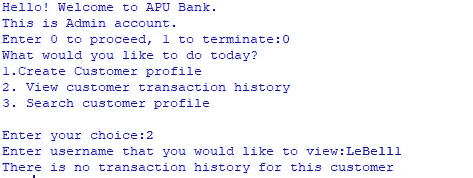
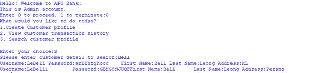
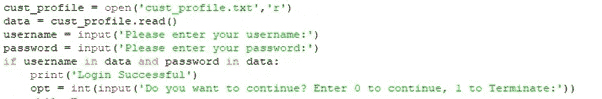
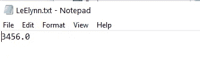

# 用 Python 实现的 ATM 机

> 原文：<https://medium.com/analytics-vidhya/atm-machine-with-python-d90b9ee300e?source=collection_archive---------2----------------------->

[摄于](https://unsplash.com/@thegraphicspace?utm_source=medium&utm_medium=referral) [Unsplash](https://unsplash.com?utm_source=medium&utm_medium=referral) 上的图形空间

一个初学者的项目，编写 Python 代码，模仿 ATM 机的功能-密码创建，现金存款，现金提取，查看客户交易历史，搜索客户档案和创建客户档案。

我首先创建了一个 randompassword 函数，顾名思义，它可以生成随机密码。生成的密码长度在 8-12 之间，由大写、小写和数字组合而成。

然后创建一个管理员界面。

由于这是一个管理员的界面，有限的功能是可用的，主要是创建个人资料和查看客户的过去记录。

接下来是创建客户档案，这需要提供这些信息—名字、姓氏和地址。用户名是通过将姓和名的前两个字符连接起来创建的。如果用户名不在现有的用户名列表中，将创建一个新的用户名。否则，用户名将被附加一个整数。

将使用 randompassword 函数生成密码。

客户的个人资料将保存在一个文本文件中，如下图所示。

下面是一个界面在运行时的样子的例子。

接下来是查看客户的交易历史。

对于选项 2，python 接受来自 admin 的用户名输入来搜索 transactionhistory txt 文件。

如果文件存在且不为空，python 将在文件中打印信息。否则，将创建一个新的 transactionhistory 文件，python 返回没有特定客户的交易历史。如果文件存在但为空，python 也将返回没有事务历史。

例如，用户名为:PrKamini 的客户 Kamini Premanthan 以前有交易历史。

这是输出。

这里是新创建的客户 Bell Leong 的输出，用户名:LeBell1，他没有进行任何交易。

管理员也可以使用任何可用的细节搜索客户的历史。编写代码来读取 cust_profile.txt，并返回包含管理员输入的搜索细节的行。

在下面的示例中，我们搜索居住在吉隆坡的任何客户。

另一个搜索名字的例子:贝尔。

现在让我们进入客户界面。

存款现金是一个读取客户存款金额并更新现有余额的功能。

编写代码以从客户处获取存款金额和用户名。必须提供用户名以搜索余额文本文件或创建新文件。存款金额将添加到文件中的现有余额，新的余额将存储在文件中。完成后，存款金额、以前的余额和新的余额也将存储在交易历史文件中。

取款现金功能是用来读取客户的取款金额，并对 txt 文件中的现有余额进行更新。

编写代码以从客户处获取取款金额和用户名。提款金额将从现有余额中扣除，新的余额将存储在 txt 文件中。

如果提取金额超过现有余额，python 将返回没有足够的资金继续。

Balance 函数用于检查客户的现有余额。必须提供用户名以搜索客户的文件，文件中的任何信息都将被读取。如果文件中没有余额，python 将返回没有余额。

客户必须首先登录帐户才能继续。将在 cust_profile.txt 中搜索提供的用户名和密码，如果不存在，python 将返回提供的信息不正确。

如果提供的用户名和密码都正确，python 将返回登录成功。

登录后的主界面，客户可以在其中进行选择—存款、取款、检查余额或检查交易历史。

在做出选择后进行验证。如果提供了错误的选择，python 将返回做出的错误选择，并检查客户是否希望继续。

在下面的例子中，客户张盈盈向她的账户存入了 3456 英镑。由于该客户之前没有交易，新的余额保持不变。

由客户用户名创建的新余额文件。

交易历史文件也被创建，并存储最新交易。

在下一个例子中，客户请求从余额中提取 20 英镑。由于余额充足，提款过程成功。

接下来客户要求提取更多的钱，4000。我们知道现有的余额是 3456。由于提取金额大于余额，提取流程不成功。

检查余额和交易历史的程序将与管理员的界面类似。

这就是我的第一个 Python 项目的结尾。当我测试它时，代码有一些缺陷，例如在用户名功能上，有时可能会创建重复的用户名。我真的希望当我学到更多的东西来进一步改进它的时候，再回到这个项目上来。

但在那之前，塔塔！

Python 代码可以在[这里](https://github.com/gyiernahfufie/ATM-Machine-with-Python)找到。