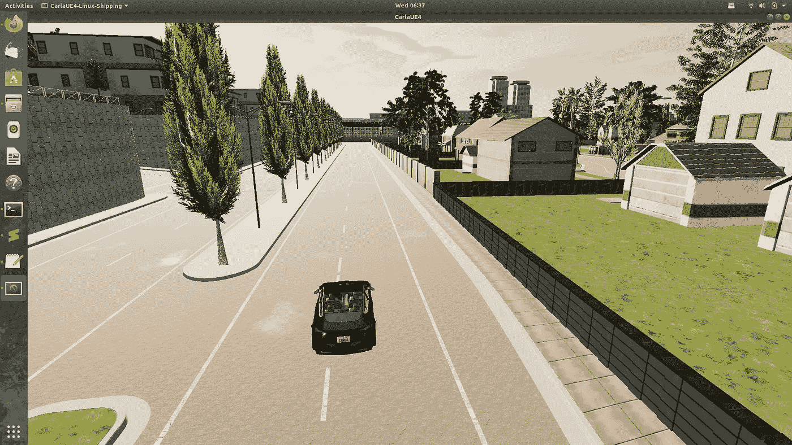
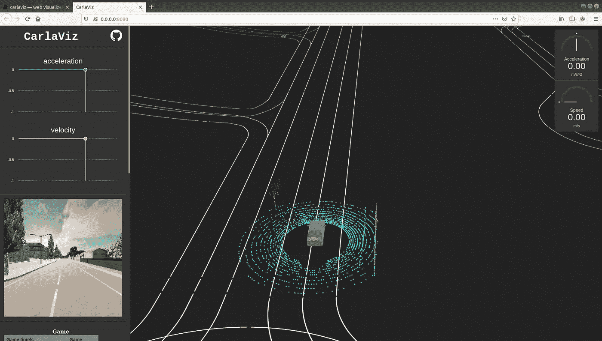

# 在 Carla-viz 中连接传感器并可视化传感器数据

> 原文：<https://medium.com/analytics-vidhya/attaching-sensors-and-visualizing-sensor-data-in-carla-viz-aa66af359caa?source=collection_archive---------6----------------------->

这个博客是我之前的[一个](/analytics-vidhya/spawning-vehicles-in-carla-86429f767040)的延续，我之前的博客是关于如何在卡拉的理想地点制造一辆车。我的目的只是帮助那些试图研究自动驾驶汽车的人，因为网上没有足够的资源。

因此，在这篇博客中，我们将在我们的车辆上安装不同的传感器，并在 Carla-Viz 中可视化这些传感器的输出。Carla-viz 为 Carla 提供了一个可视化工具。你可以在这里从[下载并阅读关于 Carla-viz 的内容。](https://carla.readthedocs.io/en/latest/plugins_carlaviz/)

首先，你必须启动我之前文章中解释的卡拉模拟器。

让我们现在编码

```
import glob
import os
import sys
import timetry:
    sys.path.append(glob.glob('./PythonAPI/carla/dist/carla-*%d.%d-%s.egg' % (
        sys.version_info.major,
        sys.version_info.minor,
        'win-amd64' if os.name == 'nt' else 'linux-x86_64'))[0])
except IndexError:
    passimport carlaclient = carla.Client('localhost', 2000)
client.set_timeout(2.0)
world = client.get_world()blueprint_library = world.get_blueprint_library()
bp = blueprint_library.filter('vehicle.*')[4]
bp.set_attribute('role_name','ego')
world = client.get_world()
spawnPoint=carla.Transform(carla.Location(x=38.6,y=5.8, z=0.598),carla.Rotation(pitch=0.0, yaw=0.0, roll=0.000000))
vehicle = world.spawn_actor(bp, spawnPoint)cam_bp = None
cam_bp = world.get_blueprint_library().find('sensor.camera.rgb')
cam_bp.set_attribute("image_size_x",str(180))
cam_bp.set_attribute("image_size_y",str(180))
cam_bp.set_attribute("fov",str(105))
cam_location = carla.Location(2,0,2)
cam_rotation = carla.Rotation(0,0,0)
cam_transform = carla.Transform(cam_location,cam_rotation)
ego_cam = world.spawn_actor(cam_bp,cam_transform,attach_to=vehicle, attachment_type=carla.AttachmentType.Rigid)
#ego_cam.listen(lambda image: image.save_to_disk('tutorial/output/%.6d.jpg' % image.frame))gnss_bp = world.get_blueprint_library().find('sensor.other.gnss')
gnss_location = carla.Location(1,0,2)
gnss_rotation = carla.Rotation(0,0,0)
gnss_transform = carla.Transform(gnss_location,gnss_rotation)
gnss = world.spawn_actor(gnss_bp,gnss_transform,attach_to=vehicle, attachment_type=carla.AttachmentType.Rigid)#Attaching Lidarlidar_bp = world.get_blueprint_library().find('sensor.lidar.ray_cast')
lidar_location = carla.Location(0,0,2.4)
lidar_rotation = carla.Rotation(0,0,0)
lidar_transform = carla.Transform(lidar_location,lidar_rotation)
lidar =world.spawn_actor(lidar_bp,lidar_transform,attach_to=vehicle, attachment_type=carla.AttachmentType.Rigid)time.sleep(40)
vehicle.destroy()
```

将此脚本保存在计算机上的任意位置。然后启动卡拉模拟器。然后使用这个命令打开一个新的终端并启动 Carla-viz



产卵后车辆

> *docker run-it—network = " HOST "-e CARLA viz _ HOST _ IP = localhost-e CARLA _ SERVER _ IP = localhost-e CARLA _ SERVER _ PORT = 2000 mjxu 96/CARLA viz:最新*

注意，我使用的是 Carla-viz docker 版本。到你的浏览器粘贴这个 [http://0.0.0.0:8080/](http://0.0.0.0:8080/) 。因为 Carla-viz 运行在端口 8080 上。您将从运行 Carla-viz 的终端获得这个链接。



使用 Carla Viz 的可视化

在图片中，我们可以看到 Carla-viz 中 RGB 相机和激光雷达点云的输出