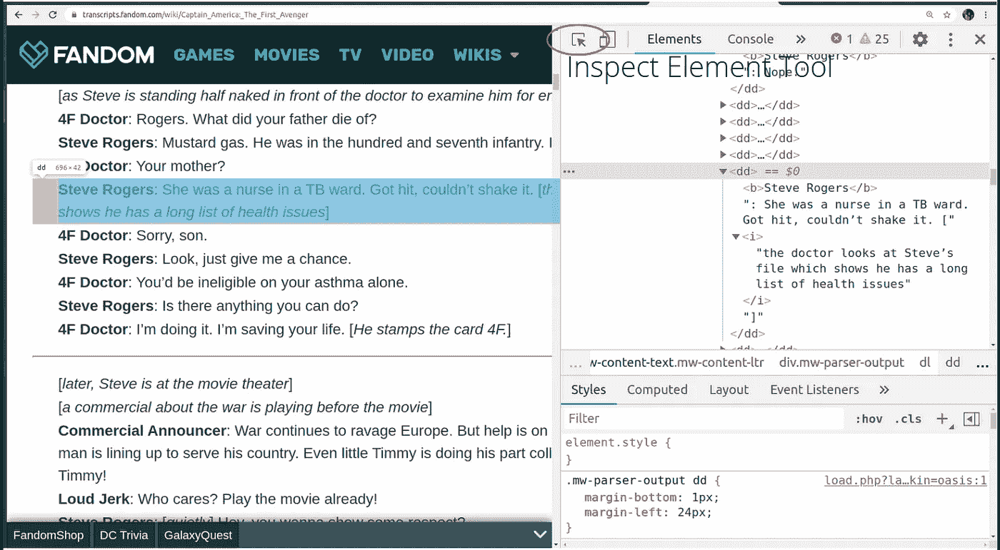
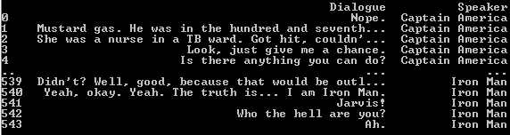
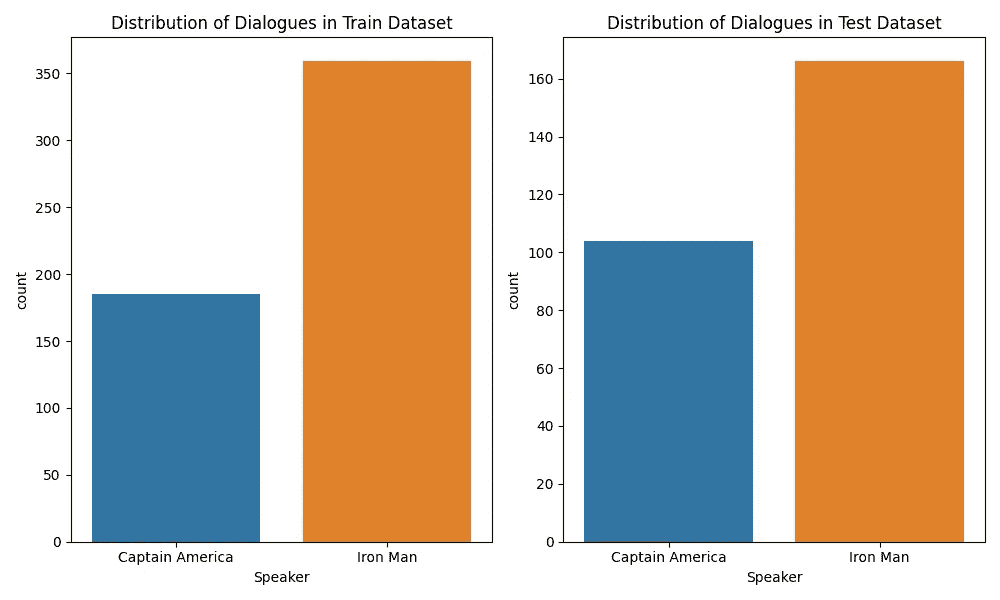

# 使用朴素贝叶斯算法的作者识别—数据收集

> 原文：<https://medium.com/analytics-vidhya/author-identification-using-naive-bayes-algorithm-1-abeeb88eb862?source=collection_archive---------19----------------------->

## 托马斯·贝叶斯能区分史蒂夫·罗杰斯和托尼·斯塔克吗？

这篇文章是三部分系列的第一部分，旨在使用 dockers 以端到端的方式实现机器学习算法。这个问题的潜在目标是使用朴素贝叶斯算法建立一个分类器，它可以判断一个句子更有可能是由史蒂夫·罗杰斯(又名美国队长)或托尼·斯塔克(又名钢铁侠)说出的。我将在这篇文章的剩余部分和后续文章中使用两个角色的名字来适应上下文。

***注:*** *部分网站不允许抓取数据。在进行任何形式的数据收集之前，请确保您了解网站的条款和条件。以下仅出于教育目的。*

图片来自 Pixabay，鸣谢:[Jr _ 侏罗纪](https://pixabay.com/users/jr_jurassic-6470884/)

# 动机

朴素贝叶斯算法是为分类问题建立强基线的一种非常强大的算法。它确实值得比在现实世界中得到更多的关注。除了通常的垃圾邮件过滤和情感分析(大多数人认为朴素贝叶斯仅限于此)之外，它还可以用于多种问题，如作者识别、信息检索、单词歧义消除。

在这一系列的帖子中，我想详细介绍这个算法，并使用朴素贝叶斯建立一个端到端的机器学习解决方案。它将详细涵盖以下步骤:

1.  数据收集和预处理。
2.  建模和推理。
3.  使用 Flask，Flasgger 通过 API 端点部署模型。
4.  使用 Docker 封装 web 应用程序并将其部署到 Heroku。

在这篇文章中，我们将讨论如何从网络中获取数据，并对其进行预处理，使其成为适合监督分类问题的形式。

# 数据收集和预处理

为了建立一个分类器来区分史蒂夫·罗杰斯和托尼·斯塔克的对话，我们需要大量他们都说过的对话。为了做到这一点，我们将不得不求助于网络搜集，从网上免费提供的抄本中提取这些对话。

这是我们准备数据的方式:

1.  为了获得美国队长对话的语料库，我们将在电影**《美国队长:第一复仇者联盟》的抄本中刮出队长所说的句子。**
2.  为了建立一个钢铁侠对话的语料库，我们将从电影**“钢铁侠”的脚本中提取托尼·斯塔克说过的句子。**
3.  以上将作为我们的训练数据集；为了评估我们模型的性能，我们将从**“复仇者联盟 4：终局之战”中提取船长和托尼的对话。**

我们将使用 requests 库从脚本和 beautifulsoup 的网页中提取 html 源代码，解析 html 以提取对话。让我们看看它是怎么做的。

首先，我们将从 fandom 的网站上摘录史蒂夫·罗杰斯在《美国队长:第一个复仇者》中的对话。

首先使用请求库中的 get 方法提取 html 源代码；接下来使用带有 BeautifulSoup4 库的 html 解析器解析整个页面。一旦我们完成了这一步，我们需要找出承载所有对话的兴趣标签。如果你正在使用 Chrome，你可以打开网站并按 Ctrl/Command + Shift + I 来检查页面的 html DOM 树中的元素。然后点击 inspect 按钮，将鼠标移动到主页上的对话区域。

图片由 Vinayak 提供

从上面的片段中我们可以看到，对话都包含在`<dd>`标签中，叙述者总是以粗体突出显示。因此，我们将如下使用该信息。

*   首先，我们将提取所有的`<dd>`标签，并将它们存储在一个列表中。为此，我们将使用 find_all 方法。
*   接下来，我们将从这些`<dd>`标签中单独提取`<b>`标签，并查看这些标签中的文本内容。请注意，冒号有时在粗体标签内，有时不在。所以我们要做的只是选择那些`<dd>`标签的内容，这些标签在它们各自的粗体标签中有 *"Steve Rogers"* 或 *"Steve Rogers:"* 。

还要注意，我们只对真实的对话感兴趣，对动作/场景信息等不感兴趣。它被封装在方括号中。所以我们将使用一个正则表达式，用一个空字符串替换那些括号(包括括号)中的内容。

类似地，我们需要替换文本中的叙述者文本，即“Steve Rogers:”这可以简单地使用每个字符串变量固有的 replace 函数来完成。

我们可以为[钢铁侠](https://transcripts.fandom.com/wiki/Iron_Man)和[复仇者联盟 4：终局之战](https://transcripts.fandom.com/wiki/Avengers:_Endgame)重复同样的过程，以分别获得 Cap 和 Tony 的对话。请注意，您必须分别检查两个网页的元素，并查看其中的细微差别，例如，在钢铁侠脚本中，所有对话都绑定在`
`标签中。此外，在《复仇者联盟:残局》剧本中，叙述者的名字是大写的，这意味着我们将不得不在标记对话的粗体标签中寻找*“史蒂夫·罗杰斯”*而不是*“史蒂夫·罗杰斯”*。

一旦我们得到了对话列表，我们就可以创建对话的数据框架和它们各自的讲述者/说话者，用于训练和推理。

图片由 Vinayak 提供

在训练数据集中，我们有 544 个对话，在测试数据集中，我们有 270 个对话。这是预料之中的，因为测试数据集仅包含来自一部电影即《复仇者联盟 4：终局之战》的对话，而训练数据集包含来自两部电影的对话。对话在两个数据集中的分布如下。

图片由 Vinayak 提供

可以看出，训练和测试数据集具有两个类的几乎相似的分布；这总是一件好事。

现在，我们已经收集了数据并对其进行了预处理，我们准备进入第二部分，即实际构建分类器。同样的，你可以参考这篇文章。

# 参考

1.  [Github repo 与此帖子的代码。](https://github.com/ElisonSherton/rogers-stark-classification)
2.  [三部电影抄本粉丝](https://www.fandom.com/)。
3.  [用 PluralSight 的 beautifulsoup 进行网络抓取](https://www.pluralsight.com/guides/web-scraping-with-beautiful-soup)。
4.  [朴素贝叶斯模型构建——本系列的下一篇文章。](/swlh/author-identification-with-naive-bayes-algorithm-2-8b43854c1429)