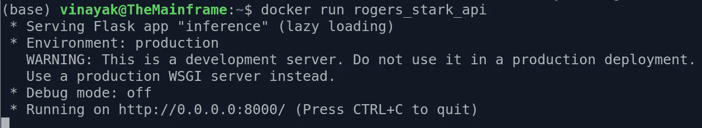

# 使用朴素贝叶斯算法识别作者——使用 Flask & Dockers 部署

> 原文：<https://medium.com/analytics-vidhya/author-identification-using-naive-bayes-algorithm-deployment-with-flask-dockers-1a1484f4fd07?source=collection_archive---------10----------------------->

## 托马斯·贝叶斯能区分史蒂夫·罗杰斯和托尼·斯塔克吗？

这是演示构建简单 ML 模型并将其部署到 API 端点的过程的三部分系列文章中的最后一篇。之前，我们已经看到了如何从网络上抓取数据来构建由两个角色美国队长和钢铁侠讲述的对话数据集。随后，我们看到了朴素贝叶斯算法的说明性概述，并建立了一个模型(条件概率字典)来识别给定对话的作者。你可以参考[这篇文章](/swlh/author-identification-with-naive-bayes-algorithm-2-8b43854c1429)来了解模型构建阶段的概况。


照片由 [Ryan Yoo](https://unsplash.com/@ryan_yoo?utm_source=medium&utm_medium=referral) 在 [Unsplash](https://unsplash.com?utm_source=medium&utm_medium=referral) 上拍摄

作为一名 ML 从业者，有能力将你的工作部署为 API 或 web 应用程序是至关重要的，这样人们就可以使用你的模型进行推理。在这篇文章中，我们将使用 Flask & Flasgger 将我们的模型部署到一个 API 端点，使用 Docker 将其容器化，并将这个应用程序部署到 Heroku。让我们开始吧。

首先你必须安装两个库，即 Flask 和 Flasgger。这可以在 pip 包管理器的帮助下简单地完成，如下所示

```
pip install Flask
pip install Flasgger
```

Flask 是一个用 python 编写的微型 web 框架，而 Flasgger 是一个 flask 扩展，它可以从我们的 API 中注册的所有 flask 视图中提取 openAPI 规范。使用这两个库，我们可以构建一个全功能的用户友好的 UI，向用户公开我们的模型。让我们看看如何在下面代码的帮助下达到同样的效果

首先，我们导入所有必要的库，如 Flask、Flasgger、pickle 和 utils 模块，该模块包含帮助函数来预测给定对话的作者。接下来，我们通过从保存的 pickled 文件中取出在上一篇文章中创建的朴素贝叶斯模型来加载它。

在 Flask 中，我们使用`@app.route` decorator 为端点编写代码，其中我们指定了路由的名称。在这个应用程序中，我们将有两条路线；一个是默认主页，另一个是 predict_dialogue 路由，它将加载我们的 API 来识别作者。

home route 什么也不做，只是简单地显示这个应用程序可以做什么的提示。它返回一个简单的 HTML 字符串，一旦应用程序启动并运行，该字符串就会呈现在主页上，如下面的代码片段所示。


图片由 Vinayak 提供

这方面的代码在附加到`@app.route(/)`装饰器的 home 函数中定义。接下来，我们将看看应用程序的核心部分，即 predict_dialogue 端点。

在我们的代码中，在我们为 predict_dialogue 定义函数之前，我们已经为端点编写了大量的文档，包括它能做什么、它期望什么作为输入、它输出什么等等。这就是 Flasgger 所看到的，当我们转到 localhost 中的 apidocs 子域时，我们会看到一个漂亮的 UI，如下所示。


图片由 Vinayak 提供

因为我们只有一个只接受 POST 请求的端点，所以我们把这个视图作为交互的选项之一。请注意，端点的名称是从装饰器中选取的，描述来自该端点的函数描述的第一行。接下来，如果我们单击 POST 请求的选项，我们会看到这个端点需要的不同参数


图片由 Vinayak 提供

在我们的例子中，我们只需要一个对话文本的参数。我们在函数定义中指定了端点需要这个参数，它是一个以红色显示的必填字段，它的名称是文本，它是一个查询参数，它的数据类型应该是字符串，所有这些都以蓝色圆圈显示。

此外，在底部我们可以看到这个端点可能返回的不同响应；这一个简单地描述了当对话成功地用讲述者标记时，返回状态代码 200。这也是从 predict_dialogue 函数的定义中选取的；定义中的“响应:”部分提到了所有这些代码并对它们进行了描述。

右上角的“试用”按钮可用于查询该 API，如下所示:


图片由 Vinayak 提供

单击“尝试”按钮后，您可以输入 API 所需的不同参数，然后单击“执行”按钮，该按钮将运行 predict_dialogue 函数，并返回使用朴素贝叶斯算法计算的概率预测的作者。这可以在回复正文部分看到，也可以随时下载。

既然我们已经启动并运行了端点，我们可以专注于如何使用 docker 将其容器化，但在此之前，让我们首先理解为什么我们应该使用 docker。

# 为什么是码头工人？


安德烈斯·洛佩斯·马尔多纳多在 [Unsplash](https://unsplash.com?utm_source=medium&utm_medium=referral) 上的照片

考虑这样一个场景，作为一名开发人员，您正在本地系统上工作，构建一个端到端的 web 应用程序或任何相关的应用程序。一旦你完成了构建和测试，你把它交给 QA 团队，让他们测试这个应用程序，但是情况变得很糟糕，QA 团队给你发了一大堆罚单，说什么都没用，你遇到过这种情况吗？

这是一种非常常见的情况，大多数情况下是由于操作系统、硬件、依赖关系等原因造成的。对开发者的环境和对 QA 的环境是不一样的。Dockers 有助于解决这个问题，并且还提供了一些非常有用的可能性。这些措施如下

1.  **环境标准化:** Docker 容器帮助将与运行特定应用程序相关的一切捆绑在一起，包括文件系统、网络功能、硬盘空间和 RAM。这避免了开发者应用程序的用户像开发者一样设置环境的麻烦，这可能是一个艰苦的过程。
2.  **隔离:**这意味着每个 docker 容器作为一个进程是独立的，拥有自己的内存、网络能力和计算能力。与虚拟机不同的是，如果一个容器被停止，这些资源就会被释放，并可以被其他已经在运行的容器实例所利用。
3.  **可移植性:**一旦您构建了 docker 映像，您就可以将它分发给任何系统上的任何人，并且可以确信，如果它在您的系统上运行，它将在任何其他地方运行，也就是说，您只需要构建一次并将其部署到任何地方，它就一定会运行。

要构建 docker，您需要首先在您的系统上安装并运行 docker。您可以在此参考[官方文档页面](https://docs.docker.com/engine/install/ubuntu/)进行安装。我正在开发 Ubuntu 18.04 版本，可以很容易地按照这里的步骤在我的系统上安装 docker。

接下来，我们需要构建一个 docker 文件，其中包含构建 docker 映像的说明。

1.  我们将首先从 Dockerhub 获得一个基础映像，这里我们选择了 anaconda 基础映像，它包含许多已经安装了基础 python 的默认 python 包。我们选择了预装 python3.x 的 anaconda3。我们使用 FROM 命令来实现这一点。
2.  接下来，我们将在`usr`目录中创建一个文件夹`app`,我们将在其中复制所有的应用程序文件。我们用复制命令来做这件事。
3.  因为我们必须托管一个端点，所以我们需要提供一个用于通信的端口，我们使用 EXPOSE 命令并使用端口 5000 来实现这一点，我们可以选择 8000、8888 或任何其他可用端口。
4.  接下来，我们使用 WORKDIR 命令将工作目录设置为复制所有应用程序文件的位置。
5.  完成后，我们将下载应用程序运行所需的所有依赖项，如 Flask、Flasgger、BeautifulSoup 等。requirements.txt 文件中提到了这一点
6.  最后，我们将使用 CMD 命令运行命令来启动应用程序脚本。

我们将把这个 docker 文件保存在与我们的应用程序文件相同的文件夹中，否则我们将不得不更改 COPY 命令中的代码，以便正确地将文件从我们的本地系统传输到 docker 容器中。一旦构建了这个 docker 文件，我们需要构建 docker，这可以使用下面的命令来完成

```
docker build -t rogers_stark_api .
```

这里 rogers_stark_api 是我希望与我的 docker 映像相关联的名称，我希望从与 docker 文件相同的路径构建它，因此有了`.`一旦您执行此命令，它将从 Dockerhub 提取 anaconda 基本映像，将文件从当前目录复制到 usr/app，使用 pip 安装所有需求，并将端点暴露到端口 5000(指定端口)。要确保 docker 映像构建成功，请键入

```
docker images
```

在您的命令提示符/终端/ powershell 下，您应该看到有一个名为 rogers_stark_api 的映像在您的系统上运行，如下所示。


图片由 Vinayak 提供

一旦构建了映像，我们就可以使用命令运行它

```
docker run rogers_stark_api
```



图片由 Vinayak 提供

我们的应用程序将被托管，我们可以使用它。但还不完全是；因为托管我们的应用程序的 IP 地址实际上不是我们在 inference.py 文件中指定的地址，而是 docker 映像的地址。我们需要首先找出这一点，这可以通过下面的命令来完成

```
docker ps
docker inspect CONTAINER_ID | grep '"IPAddress"' | head -n 1
```

第一个命令`docker ps`将显示 api 映像的容器 id，然后下面的命令将显示该特定容器的 IP 地址。内容如下


图片由 Vinayak 提供

现在您已经有了 IP 地址，您可以转到地址 172.17.0.2:8000/apidocs，然后您可以在浏览器中看到下面的 api 启动并运行。


图片由 Vinayak 提供

这标志着这一系列文章的结束。希望你从这个系列中学习和理解的乐趣和我写它的乐趣一样多:)

# 参考

1.  [Docker 安装指南](https://docs.docker.com/engine/install/ubuntu/)
2.  [Docker 学习播放列表由](https://www.youtube.com/playlist?list=PLZoTAELRMXVNKtpy0U_Mx9N26w8n0hIbs) [克里斯·纳伊克](https://medium.com/u/d67809141db2?source=post_page-----1a1484f4fd07--------------------------------)
3.  [使用朴素贝叶斯的作者识别—数据收集](/swlh/author-identification-using-naive-bayes-algorithm-1-abeeb88eb862)
4.  [利用朴素贝叶斯进行作者识别——建模](/swlh/author-identification-with-naive-bayes-algorithm-2-8b43854c1429)