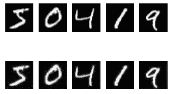

# TensorFlow 自动编码器教程

> 原文：<https://medium.com/analytics-vidhya/auto-encoder-tutorial-with-tensorflow-3bc53f0b29a2?source=collection_archive---------27----------------------->

自动编码器是一种无监督的神经网络，它有效地压缩数据(编码)，然后重建数据(解码)。它们被用于图像去噪和 GANs(生成对抗网络)。GANs 是将照片转换为绘画以及生成人脸照片等任务的首选网络。自动编码器有 3 个主要部分:

1.  **编码器**:通过缩小输入尺寸来压缩输入图像。
2.  **解码器:**将编码后的数据重建回原始图像。n 这样做，有一个**重建损失**。神经网络的目标是尽量减少这种损失。
3.  **瓶颈:**它是编码器和解码器之间的层，包含最压缩的输入形式。

让我们看一下在 TensorFlow 中训练自动编码器的代码。首先，我们导入所有必要的模块:

```
from tensorflow.keras import Layers
from tensorflow.keras.datasets import fashion_mnist
from tensorflow.keras.optimizers import Adam
from tensorflow.keras.models import Model
import numpy as np
import matplotlib.pyplot as plt
from matplotlib.figure import Figure
```

接下来，我们将导入并格式化数据。在这个例子中，我们将使用 MNIST 数据集。

```
(x_train, y_train), (x_test, y_test) = mnist.load_data()
x_train = x_train.astype('float32')/255.
x_train = np.expand_dims(x_train, axis=1)
x_train = np.reshape(x_train, (60000, 28, 28, 1))x_test = x_test.astype('float32')/255.
x_test = np.expand_dims(x_test, axis=1)
x_test = np.reshape(x_test, (10000, 28, 28, 1))
```

这段代码可能看起来有些混乱，所以让我们一行一行地检查一下。

在这里，我们将这些值转换成。浮点数，并在 0-1 的范围内对数据进行规范化，而不是 0-255。如果我们跳过这一步，损失将会非常大，因为我们将会处理更大的数字。接下来的两行用于将数据格式化为正确的维度，以供模型使用。测试数据`x_test`经历完全相同的过程(标准化和格式化尺寸)。

我们现在将定义编码器的架构:

```
# encoder
input = Input((28, 28, 1))
x = Conv2D(8, (4, 4), activation="relu", padding="same")(input)
x = MaxPooling2D((2, 2), padding="same")(x)
x = Conv2D(4, (4, 4), padding="same", activation="relu")(x)
x = MaxPooling2D((2, 2), padding="same")(x)
x = Conv2D(4, (4, 4), padding="same", activation="relu")(x)encoded = MaxPooling2D((2, 2), padding="same")(x) # bottleneck#decoder
x = Conv2D(4, (4, 4), activation="relu", padding="same")(encoded)
x = UpSampling2D((2, 2))(x)
x = Conv2D(4, (4, 4), activation="relu", padding="same")(x)
x = UpSampling2D((2, 2))(x)
x = Conv2D(8, (4, 4), activation="relu", padding="same")(input)
decoded = Conv2D(1, (4, 4), padding="same")(x)
```

在编码器和解码器中，卷积层与 MaxPooling 结合使用以降低维度，而上采样则增加维度。

下一步是编译、训练和评估模型。`binary_crossentropy`在这里，指重建损失。我们正在使用亚当优化器进行训练。最后，我们使用测试数据集评估模型，并打印平均重建损失。

```
model = Model(inputs=input, outputs=decoded)
model.compile(loss="binary_crossentropy", optimizer=Adam())model.fit(x_train, x_train, epochs=5, batch_size=64, shuffle=True)
scores = model.evaluate(x_test, x_test)
print("loss: ", scores)
```

为了更好地理解模型，并验证它的训练，我们可以在通过自动编码器之前和之后显示一些图像。

```
in_imgs = x_train[:5] # 5 images from the training data
out_imgs = model.predict(in_imgs) # model output for the imagesFigure(figsize=(20, 4)) # creating a matplotlib figure
for i in range(5):
    # image processing for input images
    ax = plt.subplot(2, 5, i + 1)
    plt.imshow(in_imgs[i].reshape(28, 28))
    plt.gray()
    ax.get_xaxis().set_visible(False)
    ax.get_yaxis().set_visible(False) # image processing for output images
    ax = plt.subplot(2, 5, i + 1 + 5)
    plt.imshow(out_imgs[i].reshape(28, 28))
    plt.gray()
    ax.get_xaxis().set_visible(False)
    ax.get_yaxis().set_visible(False)plt.show()
```



自动编码器几乎完美地重建了数字

因此，您已经成功地在 MNIST 数据集上构建并训练了一个简单的自动编码器。敬请关注更多关于 AI/ML 的文章！