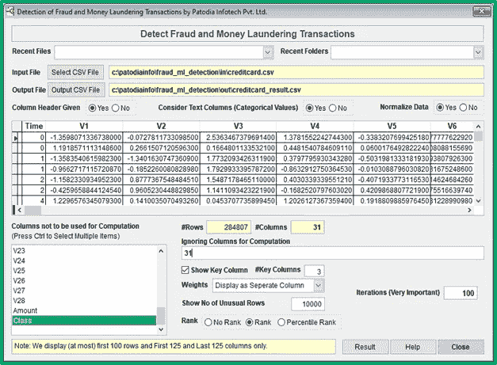
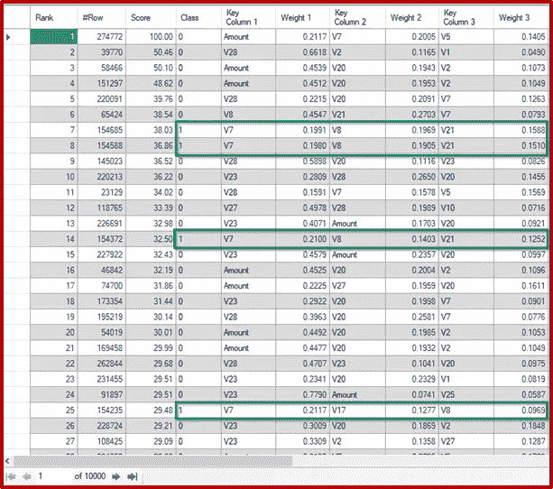
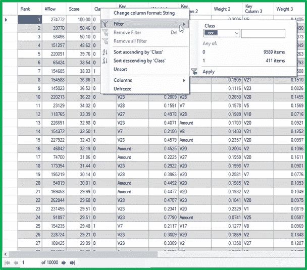
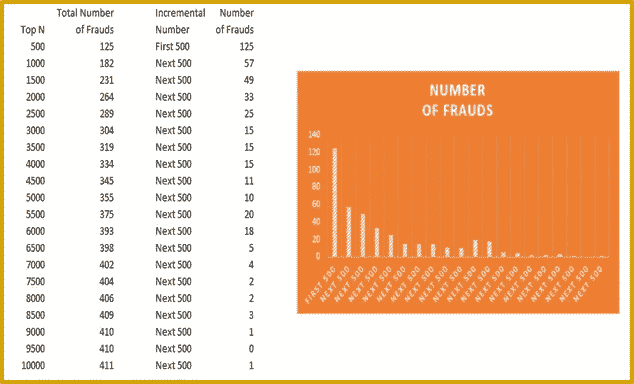
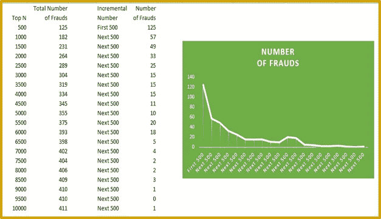
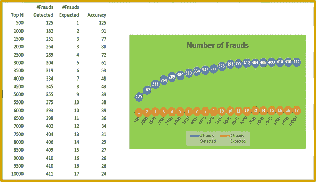

# 无需构建模型的汽车欺诈检测

> 原文：<https://medium.com/analytics-vidhya/auto-fraud-detection-without-building-models-20f22b37aea?source=collection_archive---------27----------------------->

有没有可能在几分钟内从数百万笔交易中检测出欺诈，而不需要对数据进行任何标记，也不需要建立机器学习模型？

企业和组织规模的不断扩大、复杂的生态系统以及运营的数字化为这些组织内外的欺诈者实施欺诈活动提供了机会。根据 2010 年 1 月至 2011 年 12 月间对欺诈案件进行调查的注册欺诈审查员(CFEs)的一项调查，世界各地的组织因欺诈损失了约 5%的年收入。**根据 2011 年全球生产总值的估计，这一数字相当于潜在的欺诈损失总额超过 3.5 万亿美元。**请注意，3.5 万亿美元的数字是对 2011 年的估计，而我们是在 2021 年。我们相信在过去的 10 年里。诈骗金额翻了很多倍。

这对组织来说是一个巨大的威胁，对领导者来说也是一个巨大的挑战。此外，考虑到业务增长的速度和欺诈场景的演变，欺诈防范团队没有足够的时间。那么，有没有可能在几分钟内从数百万笔交易中检测出欺诈，而不需要对数据进行任何标记，也不需要建立机器学习模型？如果我们说**“是”，**你可能会发现这极不可能，但这是真的。我们已经构建了一个解决方案“Discover ”,正是为了做到这一点。

**DISCOVER** 是来自 IIT 马德拉斯和比特皮兰尼的一流机器学习和管理咨询专家进行广泛研究的结果解决方案，旨在发现数据中的异常，进一步帮助检测和防止各行业组织中的欺诈活动。这个解决方案可以自己从任何类型的数据中发现异常。它基于无监督的机器学习，它的许多应用包括:它可以帮助检测工资支付中的欺诈行为，找到应该处理的呆滞库存和应该立即订购的库存，找到产生高收入的产品和亏损的产品，识别为公司产生高收入的员工和公司亏损的员工。这些只是 Discover 众多应用中的一小部分。在本文的用例部分，我们给出了这个解决方案更多的潜在应用。

我们解释了这一新颖的解决方案及其核心特性、优势和使用案例:

**功能:**

它是基于无监督的机器学习，所以它不需要训练，可以立即使用。然而，为了获得更好的结果，可以基于领域知识进行特征工程。

整个解决方案是用 C 和 PHP 编写的。由于 C 程序可以在任何操作系统上编译，所以它可以在服务器、云、台式机、笔记本电脑等上使用。PHP 可以在大多数操作系统上运行。

如果提供了目标变量，它具有进行自动特征选择的内置功能。

**好处:**

这个解决方案的准确性远远优于其他类似的解决方案。

它的速度至少是同类产品的 100 倍。

它可以处理数字和分类数据。

我们的解决方案可以处理任意数量的行和列，并且可以从任何类型的数据中对欺诈交易进行排序。**这使得我们的解决方案高效且有效。**

该解决方案查找关键特征(或列)以及每行的每个特征的权重，使其成为可疑交易或异常交易。我们还提供了值是高还是低与权重。这有助于我们理解**为什么某项交易被显示为可疑或异常，并使我们能够朝着正确的方向进行调查**。**这为进行调查的团队节省了大量时间。由于团队可以在短时间内识别并防止欺诈，这为公司节省了数百万美元。除了防止欺诈，它还可以识别哪个产品做得非常好，哪个客户非常有价值，哪个机器需要维护等等。下面，我们给出用例。**

**用例:**

由于该解决方案可应用于跨行业的企业和组织，因此下面列出了它在不同行业的潜在应用:

**常见用例(适用于大多数公司):**

根据可量化的绩效数据，发现表现优异和表现差得令人难以置信的员工。

检测员工工资中的欺诈。

发现最有价值的客户。

检测最有价值的产品。

检测销售额下降或快速增长的产品。

发现应付账款和应收账款中的欺诈行为。

**银行业金融板块:**

及早发现和预防欺诈和洗钱活动。

发现不值得贷款的申请人。

**保险行业:**

检测异常索赔，检测不合格的申请人和投保人。

检测不合格的申请人和投保人。

**IT & ITES 部门:**

识别表现优异和表现不佳的产品。

检测不同供应商应付账款中的欺诈行为。

**制造业:**

基于可量化的数据检测制造缺陷。

通过识别从仓库缓慢转移的库存和从仓库快速转移的库存来帮助制造企业。

发现表现优异和表现不佳的员工。

检测需要维护的机器。

**电子商务板块:**

通过识别供应链中流动缓慢的商品和快速流动的商品来帮助电子商务公司。

发现有问题的客户和特别好的客户。

**电信部门:**

检测计算机网络中的未授权访问。

监控计算机网络的性能(检测网络瓶颈)。

**医疗保健行业:**

组织(医院和政府)的患者识别和医疗危机预防、收入增加、成本降低和效率提高。

**零售部门:**

识别为公司带来更多收入的产品/识别表现不佳的产品。

发现表现优异和表现非常差的员工。

**制药:**

面向患者的数据驱动健康监测和预警诊断工具。

检测关键绩效指标中的异常指标。

**航空公司:**

飞机发动机的数据驱动健康监测和预警诊断工具。

检测表现特别好或特别差的部门。

**治理、风险和合规:**

检测薪资支出中的重复/欺诈行为。

检测不同供应商应付账款中的欺诈行为。

发现表现优异和表现非常差的员工。

这些只是我们目前可以想象的一些应用。我们可以找到许多其他的创新方法，将这个解决方案用于许多其他无法预见的问题领域。

通过案例研究来更好地理解它怎么样？

在本案例研究中，我们从 Kaggle.com 网站获取了 2013 年 9 月欧洲持卡人的信用卡交易数据:

[https://www.kaggle.com/mlg-ulb/creditcardfraud](https://www.kaggle.com/mlg-ulb/creditcardfraud)

数据集包含欧洲持卡人在 2013 年 9 月的信用卡交易。该数据集包含两天内发生的交易，其中 284，807 笔交易中有 492 笔欺诈。数据集高度不平衡，正类(欺诈)占所有交易的 0.172%。

数据集包括 31 列。除了“时间”、“金额”和“功能”之外，所有列都是匿名的。除了这 3 列，还有 28 列的名称为“V1”、“V2”到“V28”。V1、V2……v 28 是用五氯苯甲醚获得的主要成分。

结果是代表交易是否欺诈的“特征”(最后一列)。特征值‘1’表示‘欺诈’，而‘0’表示‘无欺诈’。

**什么是 PCA(主成分分析)？**

主成分分析(PCA)是一种降低数据集维度的技术，但同时最大限度地减少信息损失。它通过创建新的不相关变量来实现方差的连续最大化。该方法需要计算特征向量和特征值。

**结果:前 10，000 笔交易:**

欺诈交易占所有交易的 0.172%。因此，如果我们进行 10，000 次随机交易，我们将得到大约 17 次欺诈交易。然而，当我们将交易提交给我们的软件“检测欺诈和洗钱交易”时，我们得到了 411 笔欺诈交易。因此，该软件可以检测大约 24 倍的随机选择。此外，如果我们取前 1000 笔交易，我们得到 182 笔欺诈交易。这比 100 倍要好，因为随机的 1000 笔交易可能会获得 1.7 笔欺诈交易。这显示了基于无监督机器学习的软件的有效性。

我们在“检测欺诈和洗钱交易”中选择了数据集，并要求它找出前 10，000 项可能的欺诈交易。**请注意，计算前 10，000 笔交易的时间不到 2 分钟。**

下面，我们给出“检测欺诈和洗钱交易”的截图:

让我们仔细研究一下上面的屏幕。它显示有 284，807 行和 31 列。我们忽略了“类别”列，因为它包含交易是否是欺诈性的。所以，这个栏目不应该考虑。我们点击了“显示关键列”按钮，并选择了 3 个关键列。权重将显示为单独的列。要显示的欺诈交易数量为 10，000。

当我们点击“结果”按钮时，我们看到以下屏幕:

在上面的截图中，我们可以看到前 25 名交易中有 4 笔欺诈交易。这些都标有绿色的长方形。对于第一笔欺诈交易，“V7”列的权重为 19.91%，“V8”的权重为 19.69%，“V21”的权重为 15.88%。这样，我们可以看到哪个特性(或列)负责这个带有权重的事务。这有助于进一步分析欺诈交易。当然，从 V1 到 V28 的列源自 PCA，因此是匿名的，我们不知道这些列的含义。然而，在现实生活中，这些专栏是众所周知的，并提供了重要线索，说明为什么某一特定交易可能是欺诈交易。

**所用时间:**

请注意，我们已经处理了 284，807 行和 30 列(最后一列被忽略)。因此，实际上我们已经处理了 850 万个列，在一个普通的硬件上只花了不到 2 分钟的时间。这表明该软件的速度非常快。

在下面给出的屏幕截图中，我们可以看到 411 个项目的类别显示为 1，因此，该软件从其选择的前 10，000 笔交易中检测到 411 笔欺诈交易。

我们分析并计算了软件选择的每 500 笔交易中发现的欺诈交易的数量。下面，我们给出结果。

下面，我们展示最终分析的截图:

从上面可以明显看出，在前 500 笔交易中，我们有 125 笔欺诈交易。如果我们随机取 500 笔交易，我们将得到一笔交易(0.172*5 = 0.86 笔交易)。接下来的 500 笔交易中，我们发现了 57 笔欺诈交易。我们看到数字正在快速下降。显而易见，该软件自动将交易从最有可能欺诈到最不可能欺诈进行分类。

**准确度:**

让我们分析结果的准确性。如果我们随机取 500 笔交易，预计会得到一笔欺诈交易(0.172*500/100 = 0.86)。然而，我们的软件可以从前 500 笔交易中获得 125 笔欺诈交易，而无需任何建模或任何数据信息。这意味着，获得的准确性是随机选择交易的 125 倍。显然，这不可能是巧合。

如果我们随机抽取 1000 笔交易，预计会得到两笔欺诈交易；但是，我们可以在该软件获得的前 1，000 笔交易中检测出 182 笔欺诈交易。因此，获得的准确度是 91 倍。

**注意**:虽然我们没有给出上图中前 200 笔交易的结果。在前 200 笔交易中，我们有 96 笔欺诈交易。因此，我们得到了 96.0/200*284807/492 = 278 倍于随机选择的 200 个交易。

它能处理任何类型的数据吗？

是的，只要提供所需的数据，我们就能检测出任何类型的欺诈。然而，重要的是要注意，仅仅孤立的交易数据可能不足以检测欺诈或异常。我们还需要历史数据和交易数据。例如，假设有两个客户，每个人都完成了 1000 美元的交易。如果我们获取历史数据，我们会发现第一个客户已经完成了许多 10，000 美元及以上的交易，因此对于该客户来说，交易最不可能是欺诈性的。然而，第二个客户从未进行过超过 100 美元的交易，这使其成为可疑交易。

下面，我们举例说明信用卡交易所需的详细信息:

交易前余额

交易后余额

过去 24 小时内发生的交易数量

过去 24 小时内发生的交易总额

上一季度的最大交易金额

如果提供更多的细节，将会提高准确性。我们还需要计算某些比率，比如

交易前余额/交易金额

交易金额/上一季度的最大交易金额

**成绩下载链接:**

结果可从我们的网站下载:

http://patodiainfo.com/download/creditcard_result.csv

**研究学者:**

我们向研究学者免费提供一个月的“发现”。对此感兴趣的人，请向 research@patodiainfo.com 提出要求并附上必要的文件。我们将在核实文件后发送链接和密钥。

注意:请注意“发现”仅提供给研究学者用于研究目的，他们不能用于商业目的。

**结论:**

该软件经过了广泛的研究和多层次的极端提炼，其主要目标是帮助企业和组织有效地检测欺诈，并有望节省大量成本和精力。

在下一个系列中，我们将介绍如何使用“Discover”从工资单数据中检测欺诈。