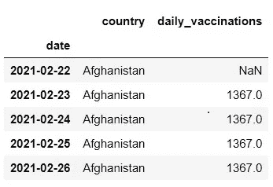
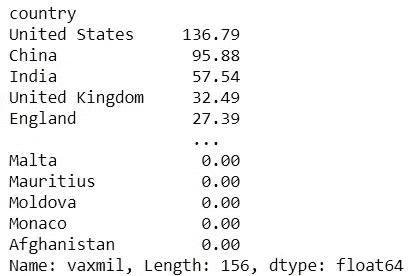
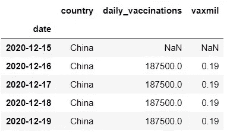
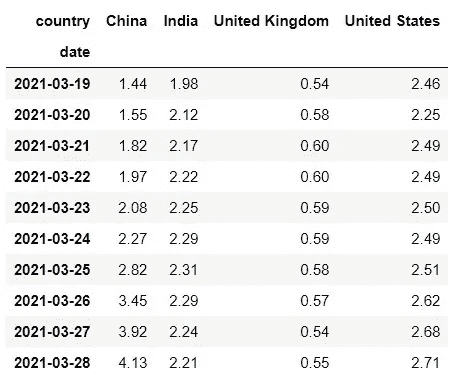
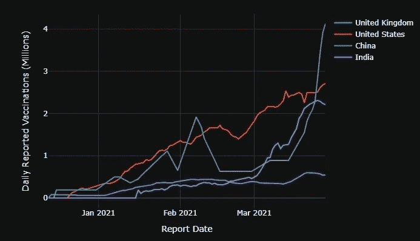
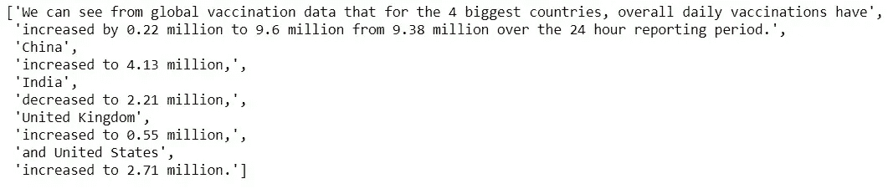
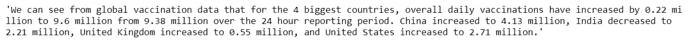

# 用 Python 自动生成图表注释

> 原文：<https://medium.com/analytics-vidhya/auto-generating-chart-commentary-with-python-7b341515d1ab?source=collection_archive---------1----------------------->

科技日报在 [Unsplash](https://unsplash.com/s/photos/data-chart?utm_source=unsplash&utm_medium=referral&utm_content=creditCopyText) 上拍摄的

因此，您已经创建了最新的漂亮的完全交互式仪表板，该仪表板将每天更新，管理层现在可以随时登录并查看他们的销售情况。然而，总有一些人讨厌图表，他们只是想在报告中得到数字，他们不会点击你的图表。那么你能做什么呢？

显然，我们可以每天检查并写一份关于最新变化的报告，然而，这将是非常乏味、耗时的，如果有许多图表要显示，则完全不切实际，需要大量的时间来每天更新。

一个简单的方法是为读者可能感兴趣的最重要的事情制定一个基本模板，然后自动从你的数据中拼凑出文本，然后可以作为“评论”添加到图表上。越是通用，就越容易做到，但是需要注意确保它实际上是相关的和有用的，否则你将不得不定期地重写这些代码。

为了证明这一点，我获得了作为简单时间序列的每日 Covid19 疫苗接种数据。我将它导入到一个熊猫数据框架中，并查看了前几行。在处理时间序列时，确保正确解析日期很重要(在这种情况下，使用 read_csv 中的‘parse _ dates’参数很容易做到)。

每个国家的每日疫苗接种数据

接下来，我将疫苗接种数字转换为百万单位，四舍五入到两位，以便稍后在图表中更具吸引力，然后通过查看并按降序排序来查找最大的国家。我们正在寻找的评论是针对最相关的数据点，我们可以即时计算这些数据点，但在这个例子中，我将只寻找最大的 4 个国家。

正如您所料，最大的国家是美国、中国、印度和英国(英国的组成部分也单独列出，因为您可以从列表中的下一个英格兰看到)，所以这些是我们将集中关注的国家，我将数据限制在 2021 年 3 月 28 日之前，因为这是数据集中最近的完整数字。

接下来，我们需要透视数据，使每个国家都有自己的列，表中有“vaxmil”值，索引中有日期。我们还使用“fillna”方法用零替换丢失的值，这是一种假设，但这是目前我们能做到的最好的方法。

完成的数据透视表

使用 Plotly，我们现在可以很容易地创建一个很好的时间序列图。

一段时间内各国每日疫苗接种数量

现在我们有了图表，但是我们希望生成注释来解释在过去 24 小时内发生了什么(在其他情况下，您可能希望与前一周的同一天、前一个月或与您的数据最相关的任何时间进行比较)。

为此，我们需要设置一些函数。首先，我们需要从数据中找到并提取最近的行进行比较，在本例中，Timedelta 是一天，但这可以根据需要进行调整。

接下来，我们希望能够计算每一行的总值，以及自前一天以来的变化。

提取每列的当前值和先前值，并计算两者之间的差异。

为我们的总体变更摘要创建文本。这只是一个简单的 if/else 语句，它查看总变化是正的、负的还是没有变化，然后将一段适当的文本附加到我们的列表中。它还将添加到我们的介绍文本中，我们将在稍后定义。

为我们希望评论的每个国家生成文本，确保列表中最后一个国家的语法和标点正确。同样，这是一个简单的 if/else 语句，用于查看每个国家是增加了还是减少了。

现在，我们可以在透视数据上运行我们的函数，给出一段相关的文本来开始我们的注释，并生成所需的文本。

由于我们的函数是通过将每个相关的文本片段追加到一个列表中来工作的，所以我们现在只需要使用 join 方法将它们全部合并到一个字符串中，在每个文本片段之间放置一个空格。

我们的最终文本

我们已经看到，使用一些简单的 Python 代码，我们可以生成一段有意义的文本，总结数据中最重要的变化。这可以进一步发展，使其更加灵活和强大，例如，关于增加/减少是积极的还是消极的，变化是大还是小，重要还是不重要，等等。这将需要一些工作来设置，但希望节省每天手动编写评论来总结变化的时间。