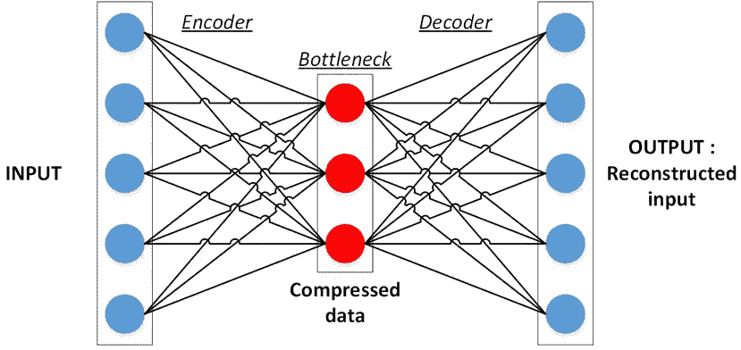
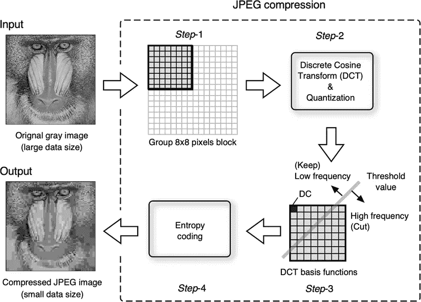
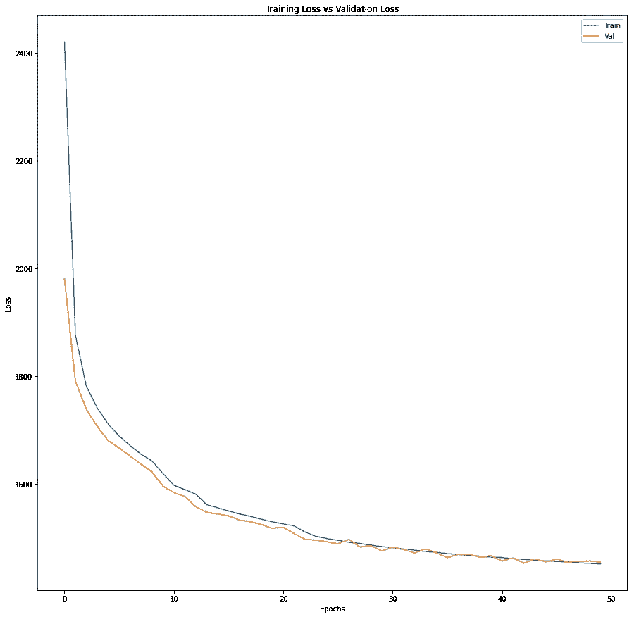
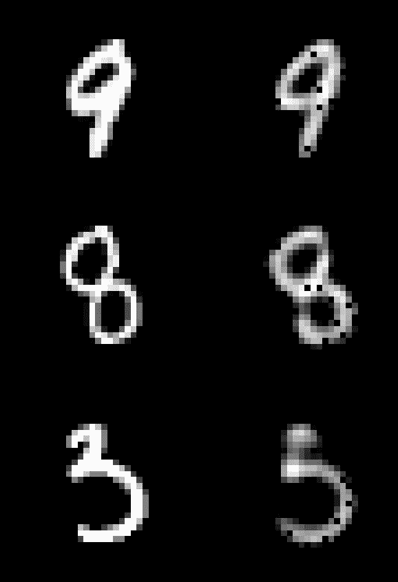
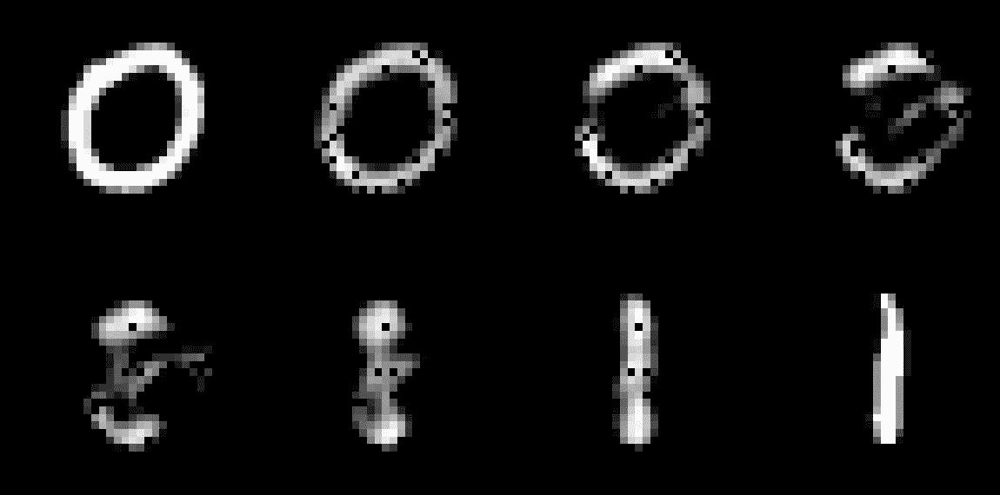

# 带 TensorFlow 的自动编码器

> 原文：<https://medium.com/analytics-vidhya/autoencoders-with-tensorflow-2f0a7315d161?source=collection_archive---------4----------------------->

自动编码器是无监督的神经网络模型，旨在学习用较少的参数表示多维数据。数据压缩算法早已为人所知，然而，学习将数据映射到较低维度的非线性操作是自动编码器对文献的贡献。



自动编码器的一般方案(图取自[1])

## 介绍

自动编码器提供了一种非常基本的方法，通过去除冗余来提取数据中最重要的特征。当数据集的多个部分(. csv 文件中的一列或图像数据集中的一个像素位置)相互之间高度相关时，就会出现冗余。在这种情况下，仅保持其中一列或忽略除一列之外的相关像素将允许我们以可接受的信息损失存储相同的数据。

在图像压缩领域，最受欢迎的技术之一是 JPEG 算法，该算法采用了*离散余弦变换* [2]和线性变换，该变换在简单的整数舍入后产生一个主要由零占据的图像矩阵。基本上，只保存非零元素而忽略其余的元素将创建一个具有更少参数的数据表示。应用变换的逆变换将几乎没有损失地重建相同的图像。



JPEG 管道(图取自[3])

利用离散余弦变换和应用某种线性变换的想法背后有一种数学直觉，但是我们不能确保这是最好的映射。JPEG 是一个很好的算法，今天仍然被广泛使用，但是如果我们提出一个模型，学习特定于相关数据的更好的映射，会怎么样呢？自动编码器正是通过学习参数压缩和重建数据来做到这一点的。根据输入数据和重建数据，该损失定义为*重建损失*，通常为 [L1 或【L2】损失。](https://afteracademy.com/blog/what-are-l1-and-l2-loss-functions)

Gallinari & LeCun 等人[4]于 1987 年提出了使用自动编码器对数据进行去噪的想法，这是利用[联想记忆](https://igi-web.tugraz.at/lehre/NNB/SS10/Lecture_Hopfield_nets.pdf)完成任务的 Hoplied 网络的替代方案[5]。如今，自动编码器不仅广泛用于去噪和压缩，还用于数据生成。

## 一个简单的张量流自动编码器

实际上，自动编码器并不是新颖的神经网络，这意味着它们没有一个自身具有独特属性的架构。相反，自动编码器结构是使用其他类型模块(全连接层、卷积层、复制、裁剪等)的流水线。)互相跟随。根据数据和任务的性质，模型的复杂性是灵活的。在本文中，我们将在 [MNIST 数据集](http://yann.lecun.com/exdb/mnist/)上构建并测试一个具有全连接层的简单自动编码器。

对于一个简单的实现，TensorFlow 后端上的 [Keras API 优先于](https://www.tensorflow.org/api_docs/python/tf/keras) [Google Colab](https://colab.research.google.com/) GPU 服务。

首先，导入所需的库。

```
import tensorflow as tf
import numpy as np
import matplotlib.pyplot as plt
from tensorflow.keras import datasets, layers, models, losses, Modelfrom random import randint
```

***数据***

MNIST 的数据可以在 Keras 上获得，只需一行代码就可以在几秒钟内导入。由于模型的目的将是学习如何重建数据，这是一项无人监督的任务，或者用一个我喜欢的更好的术语来说，它是自我监督的。因此，在加载数据时，标签不是必需的，也不会被存储。

训练集有 60000 个，测试集有 10000 个 28×28 大小的单通道图像。该测试集将用于培训期间的验证。

```
(x_train, _), (x_test, _)=tf.keras.datasets.mnist.load_data()
```

***编码器***

首先，图像将被展平成具有 784 (28 乘 28)个元素的向量。然后，在具有 100 个神经元的隐藏层之后，编码器的输出将具有 20 个参数。这被称为数据的潜在表示。如果模型训练成功，它将能够仅用 20 个数字来表示 MNIST 图像。这是我们压缩数据的阶段，数据被命名为*瓶颈层*。

```
hidden_size = 100
latent_size = 20input_layer = layers.Input(shape = x_train.shape[1:])flattened = layers.Flatten()(input_layer)
hidden = layers.Dense(hidden_size, activation = 'relu')(flattened)
latent = layers.Dense(latent_size, activation = 'relu')(hidden)
encoder = Model(inputs = input_layer, outputs = latent, name = 'encoder')encoder.summary()
```

不一定要包括隐藏层，但是试探性地增加几层会增加编码器的表示能力。为完全连接的层选择 ReLU 激活。

```
Model: "encoder" _________________________________________________________________ Layer (type)                 Output Shape              Param #    ================================================================= input_1 (InputLayer)         [(None, 28, 28)]          0          _________________________________________________________________ flatten (Flatten)            (None, 784)               0          _________________________________________________________________ dense (Dense)                (None, 100)               78500      _________________________________________________________________ dense_1 (Dense)              (None, 20)                2020       ================================================================= Total params: 80,520 Trainable params: 80,520 Non-trainable params: 0
```

***解码器***

解码器旨在通过反向操作撤销编码器所做的操作。这意味着，潜在变量将分别被上采样到 100 和 784。最后，向量将被整形为图像矩阵。

```
input_layer_decoder = layers.Input(shape = encoder.output.shape)
upsampled = layers.Dense(hidden_size, activation = 'relu')(input_layer_decoder)
upsampled = layers.Dense(encoder.layers[1].output_shape[-1], activation = 'relu')(upsampled)
constructed = layers.Reshape(x_train.shape[1:])(upsampled)decoder = Model(inputs = input_layer_decoder, outputs = constructed, name= 'decoder')decoder.summary()
```

请注意，解码器的输入大小等于编码器的输出大小。同样，最终层的输出大小等于展平层的输出大小。上面你可以看到它是(*无，784)* 。

```
Model: "decoder" _________________________________________________________________ Layer (type)                 Output Shape              Param #    ================================================================= input_2 (InputLayer)         [(None, None, 20)]        0          _________________________________________________________________ dense_2 (Dense)              (None, None, 100)         2100       _________________________________________________________________ dense_3 (Dense)              (None, None, 784)         79184      _________________________________________________________________ reshape (Reshape)            (None, 28, 28)            0          ================================================================= Total params: 81,284 Trainable params: 81,284 Non-trainable params: 0
```

***自动编码器***

模型的计算图被构造成使得总输入是编码器的输入，总输出是解码器在处理编码器的输出时的输出。

```
autoencoder = Model(inputs = encoder.input, outputs = decoder(encoder.output))
autoencoder.summary()Layer (type)                 Output Shape              Param #    ================================================================= input_1 (InputLayer)         [(None, 28, 28)]          0          _________________________________________________________________ flatten (Flatten)            (None, 784)               0          _________________________________________________________________ dense (Dense)                (None, 100)               78500      _________________________________________________________________ dense_1 (Dense)              (None, 20)                2020       _________________________________________________________________ decoder (Functional)         (None, 28, 28)            81284      ================================================================= Total params: 161,804 Trainable params: 161,804 Non-trainable params: 0
```

损失是输入图像和重建图像之间的均方误差，即 L2 损失。该模型用 64 个样本的批次训练 50 个时期。

```
autoencoder.compile(optimizer='adam', loss=losses.MeanSquaredError())history = autoencoder.fit(x_train, x_train, epochs=50, batch_size=64, validation_data = (x_test, x_test))Epoch 1/50 938/938 [==============================] - 3s 2ms/step - loss: 3085.7667 - val_loss: 1981.6154 
Epoch 2/50 938/938 [==============================] - 2s 2ms/step - loss: 1917.1781 - val_loss: 1790.9906
...
Epoch 50/50 938/938 [==============================] - 2s 2ms/step - loss: 1456.5116 - val_loss: 1454.8712
```

由于这不是一个分类示例，因此没有准确性度量，要跟踪的重要度量是损失。尽管 1456 可能看起来是一个很大的数字，但与最初的时期相比，误差的下降意味着一个学习阶段。此外，损失不是像[F1-得分](https://scikit-learn.org/stable/modules/generated/sklearn.metrics.f1_score.html)的准确性那样的绝对指标，它应该根据上下文来评论。

```
fig, axs = plt.subplots(figsize=(15,15))
axs.plot(history.history['loss'])
axs.plot(history.history['val_loss'])
axs.title.set_text('Training Loss vs Validation Loss')
axs.set_xlabel('Epochs')
axs.set_ylabel('Loss')
axs.legend(['Train','Val'])
```



在本文中，定性分析(目测)比定量分析更能提供模型成功的信息。首先，一些随机重建被可视化:

```
fig, axs = plt.subplots(3,2,figsize=(10,15))
for i in range(3):
  sample1 = x_train[randint(0,x_train.shape[0])]
  axs[i][0].imshow(sample1, cmap = 'gray')
  axs[i][1].imshow(autoencoder(np.expand_dims(sample1,0))[0], cmap = 'gray')
```



重建结果(左侧为原始结果，右侧为重建结果)

正如您所看到的，由于它是一个非常基本的自动编码器，因此发生了一些信息丢失，但是在大多数情况下，仍然有可能了解哪个数字受模型支配。

一个更有趣的视觉化想法是在潜在空间上玩耍并观察结果。每个图像首先被编码成大小为 20 的向量。如果我们取两个潜在向量的平均值，并将其传递给解码器，会发生什么？重建的图像会与两个原始数字相似吗？还是会出现一些完全没有意义的图像？此外，我们可以采用潜在变量的加权平均值，并可视化潜在向量中逐渐变化的影响:

```
sample1_idx = randint(0,x_train.shape[0])
sample1 = x_train[sample1_idx]sample2_idx = randint(0,x_train.shape[0])
sample2 = x_train[sample2_idx]latent1 = encoder(np.expand_dims(sample1,0))
latent2 = encoder(np.expand_dims(sample2,0))weights = np.arange(0.05,0.95,0.15)fig, axs = plt.subplots(2,4,figsize=(20,10))
axs = axs.ravel()axs[0].imshow(sample2, cmap = 'gray')
axs[-1].imshow(sample1, cmap = 'gray')for i in range(6):
  latent = latent1*weights[i] + latent2*(1-weights[i])
  constructed = decoder(latent)
  axs[i+1].imshow(constructed[0], cmap='gray')
```



从一个数字到另一个数字的逐渐变化

在上图中，我们将两个潜在向量的加权重要性从 95%-5%改为 5%-95%。因此，重建图像首先类似于*【0】*。到了 50%-50%就变得面目全非，既不是*【0】*，也不是*【1】*。最后，随着第二个潜在向量的重要性成为主导，解码器产生看起来像*“1”*的图像。

## autoencoder_tensorflow.ipynb

## 结论

自动编码器通过学习高效的特定于数据的映射和减少维数，创建了一种压缩数据的替代方法。在 MNIST 的这篇文章中，由 784 个像素组成的图像已经由大小为 20 的向量表示并被重构回来。尽管结果并不完美，但仍然可以看出潜在向量保留了大部分信息，但丢失了细节。潜在变量所包含的信息决定了重构的成功与否。通过操纵潜在向量，有可能产生中间结果。

希望你喜欢。在下面的自动编码器应用中再见。

最美好的祝愿…

mrgrhn

后续帖子，请访问:

[](https://mrgrhn.medium.com/convolutional-autoencoders-cae-with-tensorflow-97e8d8859cbe) [## 带张量流的卷积自动编码器(CAE)

### 自动编码器在深度学习文献中已经存在很长时间了，最受欢迎的是数据压缩任务…

mrgrhn.medium.com](https://mrgrhn.medium.com/convolutional-autoencoders-cae-with-tensorflow-97e8d8859cbe) 

## 参考

1.  崇高，Jeremie & Kalinicheva，叶卡捷琳娜。(2019).“利用深度学习技术进行变化检测的灾后损失自动绘图:东北海啸案例研究”。遥感。11.1123.10.3390/rs11091123。
2.  NN，Ahmed & Natarajan，T. & Rao，Kamisetty。(1974).“离散余弦变换”。计算机，IEEE 汇刊。C-23。90–93.10.1109
3.  李树生、津田宏、张刚、许世生、罗福祥、李泰荣..(2020).“通过视频记录的取样云纹法进行动态变形测量及其在桥梁工程中的应用”。实验技术。44.10.1007/s 40799–019–00358–4。
4.  加利纳里，p .，勒昆，y .，蒂里亚，s .，，福格尔曼-苏利，F. (1987)。“备忘录联合发行”。认知程序 87。巴黎，拉维莱特。
5.  [https://citeseerx.ist.psu.edu/viewdoc/download?doi = 10 . 1 . 1 . 536 . 3644&rep = rep 1&type = pdf](https://citeseerx.ist.psu.edu/viewdoc/download?doi=10.1.1.536.3644&rep=rep1&type=pdf)