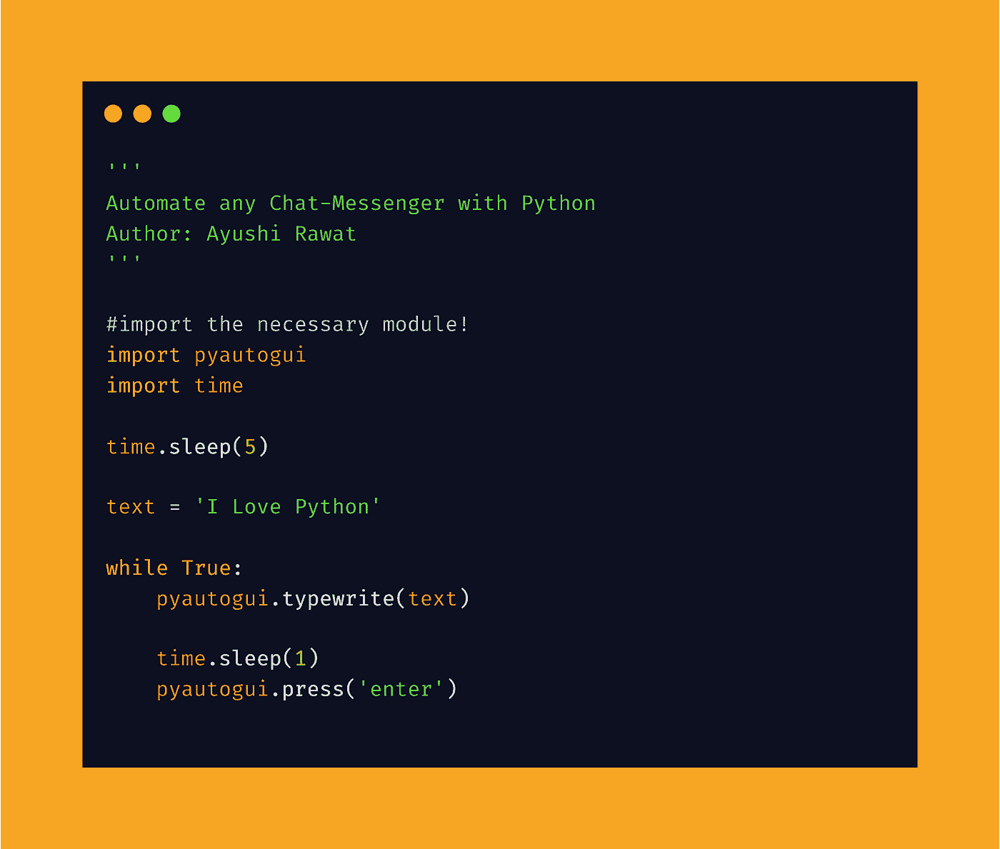

# 使用 Python 自动化任何聊天工具

> 原文：<https://medium.com/analytics-vidhya/automate-any-chat-messenger-with-python-538d1b7d5ed0?source=collection_archive---------3----------------------->

你好，世界！


在这篇博客文章中，我们将学习如何自动化任何聊天工具。我们将看到 Python 中的实现。

[查看 python 的终极资源库](https://github.com/ayushi7rawat/Ultimate-Python-Resource-Hub)。发现有用就掉颗星！有什么要补充的吗？开个 PR 就一样了！

你可以参考我的 YouTube 视频教程，看一个工作教程来更好的理解和一步一步的指导。

# 这个博客将会涵盖什么

```
1\. PyAutoGUI Introduction
2\. Automating Whatsapp | Facebook | Instagram Chat-Messenger
```

*我们开始吧！*

# PyAutoGUI 是什么？

*   PyAutoGUI 是一个跨平台的 GUI 自动化 Python 模块。
*   PyAutoGUI 允许您的 Python 脚本控制鼠标和键盘，以自动化与其他应用程序的交互。
*   PyAutoGUI 可以在 Windows、macOS 和 Linux 上运行，并且可以在 Python 2 和 3 上运行。

如果你想了解更多，可以参考 [PyAutoGUI 文档](https://pyautogui.readthedocs.io/en/latest/)。使用此链接导航到文档。

现在，您已经熟悉了*我们的议程*并掌握了 *PyAutoGUI 模块的基本知识，*我们可以前进到*编码部分。*

# 该编码了！

你可以在我的 [GitHub 库](https://github.com/ayushi7rawat/Youtube-Projects/tree/master/Automate%20any%20Chat-messanger)中找到所有代码。发现有用就掉颗星。



为了访问 Python 库，您需要首先安装它。

```
pip install pyautogui
```

安装完成后，让我们将其导入到您的 python 环境中，使用以下命令将其导入到您的 Python 脚本中。

```
import pyautogui
import time
```

我们不希望我们的脚本以立即执行开始，所以我们需要在这里引入时间模块。使用前请确保导入`time`。

```
time.sleep(5)
```

现在让我们存储您希望用于自动化的数据。我把它叫做文本，你可以给它起任何你喜欢的名字。所以基本上，你可以把存储在`text`的数据发送给想要的用户，次数不限。

```
text = 'I Love Python'
```

为了自动化，我们将利用来自`pyautogui`模块的`typewrite`方法，它将在光标所在的屏幕上输入消息中出现的每个字符。

接下来，我们将调用`press`方法，它对消息中的每个字符执行一次键盘按键按下，然后释放。因此，我们将传递`enter`作为我们的参数，也就是说，一旦在聊天信使中键入文本，脚本将按 enter 键。

为了在这两者之间提供一些余量，让我们引入`sleep`，最后我们将把代码放在 while 循环中，以便重复执行。

```
while True:
    pyautogui.typewrite(text) time.sleep(2)
    pyautogui.press('enter')
```

现在，在浏览器的新标签页中打开聊天信使。完成后，保存并运行 python 脚本。一旦执行开始，确保将光标放在正确的位置。

如果您希望限制脚本向用户发送消息的次数，可以通过修改 while 循环来实现。

就是这样。我们完了。您可以根据需要进一步定制代码以执行不同的操作。

通过这些步骤，我们成功地实现了聊天信使的自动化。就是这样！您可以使用`pyautogui`库，甚至探索更多的特性。

很简单，不是吗？希望这篇教程有所帮助。我强烈推荐你去看看 T2 的 YouTube 视频，别忘了订阅我的频道。

你可以在我的 [GitHub 库](https://github.com/ayushi7rawat/Youtube-Projects/tree/master/Automate%20any%20Chat-messanger)中找到所有代码。发现有用就掉颗星。

感谢您的阅读，我很乐意通过 [Twitter](https://twitter.com/ayushi7rawat) | [LinkedIn](https://www.linkedin.com/in/ayushi7rawat/) 与您联系。

请分享您的宝贵建议，感谢您的真诚反馈！

你绝对应该看看我的其他博客:

*   [Python 3.9:你需要知道的一切](https://ayushirawat.com/python-39-all-you-need-to-know)
*   [终极 Python 资源中心](https://ayushirawat.com/the-ultimate-python-resource-hub)
*   [GitHub CLI 1.0:你需要知道的一切](https://ayushirawat.com/github-cli-10-all-you-need-to-know)
*   [成为更好的程序员](https://ayushirawat.com/become-a-better-programmer)
*   [如何制作自己的谷歌 Chrome 扩展](https://ayushirawat.com/how-to-make-your-own-google-chrome-extension-1)
*   [用 Python 从任何 pdf 创建你自己的有声读物](https://ayushirawat.com/create-your-own-audiobook-from-any-pdf-with-python)
*   你很重要，你的心理健康也很重要！

# 资源:

*   [pypi.org/project/PyAutoGUI](https://pypi.org/project/PyAutoGUI/)
*   【pyautogui.readthedocs.io/en/latest 号
*   【github.com/asweigart/pyautogui 

在我的下一篇博客文章中再见，保重！！