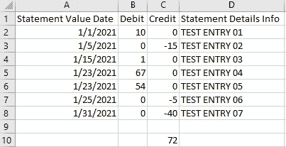
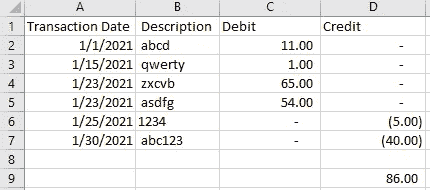
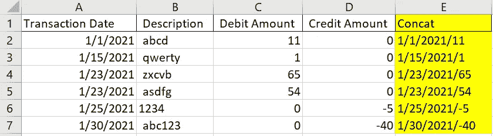
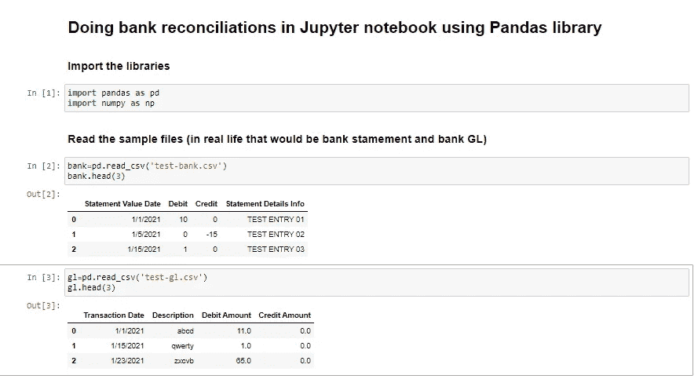
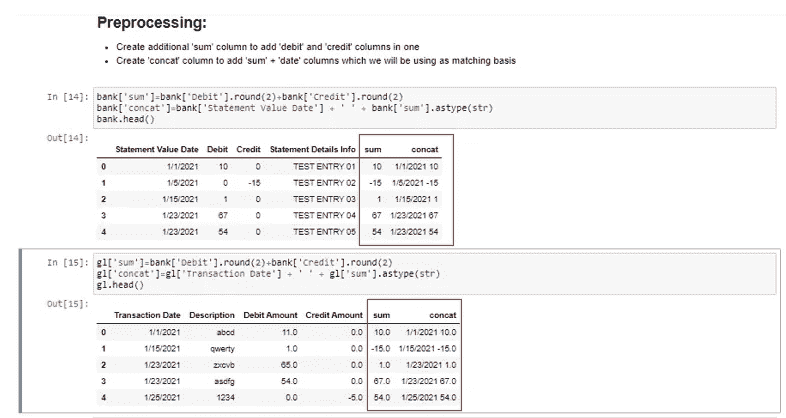
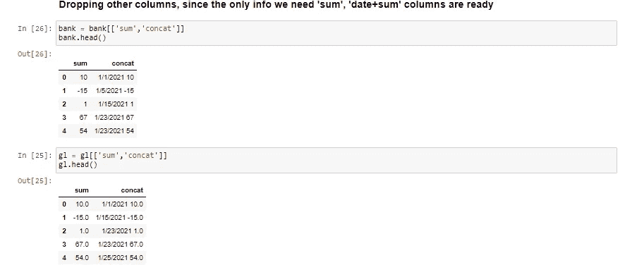
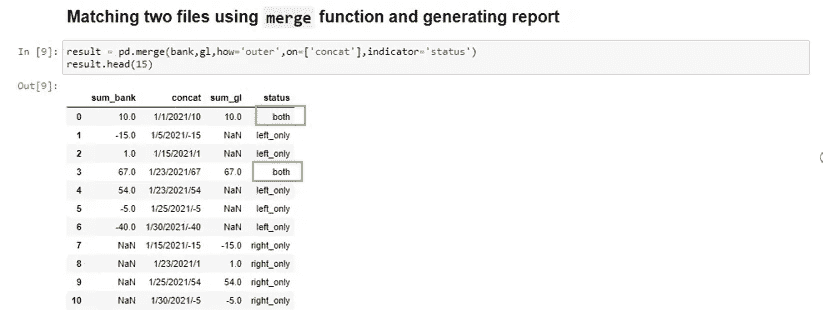
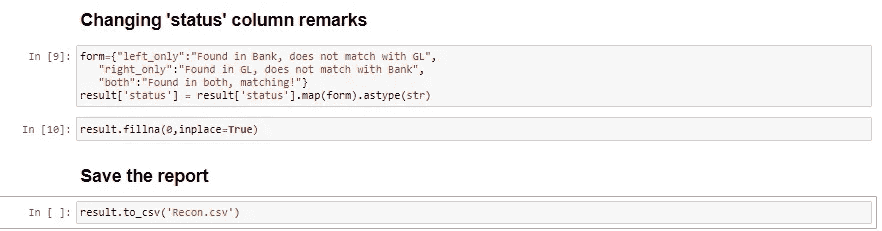
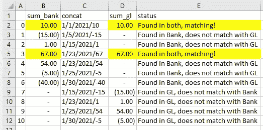

# 使用 Jupyter 笔记本中的 Pandas 库实现银行对账自动化

> 原文：<https://medium.com/analytics-vidhya/automate-bank-reconciliations-using-pandas-library-in-jupyter-notebooks-ccdb0cb4c32d?source=collection_archive---------4----------------------->

我们，会计师，通常是非常非常冷静的人，我们大多数人都这么认为。但有些事情会让最有耐心的会计师也难以保持冷静。想象一下，查看成千上万行看似永无止境的银行月结单，并试图将其与您的银行分类账报表进行匹配……仅此一项就足以说明这一过程会多么令人沮丧和耗时。

我们中的大多数人仍然依赖 Excel 来准备这样的报告，然而，不管 Excel 有多好，对我来说，在做银行 rec 时，它仍然太手工化和僵化了。我决定使用一些其他工具来寻找我的救赎，这时我发现了我一生的爱 Python 中的熊猫库。我知道你们也喜欢`Pandas`,事实上，它是最广泛使用的语言之一。

只用几行代码，我就可以实现银行对账单与银行分类账的自动匹配，识别不匹配的记录，甚至还能享受其中的乐趣。使用 Excel 做银行记录节省了我们一个多小时。这里唯一需要手动操作的是显示文件的路径，眨眼之间，报告就生成并保存了！

下面我分享 Jupyter 笔记本中使用样本测试银行对账单和银行分类账号码的步骤和全部代码。

为了便于解释，我将使用样本测试银行对账单和银行分类账报告:

银行对账单样本

银行分类帐报表样本

正如我们所看到的，我们在两个报告之间有 14 美元的差异，我们将使用`Pandas`来查找所有匹配和不匹配的条目，并生成对账报告。银行 rec 使用一系列因公司而异的技术来完成，然而，最常用的技术之一是*“日期+金额”*连接技术来匹配交易。其中交易日期和借项/贷项金额连接在每个报表的单独单元格中，然后查找匹配项。它看起来会像下面这样:

示例:在 Excel 中完成日期+金额串联，为匹配做准备

现在让我们开始编码吧！

1.  导入`pandas`库，阅读我们的 csv 文件:

文件已准备就绪

2.第二步将涉及我们的文件预处理，准备使用“日期+总和”方法进行匹配。

注意，作为预处理的一部分，我们有两个单独的列。现在这是一个简单的例子，但是在 real statement/GLs 中，必须执行许多步骤来准备我们的匹配数据。

3.现在，我们可以匹配这两个文件，并查看银行总账中缺失或错误过账的数字:

银行对账单中五个分录中只有两个在总账中正确过账。必须对其他不匹配的交易记录进行更正分录。

4.匹配已经完成，但是，让我们以适当且“方便读者”的方式呈现这些数据——让我们在“状态”列上多下功夫，让非财务用户更容易理解，同时我们可以用适当的零替换“NaN ”:

让我们打开并查看我们保存的`csv`文件:

显然，用真实的银行对账单和总账做这件事可能需要更多的预处理步骤或准备好数据，但最终过程总是相同的，以匹配和找到缺失/错误的交易。您还可以在准备过程中修改和添加额外的步骤，并帮助实现另一个手动过程的自动化。从小处着手，全部完成！