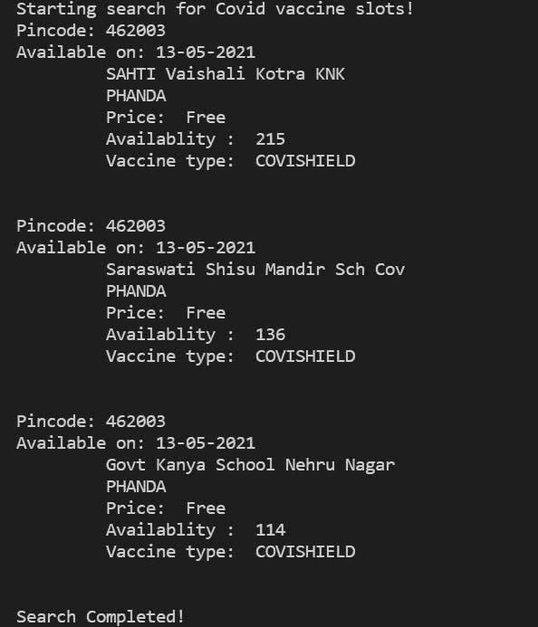

# 使用 Python 自动化 Cowin 疫苗槽可用性

> 原文：<https://medium.com/analytics-vidhya/automate-cowin-vaccine-slots-availablity-using-python-6c76aa61a901?source=collection_archive---------19----------------------->

读者你好！


我希望你们都平安在家。不要走出你的房子，除非有适当的预防措施，绝对必要。

冠状病毒病例与日俱增。第二次浪潮在许多地区造成了非常严重的影响。接种疫苗非常重要。但是，得到一个位置似乎几乎是不可能的。甚至我也不能得到一个。所以我试图想出一个可能的更好的主意，如果你了解我，你现在一定知道我是一个 python 爱好者，所以我试图自动化该槽的可用性。

因此，在这篇博文中，我将告诉你如何自动化疫苗空位的可用性，并在空位可用时得到通知。我们将看到 python 中的实现。

为了方便起见，您可以使用代码，它可以在我的 GitHub 库中找到。尽可能地传播这篇文章，这样每个人都可以得到关于空位的通知，我们都可以接种疫苗。

[查看 python 的终极资源库](https://github.com/ayushi7rawat/Ultimate-Python-Resource-Hub)。发现有用就掉颗星！有什么要补充的吗？开个 PR 就一样了！

你可以参考我的 YouTube 视频教程来看一个工作教程，以便更好地理解和一步一步的指导。

# 这个博客将会涵盖什么

```
1\. What is Web Scraping?
2\. The Web-Scaping Process and its Uses.
3\. What is Coronavirus and CoWin?
4\. How to Automate vaccine slots availability
```

*我们开始吧！*

# 什么是 Web 报废？：

# 介绍

如果你曾经从一个网站上复制并粘贴信息，你已经完成了与任何网页抓取器相同的功能，只是在微观的手动范围内。


Web 抓取，也称为 web 数据提取，是从网站检索或“抓取”数据的过程。收集这些信息，然后将其导出为对用户更有用的格式。无论是电子表格还是 API。

这里需要考虑两个要点:

1.  始终保持尊重，并试图获得许可刮，不要轰炸一个网站与刮请求，否则，您的 IP 地址可能会被封锁！
2.  请注意，网站经常变化，这意味着您的代码可能会从正常工作到完全崩溃。

# 流程:三个简单的步骤

1.  请求网页作出回应
2.  借助美汤和`lxml`解析提取
3.  将熊猫的数据下载并导出到 excel


# 其用途:

它可以服务于几个目的，最受欢迎的是投资决策，竞争对手监测，新闻监测，市场趋势分析，评估财产价值，估计租金收益，政治和运动，等等。

如果你想进一步了解它。我在这里附上[维基百科](https://en.wikipedia.org/wiki/Web_scraping)链接。你可以看看。

# 什么是冠状病毒？

我不认为冠状病毒需要介绍，但以防万一，如果有人不知道，冠状病毒疾病(新冠肺炎)是一种由新发现的冠状病毒引起的传染病。

新冠肺炎病毒主要通过患者咳嗽或打喷嚏时的唾液或鼻涕传播

如果你想进一步了解它。我在这里附上[维基百科](https://en.wikipedia.org/wiki/Coronavirus)链接。你可以看看。

# CoWin 是什么？

在全民免疫计划下，几年来，印度一直使用一个名为 eVIN(电子疫苗情报网络)的疫苗情报系统，CoWIN 是 eVIN 的延伸。CoWIN 代表 Covid 疫苗情报工作。

> 它是疫苗接种的门户，也是疫苗接种运动的支柱。

# 数据源

我们将利用 cowin 官方网站。


# 使用的模块:

## 请求模块:

*   使用请求库来获取页面。
*   如果您有防火墙阻止 Python，这可能会失败。
*   有时，如果第一次失败，您需要运行两次。

现在，您已经熟悉了*冠状病毒和 Cowin* ，并掌握了 *Web 报废和请求模块的基本知识，*我们可以前进到*编码部分。*

# 该编码了！

你可以在我的 [GitHub 库](https://github.com/ayushi7rawat/CoWin-Vaccine-Notifier)中找到所有代码。发现有用就掉颗星。


*先来了解一下这个！*

为了访问 Python 库，需要将其安装到 Python 环境中

```
pip install requests
```

现在，我们需要将包导入到 python 脚本中。使用以下命令来完成此操作。

```
import requestsfrom datetime import datetime, timedelta
import timeimport json
```

现在我们已经导入了库，让我们继续。

让我们显示一条欢迎信息。同样，我们将使用`print`方法。

```
print("Starting search for Covid vaccine slots!")
```

现在，让我们设置一些基本参数，

```
age = 52
pinCodes = ["462003"]
print_flag = 'Y'
num_days = 2
```

*   老虎机分为两类，45 岁以上和 18 岁以上。现在让我们从`Age 45+`开始，你可以根据你的需要来设置。
*   您可以根据`Pincode`或`District`进行搜索。因为我们正在寻找附近可用的插槽，所以我使用了 Pin 码。您也可以传递多个 pin 码，在列表中用`commans`分隔。
*   我们只想检查接下来两天的空位，这里我们将`num_days`设为`2`。
*   最后，将标志值设置为`y`。

现在让我们利用`datetime`方法来计算今天的日期。

```
actual = datetime.today()#output:
2021-05-13 13:35:24.396612
```

现在，运行一个循环将其转换为列表格式。我们将利用`timedelta`方法将其转换成列表格式

```
list_format = [actual + timedelta(days=i) for i in range(num_days)]#Output:
[datetime.datetime(2021, 5, 13, 13, 39, 18, 496330), datetime.datetime(2021, 5, 14, 13, 39, 18, 496330)]
```

我们将再次运行一个循环来从列表中获取日期，我们将利用`strftime`方法来这样做。注意，我们以`date-month-year`格式存储日期。

```
actual_dates = [i.strftime("%d-%m-%Y") for i in list_format]#Output:
['13-05-2021', '14-05-2021']
```

接下来，我们将运行一个 while 循环来获取插槽的详细信息。首先让我们将计数器设置为零。

这里再介绍两个循环:

*   一个是为了获取每个 pin 码的细节。
*   第二步是获取给定 pin 码中每个日期的详细信息。

现在，为了获得请求，让我们定义 URL。

```
URL = "https://cdn-api.co-vin.in/api/v2/appointment/sessions/public/calendarByPin?pincode={}&date={}".format(pinCode, given_date)
```

如果您注意到，我已经使用字符串格式在 URL 本身中添加了参数。我们在这里传递两个参数，`pincode`和`date`。每当内部循环运行时，这个 URL 将被调用，相应的日期和 pin 码将作为每个案例的参数被传递。

现在，为了得到请求，让我们定义一下`header`。

```
header = {'User-Agent': 'Mozilla/5.0 (Windows NT 6.1; WOW64) AppleWebKit/537.36 (KHTML, like Gecko) Chrome/56.0.2924.76 Safari/537.36'}
```

一旦完成，让我们调用`requests`，我们将使用`get`方法。

```
result = requests.get( URL, headers=header)
```

现在，我们的响应存储在结果中。让我们试着打印出来。我们将利用`text`方法进行同样的操作。

```
print(result.text)#OUTPUT:{"centers":[{"center_id":691508,"name":"Navin Girls HSS Tulsi Nagar 18","address":"1250 Tulsi Nagar HOSPITAL","state_name":"Madhya Pradesh","district_name":"Bhopal","block_name":"PHANDA","pincode":462003,"lat":23,"long":77,"from":"09:00:00","to":"17:00:00","fee_type":"Free","sessions":[{"session_id":"b63ce111-23dd-4d4e-9f1c-c97073c57a52","date":"13-05-2021","available_capacity":0,"min_age_limit":18,"vaccine":"COVAXIN","slots":["09:00AM-11:00AM","11:00AM-01:00PM","01:00PM-03:00PM","03:00PM-05:00PM"]}]},{"center_id":570554,"name":"SAHTI Vaishali Kotra 
KNK","address":"Govt. Higher Sec. Kamla Nehru Girls School Teenshed TT Nagar","state_name":"Madhya Pradesh","district_name":"Bhopal","block_name":"PHANDA","pincode":462003,"lat":23,"long":77,"from":"09:00:00","to":"17:00:00","fee_type":"Free","sessions":[{"session_id":"93144388-6dca-4f7c-9aba-ecd5b120fa94","date":"13-05-2021","available_capacity":215,"min_age_limit":45,"vaccine":"COVISHIELD","slots":["09:00AM-11:00AM","11:00AM-01:00PM","01:00PM-03:00PM","03:00PM-05:00PM"]}]},{"center_id":592476,"name":"25 Battalion Campus BhadBhada","address":"25th Battalion Bhadbhada Bhopal","state_name":"Madhya Pradesh","district_name":"Bhopal","block_name":"PHANDA","pincode":462003,"lat":23,"long":77,"from":"09:00:00","to":"17:00:00","fee_type":"Free","sessions":[{"session_id":"b857cd10-b46f-404f-a5de-81032b667e46","date":"13-05-2021","available_capacity":0,"min_age_limit":45,"vaccine":"COVAXIN","slots":["09:00AM-11:00AM","11:00AM-01:00PM","01:00PM-03:00PM","03:00PM-05:00PM"]}]},{"center_id":570591,"name":"GHMC- Ward 29 Office 18","address":"Pandit Khushilal Sharma Parisar","state_name":"Madhya Pradesh","district_name":"Bhopal","block_name":"PHANDA","pincode":462003,"lat":23,"long":77,"from":"09:00:00","to":"17:00:00","fee_type":"Free","sessions":[{"session_id":"5bcd92b4-a476-4c47-a203-3e96179e5beb","date":"13-05-2021","available_capacity":0,"min_age_limit":18,"vaccine":"COVISHIELD","slots":["09:00AM-11:00AM","11:00AM-01:00PM","01:00PM-03:00PM","03:00PM-05:00PM"]}]},{"center_id":609392,"name":"Govt School Nayabasera 18","address":"NAYABASERA SANJEEVANI","state_name":"Madhya Pradesh","district_name":"Bhopal","block_name":"PHANDA","pincode":462003,"lat":23,"long":77,"from":"09:00:00","to":"17:00:00","fee_type":"Free","sessions":[{"session_id":"60306cc5-15a4-4195-876a-2889676631c0","date":"13-05-2021","available_capacity":0,"min_age_limit":18,"vaccine":"COVISHIELD","slots":["09:00AM-11:00AM","11:00AM-01:00PM","01:00PM-03:00PM","03:00PM-05:00PM"]}]},{"center_id":561924,"name":"Saraswati Shisu Mandir Sch Cov","address":"Saraswati Shishu Mandir School Shivaji Nagar Bhopal Madhya Pradesh India","state_name":"Madhya Pradesh","district_name":"Bhopal","block_name":"PHANDA","pincode":462003,"lat":23,"long":77,"from":"09:00:00","to":"17:00:00","fee_type":"Free","sessions":[{"session_id":"e1f4f7a1-42d5-4f58-934b-ed031fc3e7c0","date":"13-05-2021","available_capacity":137,"min_age_limit":45,"vaccine":"COVISHIELD","slots":["09:00AM-11:00AM","11:00AM-01:00PM","01:00PM-03:00PM","03:00PM-05:00PM"]}]},{"center_id":591027,"name":"CD RAJ BHAVAN CVX","address":"RAJ BHAVAN BHOPAL","state_name":"Madhya Pradesh","district_name":"Bhopal","block_name":"PHANDA","pincode":462003,"lat":23,"long":77,"from":"09:00:00","to":"17:00:00","fee_type":"Free","sessions":[{"session_id":"52de668d-5526-4e09-8c41-f34c1912302d","date":"13-05-2021","available_capacity":0,"min_age_limit":45,"vaccine":"COVAXIN","slots":["09:00AM-11:00AM","11:00AM-01:00PM","01:00PM-03:00PM","03:00PM-05:00PM"]}]},{"center_id":667429,"name":"CD Vallabh Bhawan CVX","address":"Vallabh Bhawan Bhopal","state_name":"Madhya Pradesh","district_name":"Bhopal","block_name":"PHANDA","pincode":462003,"lat":23,"long":77,"from":"09:00:00","to":"17:00:00","fee_type":"Free","sessions":[{"session_id":"e8202c2d-b545-401c-b266-8bf9102687e2","date":"13-05-2021","available_capacity":0,"min_age_limit":45,"vaccine":"COVAXIN","slots":["09:00AM-11:00AM","11:00AM-01:00PM","01:00PM-03:00PM","03:00PM-05:00PM"]}]},{"center_id":561310,"name":"Govt Kanya School Nehru Nagar","address":"Govt Kanya School Nehru Nagar","state_name":"Madhya Pradesh","district_name":"Bhopal","block_name":"PHANDA","pincode":462003,"lat":23,"long":77,"from":"09:00:00","to":"17:00:00","fee_type":"Free","sessions":[{"session_id":"85a85c27-cabd-4058-b902-7b0bf457cb44","date":"13-05-2021","available_capacity":114,"min_age_limit":45,"vaccine":"COVISHIELD","slots":["09:00AM-11:00AM","11:00AM-01:00PM","01:00PM-03:00PM","03:00PM-05:00PM"]}]},{"center_id":636442,"name":"CD VIDHAN SABHA COVISHIELD","address":"VIDHAN SABHA","state_name":"Madhya Pradesh","district_name":"Bhopal","block_name":"PHANDA","pincode":462003,"lat":23,"long":77,"from":"09:00:00","to":"17:00:00","fee_type":"Free","sessions":[{"session_id":"6010b80f-a818-4cf5-ad67-90a0cb49f1d6","date":"13-05-2021","available_capacity":0,"min_age_limit":45,"vaccine":"COVISHIELD","slots":["09:00AM-11:00AM","11:00AM-01:00PM","01:00PM-03:00PM","03:00PM-05:00PM"]}]},{"center_id":611640,"name":"Kopal HSS Nehru Nagar18","address":"Kopal HSS Nehru Nagar Bhopal","state_name":"Madhya Pradesh","district_name":"Bhopal","block_name":"PHANDA","pincode":462003,"lat":23,"long":77,"from":"09:00:00","to":"17:00:00","fee_type":"Free","sessions":[{"session_id":"b4a74e1f-cc5b-498a-b92d-25bf5c3bc072","date":"13-05-2021","available_capacity":0,"min_age_limit":18,"vaccine":"COVAXIN","slots":["09:00AM-11:00AM","11:00AM-01:00PM","01:00PM-03:00PM","03:00PM-05:00PM"]}]},{"center_id":639426,"name":"BANGANG WARD 25 CVX","address":"SANJEEVNI BANGANGA","state_name":"Madhya Pradesh","district_name":"Bhopal","block_name":"PHANDA","pincode":462003,"lat":23,"long":77,"from":"09:00:00","to":"17:00:00","fee_type":"Free","sessions":[{"session_id":"def621bf-2e3e-4514-a605-9debd696d8ef","date":"13-05-2021","available_capacity":0,"min_age_limit":45,"vaccine":"COVAXIN","slots":["09:00AM-11:00AM","11:00AM-01:00PM","01:00PM-03:00PM","03:00PM-05:00PM"]}]},{"center_id":636455,"name":"JAHANGIRABAD SANJEEVANI","address":"JAHANGIRABAD","state_name":"Madhya Pradesh","district_name":"Bhopal","block_name":"PHANDA","pincode":462003,"lat":23,"long":77,"from":"09:00:00","to":"18:00:00","fee_type":"Free","sessions":[{"session_id":"a58f02b7-a252-4daf-a541-b7ddf9bae21c","date":"19-05-2021","available_capacity":0,"min_age_limit":45,"vaccine":"COVISHIELD","slots":["09:00AM-11:00AM","11:00AM-01:00PM","01:00PM-03:00PM","03:00PM-06:00PM"]}]},{"center_id":627202,"name":"CD Sewaniya Gaud","address":"CD Sewaniya Gaud","state_name":"Madhya Pradesh","district_name":"Bhopal","block_name":"PHANDA","pincode":462003,"lat":23,"long":77,"from":"09:00:00","to":"18:00:00","fee_type":"Free","sessions":[{"session_id":"80130fd2-483a-4bb7-876a-9f2130484994","date":"19-05-2021","available_capacity":0,"min_age_limit":45,"vaccine":"COVISHIELD","slots":["09:00AM-11:00AM","11:00AM-01:00PM","01:00PM-03:00PM","03:00PM-06:00PM"]}]}]}
```

该数据是非结构化的。因此，我们将在这里使用`json`。让我们将数据转换成`json`文件。

```
if result.ok:
    response_json = result.json()
```

现在，为了检索每个中心的信息，我们将运行一个相同的循环。最初，让我们将`flag`设置为`false`

```
flag = False
if response_json["centers"]:            
    if(print_flag.lower() =='y'):
        for center in response_json["centers"]:
```

现在，让我们显示并验证每个中心的数据

```
print(center)#OUTPUT:{'center_id': 691508, 'name': 'Navin Girls HSS Tulsi Nagar 18', 'address': '1250 Tulsi Nagar HOSPITAL', 'state_name': 'Madhya Pradesh', 'district_name': 'Bhopal', 'block_name': 'PHANDA', 'pincode': 462003, 'lat': 23, 'long': 77, 'from': '09:00:00', 'to': '17:00:00', 'fee_type': 'Free', 'sessions': [{'session_id': 'b63ce111-23dd-4d4e-9f1c-c97073c57a52', 'date': '13-05-2021', 'available_capacity': 0, 'min_age_limit': 18, 'vaccine': 'COVAXIN', 'slots': ['09:00AM-11:00AM', '11:00AM-01:00PM', '01:00PM-03:00PM', '03:00PM-05:00PM']}]}
```

现在，我们终于可以检索每个会话的信息了。我们将应用检查参数作为我们之前保存的参数。

```
for session in center["sessions"]:
    if (session["min_age_limit"] <= age and session["available_capacity"] > 0 ):
```

如果它将我们的条件分层，让我们显示结果。

```
print('Pincode: ' + pinCode)
print("Available on: {}".format(given_date))
print("\t", center["name"])
print("\t", center["block_name"])
print("\t Price: ", center["fee_type"])
print("\t Availablity : ", session["available_capacity"])if(session["vaccine"] != ''):
    print("\t Vaccine type: ", session["vaccine"])
    print("\n")
```

最后还是让计数器加一吧。

```
counter += 1
```

让我们来看看边缘情况:

```
if(counter == 0):
    print("No Vaccination slot avaliable!")
else:
    print("Search Completed!")
```

最后，让我们实时同步数据。

```
dt = datetime.now() + timedelta(minutes=3)while datetime.now() < dt:
    time.sleep(1)
```

让我们看看输出，让我们与实际网站进行比较。



就这样，结束了！您可以将脚本托管在服务器上，以便在您附近有空位时得到通知。你可以在我的 [GitHub 库](https://github.com/ayushi7rawat/CoWin-Vaccine-Notifier)找到所有代码。发现有用就掉颗星。

很简单，不是吗？希望这篇教程有所帮助。我强烈推荐你去看看 YouTube 上的视频，别忘了订阅我的频道。

我写关于职业、博客、编程和生产力的文章，如果你对此感兴趣，请与你的朋友和关系人分享这篇文章。你也可以订阅我的时事通讯，在我每次写东西的时候得到更新！

谢谢你的阅读，如果你已经到目前为止，请喜欢这篇文章，它会鼓励我写更多这样的文章。请分享您的宝贵建议，感谢您的真诚反馈！

我很乐意在推特 | [LinkedIn](https://www.linkedin.com/in/ayushi7rawat/) 与你联系。

你绝对应该看看我的其他博客:

*   [Python 3.9:你需要知道的一切](https://ayushirawat.com/python-39-all-you-need-to-know)
*   [终极 Python 资源枢纽](https://ayushirawat.com/the-ultimate-python-resource-hub)
*   [GitHub CLI 1.0:您需要知道的一切](https://ayushirawat.com/github-cli-10-all-you-need-to-know)
*   [成为更好的程序员](https://ayushirawat.com/become-a-better-programmer)
*   [如何制作自己的谷歌 Chrome 扩展](https://ayushirawat.com/how-to-make-your-own-google-chrome-extension-1)
*   [使用 Python 从任何 pdf 创建您自己的有声读物](https://ayushirawat.com/create-your-own-audiobook-from-any-pdf-with-python)
*   你很重要，你的心理健康也很重要！

# 资源:

*   [https://API setu . gov . in/public/market place/API/cowin #/Appointment % 20 avail ability % 20 APIs/calendar bypin](https://apisetu.gov.in/public/marketplace/api/cowin#/Appointment%20Availability%20APIs/calendarByPin)
*   [cowin.gov.in/home](https://www.cowin.gov.in/home)
*   [pypi.org/project/requests](https://pypi.org/project/requests/)

在我的下一篇博客文章中再见，保重