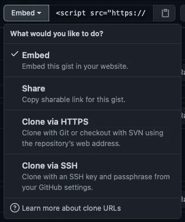
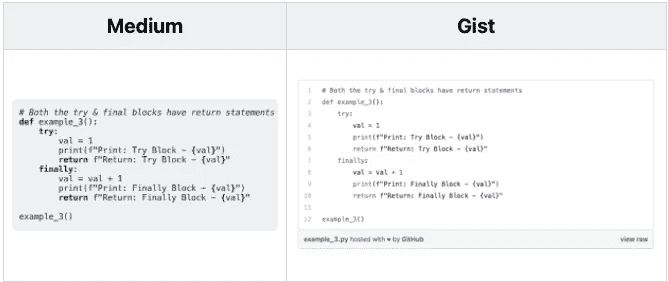

# 使用 Python 从 Markdown 文件自动创建 Gist

> 原文：<https://medium.com/analytics-vidhya/automate-gist-creation-from-markdown-file-using-python-df730762a1e?source=collection_archive---------7----------------------->

## Markdown 的代码块非常适合编写代码片段。然而，当你试图通过博客平台发布或分享它时，会有一些缺点。Gist 可以帮助缩小差距。Gist 让你的博客看起来更好，更容易维护。在这篇文章中，让我们看看自动创建要点是如何改善你的技术博客体验的。

# 要点介绍

Gist 是一个 GitHub 存储库，在这里你可以存储和与他人共享代码/数据。一个 gist 可以存储多个文件。基于文件扩展名类型支持语法突出显示，因此在命名文件时要小心。要点可以是公开的，也可以是秘密的。请注意，secret gists 不是私有的，这意味着任何拥有该 URL 的人都可以查看代码/数据。

# 为什么要用 gist？

*   支持 GitHub 库功能，如版本控制、分叉和克隆。
*   能够订阅，星级和评论，使 gist 容易与他人合作。
*   Gist 可以以多种方式共享，没有任何依赖或安装。

要点分享

# 为什么在博客中使用 gist？

我目前写博客的工作流程如下:

1.  用 Jupyter 笔记本写博客。
2.  下载笔记本作为降价文件。
3.  发布到[中型](https://6aravind.medium.com) & [开发到](https://dev.to/6aravind)等平台之前，对降价文件进行编辑

第 3 步涉及许多手动过程，我计划在接下来的几周内解决这些问题。我现在最关心的是代码片段在不同平台上的样子。更具体地说:

*   发布后，没有简单的方法对代码片段进行更改
*   中等失去语法突出显示
*   在两种平台中，无法突出显示长代码段中的特定行

中等和要点的区别

Gist 有助于解决所有这些问题。另外，来自同一个博客的所有代码片段可以通过 gist 组合在一起。这使得引用/访问(如果需要)更加容易。

# 从降价文件创建要点

目标是为 markdown 文件创建一个要点，其中每个代码片段都是一个单独的文件。

1.  首先，我们将下载像[这篇文章](https://www.liquidweb.com/kb/little-known-ways-to-utilize-github-gists/)中提到的用于 gist 创建的令牌，并将其存储在一个名为— *create_gist_token.txt* 的文件中

2.我们可以使用 python 读取 markdown 文件，并使用正则表达式找到所有代码块。python 的代码块是通过在 markdown 文件中的``之间包装代码来创建的。旗 [re。S](https://docs.python.org/3/library/re.html#re.S) 确保匹配也包括换行符

3.如前所述，每个代码片段在 gist 中都是一个独立的文件，所以我们需要为每个代码片段取一个名字。为了简单起见，我们将第一个注释作为文件名。

4.要点的描述将是减价文件的第一个标题。通常，这将是博客的名称，所以应该足够了。现在我们可以把所有的数据放在一起，进行 API 调用。

5.由于 Devto 支持液体文本，所以与 Medium 相比，我们需要特殊的格式来嵌入要点。在这两个平台中，我们需要指定文件，以便不显示整个要点。

6.遍历所有上传的文件，并用 markdown 文件中相应的 gist 嵌入替换它们。我已经包含了两个平台的嵌入，可以根据你的需要随意修改。

7.重写脚本，使其更容易从命令行运行。

# 外卖食品

Gist 非常有用，它解决了博客中的许多恼人的问题。我们已经设法整合了一个 python 脚本，它可以减少发布博客所需的人工工作。请随时通过 [Twitter](https://twitter.com/6aravind) 联系我，或者评论你对这篇文章的想法。

*原载于 2021 年 5 月 11 日*[*https://dev . to*](https://dev.to/6aravind/automate-gist-creation-from-markdown-file-using-python-2la5)*。*