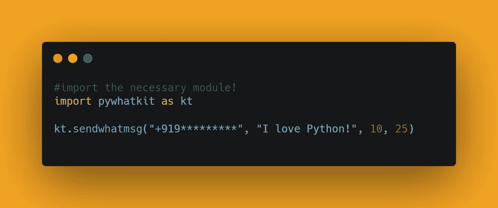

# 使用 Python 自动化 WhatsApp

> 原文：<https://medium.com/analytics-vidhya/automate-whatsapp-using-python-d6e9a3d5704c?source=collection_archive---------2----------------------->

你好世界！


在这篇博客文章中，我们将学习如何自动化 WhatsApp。我们将利用 web.whatsapp.com[的](http://web.whatsapp.com/)网页来自动化消息，我们将看到 Python 中的实现。

[查看 python 终极资源库](https://github.com/ayushi7rawat/Ultimate-Python-Resource-Hub)。发现有用就掉颗星！有什么要补充的吗？开个 PR 就一样了！

你可以参考我的 YouTube 视频教程，看一个工作教程来更好的理解和一步一步的指导。

# 这个博客将会涵盖什么

```
1\. What is WhatsApp?
3\. Basics of pywhatkit Module
4\. Automate WhatsApp using Python
```

*让我们开始吧！*

# WhatsApp 是什么？：

我不认为 WhatsApp 需要介绍，但对于那些现在知道的人来说，WhatsApp 是一个免费的多平台消息应用程序，可以让你进行视频和语音通话，发送短信等等——所有这些都只需要一个 Wi-Fi 连接。

如果你希望了解更多，可以参考 [WhatsApp 维基百科页面](https://en.wikipedia.org/wiki/WhatsApp)。

# 使用的模块:

# pywhatkit 模块:

PyWhatKit 是一个 Python 库，具有各种有用的特性。这是一个易于使用的库，不需要你做一些额外的设置。

这个模块还有很多其他很酷的特性。请随意探索它们，或者如果你愿意，我可以写一篇关于它们的文章。

如果你想了解更多，可以参考 [pywhatkit 模块文档](https://github.com/Ankit404butfound/PyWhatKit)。

# getpass 模块:

getpass()提示用户输入密码，但不回显。在程序通过终端与用户交互时，`getpass`模块提供了一种安全的方式来处理密码提示。

现在，您已经熟悉了 *WhatsApp* 并掌握了 *pywhatkit 和 getpass 模块的基本知识，*我们可以前进到*编码部分。*

# 该编码了！

你可以在我的 [GitHub 库](https://github.com/ayushi7rawat/Youtube-Projects/tree/master/Currency%20Converter)找到所有代码。发现有用就掉颗星。


为了访问 Python 库，需要将其安装到 Python 环境中

```
pip install pywhatkit
```

现在，我们需要在 python 脚本中导入包。使用以下命令来完成此操作。

```
import pywhatkit as kt
```

现在我们已经使用命令`import pywhatkit as kt`导入了这个库，让我们继续自动化 whatsapp。

在我们继续之前，请确保您的浏览器中有一个活动会话或以前使用过的[web.whatsapp.com](http://web.whatsapp.com/)网页。


同样，我们将使用`sendwhatmsg`方法。让我们了解一下要使用的参数:

*   phone_num:强制参数
*   具有正确国家代码的目标的电话号码
*   消息:强制参数。
*   你想传达的信息。
*   time_hour:强制参数。
*   您希望以 24 小时格式发送消息的时间
*   time_min:强制参数。
*   您希望发送消息的分钟数
*   wait_time:可选参数。
*   `default value = 20`即打开网页后 20 秒后发送消息
*   print_waitTime:可选参数。
*   如果设置为真，则`default value = True`将打印剩余时间。

让我们显示一条欢迎消息，并在这里捕获目标电话号码。

```
print("Let's Automate Whatsapp!")
p_num = 'the taget phone number goes here!'#or you can use getpass module to capture cell num
import getpass as gp
p_num = gp.getpass(prompt='Phoneumber: ', stream=None)
```

让我们抓住这个信息。我把它存储在`msg`里。

```
msg = "I love Python"
```

最后，让我们称之为`sendwhatmsg`法。

```
kt.sendwhatmsg(p_num, msg, 10, 25)
```

注意:本模块遵循 24 小时时间格式。

```
OUTPUT:
In 360 seconds web.whatsapp.com will open and after 60 seconds message will be delivered.
```


此外，在运行脚本时，您应该尝试从当前时间开始提供至少 4–5 分钟的未来时间，否则，如果您将时间设置为比当前时间早 1–2 分钟，则模块可能会给出错误。


成功运行后，WhatsApp 网站将打开，消息将发送到目标手机号码。你可以使用这个脚本来自动化 WhatsApp 向你的朋友和家人发送生日或周年问候，向你的父母发送每日早间消息或将其用于其他商业想法。你可以发送大量信息，或者你可以很容易地创建一个电话号码和信息列表，你可以添加一个“For 循环”。

既然您已经理解了这一切，那么您可以用 2 行代码来编写同样的内容。



通过这些步骤，我们已经成功地使用 python 自动化了 WhatsApp。就是这样！

很简单，不是吗？希望这篇教程有所帮助。我强烈推荐你去看看同样的 [YouTube 视频](https://www.youtube.com/watch?v=ixB2YHGSiAQ)，别忘了订阅我的频道。

您可以使用`pywhatkit`库，甚至探索更多特性。

你可以在我的 [GitHub 库](https://github.com/ayushi7rawat/Youtube-Projects/tree/master/Currency%20Converter)找到所有代码。发现有用就掉颗星。

感谢您的阅读，我很乐意通过[Twitter](https://twitter.com/ayushi7rawat)|[LinkedIn](https://www.linkedin.com/in/ayushi7rawat/)与您联系。

请分享您的宝贵建议，感谢您的真诚反馈！

你绝对应该看看我的其他博客:

*   [Python 3.9:你需要知道的一切](https://ayushirawat.com/python-39-all-you-need-to-know)
*   [终极 Python 资源枢纽](https://ayushirawat.com/the-ultimate-python-resource-hub)
*   [GitHub CLI 1.0:你需要知道的一切](https://ayushirawat.com/github-cli-10-all-you-need-to-know)
*   [成为更好的程序员](https://ayushirawat.com/become-a-better-programmer)
*   [如何制作自己的谷歌 Chrome 扩展](https://ayushirawat.com/how-to-make-your-own-google-chrome-extension-1)
*   [使用 Python 从任何 pdf 创建您自己的有声读物](https://ayushirawat.com/create-your-own-audiobook-from-any-pdf-with-python)
*   你很重要，你的心理健康也很重要！

# 资源:

*   [en.wikipedia.org/wiki/WhatsApp](https://en.wikipedia.org/wiki/WhatsApp)
*   [chromedriver.chromium.org/getting-started](https://chromedriver.chromium.org/getting-started)
*   [chromedriver.chromium.org](https://chromedriver.chromium.org/)
*   [pypi.org/project/pywhatkit](https://pypi.org/project/pywhatkit/)
*   [github.com/Ankit404butfound/PyWhatKit](https://github.com/Ankit404butfound/PyWhatKit)