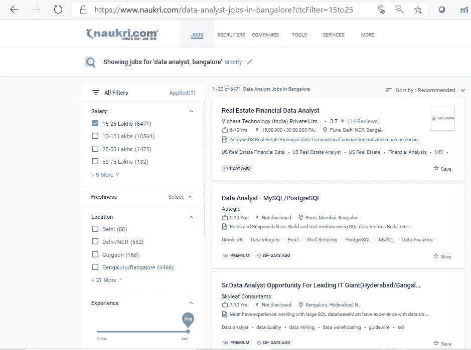
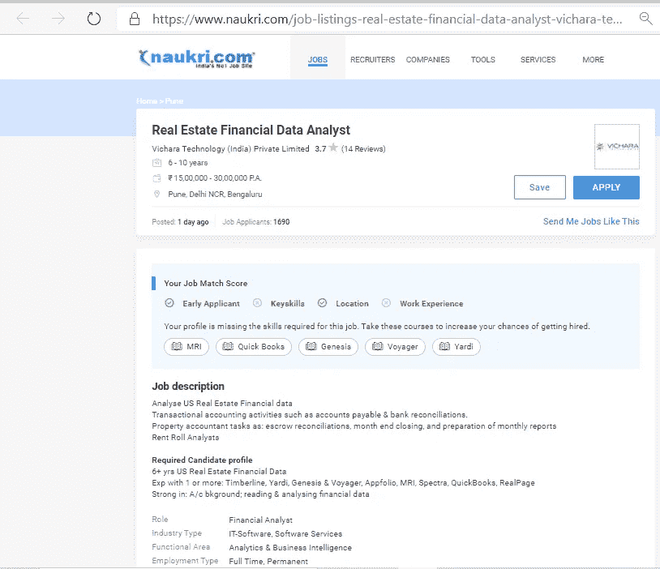
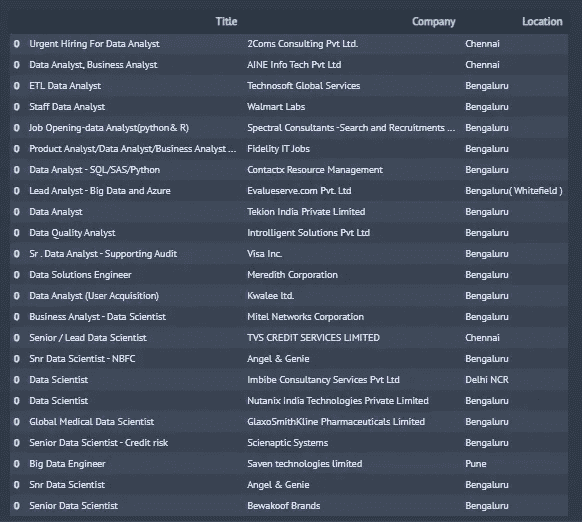

# 使用 Python 自动化您的工作申请

> 原文：<https://medium.com/analytics-vidhya/automate-your-job-applications-using-python-2c378093b901?source=collection_archive---------0----------------------->

## *创建一个能够* ***【智能】*** *自动化你的求职过程的机器人的便捷指南*


照片由[马库斯·温克勒](https://unsplash.com/@markuswinkler?utm_source=medium&utm_medium=referral)在 [Unsplash](https://unsplash.com?utm_source=medium&utm_medium=referral) 拍摄

找工作的过程有时会令人望而生畏。如果没有一个结构化的方法，一个人甚至可以挣扎几个月而得不到梦寐以求的面试电话。当没有推荐人时，Naukri、Linkedin 等求职门户网站确实提供了一个很好的平台，人们可以根据自己喜欢的组织、角色或技能进行申请，然后等待招聘人员的回复。但是，我们真的能够充分利用这些平台吗？在任何给定的时间点，特定技能的搜索结果可能会列出成千上万的空缺职位，但我们能够浏览所有这些列表吗？一个人可以一次浏览 10 个、15 个或者最多 20 个清单，然后申请几个相关的，但是如果完美的匹配在第 25 页呢？一个人很难做到这一点，因为在 20 页的每一页上单独打开 20 个清单，浏览每个清单的细节，同时有选择地申请，这既令人生畏，又极其耗时。

但是，如果你真的可以一次看完所有的工作列表，甚至可以同时申请相关的职位，那会怎么样呢？如果所有这一切都可以在不登录各自账户的情况下完成，或者更好的是，甚至不需要手动点击鼠标。随着我在过去几年中进入数据科学领域，我一直着迷于某些应用程序在解决现实生活中的日常任务时是多么有用。就我们的目的而言，让一个智能机器人过滤多个招聘信息，只申请与我们的技能相关的职位，同时我们可以喝咖啡，观看魔术表演，这种前景确实足够令人兴奋。因此，为了实现这一目标，我们将利用 Python 的功能来构建一个工作应用程序机器人，它可以解决上面提到的一些挑战。

# 场景

我们将考虑一个场景，一名数据分析师在班加罗尔寻找新的机会，其年度 CTC 在 Rs 范围内。150 万到 250 万卢比。

# 方法

我们的目标是编写一个程序，使我们的机器人做以下 6 个步骤:

1.  打开网站
2.  使用我们的凭据登录
3.  按指定的技能、位置和 CTC 范围进行搜索
4.  从获得的结果中，打开每个列表，在工作描述的整个内容中寻找我们指定的技能集
5.  只有当所有技能都匹配时，才单击“apply ”,否则关闭选项卡并转到下一个列表
6.  生成所有已申请列表的报告

出于我们的目的，我们将选择**Naukri.com**作为我们完成申请的门户。Naukri.com 是最大的招聘网站之一，自 1997 年开始在印度和中东运营。

我们将从导入必要的 Python 库开始。

```
import selenium
from selenium import webdriver as wb
import pandas as pd
import time
from time import sleep
from selenium.webdriver.support.ui import WebDriverWait
from selenium.webdriver.common.by import By
from selenium.webdriver.support import expected_conditions as EC
```

将工作目录设置为保存 *chromedriver* 的路径&然后 *chromedriver* ，如下所示

```
%cd "PATH WHERE YOUR CHROMEDRIVER IS SAVED"
driver = wb.Chrome("YOUR PATH\\chromedriver.exe")
```

定义以下几个变量是整个练习中最关键的一步，因为我们定义的技能集将决定我们的机器人将应用于哪些职位发布。因此，我们定义了技能组合、位置偏好、期望薪资范围和我们正在寻找的角色类型。我们将根据要求设置字段—角色为“数据分析师”，位置为“班加罗尔”，预期 CTC 的下限为 15，预期 CTC 的上限为 25，以及一些基本的数据分析师技能。

```
**Skillset = ['Analysis','Python','SQL']**
Skillset = [x.lower() for x in Skillset]
**LL = 15** *#lower limit of expected CTC* **UL = 25 ***      #upper limit of expected CTC*
**location = 'Bangalore'**
location = location.lower().replace(" ","-")
**role = 'Data Analyst'**
role = role.lower().replace(" ","-")
```

既然上面已经定义了我们的需求，接下来的步骤将是让我们的 bot 打开 naukri.com，进入登录页面并输入我们的凭证。我们可以用下面这段代码来实现

```
driver.get("[https://www.naukri.com](https://www.naukri.com/data-analyst-jobs-in-delhi-ncr?k=data%20analyst&l=delhi%2Fncr)")
driver.find_element_by_xpath('//*[[@id](http://twitter.com/id)="login_Layer"]/div').click()
time.sleep(5)
driver.find_element_by_xpath('//*[[@id](http://twitter.com/id)="root"]/div[2]/div[2]/div/form/div[2]/input').send_keys("YOUR NAUKRI LOGIN ID")
driver.find_element_by_xpath('//*[[@id](http://twitter.com/id)="root"]/div[2]/div[2]/div/form/div[3]/input').send_keys("YOUR NAUKRI PASSWORD")
time.sleep(5)
driver.find_element_by_xpath('//*[[@id](http://twitter.com/id)="root"]/div[2]/div[2]/div/form/div[6]/button').click()
```

一旦登录，为了打开相关页面，我们首先需要研究网址。在班加罗尔寻找数据分析师职位的 url，CTC 范围为 150-250 万卢比，如下所示

```
**https://www.naukri.com/data-analyst-jobs-in-bangalore-2?ctcFilter=15to25**
```

上面的 *url* 给了我们一个清晰的指示，告诉我们需要在哪里输入上面创建的角色、位置、ctc 上限(UL)和 ctc 下限(LL)的变量。因此，我们将调用该网站如下:-

```
for i in range(1,6):
    driver.get('[https://www.naukri.com/'+role+'-jobs-in-'+location+'-'+str(i)+'?ctcFilter='+str(LL)+'to'+str(UL))](https://www.naukri.com/'+role+'-jobs-in-'+location+'-'+str(i)+'?ctcFilter='+str(LL)+'to'+str(UL)))
```

运行上面的 url，我们现在在我们面前的是班加罗尔 150-250 万卢比 CTC 范围的数据分析师职位的所有空缺。



现在，当我们单击第一个列表时，它会在一个新的选项卡中打开。我们必须将这一点传达给我们的机器人，让它切换并在新标签中操作，如下所示

```
driver.switch_to.window(driver.window_handles[1])
url = driver.current_url
driver.get(url)
```

在新选项卡中，我们有该特定职位发布的所有详细信息。



我们现在对 Python 的命令是检查其全部内容，查找变量***【Skillset】***中定义的关键字，如果 100%匹配，则单击“Apply”按钮，否则关闭当前选项卡并打开下一个列表。

```
try:
            test = driver.find_element_by_xpath('//*[[@id](http://twitter.com/id)="root"]/main/div[2]/div[2]/section[2]')
            if all(word in test.text.lower() for word in Skillset):
                driver.find_element_by_xpath('//*[[@id](http://twitter.com/id)="root"]/main/div[2]/div[2]/section[1]/div[1]/div[3]/div/button[2]').click()
                time.sleep(2)
                driver.close()
                driver.switch_to.window(driver.window_handles[0])
            else:
                driver.close()
                driver.switch_to.window(driver.window_handles[0])
except:
            driver.close()
            driver.switch_to.window(driver.window_handles[0])
```

> **注意:此代码仅适用于可从 Naukri 门户网站直接申请的发布。任何要求你进入外部页面的帖子都会被忽略，所有这样的标签都会立即关闭。**

一旦我们的机器人完成了指定数量的空缺，我们可以让它最终生成一个报告，其中包含它代表我们完成的所有申请的列表。



一旦我们有了完整的代码，下一次我们需要改变/重新定义的只是技能集、位置偏好和 CTC 范围，我们的机器人会为我们做所有其他的事情。出于这个练习的目的，我们让我们的机器人浏览了班加罗尔数据分析师的 100 个职位列表，分布在前 5 页，我们在其中的 **23** 中成功应用了这些列表。令人惊叹的是，执行整件事所用的时间只有 1274 秒或 21 分钟。


# 结论

我们开始使用 Python 开发另一个非常实用的工具，它可以帮助日常决策。拥有一个这样的机器人非常有用，可以帮助节省大量时间，并获得更广泛的工作机会。帖子概述了该过程中使用的主要代码，完整代码可在[这里](https://github.com/aksbehera/Auto-Job-Applications)找到。