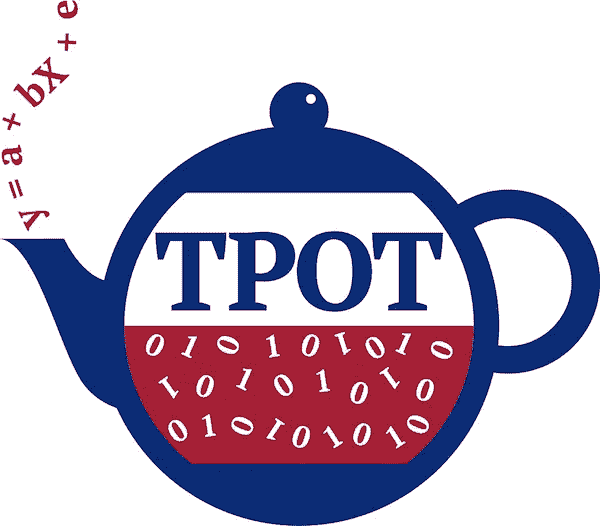

# 使用 TPOT 自动化您的机器学习训练过程

> 原文：<https://medium.com/analytics-vidhya/automate-your-machine-learning-training-process-97e63c584716?source=collection_archive---------2----------------------->

## 停止为模型选择和超参数搜索重写相同的代码

让我们面对现实吧——模特训练是极其耗时的。如果你能自动化它会怎么样？

认识一下你的数据科学助理 TPOT。它可以节省您寻找最佳机器学习管道的时间和精力。

把数据给 TPOT，它会给你基于熟悉的 sklearn 的最优机器学习算法的代码。

这篇博客文章介绍了 TPOT 和一些样本代码。请继续阅读。


提供机器学习模型的茶壶。有什么不喜欢的？照片由[乔尼·勒德洛](https://unsplash.com/@joniludlow?utm_source=medium&utm_medium=referral)在 [Unsplash](https://unsplash.com?utm_source=medium&utm_medium=referral) 上拍摄

# 为什么要自动化你的机器学习优化过程？

你有一组令人兴奋的数据，这些数据具有机器学习的潜力。您探索了数据集的每一个角落和缝隙，将其擦洗得干干净净，现在您的数据已准备好进行真正的操作—机器学习。

下一步是选择最佳的机器学习模型。您可以将数据拟合到各种不同的模型上，并执行一些超参数搜索。


去过那里，做过那个…照片由萨米·威廉姆斯在 Unsplash 上拍摄

如果你去过那里，很可能你已经在不同的项目中多次编写了相同的调用到像 sklearn 这样的通用机器学习包。

一个回归问题？也许你会从线性回归、决策树和支持向量机中抽取样本。

一个分类问题？我们会尝试像逻辑回归、决策树分类器、朴素贝叶斯和 boosting 算法这样的分类算法。

事实是，你已经写了那么多次代码，你从写同样的代码中学不到什么。此外，它还会占用您从模型中获得洞察力的宝贵时间…

> 如果我们可以自动化这个建模过程中最乏味的部分会怎么样？如果我们可以探索成千上万个可能的管道来找到最适合我们数据的管道，会怎么样？

# 介绍 TPOT，你的机器学习助手。

**TPOT** 代表 **T** ree 基 **P** ipeline **O** 优化 **T** ool。TPOT 是一个 Python 自动化机器学习工具，它使用遗传编程优化机器学习管道。



TPOT(来源:[GitHub](https://github.com/EpistasisLab/tpot)；根据 LGPL 3.0 许可证共享)

## TPOT 可以自动化机器学习管道的哪一部分？

更具体地说，TPOT 帮助

*   特征选择
*   特征预处理
*   特征构造
*   型号选择
*   参数最优化

这就是 TPOT 可以在机器学习管道中提供帮助的地方。


TPOT 自动化进程(来源:[GitHub；](https://github.com/EpistasisLab/tpot)根据 LGPL-3.0 许可证共享)

## TPOT 能解决什么问题？

TPOT 已经被证明在分类和回归任务上表现得非常好。以下是一些例子:

*   虹膜数据集分类
*   波士顿房价回归

## TPOT 的样本来自什么算法？

默认情况下，TPOT 搜索广泛的预处理器、特征构造器和选择器、模型和超参数，以最小化模型预测误差。

对于分类问题，它会搜索以下内容:

*   线性模型(如逻辑回归)
*   朴素贝叶斯模型(如伯努利 NB、高斯 NB、多项式 NB)
*   树模型(如决策树分类器)
*   集成模型(如随机森林分类器)
*   SVM 模型(如 LinearSVC)
*   XGBoost 型号

对于回归问题，TPOT 的搜索空间包括:

*   线性模型(ElasticNetCV，SGDRegressor)，
*   集合模型(如 GradientBoostingRegressor)
*   邻居模型(如 KNeighboursRegressor)
*   SVM 模型(如线性 SVR)
*   XGBBoost 型号

# TPOT 示例代码

当然，在我们开始之前，让我们在我们的环境中安装 TPOT。

```
!pip install tpot
```

以下代码使用 [Titanic 数据集](https://www.kaggle.com/c/titanic)作为 TPOT 的示例。

```
from tpot import TPOTClassifier
from sklearn.model_selection import train_test_split
import pandas as pd 
import numpy as np# reading in the data
titanic = pd.read_csv('data/titanic_train.csv')# Train-test split
training_indices, validation_indices = training_indices, testing_indices = train_test_split(titanic.index, stratify = titanic_class, train_size=0.75, test_size=0.25)# Calling the TPOT Classifier 
tpot = TPOTClassifier(verbosity=2, max_time_mins=2, max_eval_time_mins=0.04, population_size=40)
tpot.fit(titanic_new[training_indices], titanic_class[training_indices])# To get the score 
tpot.score(titanic_new[validation_indices], titanic.loc[validation_indices, 'class'].values)# Export the pipeline as a python file
tpot.export('tpot_titanic_pipeline.py')
```

运行一个小时左右，我们发现随机森林在分类方面表现最好。

在“tpot_titanic_pipeline.py”中，我们会找到训练最好的管道。这是可以复制到任何需要重用模型的地方的管道。

```
import numpy as np
import pandas as pd
from sklearn.ensemble import RandomForestClassifier
from sklearn.model_selection import train_test_split

# NOTE: Make sure that the outcome column is labeled 'target' in the data file
tpot_data = pd.read_csv('PATH/TO/DATA/FILE', sep='COLUMN_SEPARATOR', dtype=np.float64)
features = tpot_data.drop('target', axis=1)
training_features, testing_features, training_classes, testing_classes = \
            train_test_split(features, tpot_data['target'], random_state=None)

exported_pipeline = RandomForestClassifier(bootstrap=False, max_features=0.4, min_samples_leaf=1, min_samples_split=9)

exported_pipeline.fit(training_features, training_classes)
results = exported_pipeline.predict(testing_features)
```

有关 TPOT API 的更多信息，请阅读这里的[文档](https://epistasislab.github.io/tpot/api/)。

# TPOT 的更高级用法

## TPOT 支持使用 Dask 进行平行训练

对于较大的问题，并行训练将减少模型收敛所需的时间。这就是 Dask 集群上的分布式培训可以提供显著帮助的地方。为此，只需在估算器中使用`use_dask=True`命令，如下所示:

`estimator = TPOTEstimator(use_dask=True, n_jobs=-1)`

## TPOT 可以在命令行上使用！

可以从命令行调用导出的管道来进行预测。这里有一个例子。

```
tpot data/mnist.csv -is , -target class -o tpot_exported_pipeline.py
```

## TPOT 可以用来拟合神经网络

TPOT 可以使用内置 PyTorch 神经网络模型作为其模型搜索的一部分。

要做到这一点，需要明确指示 TPOT 这样做。这是一个使用神经网络的分类器的例子。您可以使用这一行来替换上面代码中的 TPOTClassifier 行。

```
 clf = TPOTClassifier(config_dict='TPOT NN', 
                   template='Selector-Transformer-PytorchLRClassifier',
                   verbosity=2, 
                   population_size=10, 
                   generations=10) 
```

但是，请注意，这仍处于试验阶段。小心行事！

# 有什么不喜欢的？

*   与 AutoML 工具一样，TPOT 可能需要一段时间来运行(最多几个小时！).优化模型的时候不要失去耐心！
*   TPOT 可能会为同一个数据集推荐不同的解决方案。这是因为 TPOT 的优化在寻找最佳管道时使用了随机性。当这种情况发生时，你可能想要检查 TPOT 是否已经收敛(也许，再给它一点时间？)或者两个管道的结果是否相似。
*   TPOT 目前无法进行无人监督的学习。

# 关于 TPOT 的更多资源

这些对帮助你开始非常有帮助！

*   [文档](https://epistasislab.github.io/tpot)
*   [Github](https://github.com/EpistasisLab/tpot/)

# 其他 AutoML 工具

这里有一个自动化机器学习工具的非详尽列表，除了 TPOT，你可以探索一下

*   [auto-sklearn](https://github.com/automl/auto-sklearn)
*   [auto_ml](https://github.com/ClimbsRocks/auto_ml)
*   [H2O 汽车](http://docs.h2o.ai/h2o/latest-stable/h2o-docs/automl.html)
*   [MLBox](https://github.com/AxeldeRomblay/MLBox)
*   [GAMA](https://github.com/PGijsbers/gama)

# 结论

在为概念验证项目寻找第一个优化模型时，TPOT 非常有用。当然，TPOT 的输出可能仍然需要大量的调整，而且肯定不是生产就绪。然而，展示第一批成果并聚集未来进展所需的势头已经足够好了。

我爱 TPOT。我已经在我的工作中使用了它，它节省了我大量的时间，而不是我用来从模型中获得洞察力。

如果你喜欢这个，你可能也会喜欢我的其他帖子，在那里我探索了机器学习的概念。

[](https://towardsdatascience.com/interpreting-black-box-ml-models-using-lime-4fa439be9885) [## 使用 LIME 解释黑盒 ML 模型

### 通过乳腺癌数据建模直观地理解石灰

towardsdatascience.com](https://towardsdatascience.com/interpreting-black-box-ml-models-using-lime-4fa439be9885) [](https://towardsdatascience.com/what-makes-a-wine-good-ea370601a8e4) [## 是什么造就了好酒…好酒？

### 使用机器学习和部分依赖图寻找好酒

towardsdatascience.com](https://towardsdatascience.com/what-makes-a-wine-good-ea370601a8e4) 

在 LinkedIn 上与我联系！很想听听你在 TPOT 的经历。

[](https://www.linkedin.com/in/travistang) [## Travis Tang -数据科学家- Gojek | LinkedIn

### 💡关注我，获取频繁的数据科学内容+更新！我发布了针对初学者和中间用户的数据科学技巧…

www.linkedin.com](https://www.linkedin.com/in/travistang)