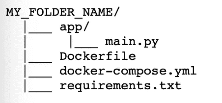

# 使用 Flask & Docker 自动化您的熊猫工作流程

> 原文：<https://medium.com/analytics-vidhya/automate-your-pandas-workflow-with-flask-docker-28e5ab461288?source=collection_archive---------6----------------------->

## 这是在 Dokerised Flask 应用程序中开发您自己的 Pandas 工作流的最简单的方法之一，该应用程序可以在您的计算机上运行或部署在服务器上。本指南也可用于任何其他烧瓶应用。

照片由[威廉·威廉](https://unsplash.com/@william07?utm_source=unsplash&utm_medium=referral&utm_content=creditCopyText)在 [Unsplash](https://unsplash.com/?utm_source=unsplash&utm_medium=referral&utm_content=creditCopyText) 上拍摄

# 为什么我需要在 dockerised flask 应用程序上运行 pandas？

你有没有尝试过在共享的办公空间或者拥挤的咖啡馆工作？嗯，有时候当房间里人太多的时候，很难把事情做好。现在想象所有那些“pip 包”都是人:每次你在那里安装一个新的包，你就有了它，一个新的小伙子“加入”你的计算机的房间。除非你有一台非常强大的机器，否则用不了多久，你的电脑就会开始变慢。

如果这还不够的话，想想你有多少次不得不通宵或连续几天运行一些计算；拥有一个专用的空间，一个“集装箱化”的环境有助于您在脚本工作时专注于重要的事情，当脚本完成时，您可以停止它，甚至完全删除它，而不必担心可能会降低性能的残留。

最后，如果您能够胜任这项任务，您可以轻松地将容器部署在远程服务器上，并永久地将它从您的物理机器中取出来。

# 先决条件

要在本教程后面使用 docker 和 docker compose，您需要在您的计算机上安装它们。点击这里了解更多关于如何安装它们的细节:[https://www.docker.com](https://www.docker.com)

# 创建一个烧瓶应用程序

这个过程非常简单，在官方的 Flask 文档中有很好的描述:[https://flask.palletsprojects.com/en/2.0.x/quickstart/](https://flask.palletsprojects.com/en/2.0.x/quickstart/)

然而，为了使它更简单，对于本文的范围，您只需要用您选择的名称创建一个新文件夹，然后在该文件夹中，创建一个名为`main.py`的新文件，并复制粘贴以下代码:

# 将您的熊猫工作流添加到 Flask 应用程序中

现在我们有了一个最小的 flask 应用程序，我们需要向它添加我们的 pandas 工作流。为此，我们需要`import pandas as pd`,然后在我们的 main 函数中添加 python 代码，当 Flask 应用程序打开时将调用该函数。

如果您不熟悉 Flask，在我们的例子中，当您打开浏览器并访问页面`127.0.0.1`或“localhost”时，会调用`hello_world`函数。在你继续尝试之前，请记住，这只有在我们运行了 docker 之后才会起作用，所以请耐心等待！

如你所见，`hello_world`这个功能是用`app.route("/")`装饰的。这意味着你一访问`127.0.0.1`它就会被调用。如果你愿意，你可以创建自己的个人路径，并为每个 url 触发不同的工作流:例如，只有在访问`127.0.0.1/myfunction`时才会调用`app.route("/myfunction")`等。

专业提示:

*   您可以将参数传递到您的个人 url:例如`127.0.0.1/myfunction?user=John`。
*   您可以导入其他数据可视化或机器学习库(如 sklearn、pyspark、matplotlib、seaborn 等)。)

# 创建 Docker 容器

现在我们有了一个基本的 flask 应用程序，我们需要创建我们的`Dockerfile`和`docker-compose.yml`文件。PS:我使用 docker-compose 是因为用它运行你的容器更容易。

如果你不熟悉 docker，那么你很幸运！Docker hub 已经为我们准备了一个 Docker 图像，包括了(几乎)我们需要的所有东西！[https://hub.docker.com/r/tiangolo/meinheld-gunicorn/](https://hub.docker.com/r/tiangolo/meinheld-gunicorn/)

因此，让我们创建一个文件，将其命名为`Dockerfile`，不带扩展名:

现在对于`docker-compose.yml`文件:

最后，让我们创建一个`wsgi.py`文件:

和一个`requirements.txt`文件，它是我们想要安装的`pip`包的列表(每行一个名字)。在我们的例子中只有`flask`和`pandas`。

现在一切都准备好了，我们需要创建一个名为`app`的新文件夹，然后将文件`main.py`放入其中。我们的文件夹的最终结构将是:

# 构建并运行容器

要构建和运行容器，打开一个新的终端并导航到文件夹:例如`cd <my_path>/MY_FOLDER_NAME`，然后运行以下命令:

`docker-compose build`

`docker-compose up -d`

最后，在您的浏览器上访问`127.0.0.1`来运行集装箱化的工作流程。