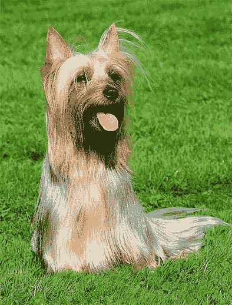
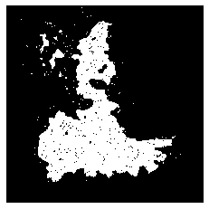

# 使用显著图可视化 CNN 和自动包围盒(动手操作)

> 原文：<https://medium.com/analytics-vidhya/automated-bounding-boxes-using-saliency-maps-ae83f4c0f071?source=collection_archive---------2----------------------->

## 可解释 CV 和弱监督目标定位

**显著图**简单来说基本上是一个显示**输入图像像素的变化对该类**输出的影响的图像。如果图像像素有很小的变化，输出类会受到什么影响，我们逐个查找每个像素的 w.r.t。需要记住的重要一点是，输出类值不是 softmax 值，而是应用 softmax 之前的值。

**包围盒**主要用于物体检测。它包含图像中聚焦对象的信息 **(x0，y0，width，height)** ，但是**标记**这些框是一项繁琐的任务，需要大量的手工劳动。市场上很少有工具可以让你画出一个盒子，并且信息会自动存储在一个文件中，但是你仍然需要浏览所有的图像并手动完成。但是如果有一种自动的方法****来标记**呢，给定图像分类模型可用于这些类别。**

**反过来，这些边界框也可以被视为模型在图像中学习到的内容或模型关注的地方。**

**我已经采取了一个**预先训练的 VGG16 imagenet 模型**和样本图像来解释这个概念。**

************

**(左)黄貂鱼-指数 6 |(中)澳大利亚梗-指数 193 |(右)喜鹊-指数 18**

****导入所有需要的库****

```
import cv2
import numpy as np
from time import time
import tensorflow as tf
import matplotlib.pyplot as plt
```

****加载异常模型并将最后一层从 softmax 输出转换为 raw 输出(在 softmax 之前)****

```
model = tf.keras.applications.vgg16.VGG16()   ### loaded pre-trained### Get raw values (before softmax)
dense_weights = model.get_weights()[-2]
predictions_weights = model.get_weights()[-1]x = model.layers[-2].output
x = tf.keras.layers.Dense(1000, kernel_initializer=tf.constant_initializer(dense_weights), bias_initializer=tf.constant_initializer(predictions_weights))(x)model = tf.keras.models.Model(inputs=model.input, outputs=x)
```

**因此，模型被加载，现在我们必须**写一个函数来计算显著图**。显著图是为每个单独的通道(红色、绿色和蓝色)计算的，然后我们取最大值得到最终的图。**

```
## class_number is the index of imagenet class
## image_size is input size of the model
## preprocess is preprocessing function**def saliencyMaps(model, img_path, class_number, image_size, preprocess):**
    img = tf.keras.preprocessing.image.load_img(img_path, target_size=image_size)
    x = tf.keras.preprocessing.image.img_to_array(img)
    x = np.expand_dims(x, axis=0)
    x = preprocess(x)    x = tf.cast(x, tf.float32)

    with tf.GradientTape() as tape:
        tape.watch(x)
        preds = model(x)
        preds = preds[0][class_number]

    grads = tape.gradient(preds, x)red = grads[0,:,:,0]green = grads[0,:,:,1]blue = grads[0,:,:,2]

    return img, red, green, blue
```

****让我们在一张图片上运行这个代码****

```
img_path =     ## path_to_img
class_number = ## class_index
image_size =   ## Input size of model
preprocess_func = tf.keras.applications.vgg16.preprocess_inputimg, red, green, blue = \ **saliencyMaps(model, img_path, class_number=class_number, image_size=image_size, preprocess=preprocess_func)**plt.figure(1, figsize=(15, 15))plt.subplot(330 + 2)
plt.axis('off')
plt.imshow(img)plt.subplot(330 + 4)
plt.axis('off')
plt.imshow(red, cmap='gray')plt.subplot(330 + 5)
plt.axis('off')
plt.imshow(green, cmap='gray')plt.subplot(330 + 6)
plt.axis('off')
plt.imshow(blue, cmap='gray')plt.subplot(330 + 8)
plt.axis('off')
plt.imshow(**np.maximum(np.absolute(red), np.absolute(green), np.absolute(blue))**, cmap='gray')plt.show()
```

****输出:****

****

**(上)原始图像|(中)红色、绿色和蓝色显著性图|(下)通过最大化红色、绿色和蓝色图的最终图**

**下一步是找到一个自动包围盒(弱监督对象定位)。基本概念是找出图像的**前景和背景。高于 95%分位数的每个像素值都是我们的前景，低于 30%分位数的所有像素值(【https://bit.ly/3wCyaNQ】)都是背景。然后我们用 **cv2.grabCut** 做一个**蒙版图像**突出前景，接着找到**最大连通分量**。参考资料:[https://arxiv.org/pdf/1312.6034.pdf](https://arxiv.org/pdf/1312.6034.pdf)****

```
img = cv2.imread(img_path)
img = cv2.cvtColor(img, cv2.COLOR_BGR2RGB)
img = cv2.resize(img, image_size)mask = np.zeros(img.shape[:2], np.uint8)
mask_img = np.maximum(np.absolute(red), np.absolute(green), np.absolute(blue))fquantile = np.quantile(mask_img.ravel(), .95)
bquantile = np.quantile(mask_img.ravel(), .30)mask[mask_img>=fquantile] = 1
mask[mask_img<=bquantile] = 0
mask[(mask_img<fquantile) & (mask_img>bquantile)] = 2**bgdModel** = np.zeros((1, 65),np.float64)
**fgdModel** = np.zeros((1, 65),np.float64)mask, bgdModel, fgdModel = **cv2.grabCut**(img, mask, None, bgdModel, fgdModel, 5, cv2.GC_INIT_WITH_MASK)mask = np.where((mask==2)|(mask==0), 0, 1).astype('uint8')plt.axis('off')
plt.imshow(mask, cmap='gray')
```

****

**前景背景减法**

****最大连通分量****

```
new_mask = np.zeros_like(mask)
for val in np.unique(mask)[1:]:
    temp_mask = np.uint8(mask == val)
    labels, stats = **cv2.connectedComponentsWithStats**(temp_mask, 4)[1:3]
    largest_label = 1 + np.argmax(stats[1:, cv2.CC_STAT_AREA])
    new_mask[labels == largest_label] = valplt.axis('off')
plt.imshow(new_mask, cmap='gray')
```

****

**最大连通分量**

****扩张(可选步骤)****

```
kernel = np.ones((5, 5), np.uint8)
dilation = **cv2.dilate**(new_mask, kernel, iterations = 10)plt.axis('off')
plt.imshow(dilation, cmap='gray')
```

****

**膨胀 5x5**

****包围盒****

```
white_pixels = np.array(np.where(dilation==1))yMin = min(white_pixels[0])
yMax = max(white_pixels[0])xMin = min(white_pixels[1])
xMax = max(white_pixels[1])plt.figure(figsize=(10, 10))
plt.subplot(131)
plt.axis('off')
plt.imshow(img)plt.subplot(132)
plt.axis('off')
plt.imshow(cv2.rectangle(img.copy(), (xMin+1, yMin+1), (xMax, yMax), (255, 255, 0), 3))plt.subplot(133)
plt.axis('off')
plt.imshow(img[yMin:yMax, xMin:xMax])
```

****

**(左)原始图像|(中间)边界框|(右)裁剪图像**

# ****其他结果****

**********************

(左)原始图像|(中间)前景背景提取贴图|(右)边界框** 

# **结论**

**最终的结果似乎相当惊人。无需人工操作，就可以得到精确的边界框。膨胀是一个可选但有用的步骤，它有助于更好地增强对象。您肯定应该在数据集上尝试这种方法，然后可以直观地看到模型是否正确地预测了焦点对象。**