# 使用 Excel、Google Sheets 和 Python 实现 Tableau 仪表板的自动化

> 原文：<https://medium.com/analytics-vidhya/automated-dashboard-with-tableau-excel-python-208805994b7d?source=collection_archive---------4----------------------->

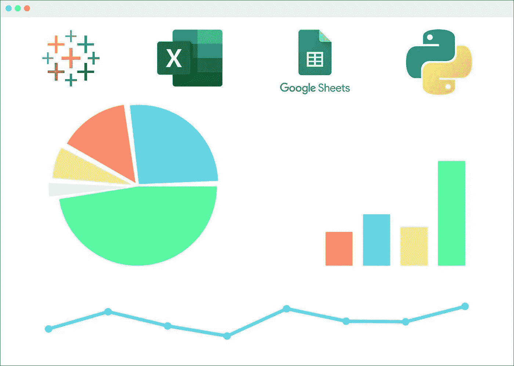

# **内容:**

1.  导入实时数据
2.  将 Tableau 连接到实时数据
3.  使用 Python 刷新数据
4.  使用 Tableau Public 创建和发布仪表板

# **1。导入实时数据**

第一个挑战是以自我更新的方式导入[所需的数据](https://ourworldindata.org/coronavirus-source-data)。我尝试了几种方法，但是都失败了，因为我要导入的数据太大了。

原始数据源可以在[这里](https://raw.githubusercontent.com/owid/covid-19-data/master/public/data/owid-covid-data.csv)找到。

## **1.1 Tableau Web 数据连接器(WDC)——适用于静态数据**

我在[社区门户](https://tableau.github.io/webdataconnector/community/)上找到了这个[由柯夏萝丝](https://basic-csv-wdc.herokuapp.com/)制作的 CSV URL 连接器。直接将在线 CSV 导入 Tableau 是一个很神奇的 [WDC](https://help.tableau.com/current/pro/desktop/en-us/examples_web_data_connector.htm) 并且简单易用。它甚至有更大文件的快速模式。

但是因为一个小问题，我不能使用这个方法。在 [Tableau Public](https://public.tableau.com/en-us/s/) 上发布时，Tableau 工作表和数据打包在一起，这意味着数据无法更新。

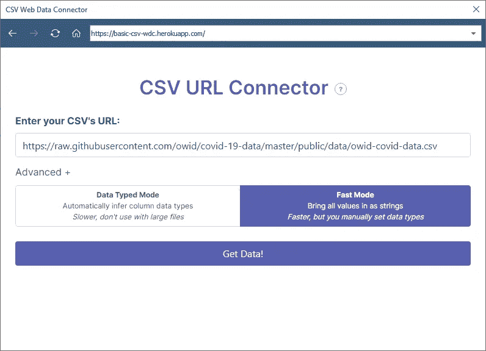

CSV URL 连接器

## **1.2 Google Sheets——中小型实时数据的有效替代方案**

Google Sheets 是在 Tableau 中建立实时连接的最佳方式之一。为了将 CSV 导入工作表，我使用了[导入数据](https://support.google.com/docs/answer/3093335?hl=en)功能。

> = import data(" https://raw . githubusercontent . com/owid/新冠肺炎-data/master/public/data/owid-covid-data . CSV ")

我真的希望这能解决我的问题，但当我发现 Google Sheets 对使用该功能导入的数据大小有限制时，我又陷入了困境。

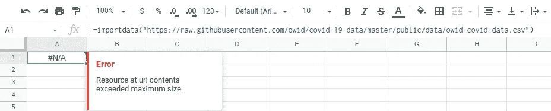

Google 工作表错误

也就是说，这种方法对于导入较小的文件来建立实时连接非常方便。

## **1.3 Excel —大型数据集的解决方案**

在多次尝试失败后，我不得不求助于[通过网络连接](https://victorleungtw.medium.com/getting-real-time-data-from-web-to-excel-467913abe61a#:~:text=First%2C%20open%20Microsoft%20excel%20365,for%20you%20to%20choose%20from.)将数据导入 Excel。这种方法在从网站获取数据和直接在 excel 表格上工作时非常有效。当工作簿关闭时，“每‘x’分钟刷新”选项似乎不起作用。即使工作簿是打开的并且数据在后台更新，用户也必须在退出之前手动保存工作簿，以便将更改反映在最终副本中。

由于我使用的是指向 CSV 的原始链接(通常是下载 URL ),所以我不得不选择不同的路径。以下是对我有效的方法:

转到“数据”选项卡。点击“获取外部数据”。然后选择“从文本”。现在输入包含 CSV 文件的所需 URL。

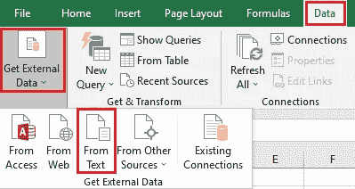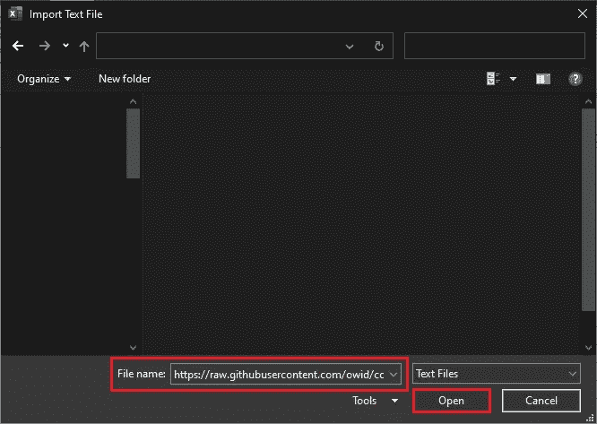

然后按照以下步骤操作:

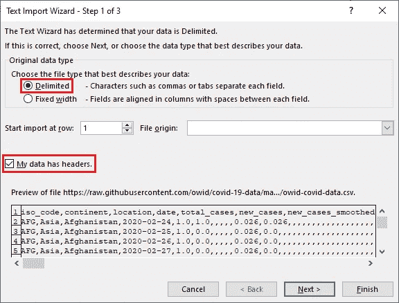

第一步

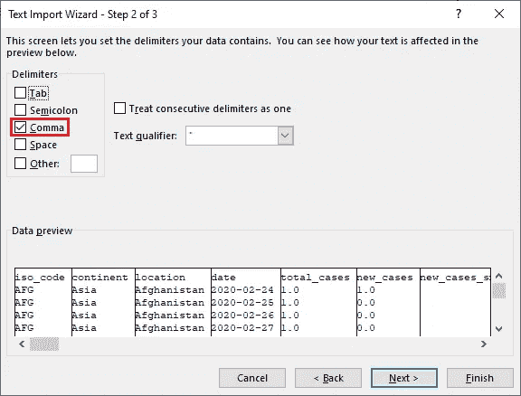

第二步

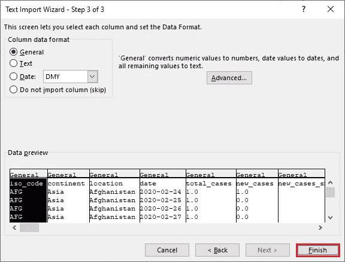

第三步

记得保存为. xlsx 文件。

完整的数据终于出现了。现在，我需要弄清楚如何使用这个 Excel 工作簿作为实时连接，并自动刷新数据源。

# 2.将 Tableau 连接到实时数据

尽管现在已经导入了完整的实时数据并可以使用，但我不能直接使用 Excel 工作簿作为 Tableau 中的数据源。如 1.1 中所述，打包的 Tableau 工作簿会阻止我更新数据源。

为了建立实时连接，我再次求助于 Google Sheets。我下载了[谷歌备份和同步(针对个人)](https://www.google.com/drive/download/)并备份了文件夹，里面只有上面提到的 Excel 工作簿。


谷歌备份和同步

这里需要注意的关键点是，当 Excel 工作簿上传到我的个人 Google Drive 时，它是以 Google 工作表的形式存储在那里的。这让我绕过了 1.2 中提到的大小限制。此外，在此工作簿中所做的任何更改都将反映在 Google 工作表中(保存时)。

以下是建立实时连接的方法:

打开 Tableau 公共桌面，选择 Google Sheets。在 Google Drive 中找到所需的工作表，然后点击“打开”。

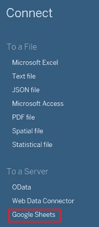

将 Tableau 连接到 Google Sheets

# 3.使用 Python 刷新数据

数据导入？检查。已建立实时连接？检查。构建仪表板之前的最后一步是自动刷新数据并保存 Excel 工作簿。

我发现这个 Python 脚本正好做到了这一点:

```
import win32com.client
xlapp = win32com.client.Dispatch('Excel.Application')
wb = xlapp.Workbooks.open('Path to xlsx')
wb.RefreshAll()
wb.Save()
xlapp.Quit()
```

由于数据只需要每天刷新一次，所以我使用 [Windows 任务调度器](https://towardsdatascience.com/automate-your-python-scripts-with-task-scheduler-661d0a40b279)将它设置为每天在同一时间运行。为此，我必须确保我的电脑在预定时间开机。如果我当时不能打开它，我可以在 Excel 中“刷新全部”并手动保存。

# 4.在 Tableau Public 上创建和发布仪表板

既然其他一切都已就绪，是时候创建仪表板了。因为数据不干净，我使用了一些[全局过滤器](https://help.tableau.com/current/pro/desktop/en-us/filtering_global.htm)来消除不想要的和空值。我还使用了一些简单的[计算字段](https://help.tableau.com/current/pro/desktop/en-us/calculations_calculatedfields_create.htm)来创建想要的可视化效果。总的来说，仪表板非常简单，易于理解。然后我把它发布到 Tableau Public 上，可以在这里[访问](https://public.tableau.com/app/profile/devanirudh/viz/Covid-19Dashboard_16222251768430/Covid-19Country-WiseStats)。切换到桌面布局并使用全屏模式以获得最佳对齐效果。

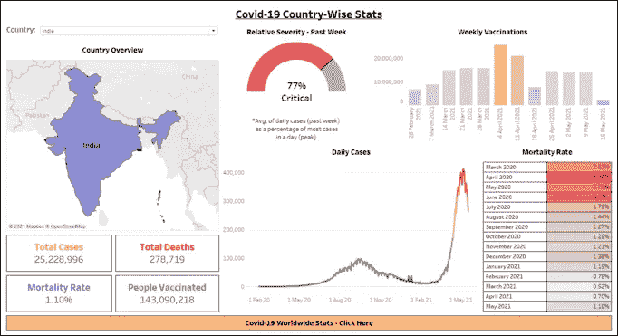

最终仪表板

有几件事要记住:

1.  将仪表板保存到 Tableau Public 时选中此框—

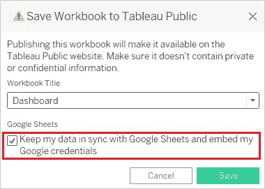

2.一旦仪表板在 Tableau Public 上发布，请转到“编辑详细信息”并选中此框——

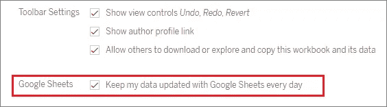

这只是一个简单的教程，适用于像我这样的完全初学者，考虑到我花了大量的时间来解决所有问题，我觉得我需要以一种详细和逐步的方式将所有内容发布在一个地方，以供那些发现自己陷入困境的人使用。这不是一个详尽的指南，我相信有更容易和更有效的方法来达到相同甚至更好的效果。

感谢您的阅读。