# 使用 pandas profiling、sweetviz、autoviz 实现自动化 EDA

> 原文：<https://medium.com/analytics-vidhya/automated-eda-using-pandas-profiling-sweetviz-autoviz-4f15c4031a12?source=collection_archive---------2----------------------->

探索性数据分析(EDA)用于解释数据是怎样的，属性之间的关系是什么，等等。EDA 不仅仅是处理数字，还包括理解数据中属性之间的意义关系。EDA 帮助我们得出关于数据属性如何分布的结论。在继续建模之前，应该进行 EDA 以理解数据并为建模做准备。EDA 不仅仅是关于数字，它也是对数据属性的可视化分析，使用适合于每种用途的各种图表。有意义的 EDA 必须有助于识别数据集中的模式。


卢克·切瑟在 [Unsplash](https://unsplash.com?utm_source=medium&utm_medium=referral) 上的照片

在准备机器学习模型的过程中，分析和清理数据占据了大约 80%的工作，消耗了你将近 40%的时间。Python 提供了某些开源模块，可以实现 EDA 整个流程的自动化，节省大量时间。下面列出了一些我用过的并且非常有用的方法

1.  熊猫简介
2.  Sweetviz
3.  Autoviz

# **熊猫简介**

EDA 可以使用名为 **Pandas Profiling 的 Python 库来实现自动化。这是一个很棒的工具，可以创建交互式 HTML 格式的报告，非常容易理解和分析数据。让我们探索 Pandas Profiling，用一行代码在很短的时间内完成 EDA。**

这里我从 Kaggle 那里得到了一个关于心力衰竭的数据集。它包含大约 300 条记录和 13 列([*https://www . ka ggle . com/andrewmvd/heart-failure-clinical-data*](https://www.kaggle.com/andrewmvd/heart-failure-clinical-data))我使用了一个非常小的数据集，因为 pandas profiling 比 sweetviz 和 autoviz 消耗更多的时间。

**实施**

首先，从安装熊猫档案开始

***pip 安装 pandas-profiling***

```
import pandas as pd
from pandas_profiling import ProfileReport
df=pd.read_csv(r’C:\Users\Guhanesvar\Downloads\heart_failure_clinical_records_dataset.csv’)
df
```

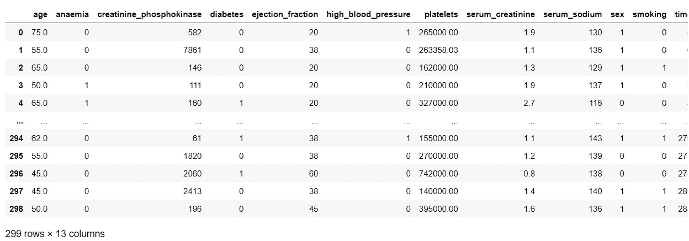

```
design_report = ProfileReport(df)
design_report.to_file(output_file='report.html')
```

这将在当前工作文件夹中生成 HTML 格式的输出报告。

## **了解报告**

生成的报告包含许多部分，我们将逐一研究它们

## **概述**

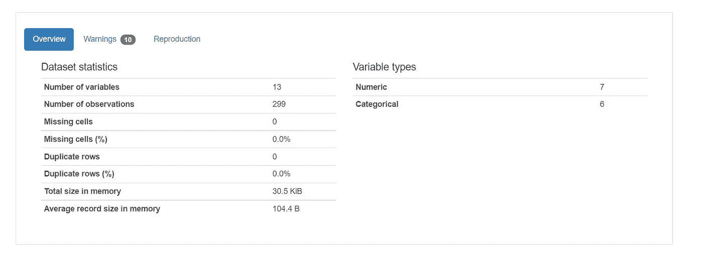

警告选项卡包含高度相关的变量

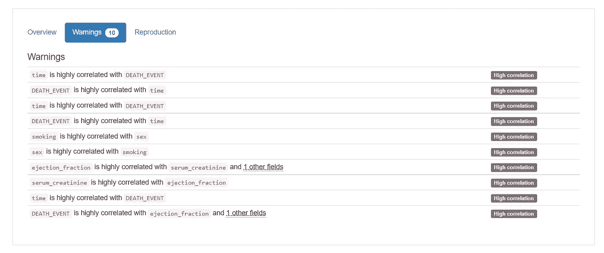

## **变量**

然后向下滚动包含数据集中所有变量及其属性的变量部分。

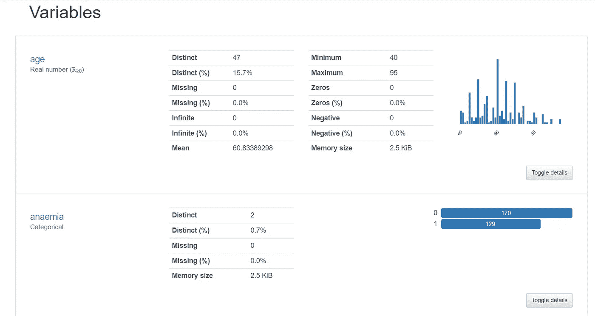

***切换详细信息*** 选项卡包含属性的一般统计信息、最常见的极值和直方图。

## 相互作用

在交互部分，您可以看到每个变量是如何相互关联的，其中为所选变量绘制了散点图。

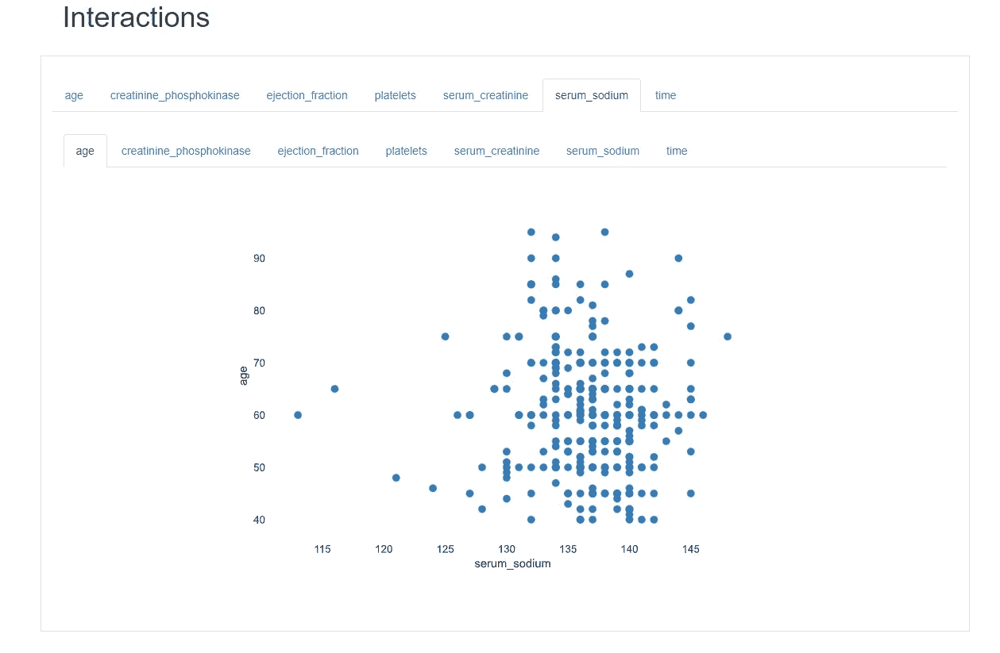

## 相关

相关性部分包含不同的相关性图，例如每个属性的*皮尔逊 r、斯皮尔曼ρ、肯德尔τ、菲尔(φk)和克莱默 V (φc)* 。

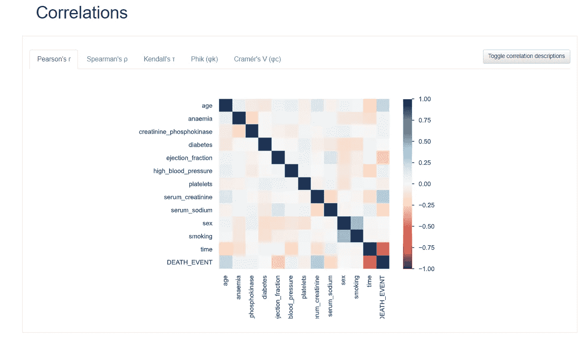

生成的报告对于识别数据中的模式和找出数据的特征非常有帮助。

# Sweetviz

最近的一个是一个新的开源 Python 库，名为 Sweetviz，是由一些贡献者和我自己为此目的创建的。它获取 pandas 数据帧，并创建一个自包含的 HTML 报告，可以在浏览器中单独查看或集成到笔记本中。

它具有强大的冲击力；除了只用两行代码就能创建深刻而漂亮的可视化效果之外，它还提供了手动生成需要更多时间的分析

**实施**

首先，从安装 sweetviz 开始

**pip 安装 sweet viz**

```
import sweetviz as sv
sweet_report = sv.analyze(df.""DEATH_EVENT")
sweet_report.show_html('sweetviz_report.html')
```

这里“死亡事件”是我们的目标变量。这将在当前工作文件夹中生成 HTML 格式的输出报告。

## 理解报告

报告顶部包含有关数据的信息，如行数、分类和数字特征。

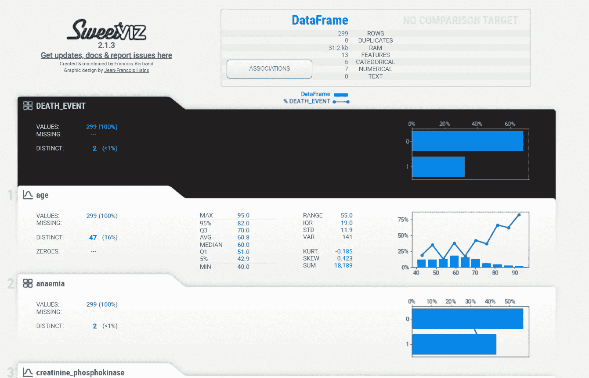

当鼠标悬停在关联选项卡上时，会弹出一个关联矩阵。这张图是由来自[Drazen Zaric:Python](https://towardsdatascience.com/better-heatmaps-and-correlation-matrix-plots-in-python-41445d0f2bec)中更好的热图和相关矩阵图的视觉效果和来自 [Shaked Zychlinski:寻找分类相关性](https://towardsdatascience.com/the-search-for-categorical-correlation-a1cf7f1888c9)的概念合成的。

基本上，除了显示传统的数值相关性之外，它还在一个图表中统一了数值相关性、不确定性系数(对于分类-分类)和相关比率(对于分类-数值)。注意，为了清楚起见，平凡的对角线是空的。

***方块:范畴关联***

***圆圈:数值关联***

大圆圈和正方形是对目标变量影响最大的变量

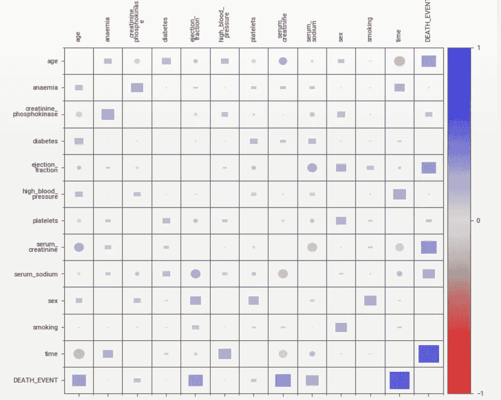

接下来，当您将鼠标悬停在每个变量上时，您可以找到其数值和分类关联(相关性)的排名。

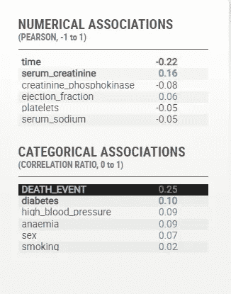

# 目标分析

当分析一个有目标变量的数据集时，这个特性非常有洞察力。

如果我们指定一个目标变量(目前只支持布尔型和数字型)，它会作为第一个变量突出显示，并使用黑色。

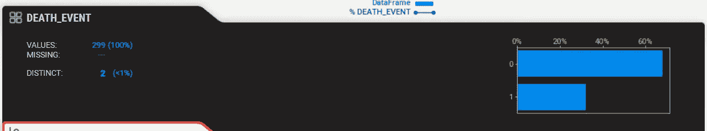

最重要的是，它的值覆盖在每一个其他图表的顶部，从而快速洞察目标相对于每一个其他变量的分布。

一眼就能看出目标值是如何受其他变量影响的。正如所料，这通常遵循“关联”图中的内容，但为您提供了每个变量的细节。

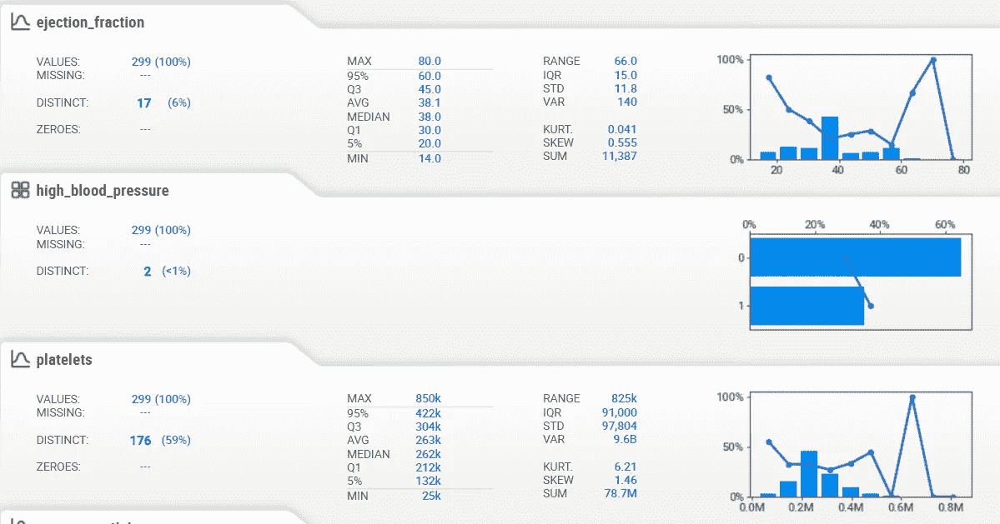

对于数值数据，您可以更改图表中“条柱”的数量，以更好地测量分布，以及目标要素的关联方式。

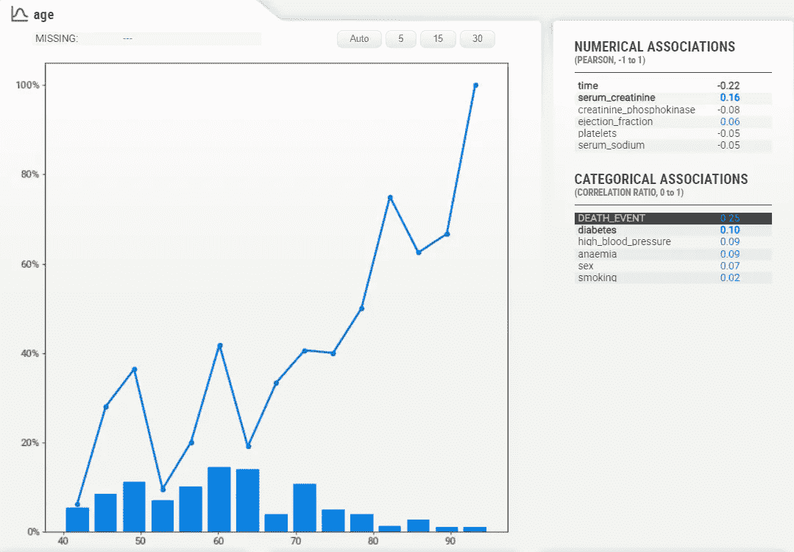

下面的表格显示了该属性的最大值、最小值和最常用值。

```
df1 = sv.compare(df[210:], df[:90])
df1.show_html('sweetvizCompare2.html')
```

您可以比较两个不同的数据集，这可能非常有用(例如，训练与测试数据)。但是，即使你只是在看一个单一的数据集，你也可以研究该数据集中不同亚群的特征。

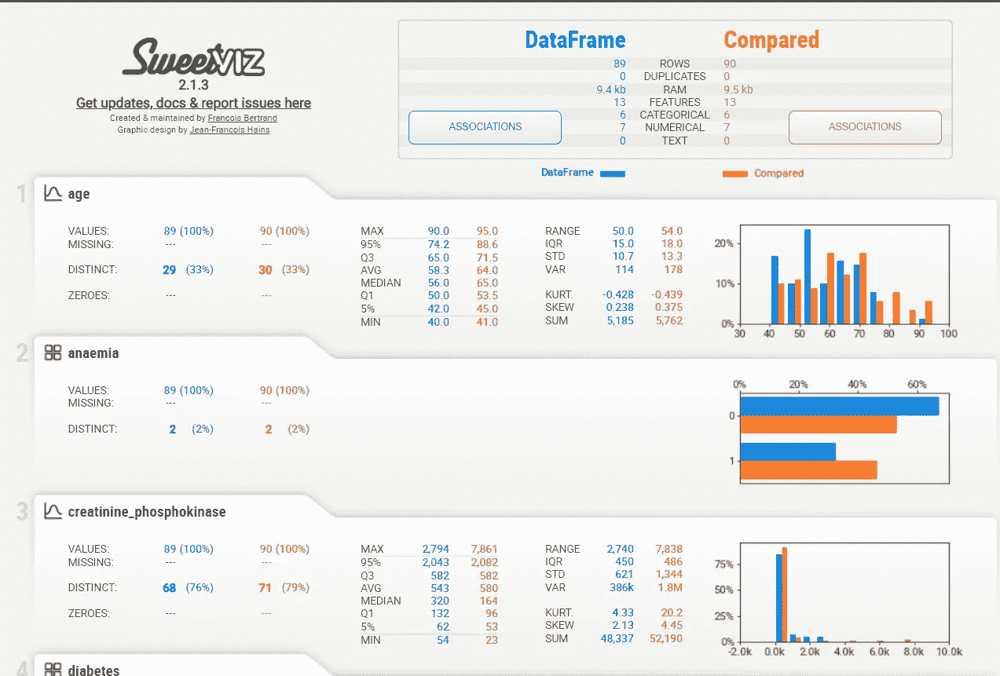

通过目标分析、数据集/组内比较、全特征分析和统一关联/相关数据，Sweetviz 仅用两行代码就提供了无与伦比的洞察力。

# AutoViz

AutoViz 只需一行代码就可以对任何数据集进行自动可视化。AutoViz 可以找到最重要的功能，并只使用那些自动选择的功能来绘制有影响力的可视化效果。此外，AutoViz 非常快，可以在几秒钟内创建可视化效果。

**实施**

首先，从安装 Autoviz 开始

**pip 安装 autoviz**

```
from autoviz.AutoViz_Class import AutoViz_Class
AV = AutoViz_Class()
df = AV.AutoViz(‘heart_failure_clinical_records_dataset.csv’)
```

Autoviz 相对较快，但输出是在笔记本电脑中生成的。Autoviz 比 pandas profiling 和 sweetviz 生成更多的可视化效果

## 了解结果

**所有连续变量的成对散点图**

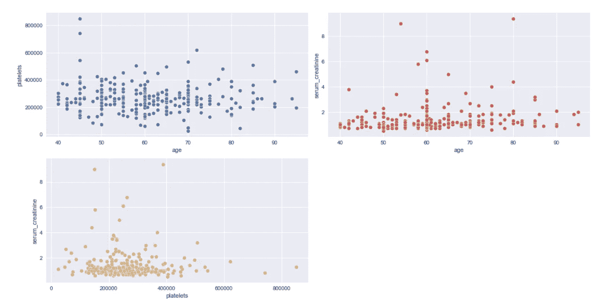

对于每个连续变量，生成成对散点图

**所有连续变量的距离图、箱线图和概率图**

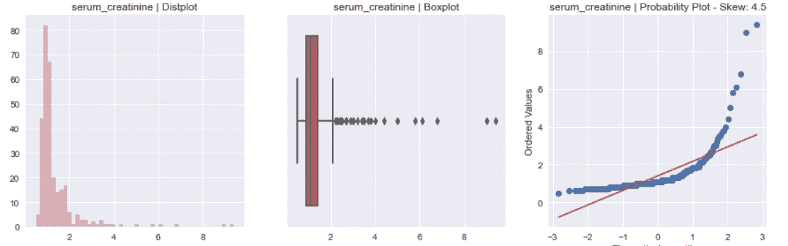

*dist plot*-显示变量中值的计数

*箱线图*-找出异常值

*概率图* -显示变量的分布

**所有连续变量的小提琴图**

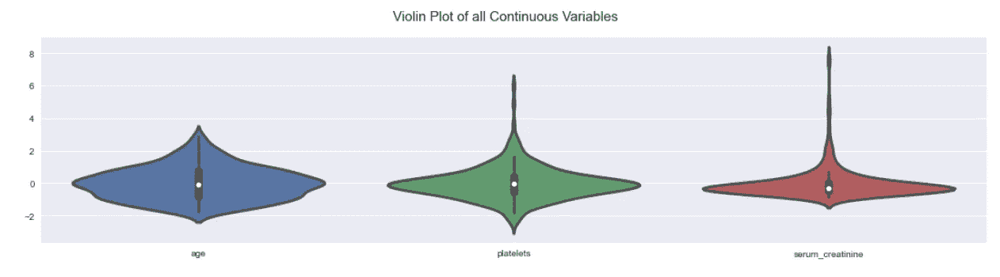

当您想要**观察数字数据的分布**时，可以使用 Violin 图，当您想要比较多个组之间的分布时，violin 图尤其有用。可以比较每组密度曲线的峰值、谷值和尾部，以查看各组的相似或不同之处

此外，它将生成一个**关联热图和几个条形图。**

如果我们知道数据集中依赖于其他变量的因变量，那么我们可以将其作为参数传递，并根据因变量可视化数据

```
df = AV.AutoViz('heart_failure_clinical_records_dataset.csv', depVar='DEATH_EVENT')
```

这将创建与我们上面看到的相同的报告，但是是在因变量(即死亡事件)的上下文中

# 结论

综上所述，这三个自动化 EDA 函数库都有各自的优缺点。通过使用这些方法，你可以节省大量的时间，并很快得到结果。这些库的总体目的是帮助:

*   特征工程:可视化工程特征如何相对于其他特征和目标变量执行/关联
*   解释/沟通:生成的图表可以提供易于解释的见解，并且可以在团队中或向客户快速传递，而无需任何额外的工作
*   测试:确认测试/验证集的组成和平衡