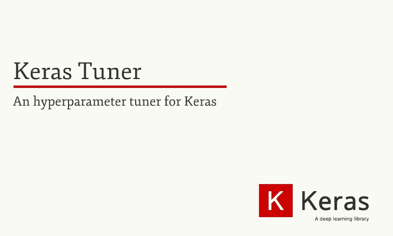
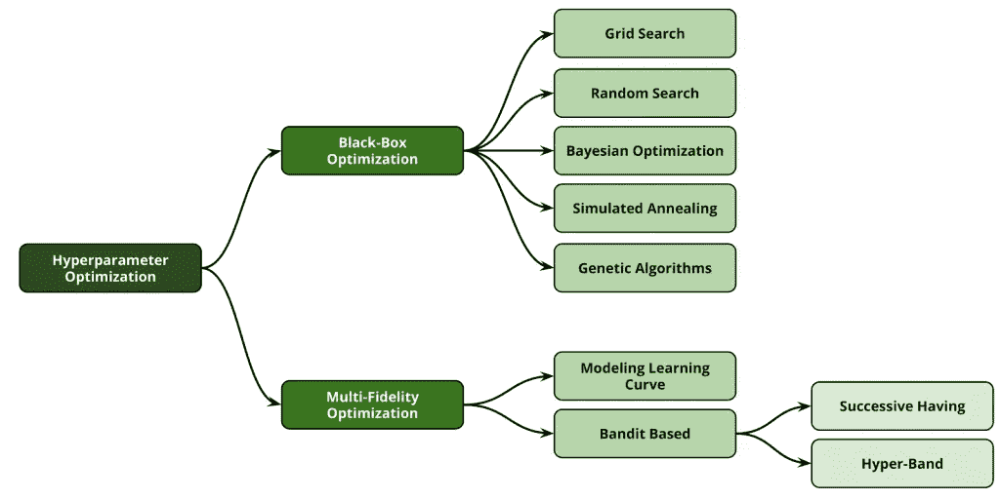
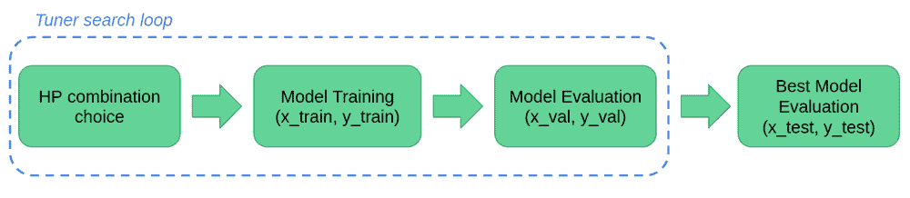
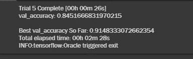
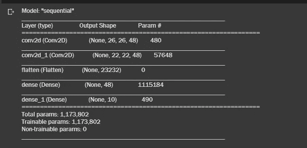
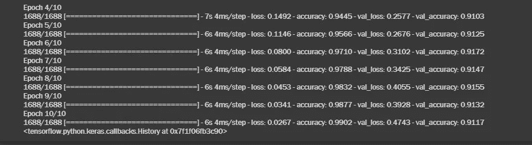

# 使用 Keras Tuner 和 TensorFlow 2.0 进行自动超参数调谐

> 原文：<https://medium.com/analytics-vidhya/automated-hyperparameter-tuning-with-keras-tuner-and-tensorflow-2-0-31ec83f08a62?source=collection_archive---------1----------------------->

# 在现实世界中构建深度学习解决方案是一个不断实验和优化的过程。

与任何其他类型的软件应用不同，深度学习应用没有线性的图形生命周期，并且依赖于模型需要不断完善、优化和测试的事实。

一言以蔽之，模型优化和模型鲁棒性成正比！

作为深度学习实践者，你不能否认为你的模型选择正确的超参数是一项非常关键和痛苦的任务。

因此，Google 的 TensorFlow 创建了一个非常棒的框架来解决执行超参数调优和优化的痛点。

## Keras Tuner 是一个库，可以帮助您为真实世界的深度学习应用选择最佳的超参数集。

在本文中，我们将了解如何使用 Keras Tuner 和 TensorFlow 2.0 为我们的模型选择最佳超参数！

在开始介绍 Keras Tuner 的惊人之处之前，让我们先了解一些重要的概念，以便顺利地阅读这篇博客。

# 什么是超参数？

超参数是控制 ML 模型的训练过程和拓扑的变量。这些变量在培训过程中保持不变，并直接影响您的 ML 计划的绩效。

超参数优化是调整超参数以获得更好的模型学习和训练的过程。

超参数有两种类型:

1.  **影响模型选择的模型超参数**，如隐藏层的数量和宽度
2.  **算法超参数**，影响学习算法的速度和质量，如随机梯度下降(SGD)的学习速率和 k 近邻(KNN)分类器的近邻数

# 为什么选择 Keras Tuner？

为了用更“深度学习”的直觉向您解释，我将解释某些被认为对您的模型优化很重要的超参数。

让我们考虑一个简单的卷积神经网络。它受到许多超参数的影响，比如-

*   **隐藏层数**—**隐藏层**的大小一般在输入和输出的大小之间。它应该是输入层大小加上输出层大小的 2/3 倍。这对规范模型训练非常重要。
*   **学习率** —所有超参数的教父，学习率量化模型的训练进度，优化其学习能力。
*   **批量** —超参数更新的一个非常重要的概念，批量是给网络的子样本数。它是一个梯度下降的超参数，控制在模型的内部参数更新之前训练样本的数量。
*   **动量** —这个超参数有助于用前几步的知识知道下一步的方向。它有助于防止振荡。

这些超参数中的每一个都在概化您的模型以获得最终稳健性方面发挥着巨大的作用。同时，选择正确的超参数值需要大量的试错过程。

你想用你的一生来调整深度学习模型吗？

嗯，那感觉就像一场噩梦。

你可能不需要！

> **Keras Tuner** 可以轻松定义搜索空间，并利用包含的算法找到最佳超参数值。 **Keras Tuner** 自带**贝叶斯优化**、 **Hyperband** 和**随机搜索**算法内置，也设计为便于研究人员扩展，以便试验新的搜索算法。— [TensorFlow 博客](https://blog.tensorflow.org/2020/01/hyperparameter-tuning-with-keras-tuner.html)

## 让我们讨论 3 种不同类型的 Keras 调谐器，然后，我们将进入代码演练，向您展示它是如何工作的！

# 可用的 Keras 调谐器概述

到目前为止，有 3 种类型的 Keras 调谐器可用。

1.  **随机搜索 Keras 调谐器**

基本且效率最低的方法，**随机搜索**并不从之前测试的超参数组合中学习。它只是从搜索空间中随机抽取超参数组合。

2.**超波段 Keras 调谐器**

**超波段**调谐器是随机搜索调谐器的优化版本，**使用**提前停止来加速超参数**调谐**过程。主要思想是为几个时期拟合多个模型，并且仅继续训练在验证集上达到最高准确度的模型。

3.**贝叶斯优化 Keras 调谐器**

**贝叶斯优化**通过对超参数组合的子集进行采样，其工作原理与随机搜索相同。但是它们之间有一个关键的区别，这使得贝叶斯理论比随机搜索更聪明。

关键区别在于，它不会随机对超参数组合进行采样；它遵循**概率方法**。它挑选已经测试过的组合，并使用这些数据对下一个组合进行采样。

> 注意:你可以通过[文档](https://keras-team.github.io/keras-tuner/documentation/hyperparameters/)熟悉 Keras Tuner 的所有语法和方法。

# 现在，是时候动手使用 Keras 调谐器了！

来源— [KDnuggets](https://www.kdnuggets.com/)

为了让你以更直观的方式理解调谐器搜索循环，我将提供一个代码演练，我们将在著名的[时尚 MNIST 数据集](https://www.kaggle.com/zalando-research/fashionmnist)上使用随机搜索 [Keras 调谐器](https://www.tensorflow.org/tutorials/keras/keras_tuner)。

> 注意—您不必从 [Kaggle](https://www.kaggle.com/) 下载该数据集，因为 Keras 已经提供了该数据集。此外，我想推荐使用[谷歌合作实验室](https://research.google.com/colaboratory/)来运行代码，因为它给你免费的 GPU 使用，不需要设置。

## 所以，拿起你的咖啡，让我们开始吧！🥤

首先，让我们安装 **Keras 调谐器**。

> **注意**:在运行这个单元之前，在您的 colab 环境中，进入运行时>更改运行时类型>硬件加速器> GPU >保存。

这将成功地在您的 Colab 环境中安装 Keras 调谐器。

现在，让我们导入本实验的依赖项。

现在，我们将从 Keras 加载我们的时尚 MNIST 数据。

现在我们将缩小图像尺寸。由于 255 是 RGB 图像的最大值，除以 255 表示 0–1。

您将收到(28，28)的输出，这表示我们的图像是 28 像素的。

大多数卷积神经网络被设计成只能接受固定大小的图像。克服这种限制的通常做法是**对输入的**图像**进行**整形，这样它们就可以被输入到网络中。

太好了！我们已经预处理了我们的数据！

现在我们将使用 build_model 函数构建一个模型，并使用 hp 作为我们的超参数类实例。

在函数内部，我们将定义一组用于调整的超参数，以及一个供 Keras 调谐器选择的最小-最大值范围。

从上面的代码中可以看出，我们已经创建了一个卷积神经网络，它有 2 个卷积层、1 个平坦层和 2 个致密层。

对于除最终输出密集层之外的每个层*，我们设置了一个最小-最大范围(最小值和最大值), Keras 调谐器将从中选取随机值。*

现在我们都设置为调用 Keras 调谐器。因此，让我们从 Keras 进口我们的 RandomSearch 调谐器。接下来，我们将使用我们的 RandomSearch 调优器，在 3 个时期内进行 5 次试验，看看我们目前达到的最佳验证精度是多少。

当您运行此单元时，您的 RandomSearch 调谐器将执行 5 次试验，在每次试验的 3 个周期结束时，它将获得一些准确度分数。然后，它将输出 5 个试验精度中的最佳验证精度。

让我们检查输出—

因此，我们可以看到，我们的调谐器报告了迄今为止最高的 val_accuracy，达到 91.4%。

现在，进入最精彩的部分，我们将使用这个调谐器附带的一个非常棒的函数，即“tuner_search.get_best_models()”函数，它将向您报告用于图像分类数据的最佳模型的摘要！

我们希望我们的数据有最好的模型；因此，我们将 num_models 设置为 1，我们希望第一个模型是最好的，因此我们使用 index [0]，它将输出最佳模型的摘要报告！

让我们看看生成的报告！

酷！我们得到了最佳模特报告！

现在，我们将重新训练我们的数据集，考虑我们的*“最佳模型”！*

> **注意**:记住将 initial_epoch 设置为 3，因为我们之前已经用 3 个 epoch 训练了我们的图像。所以这一次，我们从第四个开始！

最后，我们将使用 10 个历元来训练我们的最佳模型，并查看我们现在达到的精度。

现在让我们来看看准确度分数。你会惊讶的。😛

在第 10 个纪元时，我们取得了 99.02%的准确率！

仅 18 行代码就能产生大量结果！

> ⚠确保你把你的模型保存在一个 pickle 文件中，因为每次你运行单元时分数都会改变。

# 结论

希望你有兴趣探索 Keras 调谐器与这篇文章。如果你也像我一样是一个深度学习实践者，我建议你访问 Keras 调谐器文档，并用你选择的任何数据集尝试其他两个调谐器！

> **如果你是数据科学和机器学习的初学者，并且对数据科学/ML-AI、向数据科学的职业过渡指导、面试/简历准备有一些具体的疑问，或者甚至想在你的 D-Day 之前获得模拟面试，请随时在这里** **预约 1:1 电话** [**。我很乐意帮忙！**](https://topmate.io/sukannya)

你可以从我的 [GitHub](https://github.com/sukanyabag/ML-DL-NLP-resource-notebooks/blob/main/OptimizeCNNwithKerasTuner.ipynb) 下载上面提供的代码，或者直接在 [Colab](https://colab.research.google.com/drive/1kPO_YjAyNjc6YeRnw2b3dTkjEKhq0MOl#scrollTo=4ZKKr1IG3l6p) 中运行。

> 要讨论更多关于深度学习的内容，请通过 [LinkedIn](https://www.linkedin.com/in/sukannya/) 联系我。

# 快乐学习！