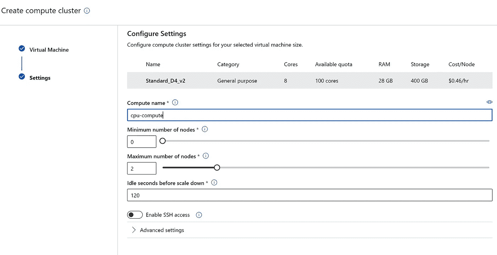
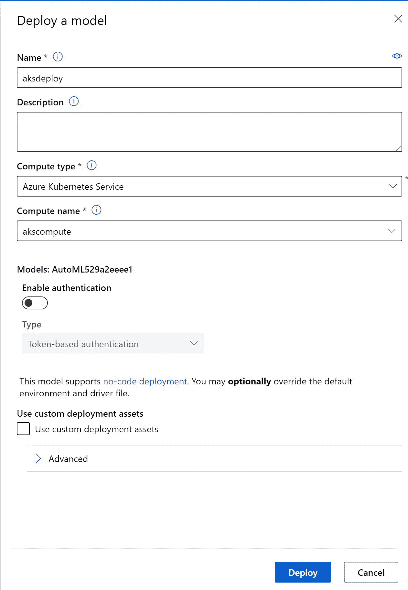

# 自动机器学习端到端开放黑客

> 原文：<https://medium.com/analytics-vidhya/automated-machine-learning-end-to-end-open-hack-303d88923b76?source=collection_archive---------16----------------------->

# 公民数据科学开放黑客

# 介绍

自动化机器学习黑客马拉松:学习如何使用自动化机器学习构建模型并部署到生产中。

# 议程

*   Openhack 简介
*   Azure 机器学习简介— 1 小时
*   机器学习操作简介— 1 小时
*   Openhack 使用案例介绍—4 小时
*   部署模型— 1 小时
*   清理— 15 分钟
*   回顾— 1 小时

# 用例

*   预测未来几年的人口增长。预测人口让经济学家知道如何在全球建立下一代供应链。
*   这些信息也使国家和州政府能够为医疗保健、消费者需求甚至城市发展规划未来。
*   构建端到端的管道
*   使用 Azure 数据工厂将数据从源移动到 Azure
*   在迁移到 Azure 存储时处理数据
*   我们可以使用数据工厂中的数据流来处理数据，以便在机器学习中使用
*   ETL/数据工程是数据处理的范围
*   不需要为 ML 算法格式化数据
*   表格数据就够了
*   确保所有功能和标签都可用
*   展示数据运营+ ML 运营
*   端到端流程来获取数据和处理，然后创建机器学习模型和消费
*   注意:模型的准确性并不重要
*   我们用回归作为样本来预测人口
*   假设是 Azure 开放数据集中的源数据并验证配置

# 体系结构


# 蔚蓝资源

*   Azure 账户—[https://azure.microsoft.com/en-us/free/?WT.mc_id=A261C142F](https://azure.microsoft.com/en-us/free/?WT.mc_id=A261C142F)
*   创建一个名为 automlopenhack 的资源组—[https://docs . Microsoft . com/en-us/azure/azure-Resource-manager/management/manage-Resource-groups-portal # create-Resource-groups](https://docs.microsoft.com/en-us/azure/azure-resource-manager/management/manage-resource-groups-portal#create-resource-groups)
*   创建名为 autoloutput—[https://docs . Microsoft . com/en-us/Azure/Storage/common/Storage-account-create 的 Azure 存储帐户？tabs=azure-portal](https://docs.microsoft.com/en-us/azure/storage/common/storage-account-create?tabs=azure-portal)
*   创建 Azure 数据工厂—autoladfopenhack—[https://docs . Microsoft . com/en-us/Azure/Data-Factory/quick start-create-Data-Factory-portal # create-a-Data-Factory](https://docs.microsoft.com/en-us/azure/data-factory/quickstart-create-data-factory-portal#create-a-data-factory)
*   Azure 开放数据集配置
*   创建 Azure 机器学习服务—[https://docs . Microsoft . com/en-us/Azure/machine-learning/quick start-create-resources](https://docs.microsoft.com/en-us/azure/machine-learning/quickstart-create-resources)
*   还要创建一个容器注册表来存储模型 pickle 文件
*   创建计算集群—[https://docs . Microsoft . com/en-us/azure/machine-learning/how-to-create-attach-compute-cluster？tabs=python](https://docs.microsoft.com/en-us/azure/machine-learning/how-to-create-attach-compute-cluster?tabs=python)
*   为 AKS 创建推理集群—[https://docs . Microsoft . com/en-us/azure/machine-learning/how-to-create-attach-kubernetes？tabs = azure-portal # create-a-new-aks-cluster](https://docs.microsoft.com/en-us/azure/machine-learning/how-to-create-attach-kubernetes?tabs=azure-portal#create-a-new-aks-cluster)
*   创建的资源列表


# 步伐

*   创建数据工厂复制管道
*   创建 blob 存储
*   https://azureopendatastorage.blob.core.windows.net/[URI](https://azureopendatastorage.blob.core.windows.net/)
*   对于 SAS 密钥，请在“”中键入
*   测试连接，看连接是否成功
*   创建 blob 源
*   将输入另存为 azureopendataset


*   选择容器
*   选择或键入容器名称“censusdatacontainer”
*   键入或选择文件夹名“release/us_population_zip/”
*   对于文件名类型为" *。如果你看到下面的文件，选择一个正确的如下
*   文件的名称和类型可以改变——因为它是一个开源数据集。


*   将其命名为 ADLSoutput
*   选择订阅和存储帐户名


*   单击下一步和下一步
*   保留所有内容为默认值
*   单击完成


有时需要 15 到 20 分钟或更长时间，具体取决于数据大小。为了提高速度，我们可以使用更多的 DIU 单元进行复制，或者并行化复制活动。

# 模型开发

# 现在来看看 Azure 机器学习系统

*   让我们创建一个设置
*   首先创建数据集和数据存储


*   创建计算 cpu-compute
*   使用 0 到 2 个节点是好



*   一旦实验完成
*   通常需要 2 到 3 个小时


*   检查解释或功能重要性，查看哪些列对预测影响最大
*   日志模型信息


*   这些是我们需要使用的列

# 模型部署

*   选择最佳模型并部署
*   部署到 AKS 集群
*   创建 AKS 集群
*   转到计算并创建推理群集


*   选择虚拟机配置
*   我选择开发/测试，因为这是为了黑客马拉松
*   对于生产说明，必须为 HA 创建至少 12 个节点的 AKS 群集
*   生产配置如下


*   然后单击创建
*   AKS 集群创建已开始



*   单击左侧的 aksdeploy 可成功转到端点信息
*   创建后，将会创建一个端点


*   单击测试选项卡
*   键入以下信息


```
decennialTime : 2020 zipCode: 77480 race: WHITE ALONE sex: Female minAge: 56 maxAge: 59
```


# 清除

*   删除所有资源
*   删除整个资源组以删除所有组件

# 评论和反馈

*原载于*[*https://github.com*](https://github.com/balakreshnan/AutomatedML/blob/main/Beginner/Intro.md)*。*