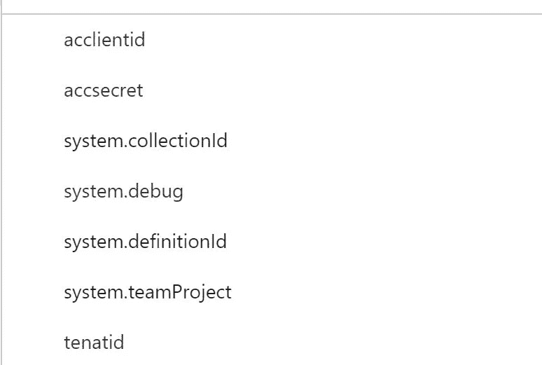
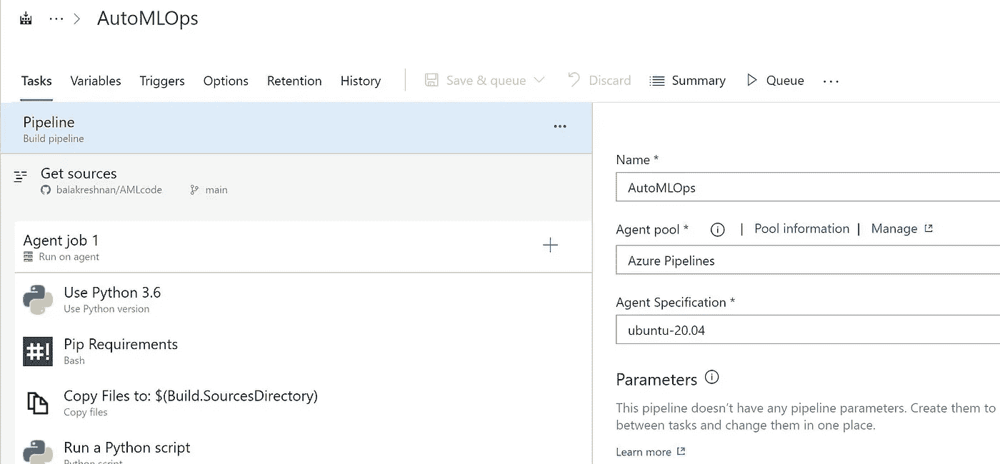
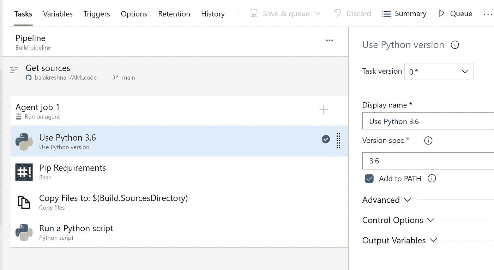
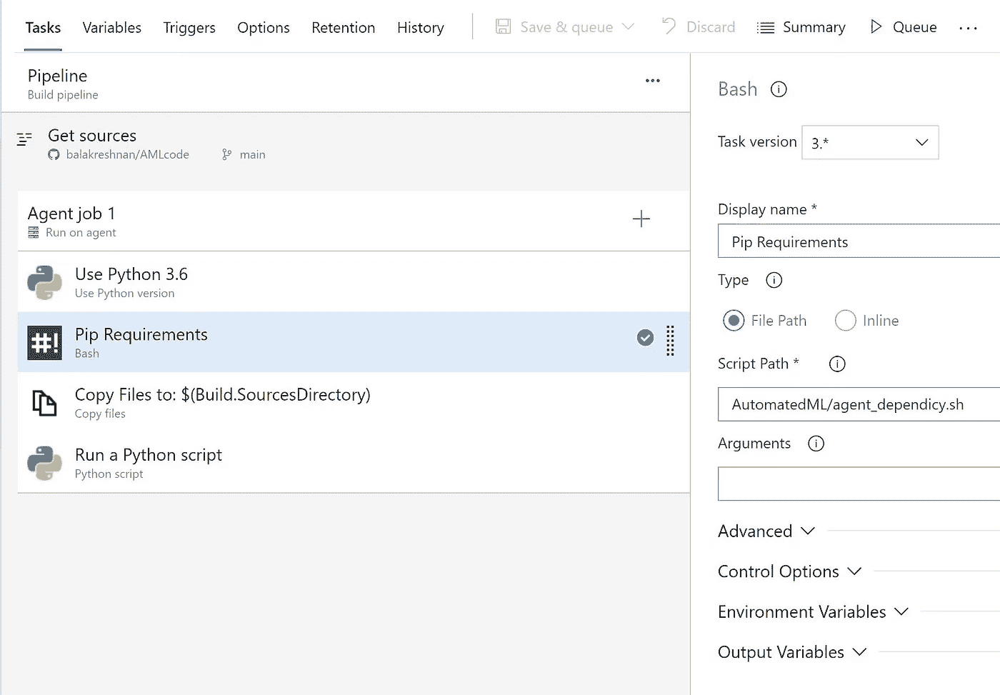
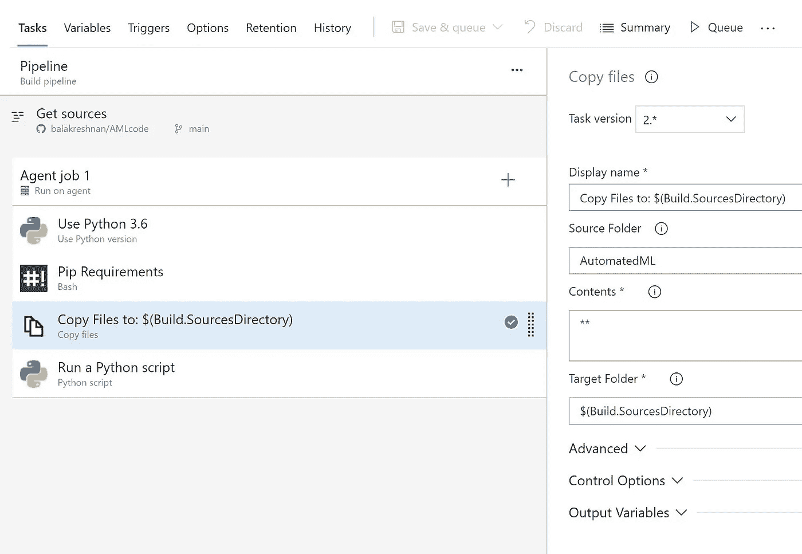
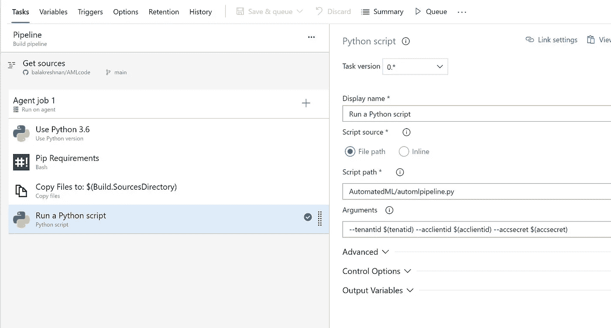
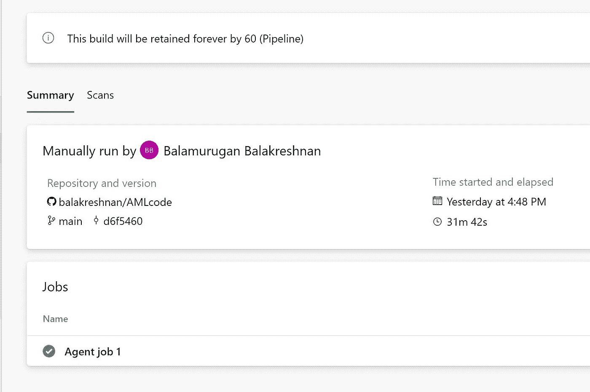
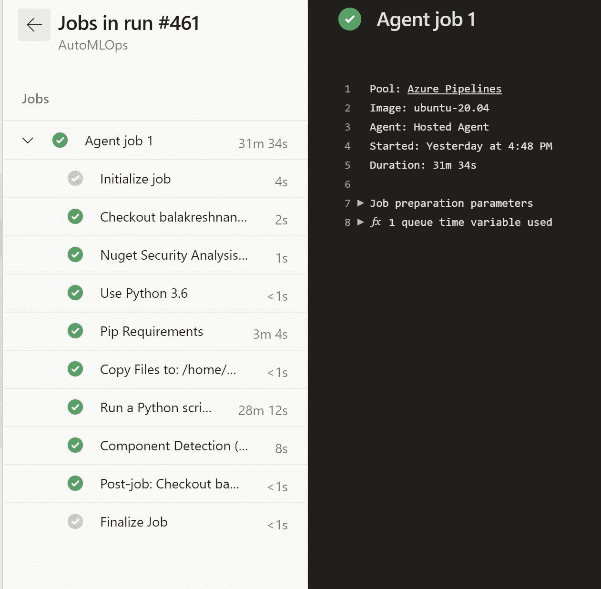

# 使用 Azure DevOps 的自动化 ML 培训— CI/CD

> 原文：<https://medium.com/analytics-vidhya/automated-ml-training-using-azure-devops-ci-cd-7dfa232f8991?source=collection_archive---------16----------------------->

# 使用 Azure DevOps 创建 CI/CD 代码，通过使用 sdk 的自动化 ML 来训练模型

# 步伐

*   导入库

```
import logging

# from matplotlib import pyplot as plt
import pandas as pd
import os

import azureml.core
from azureml.core.experiment import Experiment
from azureml.core.workspace import Workspace
from azureml.core.dataset import Dataset
from azureml.train.automl import AutoMLConfig
from azureml.core.compute import ComputeTarget, AmlCompute
from azureml.core.compute_target import ComputeTargetException
# from azureml.widgets import RunDetails
from sklearn.metrics import confusion_matrix

from azureml.core.authentication import ServicePrincipalAuthentication

import numpy as np
import itertools

import argparse 
import json
import os
```

*   打印 AML 版本

```
print("This notebook was created using version 1.29.0 of the Azure ML SDK")
print("You are currently using version", azureml.core.VERSION, "of the Azure ML SDK")
```

*   获取命令行中传递的参数

```
parse = argparse.ArgumentParser()
parse.add_argument("--tenantid")
parse.add_argument("--acclientid")
parse.add_argument("--accsecret")

args = parse.parse_args()
```

*   使用服务主体进行身份验证
*   所有要验证的信息都作为命令行参数传递
*   在 azure DevOps 中配置

```
sp = ServicePrincipalAuthentication(tenant_id=args.tenantid, # tenantID
                                    service_principal_id=args.acclientid, # clientId
                                    service_principal_password=args.accsecret) # clientSecret
```

*   获取工作区信息

```
ws = Workspace.get(name="mlopsdev",
                   auth=sp,
                   subscription_id="c46a9435-c957-4e6c-a0f4-b9a597984773", resource_group="mlops"
```

*   现在创建一个实验名称

```
# choose a name for experiment
experiment_name = 'automl-classification-ccard-remote'

experiment=Experiment(ws, experiment_name)

output = {}
output['Subscription ID'] = ws.subscription_id
output['Workspace'] = ws.name
output['Resource Group'] = ws.resource_group
output['Location'] = ws.location
output['Experiment Name'] = experiment.name
pd.set_option('display.max_colwidth', -1)
outputDf = pd.DataFrame(data = output, index = [''])
outputDf.T

ws.get_details()
```

*   设置计算集群

```
# Choose a name for your CPU cluster
cpu_cluster_name = "cpu-cluster"

# Verify that cluster does not exist already
try:
    compute_target = ComputeTarget(workspace=ws, name=cpu_cluster_name)
    print('Found existing cluster, use it.')
except ComputeTargetException:
    compute_config = AmlCompute.provisioning_configuration(vm_size='STANDARD_DS12_V2',
                                                           max_nodes=6)
    compute_target = ComputeTarget.create(ws, cpu_cluster_name, compute_config)

compute_target.wait_for_completion(show_output=True)
```

*   下载所需的数据集

```
data = "https://automlsamplenotebookdata.blob.core.windows.net/automl-sample-notebook-data/creditcard.csv"
dataset = Dataset.Tabular.from_delimited_files(data)
training_data, validation_data = dataset.random_split(percentage=0.8, seed=223)
label_column_name = 'Class'
```

*   设置自动配置

```
automl_settings = {
    "n_cross_validations": 3,
    "primary_metric": 'average_precision_score_weighted',
    "enable_early_stopping": True,
    "max_concurrent_iterations": 2, # This is a limit for testing purpose, please increase it as per cluster size
    "experiment_timeout_hours": 0.25, # This is a time limit for testing purposes, remove it for real use cases, this will drastically limit ablity to find the best model possible
    "verbosity": logging.INFO,
}

automl_config = AutoMLConfig(task = 'classification',
                             debug_log = 'automl_errors.log',
                             compute_target = compute_target,
                             training_data = training_data,
                             label_column_name = label_column_name,
                             **automl_settings
                            )
```

*   提交实验

```
remote_run = experiment.submit(automl_config, show_output = False)

remote_run.wait_for_completion(show_output=True)
```

*   等待实验完成
*   验证模型

```
best_run, fitted_model = remote_run.get_output()
fitted_model

# convert the test data to dataframe
X_test_df = validation_data.drop_columns(columns=[label_column_name]).to_pandas_dataframe()
y_test_df = validation_data.keep_columns(columns=[label_column_name], validate=True).to_pandas_dataframe()

# call the predict functions on the model
y_pred = fitted_model.predict(X_test_df)
y_pred
```

# Azure DevOps

*   创建一个名为 AMLOps 的项目
*   为构建创建管道
*   名字是 AutoMLOps
*   连接到您的 github
*   代码在[https://github . com/balakreshnan/AML code/tree/main/automated ml](https://github.com/balakreshnan/AMLcode/tree/main/AutomatedML)中



*   将版本设置为 3.6
*   配置 agend 依赖项
*   安装运行实验所需的所有库
*   path—automated ml/agent _ dependcy . sh



*   将数据复制到构建目录
*   目标:$(构建。SourcesDirectory)



*   脚本路径:AutomatedML/automlpipeline.py
*   参数:—tenantid $(tenatid)-acclientid $(acclientid)-accsecret $(accsecret)
*   一旦一切就绪
*   单击保存并排队
*   等待实验运行完成



*最初发表于*[T5【https://github.com】](https://github.com/balakreshnan/Samples2021/blob/main/AutoML/trainaml.md)*。*