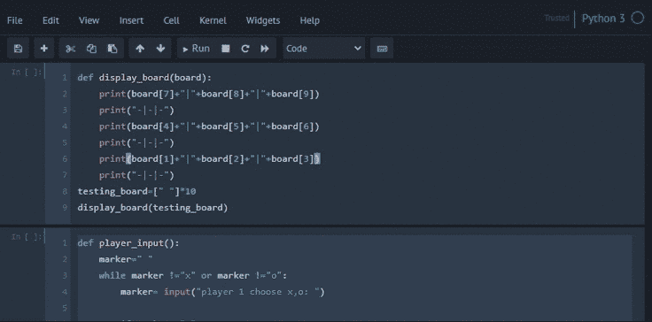
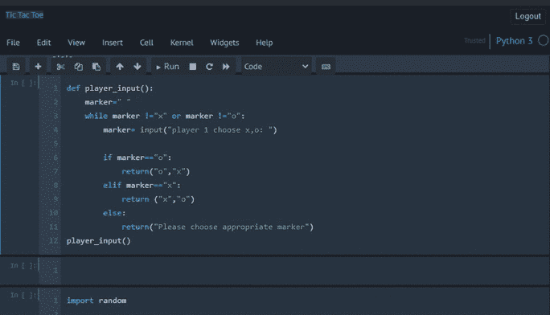
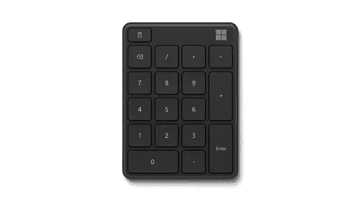
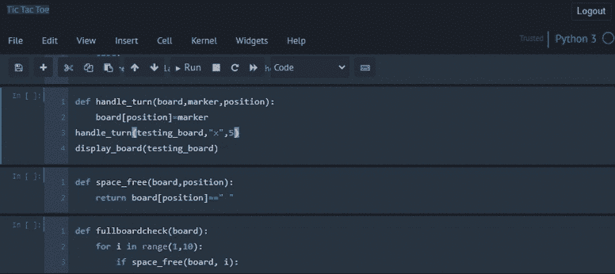
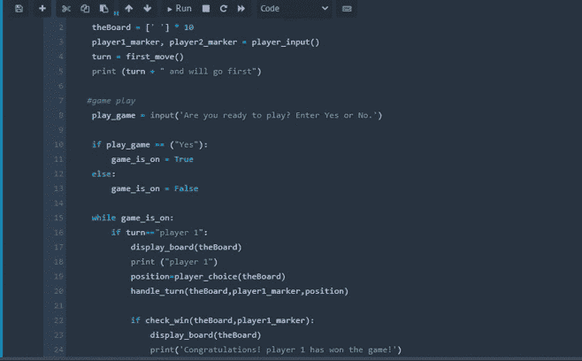

# 用 Python 画十字

> 原文：<https://medium.com/analytics-vidhya/automated-naughts-and-crosses-with-python-93770fcbb58?source=collection_archive---------4----------------------->

## 随着技术的进步，一种非常常见的井字游戏——naughts and crosses 已经从纸质游戏转移到了我们的笔记本电脑上。这是使用 *Python* 进行相同设计的一次尝试。

对于初学者来说，Python 是一门很好的语言。一旦掌握了基本语法，最好开始制作自己的项目。项目是一种很好的学习方式，因为它提供了一个应用所学知识的机会，否则就很难保持同样的知识。

我学习 Python 已经有一段时间了。作为我的第一个迷你项目，我设计了一个简单的井字游戏。这是一个常见的双人游戏，一个玩家玩 crosses ),另一个玩家玩 naughts(O ),每个玩家轮流玩。在棋盘上获得三个标记的玩家获胜。如果两个玩家都不能得到这个，游戏就以平局结束。使用一些基本功能在 *Python* 上创建这个游戏的步骤将在后续步骤中描述。

## **第一步:格栅板设计**

通过定义`display_board()`函数开始制作井字格，该函数将在打印时以网格格式显示

```
def display_board(board):
    print(board[7]+"|"+board[8]+"|"+board[9])
    print("-|-|-")
    print(board[4]+"|"+board[5]+"|"+board[6])
    print("-|-|-")
    print(board[1]+"|"+board[2]+"|"+board[3])
    print("-|-|-")
testing_board=[" "]*10
display_board(testing_board)
```

这是纸板的印刷方式



## 步骤 2:选择每个玩家的标记

接下来，通过使用*创建`player_input()`函数来制作玩家标记，同时循环*让玩家 1 选择他/她的标记；一旦玩家 1 选择了标记，则使用 *if* 功能将替代标记自动分配给玩家 2。

```
def player_input():
    marker=" "
    while marker !="x" or marker !="o":
        marker= input("player 1 choose x,o: ")if marker=="o":
            return("o","x")
        elif marker=="x":
            return ("x","o")
        else:
            return("Please choose appropriate marker")
player_input()
```



## 第三步:决定第一步

导入*随机库*决定哪个玩家开始游戏。它是 *Python 中的一个内置库，*用于在两个给定的数字之间生成随机数。定义一个函数`first_move()`来产生一个随机数，用函数`random_randint()`在 0 和 1 之间决定哪个玩家先开始。如果随机数等于 1，那么玩家 1 将开始游戏。如果是 0，那么 2 号玩家将开始游戏。

```
import randomdef first_move():
    if random.randint(0,1)==0:
        return "player 2 will start the game"
    else:
        return "player 1 will start the game"
```

## 步骤 4:决定将标记移动到哪里

为了将标记放置在给定的位置，定义一个函数`handle_turn()`，其中传递 3 个参数；黑板，记分员和位置。这块板上是井字游戏的格子。标记将是 X 和 o。位置将是标记放置在板上的点。使标记与板上的位置相等。

可以使用计算机键盘上的数字 1-9 将标记放置在网格上。设计灵感来自键盘上的数字键盘。



微软数字键盘

```
def handle_turn(board,marker,position):
    board[position]=marker
handle_turn(testing_board,"x",5)
display_board(testing_board)
```



## 第五步:为下一步行动腾出空间

下一步是检查空闲空间，即板上的空位置。在自由空间中，检查板上的任何特定位置是否是自由可用的。定义`space_free()`函数，其中板和位置将作为参数传递，如果该位置的板等于*空字符串*，则返回布尔值 true。

```
def space_free(board,position):
    return board[position]==" "
```

## 第六步:全面检查

进行全面的棋盘检查，以确定棋盘上的所有位置是否都有人。在`fullboadcheck()`功能中将板卡作为参数传递。将*用于循环*，循环用于范围 1 到 10 的`i`，其中`i`是板上所有可能的位置。使用 *if* 函数声明，如果`i`在棋盘上的任意给定位置为空，则棋盘未满，返回 false。

```
def fullboardcheck(board):
    for i in range(1,10):
        if space_free(board, i):
            return False
    return True
```

## 第七步:下一步

接下来使用`player_choice()`函数，该函数将接受玩家的输入，即如果是自由位置，则在棋盘上的下一个移动位置放置标记。如果玩家给出的位置号已经被占用，例如，如果玩家 1 选择了位置 5，并且在下一轮中玩家 2 也试图在相同的位置放置标记，那么玩家 2 将被要求选择未被占用的不同位置。这可以通过使用一个 *while 循环*来完成，该循环将检查玩家是否输入了错误的数字或不在 1 到 9 范围内的位置数字中的任何字母。它还检查该位置空间是否仍然可用。

```
def player_choice(board):
    position = 0

    while position not in range(1,10)or not space_free(board, position):
        position = int(input('Choose your next position: (1-9) '))
    return position
```

## 7 .赢家

下一次检查获胜。使`check_win()`函数将板和标记作为参数传递，该函数将检查板的行方向、列方向和对角线方向是否赢。赢是指玩家棋盘上的三个标记垂直、水平或对角对齐。

```
def check_win(board, mark):
    return ((board[7]==mark and board[8]==mark and board[9]==mark)or
    (board[4]==mark and board[5]==mark and board[6]==mark)or
    (board[1]==mark and board[2]==mark and board[3]==mark)or
    (board[7]==mark and board[4]==mark and board[1]==mark)or
    (board[8]==mark and board[5]==mark and board[2]==mark)or
    (board[9]==mark and board[6]==mark and board[3]==mark)or
    (board[7]==mark and board[5]==mark and board[3]==mark)or
    (board[9]==mark and board[5]==mark and board[1]==mark))
```

## 第八步:重播

为此，创建一个函数让游戏重启。定义`replay()`函数，该函数将接受玩家的输入来决定是否再次播放。

```
def replay():
    return input('Do you want to play again? Enter Yes or No: ')
```

## 第九步:将所有内容结合在一起

将上述所有功能整合在一起，创建游戏。从`while`循环开始，它创建了一个无限循环，只要给定的布尔条件为真，代码就会继续执行。设置棋盘，指定`player1_marker`和`player2_marker`为`player_input()`，玩家决定他们的标记，指定`first_move()`为`turn`，决定哪个玩家先走。开始游戏，接受玩家的输入。如果准备好了，输入是或否。如果玩家输入是，那么游戏开始。玩家被问及他们想标记哪个位置等等。一旦游戏结束，他们可以选择是否要重玩。

```
while True:
    theBoard = [' '] * 10
    player1_marker, player2_marker = player_input()
    turn = first_move()
    print (turn + " and will go first")

   #game play 
    play_game = input('Are you ready to play? Enter Yes or No.')if play_game == ("Yes"):
        game_is_on = True
    else:
        game_is_on = Falsewhile game_is_on: 
        if turn=="player 1":
            display_board(theBoard)
            print ("player 1")
            position=player_choice(theBoard)
            handle_turn(theBoard,player1_marker,position)

            if check_win(theBoard,player1_marker):
                display_board(theBoard)
                print('Congratulations! player 1 has won the game!')
                game_is_on=False
            else:
                if fullboardcheck(theBoard):
                    display_board(theBoard)
                    print('The game is a draw!')
                    break
                else:
                    turn = 'player 2'else:
            display_board(theBoard)
            print ("player 2")
            position = player_choice(theBoard)
            handle_turn(theBoard, player2_marker, position)if check_win(theBoard, player2_marker):
                display_board(theBoard)
                print('Player 2 has won the game!')
                game_is_on=Falseelse:
                if fullboardcheck(theBoard):
                    display_board(theBoard)
                    print('The game is a draw!')
                    break
                else:
                    turn = 'player 1'

    if not replay():
        break
```

这就是一个人如何玩自己的游戏



如需进一步了解代码，请点击[此处](https://github.com/yashnab/Tic-Tac-Toe)。