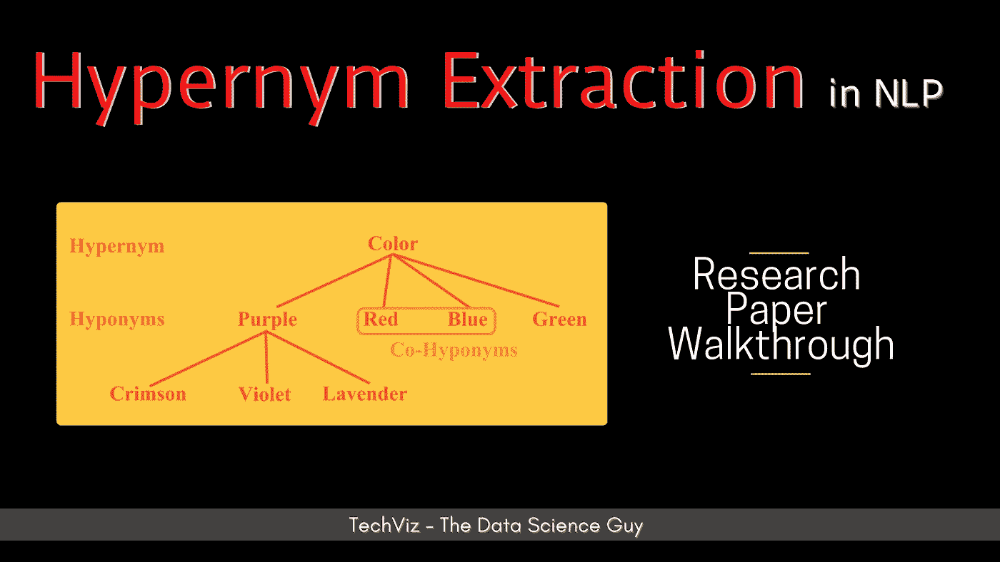

# 基于 ML 的文本上位词关系自动抽取

> 原文：<https://medium.com/analytics-vidhya/automatic-extraction-of-hypernym-relations-from-text-using-ml-4b04eb33097f?source=collection_archive---------4----------------------->

## 研究论文摘要

作者图片

*在这篇博客中，我尝试总结了我理解的* [*ACL*](https://acl2020.org/) *论文*[***CRIM at seme val-2018 Task 9:上位词发现的混合方法***](https://www.aclweb.org/anthology/S18-1116/) *。请随时评论你的想法！*

# **问题陈述**