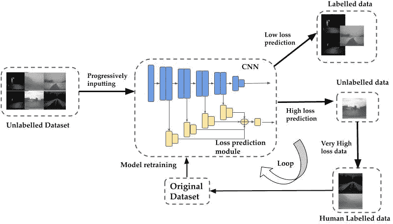
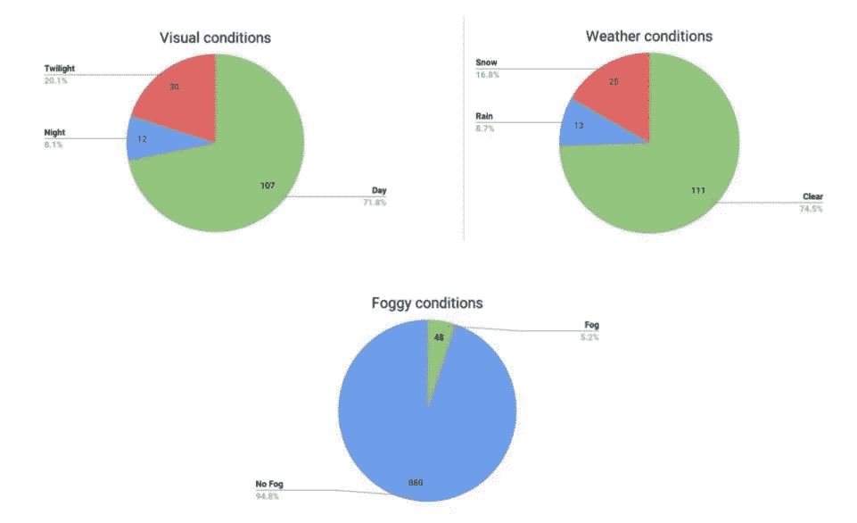
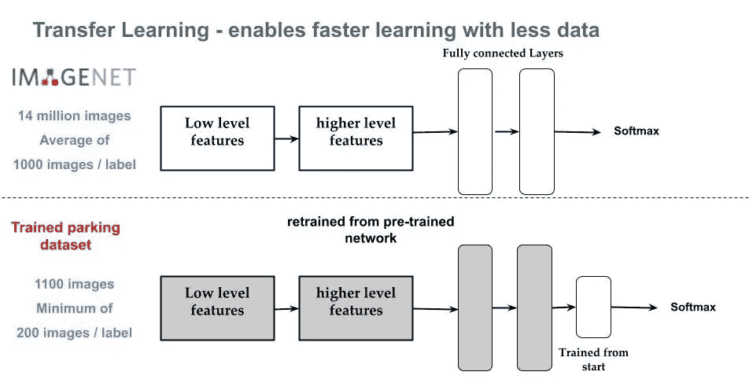
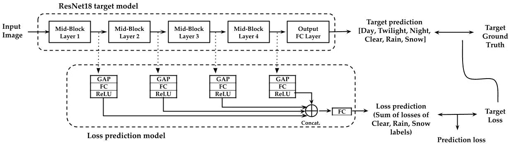
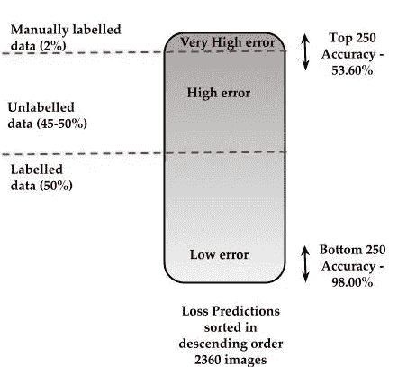

# 使用天气条件的主动学习的自动图像注释

> 原文：<https://medium.com/analytics-vidhya/automatic-image-annotation-using-active-learning-of-weather-conditions-928b01bd8a0f?source=collection_archive---------24----------------------->

> 实施多标签天气分类模型:白天、夜晚或黄昏用于视觉条件，晴朗、下雨或下雪用于天气条件。
> 
> 实施“损失预测模块”,用于选择要注释和训练的数据。
> 
> 数据集的大部分可以被自动注释。

# 概述:

天气分类模型和自动标注标准概述。

# 数据不平衡

所有实时数据都包含不平衡数据。该模型应该在所有标签上表现良好。以下是所用数据集的示例。

班级的分布显示出数据的不平衡。为每个类别选择可训练数据是很重要的。

解决方案:

1.  数据的欠采样:不平衡的类分布将有一个或多个样本很少的类(少数类)和一个或多个样本很多的类(多数类)。它包括通过消除属于多数类的样本来减少数据，目的是均衡每类样本的数量。这将不对称从 1:100 降低到 1:10 或 1:2 的类别分布。
2.  类别权重:解决数据不平衡的方法之一是为每个标签提供权重，这为少数标签提供了更多的重要性，从而最终结果是所有标签的平衡。使用中值频率平衡的类权重计算如下:w_class = median_freq / freq_class
3.  数据扩充:数据扩充是一种无需收集更多真实数据就能增加数据集多样性的技术。它防止模型过度拟合。

# 迁移学习

从其他类似数据集中初始化权重。

# **损失预测模块**

损失预测模块的体系结构。这个模块连接到目标模型的几个中间层。中间特征被映射到标量值作为损失预测。计算损失的图解。给定输入，目标模型输出目标预测，并且损失预测模块输出预测的损失。

1.  附加到目标模型的损失预测模块根据没有标签的输入预测损失值。
2.  丢失预测模块评估未标记池中的所有数据点。具有前 K 个预测损失的数据点被注释并添加到训练数据集中。

# 主动学习

问题:

*   应该对哪些数据进行标记和训练？
*   估算模型的性能？

解决方案:

*   网络识别难以预测的图像
*   从整个数据库中扫描独特的图像
*   确定最佳情况和最差情况下的性能
*   没有基础事实的近似误差估计

loos 预测输出

*   高损失=高误差=预测出错的高可能性
*   低损失=低误差=预测正确的可能性高
*   最高的 k 精度总是具有最低的精度(最坏的情况)
*   最低的 k 精度总是最高的精度(最好的情况)
*   选择前 k 个图像进行手动标记和重新训练

# 自动注释

*   标记的和未标记的数据可以通过阈值损失本身来决定
*   非常少量的非常高的误差数据被手动标记用于再训练。
*   大多数低误差数据可以自动标记为高精度。
*   Rest 是未标记的，并且期望在使用非常少的新样本的主动学习的进一步循环中被标记。

# 详细流程

1.  数据分析:

*   了解数据集中的分布和模式。
*   查找损坏的图像/标签。
*   寻找数据不平衡和偏差。
*   将异常值和边界条件可视化。

2.建立端到端的培训/评估框架

*   人类基线
*   用固定参数获取模型的基线。
*   过度拟合模型以检查容量。
*   调整超参数

在未标记数据集上使用主动学习的步骤:

*   第一步是手动标记数据的一个非常小的子样本。它提供了标签之间的本质区别。
*   一旦有了少量的标注数据，就需要对模型进行训练。该模型不会很好，但将有助于该模型了解参数空间的哪些区域需要进一步标记。
*   使用迁移学习:据观察，在训练的早期阶段，由于数据量明显较少，要训练的层数应该很少，并且用预训练的权重冻结其他层。训练层的层数随着可训练数据的增加而增加。
*   在模型被训练之后，该模型被用于在剩余的未标记数据点上预测类别。基于模型的预测，在每个未标记的数据点上选择分数。在我们的例子中，使用了损失预测模块。
*   具有高预测损失的数据点被手动标记并用于再训练。
*   这个过程可以重复:可以在新的标记数据集上训练新的模型，该数据集已经基于优先级分数进行了标记。一旦在数据子集上训练了新的模型，未标记的数据点可以在模型中运行，以更新优先化分数，从而继续标记。这样，随着模型变得越来越好，人们可以不断优化标记策略。

退房:[http://karpathy.github.io/2019/04/25/recipe/](http://karpathy.github.io/2019/04/25/recipe/)