# 使用高斯过程的自动时间序列描述

> 原文：<https://medium.com/analytics-vidhya/automatic-time-series-description-using-gaussian-processes-b9bf09f6d0ce?source=collection_archive---------9----------------------->

如果我们可以使用高斯过程以人类可以理解的方式自动描述时间序列会怎么样？

# 什么是高斯过程？

(多元)高斯过程是一组函数的分布。它们完全由它们的平均向量来描述:

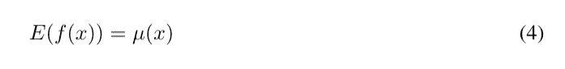

平均

和他们的协方差函数:

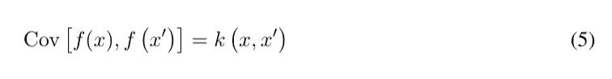

协方差函数

协方差函数的作用是描述点之间的相关性。它存在几个协方差函数。它们通常描述了我们对训练点的先验知识。我们在这篇文章中要关注的是线性核，周期核和平方指数核。

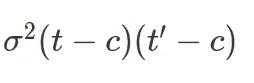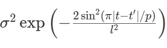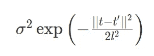

从左到右，线性、周期和平方指数核

一旦定义了这些内核，我们就能够计算如下的协方差矩阵(它们在这里显示为热图)。

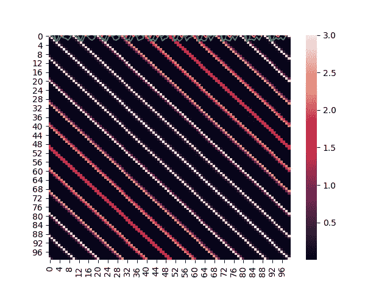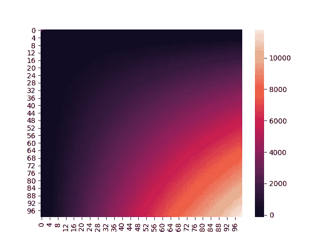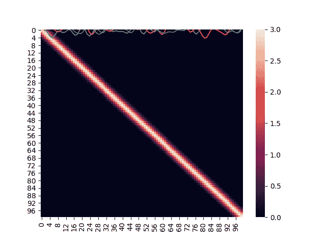

协方差矩阵的热图，从左到右，使用周期、线性和平方指数核

一旦计算出协方差矩阵，我们就定义了一个函数空间，在这里我们可以对一些项目进行采样，如下所示:

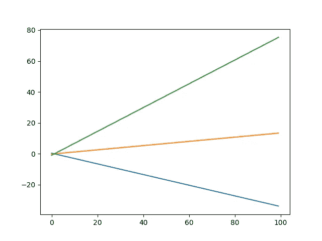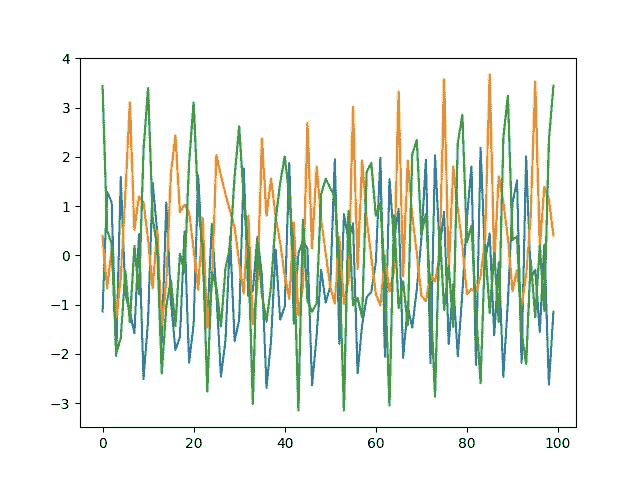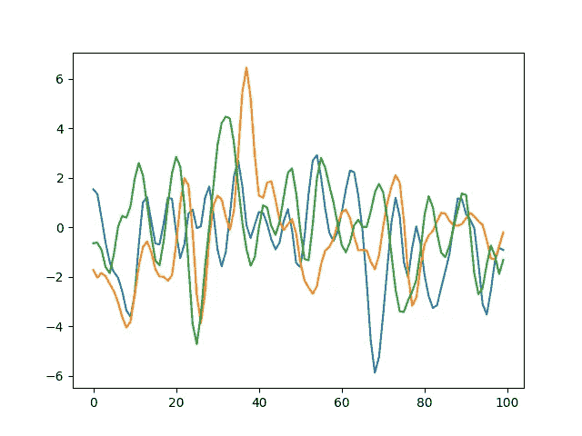

来自由上述协方差矩阵定义的函数空间的采样函数(假设零均值向量)分别使用线性、周期和平方指数核

正如我们所看到的，不同的模式由不同的内核编码，我们可以为内核参数应用其他值，以查看它们在函数行为中产生的变化。

一旦选择了协方差函数，就可以计算协方差矩阵。然后，我们可以用矩阵形式重写所有内容:

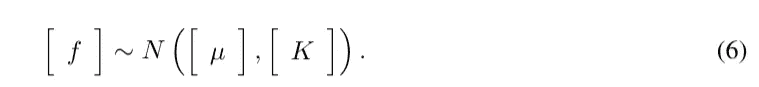

矩阵表示

与任何参数化模型一样，我们需要在训练过程中学习参数。这里的目的是最大化边际似然 p(Y |数据，参数)。这相当于在高斯过程定义的无限函数集合中选择一个函数。通过取后验对数，微积分得出:

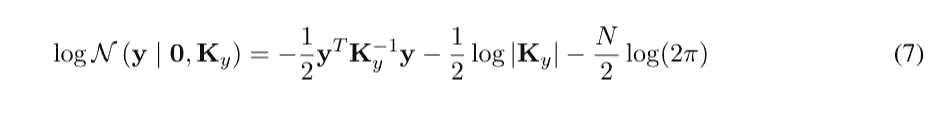

一旦选定，我们可以使用我们的函数来推断下一个值。如果我们有 f∫由未来点定义的函数，我们想通过推断得出，那么我们可以写为:

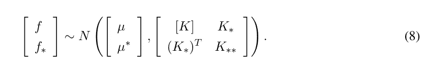

然后，我们可以根据以下公式从均值函数μ和协方差矩阵 K 推断新点 f∫的值:

预测公式

所有的证明都超出了本文的范围，但是可以在[2]中找到。

# 如何找到更好的内核？

这里的主要挑战是找到最好的内核，最好地描述我们的训练数据。这是一个困难的过程，需要很多内核选择方面的专业知识。这就是戴维·杜文瑙德和詹姆斯·劳埃德在[1]中要解决的困难。为了找到内核的最佳组合，他们引入了一个自动框架。

为了组合内核，允许三种操作:

*   加法 k = k1+k2
*   乘法 k =k1*k2
*   互换 k=k '

然后，它们递归地搜索组合核的空间。每一步都保留了最佳模型。最佳模型是指具有较高 BIC 的模型:

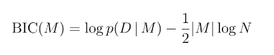

贝叶斯信息准则

其中第一项是边际可能性，第二项惩罚参数的数量。之后，他们创建了一个完整的字典，用人类可以理解的句子来翻译内核。所有的过程都在 Duvenaud 的论文中有描述。简而言之(**一定要阅读论文以获得完整的描述**)，每个内核都有一个特定的描述，当与其他内核结合时，它会发展。

# 履行

我在这里的目标是使用 Tensorflow 来利用它的计算能力。幸运的是，大部分的微积分可以用矩阵的形式来完成(张量流中的张量)。唯一的修改是将核函数重写为矩阵运算。这可以简单地通过增加向量的维数来获得我们需要的差分矩阵。这里以线性内核的实现为例。

示例实现线性核

一旦我们的内核实现了，我们需要实现搜索框架中允许的三个操作。为了简化整个过程，内核将被视为 python 列表，以便能够简单地添加、交换和相乘。

示例实现添加操作

下一步将是编码训练步骤。首先，我们需要实现公式(7)，这将是我们的目标函数最小化。

损失函数实现

第 15 行到第 39 行是为了从核列表中获得协方差矩阵，但是有趣的是函数的结尾。事实上，公式(7)使用矩阵求逆，这在计算上是昂贵的，并且在数值上是不稳定的。相反，我们可以使用 cholesky 分解来提高稳定性和复杂性。所有的细节都可以在[这门有趣的课程](https://www.cs.ubc.ca/~nando/540-2013/lectures/l6.pdf)中找到。

我们现在可以实施我们的培训流程了。尝试的第一种方法是梯度下降，但是这种方法有一些缺点:

*   它引入了新的超参数，比如我们需要调整的学习速率和迭代次数。
*   对于我们已经计算量很大的程序来说，它需要大量的迭代。

因此，我们将使用 L-BFGS-B(BFGS 的优化和约束版本)。该求解器来自拟牛顿(使用二阶导数)方法族，因此需要较少的迭代来收敛。我们将使用 scipy 的优化器，而不是 tensorflow 中实现的优化器，因为它是受约束的，并且测试表明，不受约束的超参数倾向于收敛到由损失函数定义的空间边界。

为此，我们需要创建一个函数来链接 scipy 和 tensorflow。这个函数是一个包装器，它返回一个函数，能够返回损失值和超参数的梯度(对应于 scipy.optimizer 函数所期望的)。

最后，我们可以实施我们的培训步骤:

define_boundaries 函数只是强制参数为正，因为负参数在这里没有意义。

我们现在可以实现预测步骤(公式(9)和(10)):

预言；预测；预告

一旦实施了 BIC 公式，最后一步将是实施语言。我们基于[1]的(**非常简化的**)语言可以使用 regex 和前面显示的内核名称列表来实现。

然而，许多步骤并没有包含在本文中。但是完整的节目可以在[这里](https://github.com/gregoritoo/ABCDflow)找到。它可以作为包含以下代码的包使用:

但是现在让我们看看最重要的:结果！

# 结果

预测(具有精确的置信区间，与深度学习技术相反) :

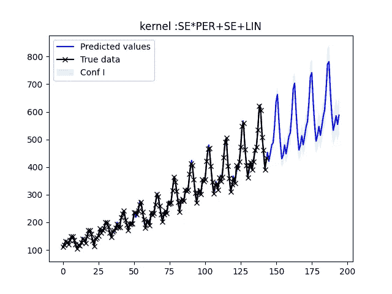

时间序列分解

解释:

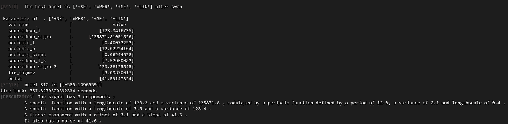

说明

分解:

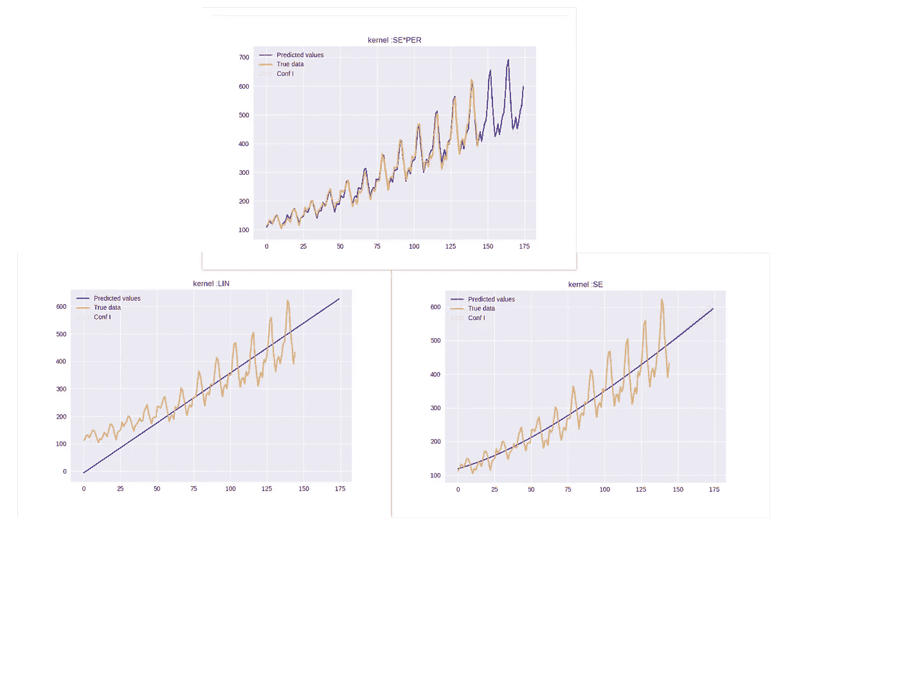

# 参考

[1]戴维·杜文瑙、詹姆斯·劳埃德、罗杰·格罗斯、约书亚·特南鲍姆和格拉马尼·邹斌。基于组合核搜索的非参数回归结构发现。Sanjoy Dasgupta 和 DavidMcAllester，编辑，第 30 届机器学习国际会议论文集，机器学习研究论文集第 28 卷，第 1166-1174 页，美国佐治亚州亚特兰大，2013 年 6 月 17-19 日。PMLR。

[2]c . e . Rasmussen & c . k . I . Williams,《机器学习的高斯过程》,麻省理工学院出版社，2006 年，ISBN 026218253 x . c 2006 Technology.www.GaussianProcess.org/gpml 麻省理工学院