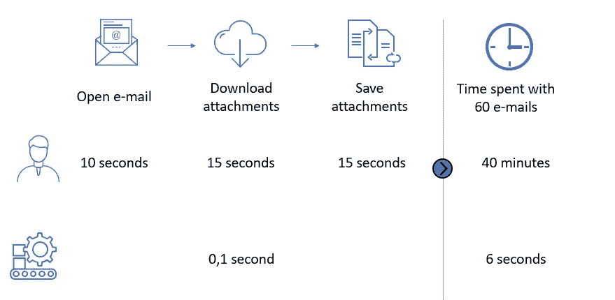

# 自动下载电子邮件附件| Python in Finance #3

> 原文：<https://medium.com/analytics-vidhya/automatically-download-e-mail-attachments-python-in-finance-3-b4670178e9a0?source=collection_archive---------3----------------------->

使用 python 自动提取电子邮件中的附件

自动完成这项任务的利弊

## **待自动化的情况**

客户发送给您 60 封电子邮件，其中包含一个需要验证的 excel 附件。

通常，你会花 40 分钟打开每封邮件，打开附件，然后把它保存在某个地方。