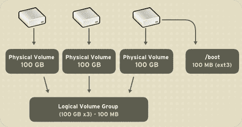
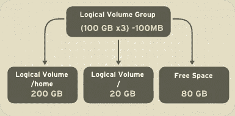
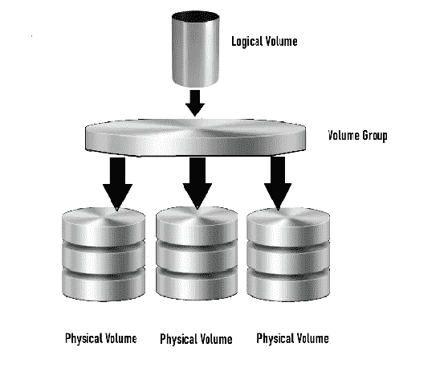
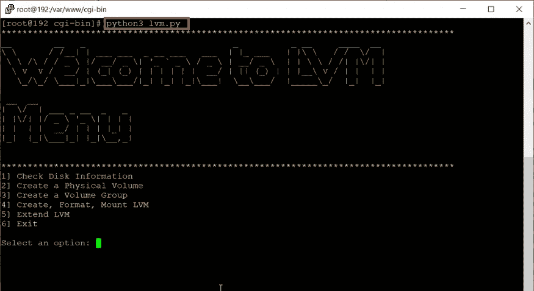
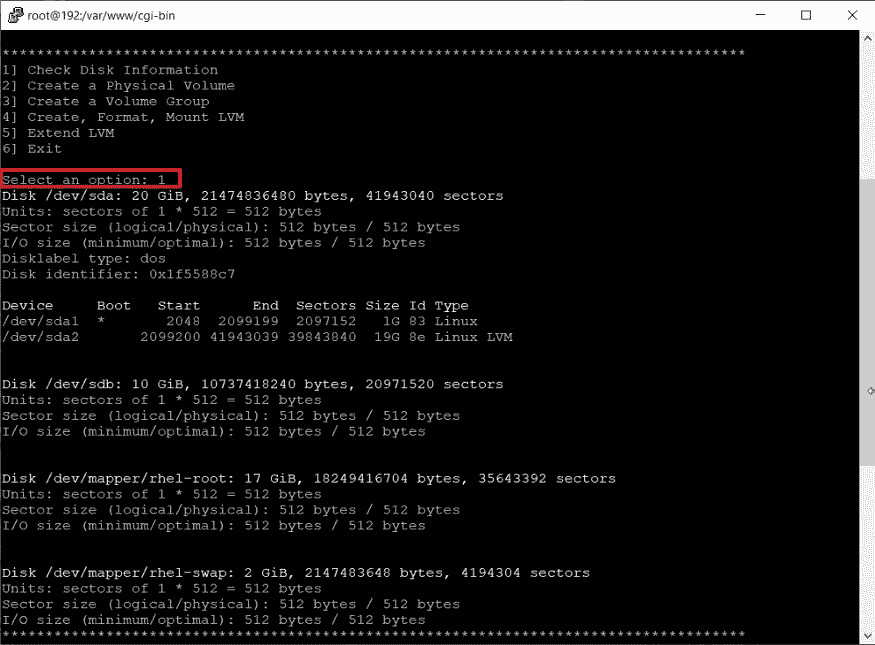
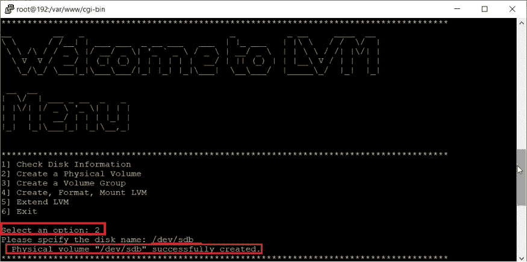
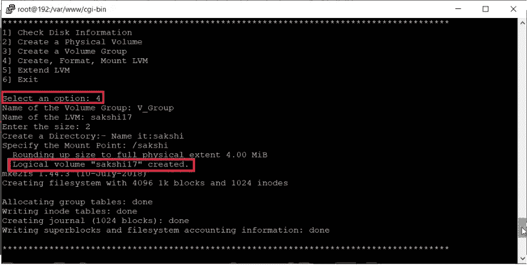
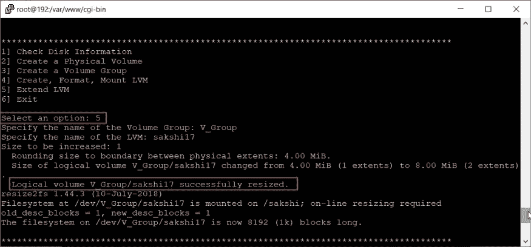
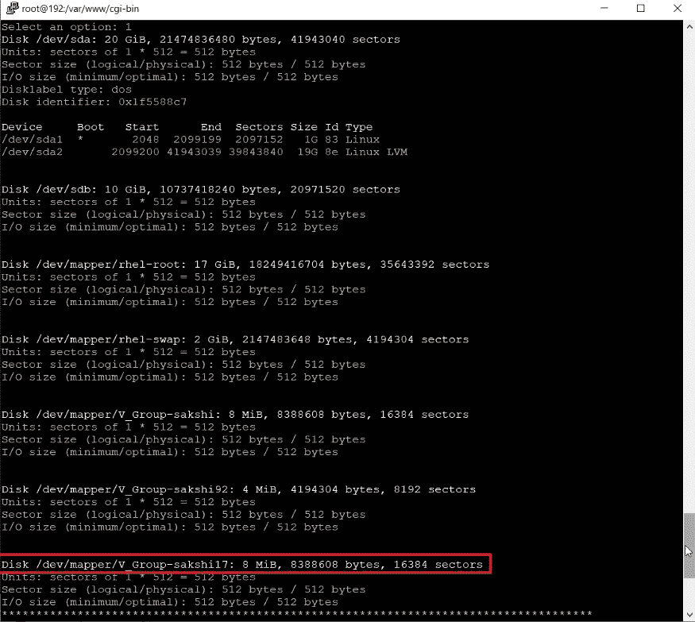
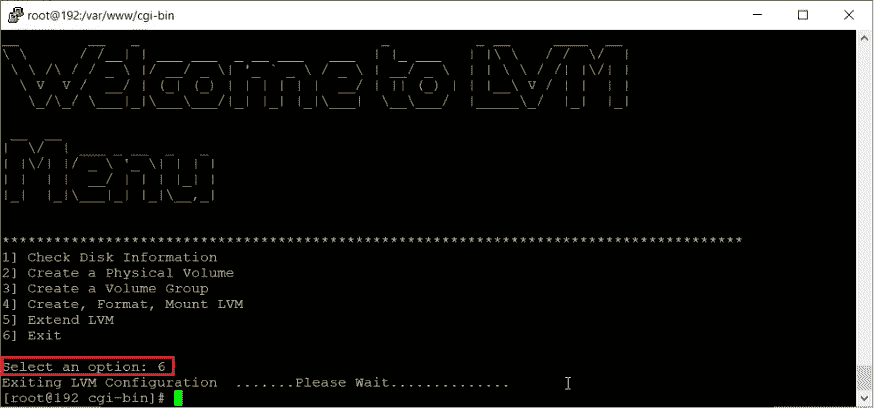

# 使用 Python 脚本自动化 LVM 分区

> 原文：<https://medium.com/analytics-vidhya/automating-lvm-partition-using-python-script-b6bb141d7824?source=collection_archive---------14----------------------->


## 什么是 LVM？

LVM 是一种逻辑卷管理工具，包括分配磁盘、条带化、镜像和调整逻辑卷大小。借助 LVM，一个或一组硬盘被分配给一个或多个*物理卷*。LVM 物理卷可以放在可能跨越两个或更多磁盘的其他块设备上。

除了`/boot`分区之外，物理卷被组合成*逻辑卷*。`/boot`分区不能在逻辑卷组上，因为引导加载程序无法读取它。如果根(`/`)分区在一个逻辑卷上，则创建一个不属于卷组的单独的`/boot`分区。由于一个物理卷不能跨多个驱动器，因此要跨多个驱动器，请在每个驱动器上创建一个或多个物理卷。



卷组可以分为*逻辑卷*，它们被分配了挂载点，如`/home`和`/`以及文件系统类型，如 ext2 或 ext3。当“分区”达到其最大容量时，可以将卷组中的空闲空间添加到逻辑卷中，以增加分区的大小。当向系统中添加新的硬盘驱动器时，可以将其添加到卷组中，并且可以增加作为逻辑卷的分区的大小。



另一方面，如果一个系统是用 ext3 文件系统分区的，那么硬盘会被划分成定义大小的分区。如果分区变满，就不容易扩展分区的大小。即使分区被移动到另一个硬盘驱动器，原始硬盘驱动器空间必须被重新分配为不同的分区或不被使用。

它是一个管理逻辑卷或文件系统的系统，比传统的将磁盘分区为一个或多个段并用文件系统格式化该分区的方法更加先进和灵活。

LVM 管理着三个概念

*   *物理卷*
*   *卷组*
*   *逻辑卷*

**物理卷:-** LVM 将物理卷合并到称为卷组的存储池中。卷组抽象了底层设备的特征，并作为一个统一的逻辑设备，具有组件物理卷的组合存储容量。

**卷组:** - LVM 将物理卷合并到称为卷组的存储池中。卷组抽象了底层设备的特征，并作为一个统一的逻辑设备，具有组件物理卷的组合存储容量。

**逻辑卷** :-一个卷组可以被分割成任意数量的逻辑卷。逻辑卷在功能上相当于物理磁盘上的分区，但灵活性更大。逻辑卷是用户和应用程序将与之交互的主要组件。



**LVM 建筑**

## Python:-

Python 是面向对象的函数式语言。它让程序员决定函数或类是否更适合手边的需求。这对测试自动化来说是一个很大的好处，因为

(a)无状态函数避免了副作用。

(b)这些函数的简单语法使它们具有可读性。

**自动化代码:-**

```
**import os
import sys
from time import sleep
import getpass as g
import pyfiglet
from termcolor import colored
from pyfiglet import figlet_format****while(1):****print("**************************************************************************************")
    print((colored(figlet_format("Welcome to LVM Menu","standard"), color='yellow')))     
    print("**************************************************************************************")
    print("1] Check Disk Information")
    print("2] Create a Physical Volume")
    print("3] Create a Volume Group")
    print("4] Create, Format, Mount LVM")
    print("5] Extend LVM")
    print("6] Exit")
    print()
    option = input("Select an option: ")
    if(option == "1"):
        os.system("fdisk -l")
        sleep(2)
    elif(option == "2"):
        disk_name = input("Please spcify the disk name: ")
        os.system(f"pvcreate {disk_name}")
        sleep(2)
    elif(option == "3"):
        vgname = input("Name of the Volume Group: ")
        disks = input("Please specify all the DiskNames ( with spaces ): ")
        os.system(f"vgcreate {vgname} {disks}")
        sleep(2)**
   ** elif(option == "4"):
        vgname = input("Name of the Volume Group: ")
        lvmname = input("Name of the LVM: ")
        size = input("Enter the size: ")
        db=input("Create a Directory:- Name it:")
        os.system(f"mkdir /{db}")
        mount_point = input("Specify the Mount Point: ")
        os.system(f"lvcreate --size {size} --name {lvmname} {vgname}")
        os.system(f"mkfs.ext4 /dev/{vgname}/{lvmname}")
        os.system(f"mount /dev/{vgname}/{lvmname} {mount_point}")
        sleep(2)
    elif(option == "5"):
        vgname = input("Specify the name of the Volume Group: ")
        lvmname = input("Specify the name of the LVM: ")
        size = input("Size to be increased: ")
        os.system(f"lvextend --size +{size} /dev/{vgname}/{lvmname}")
        os.system(f"resize2fs /dev/{vgname}/{lvmname}")
        sleep(2)
    elif(option == "6"):**
        **print("Exiting LVM Configuration  .......Please Wait..............")
        sleep(2)
        break**
```

现在，让我们运行代码，看看结果:-



**菜单**



**磁盘信息**



**创建的物理卷**



**逻辑卷已创建**



**调整了大小的逻辑卷**



**磁盘信息**



**退出程序**

同样，我们使用 Python 脚本执行 LVM 分区的自动化。

***谢谢:)***