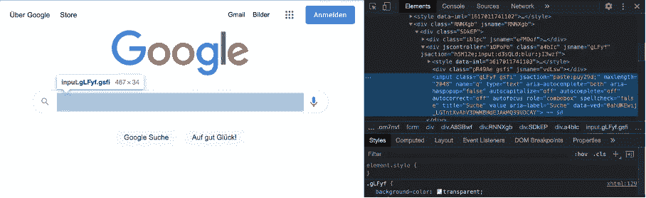
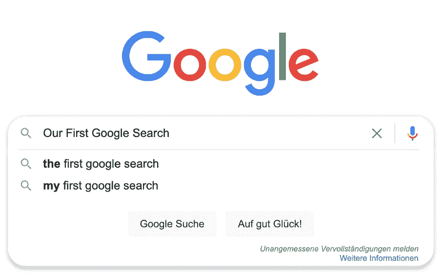
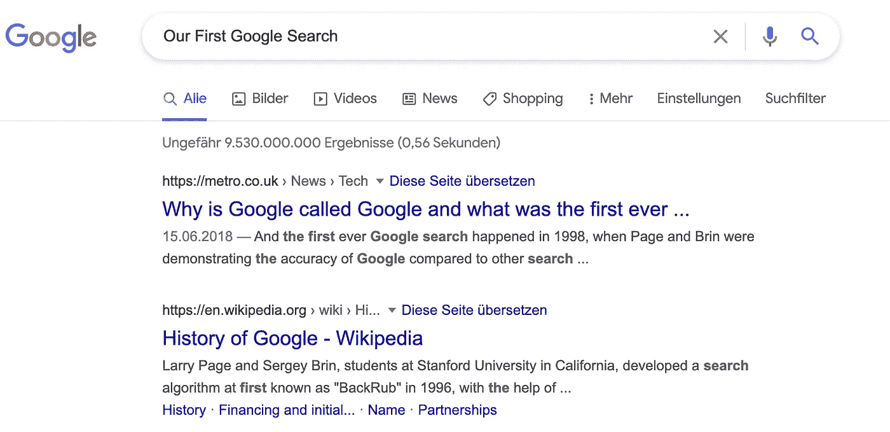
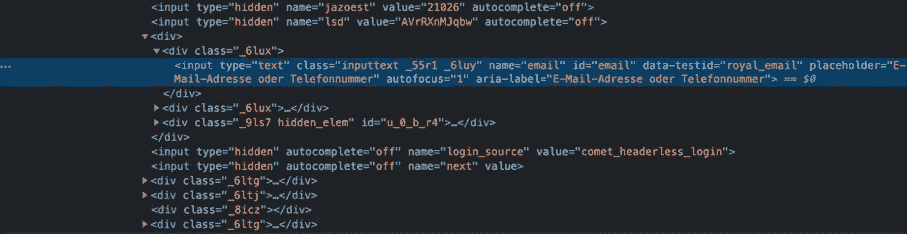

# Selenium 和 Python 的自动化测试、抓取等功能。

> 原文：<https://medium.com/analytics-vidhya/automation-testing-scraping-and-more-with-selenium-and-python-9247278b00d2?source=collection_archive---------12----------------------->


凯文·巴加特在 [Unsplash](https://unsplash.com?utm_source=medium&utm_medium=referral) 上的照片

# selenium——曾经是一个浏览器扩展，现在是测试基于 web 的应用程序的最流行的框架之一。在本文中，您将了解什么是 Selenium，如何使用它，以及如何开始您的第一步。

**Selenium 基础知识** Selenium 是一个开源框架，由以下组件组成:

1.Selenium Webdriver:在浏览器中自动执行用户动作的主要组件。

2.Selenium Grid:允许多个实例在多个设备、操作系统和浏览器上同时运行的组件。这使得在尽可能多的平台上运行测试结果成为可能，这是自动化测试成功的先决条件。

3.Selenium IDE:记录并重复用户在浏览器中的动作。

Webdriver 通过特定于浏览器的驱动程序与浏览器进行通信，该驱动程序也以相反的方向向 Webdriver 发送 HTTP 响应。这种简单的结构，加上开放的体系结构以及跨平台和跨语言工作的可能性，吸引了许多用户和开发人员，并使扩展成为可能。

**我们开始吧！** 首先是设置:我们需要 Selenium——我们可以用“-m pip install selenium”下载安装在终端中。接下来，我们需要已经提到的 webdriver。我在这个项目中使用谷歌 Chrome 浏览器，你可以在这里找到 Chrome 浏览器的驱动程序。我们开始一个新的 Python 项目——用第一行代码导入 Selenium，选择 webdriver。Chrome 并给出 chromedriver 所在的路径。

```
from selenium import webdriver
driver = webdriver.Chrome(‘/Users/NAME/Desktop/chromedriver’) 
```

在这里，您已经可以测试所有内容是否都被正确导入:运行代码应该会打开一个新的 Chrome 窗口，并显示消息:“Chrome 正在由自动化测试软件控制”。

为了初步了解 Selenium 的工作原理并开始学习语法，让我们从一个非常简单的例子开始。要调用一个页面，我们在刚刚定义的“驱动程序”上使用“ *get* 来打开所需的 URL:

```
driver.get(‘[https://www.google.com/xhtml'](https://www.google.com/xhtml'))
```

要进行自动谷歌搜索，我们必须找到执行搜索所需的元素。为了找到我们需要的元素，我们必须在网站上点击右键(使用 Chrome 浏览器)进入“查看页面源代码”来查看 HTML 代码。HTML 代码是如何构建的以及如何在这里导航，我在以前的一篇文章中使用 BeautifulSoup 的一个抓取示例进行了描述。

[https://medium . com/analytics-vid hya/how-to-find-a-car-under-market-value-with-python-beautiful-soup-and-your-own-telegram-bot-c 9d 91 e 23 c 0d 1](/analytics-vidhya/how-to-find-a-car-under-market-value-with-python-beautifulsoup-and-your-own-telegram-bot-c9d91e23c0d1)

为了在代码中实现我们需要的元素，我们将使用函数:" *find_element_by_name* "按名称使用页面上的元素。补充信息:我们使用“google.com/xhtml ”,这样我们可以更好地阅读谷歌的 html 代码。一个简短的搜索向我们展示了搜索栏元素的名字仅仅是“q”。



搜索栏 HTML

现在，我们通过“ *find_element_by_name* 转到元素，并使用“ *send_keys* 输入所需的文本。

```
search=driver.find_element_by_name(‘q’)
search.send_keys(‘Our First Google Search’)
```

为了使我们的自动化更加“人性化”,我们在命令之间增加了等待时间。为此，我们首先必须输入“时间”,并在调用网页后通过输入以下内容设置暂停时间，例如 4 秒钟:

```
time.sleep(4)
```



我们的第一次谷歌搜索开始了

我们必须添加到代码中的最后一部分是提交搜索:

```
search.submit()
```

这一行模拟了按下回车键后的搜索结果:



首次成功的自动谷歌搜索

要结束一个会话(注意:窗口会立即关闭，所以在窗口消失之前要有一个睡眠时间来查看结果)，我们使用 quit 函数:

```
driver.quit()
```

当然，我们还可以通过其他多种方式在代码中选择所需的元素—*“find _ element _ by _ name”*只是其中一个选项。其他常见的可能有:*“find _ element _ by _ id”*、*“find _ element _ by _ XPath”*、*“find _ element _ by _ class _ name”*等。详细的 selenium 文档可以在[这里](https://selenium-python.readthedocs.io/)找到。

有了这些工具，所有元素都可以在 HTML 代码中找到，作为一个元素合并到 Python 代码中，并以不同的方式用于创建自动化流程。类似地，用户可以通过选择和填写单个元素来自动登录到网页。例如，使用脸书网站。



脸书 HTML —我的电子邮件放在哪里？

在首页快速搜索发现，邮件藏在 id="email "下，密码藏在" pass "下。你所要做的就是“ *send_keys* ”给那些人，并通过提交再次执行“输入”。

我想用更多有用的函数来结束这篇文章，这些函数可以创造性地用于定制您的个人自动化过程:

*   " *getCurrentUrl()* " —以字符串形式获取当前 Url，这在您浏览网站并想要抓取它们时会很有用
*   " *getText()* " —获取您选择的 web 元素的内部文本—非常适合字符串和字符的自动抓取
*   " *implicitlyWait()* " —有时网页需要一些时间来加载，而您的驱动程序试图找到一个尚未加载的元素。implicitlyWait 将按您输入的秒数暂停操作。
*   "*visibilityOfElementLocated()*"与" untill()"成对出现-几乎做同样的事情，但不会等待 X 秒，而是等待某个元素变得可见。例如:wait . until(something wearewaitingfor . sivibilityofelementlocated)。当加载时间很长，并且您不知道要设置多少等待时间时，这就变得很方便了。
*   “getScreenshotAs()”—此时将截取一个屏幕截图，可用于以后的控制。不要忘记在括号中设置文件名和格式。

有了所有这些功能，您可以构建一个程序，它可以:自动浏览网页，检查 web 应用程序功能，提取并保存信息，以检测错误并提高性能。

一如既往:感谢阅读！