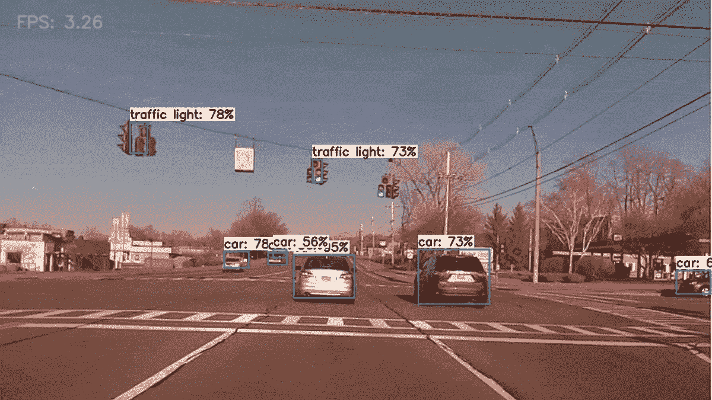
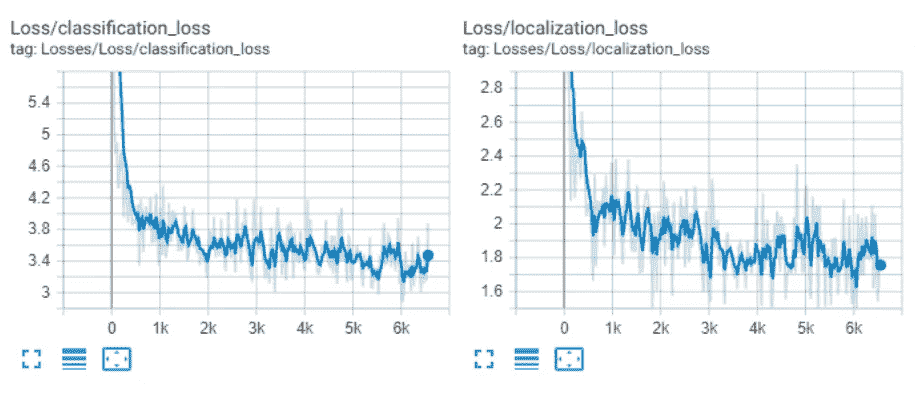
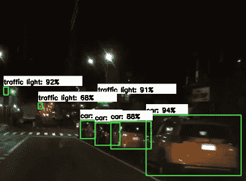
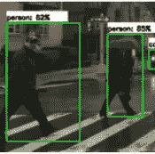
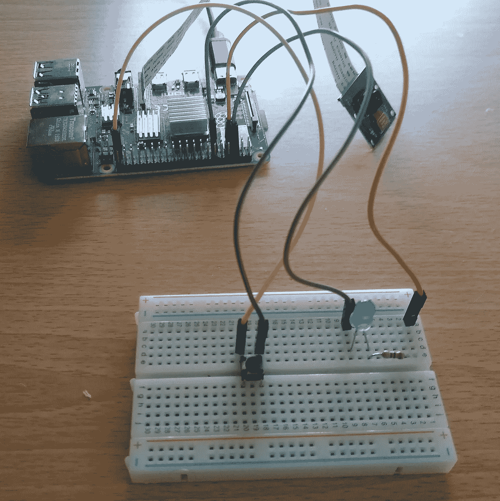
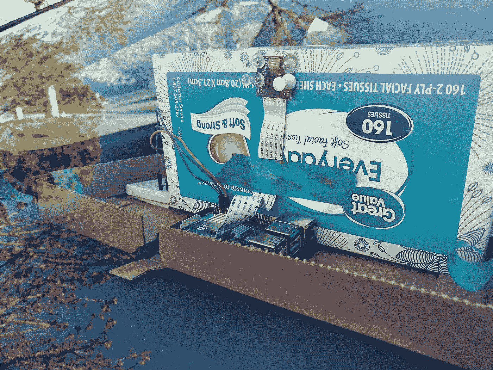
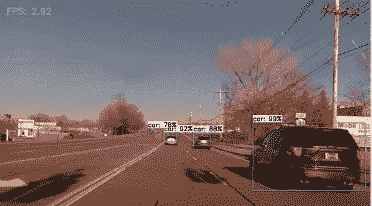

# Raspberry Pi 4 上的自动驾驶目标检测

> 原文：<https://medium.com/analytics-vidhya/autonomous-driving-object-detection-on-the-raspberry-pi-4-175bba51d5b4?source=collection_archive---------6----------------------->

使用轻量级计算硬件，如使用 T4 tensor flow Lite 的 T2 树莓 Pi 4 T3，边缘的深度学习现在成为可能！

在 Raspberry Pi 4 上测试张量流 Lite 模型

在这个项目中，分析了对象检测性能，以了解 **Raspberry Pi 4** 在移动车辆中安装和处理视频馈送时的表现。经过训练的模型在线运行速度为 **2.73 fps** ，对道路上的物体进行了令人印象深刻的分类和定位！

**背景**

**物体检测**在计算机视觉中是一项具有挑战性的任务。它包括通过处理图像的像素来计算物体的位置和这些预测的置信度。**深度学习**大大加快了该领域的性能，并允许在自动驾驶等领域实现高性能模型！

对于不熟悉**机器学习/深度学习/物体检测**的人来说。这里有一个很棒的介绍:

[https://www.youtube.com/watch?v=pIciURImE04&t = 138s&ab _ channel = bitsNblobsElectronics](https://www.youtube.com/watch?v=pIciURImE04&t=138s&ab_channel=bitsNblobsElectronics)

**模特培训详情**

一个**SSD-MobileNet-V2**tensor flow Lite 模型被训练来执行单次目标检测。作为起点，迁移学习被用于在 **COCO 数据集**上训练的模型。然后使用 **BBD100K** 自动驾驶数据集进行额外的训练。该数据集包含 10 种不同的自动驾驶类别:交通标志、交通灯、汽车、骑手、汽车、人、公共汽车、卡车、自行车和火车。在 Windows 10 机器上，对数据集进行训练直到丢失收敛花费了大约 **17 个小时**。

培训损失

作为健全性检查，一些测试图像通过模型运行，以确保它准确地检测到它被训练检测的对象类。

车辆检测试验

行人检测测试

这些测试是该模型如何在检测车辆(即使在光线较暗的情况下)和行人方面表现良好的例子！

张量流模型然后被量子化。**量化**一个模型取 **32 位** **浮点权重**并还原为 **8 位整数权重**。这使得**能够更快地检测**，同时模型精度略有下降。这也允许模型在轻量级硬件上运行，如 Raspberry Pi！

**测试设置硬件**

一旦模型被训练、量化，并且所有软件在 Pi 上被配置，测试设置被配置。

对于该项目，使用了以下硬件组件:

*   Raspberry Pi 4 (4 GB 内存— 1.5GHz CPU)
*   Raspberry Pi 5MP 万像素摄像头(1.3 版)
*   RGB LED
*   GPIO 按钮
*   小试验板
*   3.5 安培 USB-C 电源

安装到车辆前的硬件配置

把所有东西都连接起来后，相机被安装在一个纸巾盒上，并固定在我汽车的仪表板上。然后 Pi 通过我车上的 115V 交流电源插座供电。

安装到车辆后的硬件配置

当按下 GPIO 按钮时，RGB LED 亮起，Pi 开始处理视频帧，并在行驶过程中保存到 Pi。

帖子顶部的 gif 展示了模特的表现！这里有一张来自 gif 的静帧，供参考！

如果你想亲自测试这个项目，我在这里做了一个 GitHub 教程:

 [## ECD 1012/rpi _ 道路 _ 物体 _ 检测

### 该存储库包含代码和指令，用于配置必要的硬件和软件，以运行自主…

github.com](https://github.com/ecd1012/rpi_road_object_detection) 

如果你想要视频教程，这是我在 YouTube 上做的视频:

让我知道你的想法！

**未来工作:**

*   随着更多的时间花在这个项目上，看看如何在多目标跟踪(MOT)系统中使用检测将会很有趣！更多多目标跟踪背景的链接:【https://en.wikipedia.org/wiki/Multiple_object_tracking 
*   使用多目标跟踪将使这个项目更接近创造一辆自动驾驶汽车。:)

## 来源:

*   链接到 MobileNets 论文:[https://arxiv.org/pdf/1704.04861.pdf](https://arxiv.org/pdf/1704.04861.pdf)
*   张量流模型链接:[https://github . com/Tensor Flow/Models/blob/master/research/object _ detection/g3doc/tf1 _ detection _ zoo . MD](https://github.com/tensorflow/models/blob/master/research/object_detection/g3doc/tf1_detection_zoo.md)
*   链接到使用的训练数据集:[https://bdd-data.berkeley.edu/](https://bdd-data.berkeley.edu/)