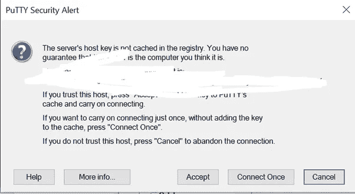

# 使用 EC2、Python、Flask 和 Nginx Part1 在 AWS 上自动缩放

> 原文：<https://medium.com/analytics-vidhya/autoscale-on-aws-with-ec2-python-flask-and-nginx-part1-240c6bbf5c35?source=collection_archive---------6----------------------->


加布里埃尔·海因策在 [Unsplash](https://unsplash.com/photos/xbEVM6oJ1Fs) 上的照片

AWS Auto Scaling 监控您的应用程序并自动调整容量，以尽可能低的成本保持稳定、可预测的性能。

想象一下，去杂货店购物，商店把所有的东西都放在一个袋子里递给你。你必须用一只手拿这个超过 5 公斤重的包。

想象一下同样的情况，但是商店给你同样重量的物品，但是分成三个不同的袋子。听起来很轻松，对吧？

同样，假设您想要管理站点上的大量流量，并且您的硬件资源在当前服务器上得到充分利用，并且您想要根据流量在运行时添加更多硬件。这就是可以应用缩放的地方。有许多方法可以实现缩放。

其中一种方法是使用 AWS 自动缩放。AWS 自动伸缩可以帮助我们根据服务器上的流量增加或减少实例。

你可以参考下面的链接来深入了解这项服务:[https://docs . AWS . Amazon . com/auto scaling/ec2/user guide/auto-scaling-benefits . html](https://docs.aws.amazon.com/autoscaling/ec2/userguide/auto-scaling-benefits.html)

**要覆盖的点**:

1.创建一个 EC2 服务器并通过 putty 访问。(第一部分)

2.在 EC2 服务器上创建 Flask 应用程序并配置 Nginx(第 2 部分)

3.配置自动缩放组(第 3 部分)

在第一部分中，我们将创建一个 EC2 实例，将。pem 文件转换成. ppk 文件，然后用 putty 访问我们的 EC2 实例。

# 创建 Ec2 服务器

Amazon EC2 允许我们使用自己选择的硬件和软件配置来创建虚拟机。让我们创建一个。

*   从搜索栏中搜索 EC2，然后单击 **EC2** 服务。


*   点击**实例(运行)**。


*   点击**启动实例**


*   让我们选择一个符合我们要求的操作系统。对于本指南，我将选择 Ubuntu Server 18.04


*   现在我们得到了实例类型的选项。在这里，我们可以看到我们将获得多少 RAM 和 vCPU。我会选择 t2.micro 免费层。


*   在默认配置的**步骤 3、4 和 5** 中点击**下一步**。现在，在第 6 步，确保你允许 HTTP 端口点击添加规则按钮。SSH 规则允许我们从像 putty 这样的软件中访问实例。HTTP 规则允许端口 80，这将允许我们的服务器上的互联网流量。


*   在最后一步中，您可以创建新的密钥对或者选择一个现有的密钥对，这将帮助您使用 SSH 规则访问您的实例。给密钥对文件起一个名字并下载这个文件，因为你不会再得到这个文件了。


# **访问实例**

*   现在，我们将借助 putty 来访问这个实例。Putty 接受一个. ppk 文件来连接服务器，而 AWS 给了我们一个. pem 文件，因此我们必须将。pem 文件转换为. ppk 文件。

```
Open puttygen → Click load button → select the file that you get from AWS → click save private key button → save file as .ppk file.
```


*   要通过 Putty 访问实例，我们需要实例的 IP 地址。要查找实例的 IP 地址，请从 EC2 控制面板中选择该实例，然后转到详细信息部分，在这里我们将获得 EC2 实例的公共 ipv4 地址，复制此 IP 地址。


*   打开 Putty 软件，将从 AWS 获得的公共 IP 地址粘贴到 hostname 中。


*   要访问实例，我们必须提供实例的私钥，为此，请转到 putty 软件的 auth 部分并浏览。我们刚刚从 Puttygen 工具生成的 ppk 文件。现在点击打开。


*   如果你得到如下提示，接受它。



*   给你的实例用户名。在大多数情况下，默认情况下，它将是 ubuntu。


在我们给出用户名后，我们现在成功登录，并且能够使用实例。

这部分到此为止。我们将在第二部分创建一个 Flask 服务器并配置 Nginx。下一篇文章再见。

如果你喜欢这篇文章，点击给我买杯咖啡！感谢阅读。

[](https://www.payumoney.com/paybypayumoney/#/147695053B73CAB82672E715A52F9AA5)

你的每一个小小的贡献都会鼓励我创造更多这样的内容。