# 使用 EC2、Python、Flask 和 Nginx Part3 在 AWS 上自动缩放

> 原文：<https://medium.com/analytics-vidhya/autoscale-on-aws-with-ec2-python-flask-and-nginx-part3-9ab0abeeeea6?source=collection_archive---------4----------------------->


使用 [Imgflip](https://imgflip.com/i/5uvg9h) 生成的图像

之前我们[搭建了一个 EC2 服务器](https://dlmade.medium.com/autoscale-on-aws-with-ec2-python-flask-and-nginx-part1-240c6bbf5c35)，通过 Putty 访问，[用 waste WSGI 创建了一个 Flask 服务器](https://dlmade.medium.com/autoscale-on-aws-with-ec2-python-flask-and-nginx-part2-f5640e406105)，还创建了 ubuntu 服务，配置了一个 Nginx 服务器。现在，我们将创建一个自动缩放组。

在创建自动缩放组之前，我们需要 AMI、目标组、启动模板。因此，让我们从创建 AMI 开始。

# **阿米**

AMI(Amazon 机器映像)提供启动实例所需的信息。它将基本上存储我们在实例中完成的每个配置，我们将从该实例中创建 AMI。

*   转到 EC2 实例，选择要为其创建映像的实例。然后点击操作→图像和模板 **→** 创建图像。

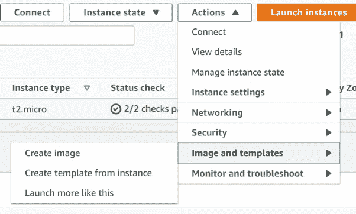

*   给出图像名称和描述，其他的保持默认。

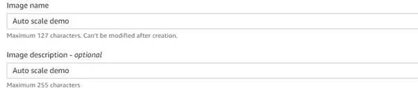

*   我们的形象被创造出来。现在让我们创建启动模板。

# 启动模板

*   启动模板将告诉我们的 auto scale 组使用 AMI 启动每个新实例，这些实例是我们之前使用给定的一组指令(如实例类型和网络设置)创建的。
*   在 EC2 仪表板的左侧，您可以看到点击启动模板。根据您的选择给出模板名称和版本。

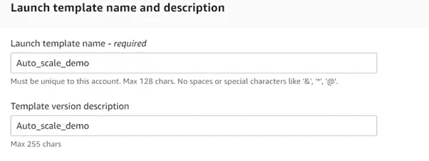

*   转到 AMI 部分。您必须选择我们之前创建的图像。

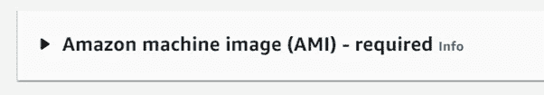

*   要选择图像，您只需在搜索框中键入您的图像名称，您的图像将出现在“我的 AMIs”部分。

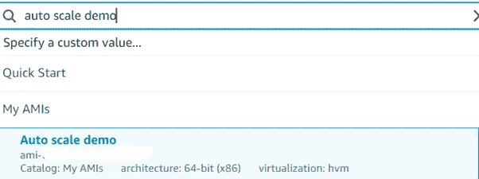

*   现在向下滚动，您将看到实例类型和密钥对部分。根据您的选择选择实例类型和密钥对。每当创建一个新实例时，它将使用这个实例类型和密钥对文件。

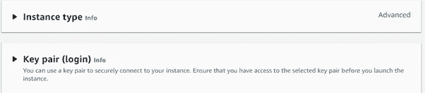

*   在网络设置中，请确保您将选择我们在第一部分中创建的安全组。这将启用 ssh 和 HTTP 规则，否则您将无法通过互联网或 SSH(如 putty)访问您的实例。

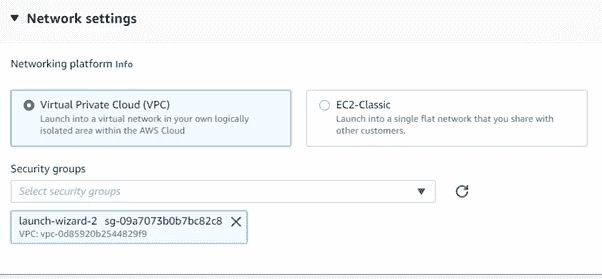

*   保留所有默认设置，然后单击创建启动模板。我们的发布模板已经准备好，让我们继续关注目标群体。这将帮助负载平衡器将流量路由到自动缩放组中创建的所有实例。

# 目标群

*   您可以在 ec2 仪表板的负载平衡部分找到目标组。这里我们将选择目标类型作为实例，因为我们是为 ec2 创建的。根据您的选择给出目标组名称，然后单击下一步。

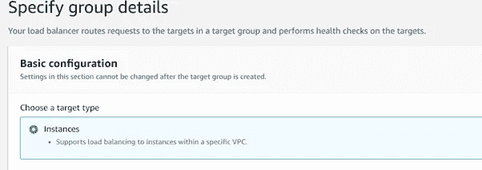

*   选择您创建的 ec2 实例的第一部分。现在，单击下面的“包括为待定”。它将在这个目标组中注册我们的实例。

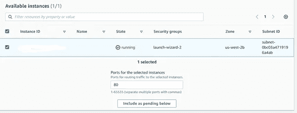

*   向下滚动一点，您会看到在目标组中注册了一个实例。点击创建目标组。至此，我们已经创建了一个启动模板、AMI 和目标组，现在我们拥有了自动缩放组所需的所有东西。

# **自动缩放组**

*   您可以在 EC2 仪表板左侧底部的自动缩放部分找到自动缩放组。单击自动缩放组，然后单击创建自动缩放组。
*   首先，输入您选择的自动缩放组名称。选择我们之前创建的发布模板，并确保发布模板的版本是最新的。

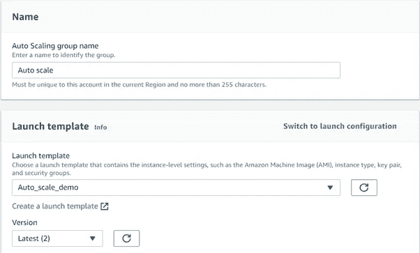

*   选择创建实例时使用的 VPC。选择所有可用性区域。

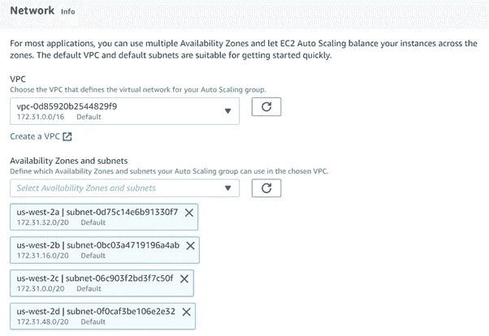

*   现在，我们将创建我们的负载平衡器，并包括我们的目标群体。选择“Attach new load balancer”单选按钮，并将负载平衡器类型设置为“Application load balancer ”,因为我们将控制 HTTP 和 HTTPS 流量。

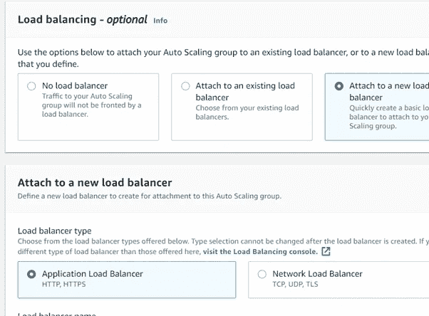

*   **负载均衡器**

1.  根据您的选择创建负载平衡器名称。
2.  选择负载平衡器方案和面向互联网，因为我们希望我们的客户访问应用程序。
3.  选择与我们之前创建的实例相同的 VPC 和可用性区域。
4.  在监听器和路由中，选择我们之前创建的目标组。
5.  单击下一步。

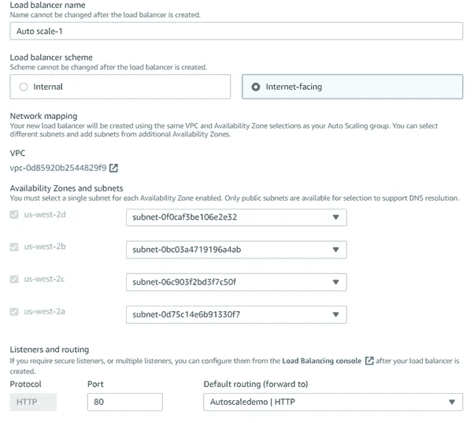

*   在组大小中，我们可以根据我们的要求选择所需的服务器容量。出于演示目的，我将保持所需容量为 1，最小容量为 1，最大容量为 2。
*   扩展策略是一个指标，它将告诉自动扩展组何时增加或减少服务器。在这里，我们保持 50%的 CPU 利用率阈值。因此，如果 CPU 利用率超过 50%，它将添加一个新实例；或者，如果我们的实例数量超过了最低要求，而 CPU 利用率低于 50%，它将减少实例数量。预热秒数是指直到您的实例利用率达到阈值并保持在该阈值以上的时间，然后自动缩放组将增加/减少实例。

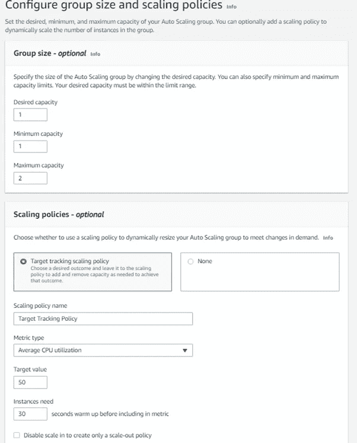

*   将所有步骤保留为默认，检查并启动自动缩放组。
*   这就是我们已经创建的自动缩放组。现在让我们来验证它是如何工作的。

# **访问站点**

*   要访问您的站点，您可以转到负载平衡器→选择负载平衡器→复制 DNS 名称→粘贴到您的浏览器中。

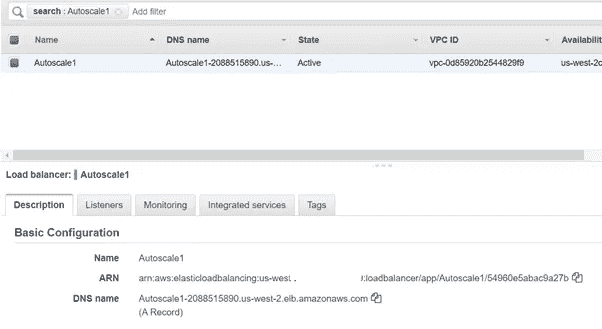

*   如果您无法访问该网站，请确保您尝试使用 HTTPS 和 HTTP 的 DNS 名称。如果不起作用，请尝试将负载平衡器的安全组更改为与实例安全组相同的组。

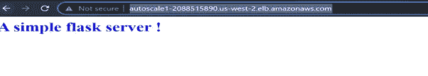

*   对于更改安全组，选择负载平衡器，然后向下滚动，您将获得一个安全组选项。

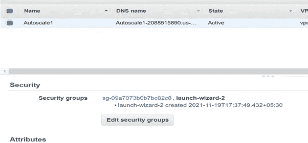

*   为了检查 auto-scale 的性能，让我们在站点上创建一些人工负载。这里有很多选项你可以找到[这里](https://geekflare.com/web-performance-benchmark/)。
*   我将使用 **Apache 基准测试**。我们将向 100 个并发用户发送 10000 个请求。结果将保存在 test1.txt 文件中。

```
ab -n 100000 -c 100 load_balancer_dns_name > test1.txt
```

*   它将产生 15–20%的 CPU 使用率。您可以将自动缩放 CPU 使用率参数更改为 10%，以便进行验证。
*   要检查 CPU 使用情况，请运行以下命令。哪个命令将显示每秒钟的 CPU 使用百分比

```
mpstat 1
```

如果你喜欢这篇文章，点击给我买杯咖啡！感谢阅读。

[](https://www.payumoney.com/paybypayumoney/#/147695053B73CAB82672E715A52F9AA5)

你的每一个小小的贡献都会鼓励我创造更多这样的内容。