# 使用基于注意力的 Seq2Seq 模型的自动建议，如 Gmail

> 原文：<https://medium.com/analytics-vidhya/autosuggestion-like-gmail-using-seq2seq-attention-model-2ee00c604304?source=collection_archive---------6----------------------->

# **目录:**

1.商业问题

2.数据采集

3.基础 EDA

4.数据预处理

5.了解基本编码器和解码器 N/W

6.定义我们的模型

7.模型比较

8.注意力模型简介

9.Flask API 上的最终部署

10.未来的工作

11.如何联系我

12.参考

# **1。业务问题**

2018 年，谷歌为 gmail 推出了智能撰写功能。用于帮助用户舒适地撰写各自的邮件，如下图所示。

目的是预测接下来的几个单词，从而在基于用户的初始单词实时编写的同时向用户提供建议。

# **2。数据采集:**

我们将在这项任务中使用的数据集是 Kaggle[https://www.kaggle.com/wcukierski/enron-email-dataset](https://www.kaggle.com/wcukierski/enron-email-dataset)上提供的“安然电子邮件数据集”。安然电子邮件数据集包含大约 500，000 封由安然公司员工生成的电子邮件。这是联邦能源管理委员会在调查安然公司倒闭时获得的。数据集采用制表符分隔文件的形式，如下所示:

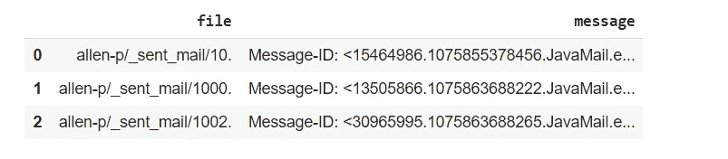

如上图所示，每条消息都由一个 file_id 引用。我们将使用 python 库“电子邮件”来进一步处理数据。

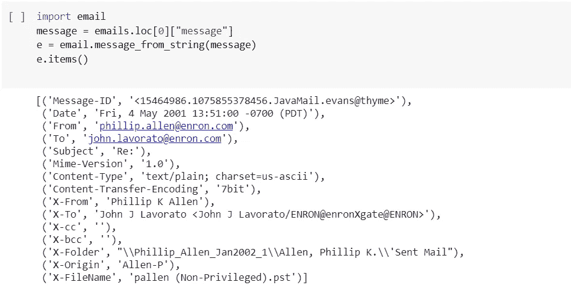

该消息包含所有细节，如消息 id、日期、发送者、接收者等。我们对从消息文件中提取消息部分感兴趣，为此我们将使用电子邮件库中的有效载荷函数。下面是一个消息示例。

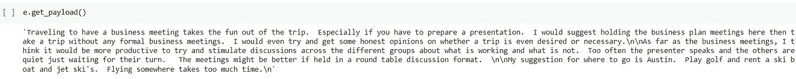

# **3。基础 EDA :**

为了更好地理解底层数据，我们将执行一些基本的 EDA 来收集一些关于数据的基本参数的信息。为了衡量安然员工之间分享的信息长度，我们将绘制一个信息长度分布图。

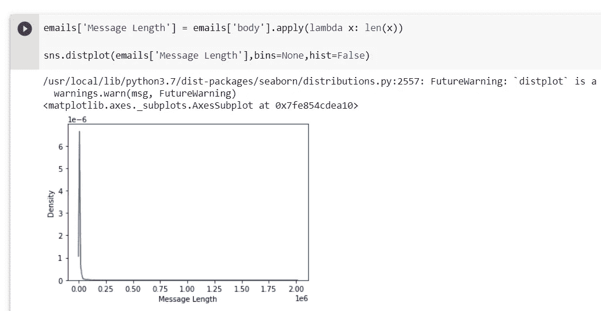

消息长度是右偏的，该图没有提供太多信息，因此我们将绘制 CDF 以获得更大的清晰度。

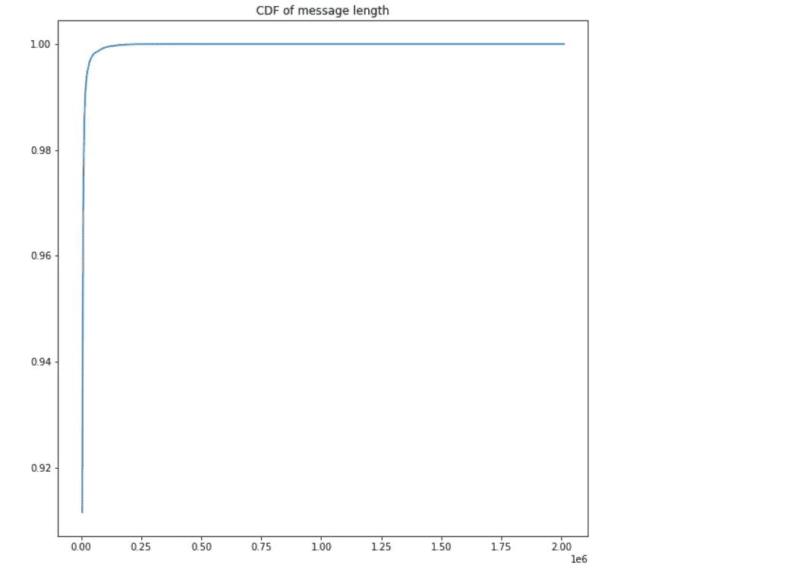

所以 99 %的消息长度都在 500k 以下。

下图显示了发送消息最多的员工。

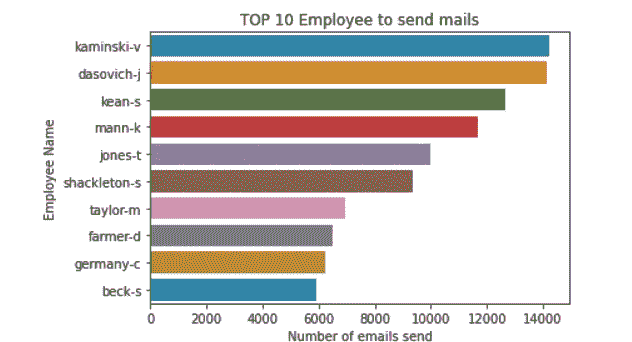

# **4。数据预处理:**

为了进一步处理，我们必须预处理电子邮件数据，因为数据中有许多特殊字符需要删除，以清理数据并将其转换为所需的格式，以便进一步处理。我们将使用下面的函数去压缩文本数据并清理它

最后，是时候以一种格式构建我们的数据，以提供给我们的编码器-解码器模型了

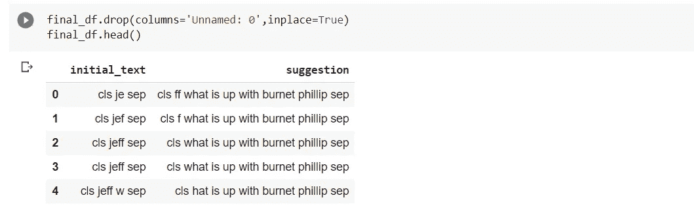

想法是预测标记为建议提供的初始文本的文本，其中“cls”和“sep”是开始和结束标记。现在，我们将继续对数据进行标记化。使用下面的代码片段。

# **5。了解基本编码器和解码器 N/W**

首先，我们将尝试使用简单的 seq2seq 编码器-解码器模型来完成下一个单词/句子预测的任务。让我们首先理解 seq2seq 模型背后的直觉

**5.1 编码器:**

*   编码器和解码器都是 LSTM 模型(或者有时是 GRU 模型)
*   编码器读取输入序列，并在所谓的**内部状态向量**或**上下文向量**中总结信息(在 LSTM 的情况下，这些被称为隐藏状态和单元状态向量)。我们丢弃编码器的输出，只保留内部状态。该上下文向量旨在封装所有输入元素的信息，以便帮助解码器做出准确的预测。
*   隐藏状态 *h_i* 使用以下公式计算:

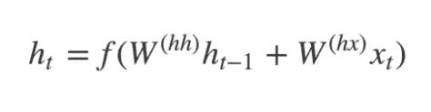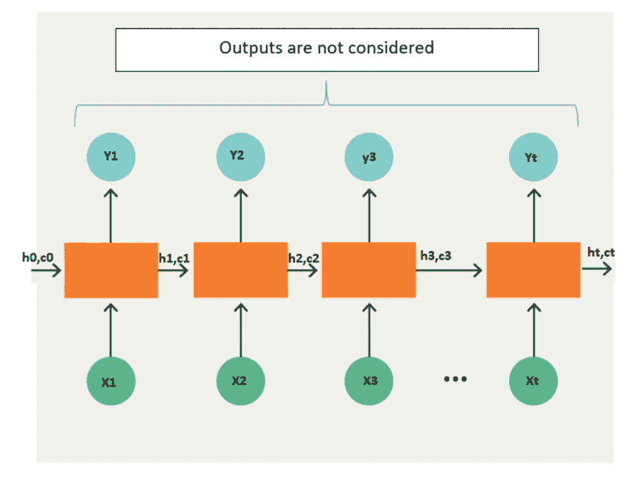

他 LSTM 一个接一个地读取数据。因此，如果输入是一个长度为“t”的序列，我们说 LSTM 以“t”个时间步长读取它。

1.Xi =时间步长 I 的输入序列

2.hi 和 ci = LSTM 在每个时间步长保持两种状态(“h”代表隐藏状态，“c”代表单元状态)。这些组合在一起，就是 LSTM 在时间步 I 的内部状态

3.Yi =时间步长 I 的输出序列。Yi 实际上是通过使用 softmax 激活生成的整个词汇的概率分布。因此，每个 Yi 是代表概率分布的大小为“vocab_size”的向量。

**5.2 解码器:**

*   解码器是 LSTM，其初始状态被初始化为编码器 LSTM 的最终状态，即编码器最终单元的上下文向量被输入到解码器网络的第一个单元。利用这些初始状态，解码器开始产生输出序列，并且这些输出也被考虑用于将来的输出。
*   几个 LSTM 单元的堆栈，其中每个单元在时间步长 t 预测一个输出 y_t
*   每个递归单元接受来自前一个单元的隐藏状态，并产生和输出它自己的隐藏状态。
*   任何隐藏状态 *h_i* 使用以下公式计算:

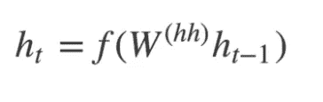

*   使用以下公式计算时间步长 *t* 的输出 *y_t* :

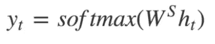

*   我们使用当前时间步长的隐藏状态以及相应的权重 W(S)来计算输出。 [Softmax](https://www.youtube.com/watch?v=LLux1SW--oM) 用于创建一个概率向量，该向量将帮助我们确定最终输出(如问答问题中的单词)。

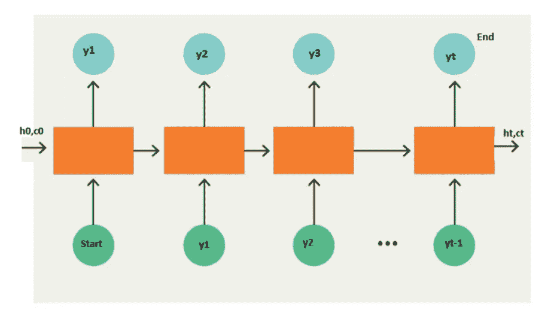

# **6。定义我们的模型**

现在，我们将编码器-解码器模型定义如下:

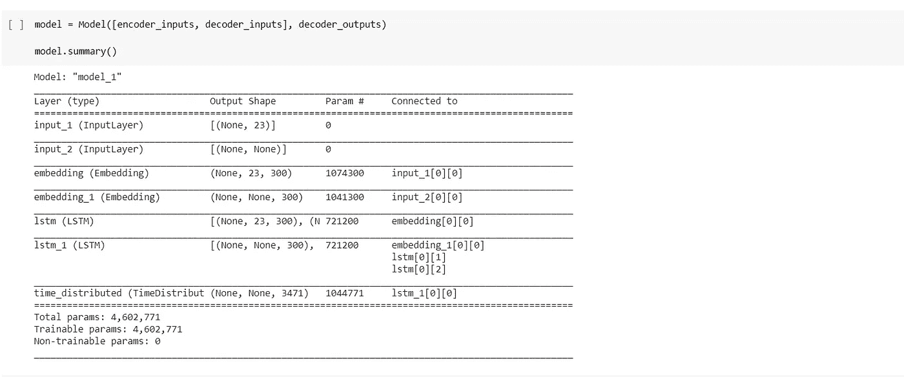

编码器 N/W 由一个嵌入层和一个 LSTM 层组成。编码器的输出状态作为初始状态传递给解码器。解码器 N/W 包括一个嵌入层、一个 LSTM 层和使用 softmax 激活的时间分布密集层，输出为 output_vocab_size。

在对模型进行了几个时期的训练后，现在是时候评估我们的模型了。为此，我们需要通过加载保存的编码器和解码器模型来构建推理模型

**损失图**

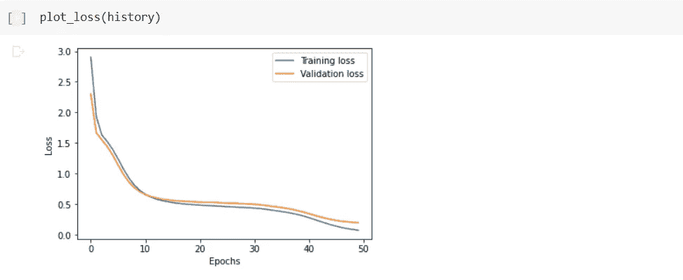

**6.1 训练模型的推理功能**

最后，我们定义我们的推理函数来预测我们的编码器-解码器模型的输出。

**预测 6.2 蓝分**

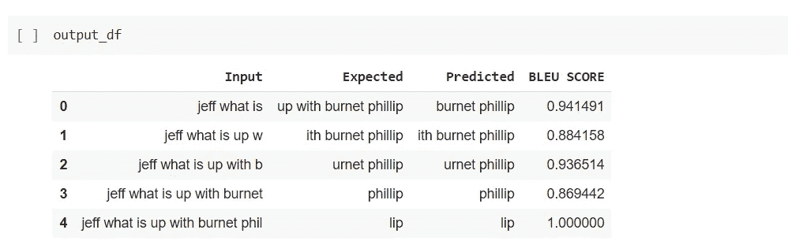

简单的编码器解码器模型做了一个体面的工作，就像上面看到的自动建议。但是简单的 seq2seq 模型在处理非常长的句子时有局限性，因此在这种情况下不是很健壮。为了克服这个缺点，我们将通过在我们的编码器-解码器模型中添加注意层来使用注意机制。

# **7。注意力模型简介:**

在注意机制中，编码器是双向 LSTM，而解码器是单向 LSTM。与仅将编码器的隐藏状态作为输入传递给解码器相反，我们传递由如下等式表示的上下文向量

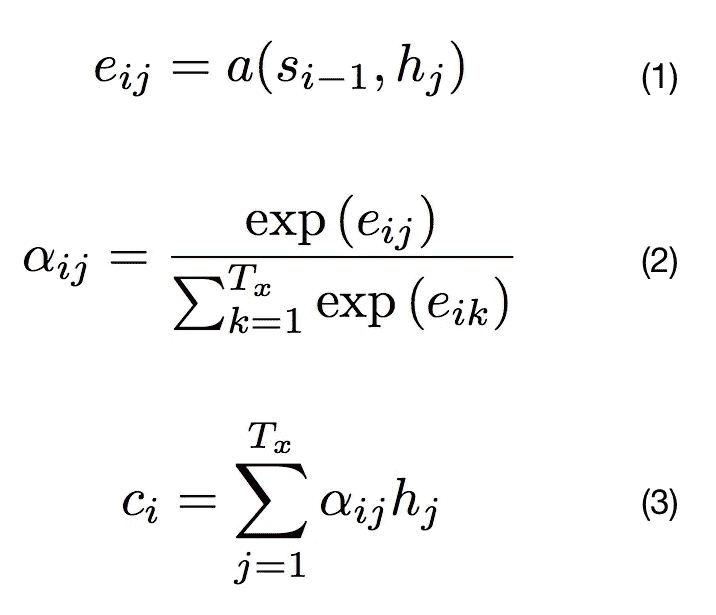

这里“ ***Ci*** ”是通过将编码器的隐藏状态“ ***hi*** ”与给定的“ ***alpha i*** ”相乘而生成的上下文向量，并且“ ***Tx*** ”是决定这样的词的数量以创建上下文向量的 hyper 参数。基本上，我们尝试创建一个单词窗口，它可能出现在我们的目标/输出单词之前或之后，如下图所示:

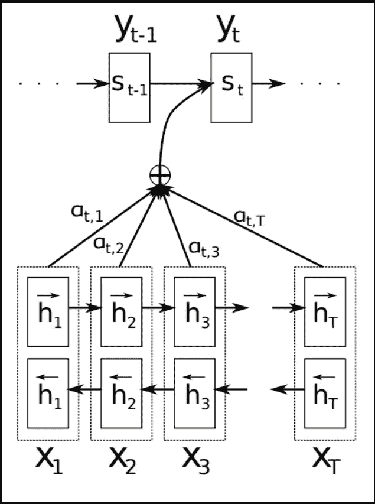

***【aplha I】***的值在 0 和 1 之间，由当前解码器的***【eij】***和***【St-1】***隐藏状态***【HJ’***给出。编码器架构如下所示:

编码器由一个 lstm 层和一个具有“glorot uniform”初始化的嵌入层组成。

解码器架构定义如下:

解码器架构由一个 Lstm 层、一个嵌入层和一个关注层组成。这里我们使用 tensorflow 插件库来定义我们的注意力层。我们在这个模型中使用了“休闲”注意力层。

# **8。型号对比:**

编码器-解码器模型和具有注意机制的编码器-解码器模型的比较如下:

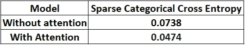

显然，注意力模型比没有注意力的模型好得多。我们将继续部署具有注意机制的模型。

# **9。烧瓶 API 的最终部署**

在对模型进行几个时期的训练并使用 **flask api** 将模型部署到我们的本地服务器上之后，模型的最终输出如下面的视频所示:

# **10。未来工作:**

我想用基于变压器的模型来训练数据。

# **11。如何联系我:**

我的 Linkedin 个人资料[**链接**](https://www.linkedin.com/in/akash-anande-it/) 和代码链接 [**Github 链接**](https://github.com/Akashaanande)

# **12。参考文献:**

[https://blog . keras . io/a-ten-minute-introduction-to-sequence-to-sequence-learning-in-keras.html](https://blog.keras.io/a-ten-minute-introduction-to-sequence-to-sequence-learning-in-keras.html)

[https://www . tensor flow . org/addons/tutorials/networks _ seq 2 seq _ NMT](https://www.tensorflow.org/addons/tutorials/networks_seq2seq_nmt)

[https://www . applied ai course . com/lecture/11/applied-machine-learning-online-course/4149/live-encoder-decoder-models/8/module-8-neural-networks-computer-vision-and-deep-learning](https://www.appliedaicourse.com/lecture/11/applied-machine-learning-online-course/4149/live-encoder-decoder-models/8/module-8-neural-networks-computer-vision-and-deep-learning)

[https://www . applied ai course . com/lecture/11/applied-machine-learning-online-course/4150/attention-models-in-deep-learning/8/module-8-neural-networks-computer-vision-and-deep-learning](https://www.appliedaicourse.com/lecture/11/applied-machine-learning-online-course/4150/attention-models-in-deep-learning/8/module-8-neural-networks-computer-vision-and-deep-learning)