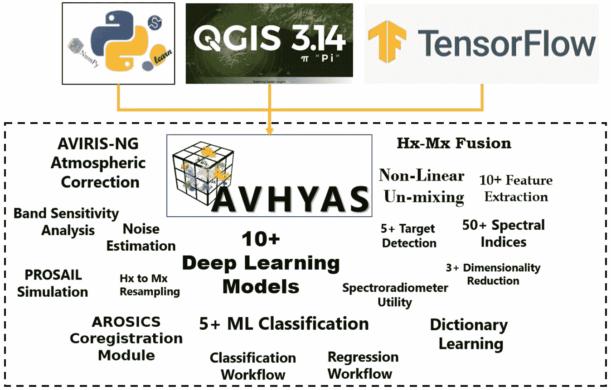
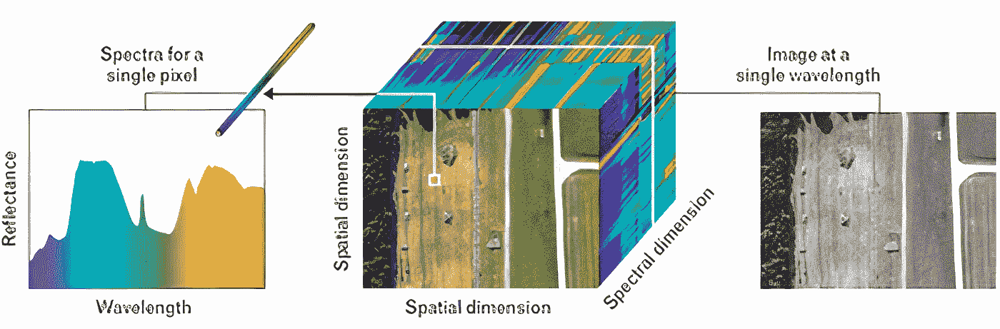
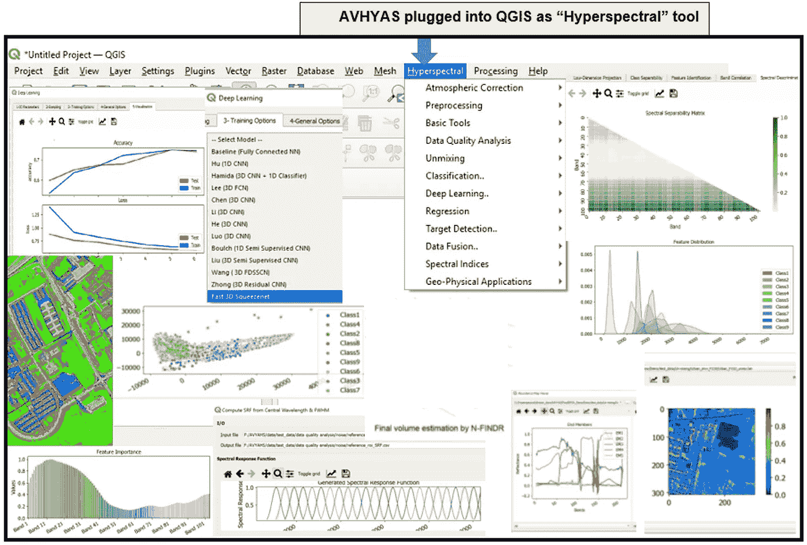

# AVHYAS:基于 Python 的 QGIS 插件，用于高级高光谱图像分析

> 原文：<https://medium.com/analytics-vidhya/avhyas-a-python-based-qgis-plugin-for-advanced-hyperspectral-image-analysis-f0931a906ac5?source=collection_archive---------0----------------------->

## **本文概述了高级高光谱数据分析软件(AVHYAS)插件，解释了使其成为高光谱遥感应用常用平台的主要功能和应用。**

高光谱遥感(HRS)是一种探测和监测地球表面生物物理特征的强大遥感手段。HRS 的成功应用包括监测农业区、森林、城市地区、冰雪、大气、内陆水域、海洋和其他自然生态系统。各种各样的方法被用于分析高光谱(Hx)数据(分类、物理化学性质估计、目标丰度估计、辐射传输建模等)。).然而，由于相邻波段之间的高度共线性(冗余信息),用于多光谱(Mx)遥感数据分析的方法不适用于高光谱数据处理。其他 difficulties 是高光谱数据的高维度、光谱混合、系统或非系统噪声和大气效应。因此，从 Hx 图像中提取信息需要复杂和高度计算密集型的数据处理和分析算法。

马诺拉基斯博士、马登博士和肖博士(2003 年)。自动目标探测应用的超光谱图像处理。*林肯实验室期刊*， *14* (1)

高级超光谱数据分析软件(AVHYAS)插件是一个基于 Python-3 的量子 GIS (QGIS)插件，旨在处理和分析超光谱(Hx)图像。从 1.0 版本开始，AVHYAS 作为一个免费的开源平台，在研究学者、科学家和潜在的最终用户之间共享和分发 Hx 数据分析方法。它的开发是为了保证充分利用现在和未来的 Hx 机载或星载传感器，并为 Hx 数据处理提供先进的算法。该软件免费提供，并提供了一系列基本和高级工具，如大气校正(用于航空图像)、标准处理工具以及用于 Hx 数据分析的强大机器学习和深度学习界面。

AVHYAS 的首要目标是为初学者和高级用户提供免费和用户友好的 Hx 数据处理高级方法。AVHYAS 集成到 QGIS 经典菜单中，以扩展其可用的应用范围。它也可用于任何 Mx 影像的特定应用。为了将机器学习方法有效地集成到 QGIS 环境中，采用了标准工作流。通过这种方式，实现的功能包括其他专有软件(例如 ENVI、ArcGIS)或非商业/开源软件(例如 EnMAP-Box)中可用的标准方法，以及标准软件中不可用的高级算法(例如基于 DL 的分类)(技术文档可在以下网站获得:[**【https://sites.google.com/view/avhyas-sac-isro/home】**](https://sites.google.com/view/avhyas-sac-isro/home))

# **关键功能**

1.  飞行数据的大气校正模块
2.  基本工具模块:它包含传感器效用、数据子集、光谱图、散点图、缩放和感兴趣区域(或类别)可分性分析等子模块。
3.  预处理模块:它包含子模块，如降维(DR)、通用实用程序(如去云)、特征提取、数据转换和 Savitsky-Golay-Filtering。
4.  数据质量分析模块:该模块可用于分析 Hx 图像在光谱和空间特征方面的质量。
5.  解混模块:解混模块对 Hx 图像执行端元提取和丰度估计。子模块包括材料计数、端元提取、丰度估计、基于稀疏的解混、交互式散点图可视化、解混结果的可视化以及解混误差分析。
6.  分类模块:有监督、无监督分类和分割
7.  深度学习模块:DL 模块由最先进的 DL 算法组成，用于 Hx 图像的分类。DL 的推理子模块提供了基于训练好的深度学习模型进行预测的接口。用户必须提供一个有效的 H5 文件，该文件包含正在训练的模型的权重和偏差(使用 AVHYAS)。分类工作流程的 UI 设计采用了 [EnMap-Box](https://enmap-box.readthedocs.io/en/latest/) 工具箱。模型性能以 html 报告的形式打印，评估报告将在默认浏览器中弹出。
8.  回归模块:该模块可用于评估目标材料的生物物理特性
9.  融合模块:包含用于配准的 [AROSICS](https://www.mdpi.com/2072-4292/9/7/676) 模块和用于 Hx-Mx 融合的融合模块。
10.  地球物理应用和光谱指数模块: [PROSAIL](https://enmap-box.readthedocs.io/en/latest/) 模拟模块(用于模拟植被光谱)配备了不同卫星有效载荷(包括印度卫星)的光谱响应功能。

关键功能

# 主要应用

亚像素矿物分类、农作物分类、农作物-森林健康监测、森林分类、高光谱数据质量检查、Hx-Mx 配准、目标生物物理属性(土壤属性、生物量、冠层叶绿素含量、水质等。)估计，目标识别(矿产，伪装等。)、Hx-mx 数据融合等。

> AVHYAS 不仅限于从机载或星载传感器获得的 HRS 数据，它还可以用于分析手持/桌面 Hx 相机获得的数据。此外，AVHYAS 成为一个不断发展的插件的机会很高，因为它可以灵活地集成不同 Hx 传感器的新算法和新的强大的 ML/DL 库。

# 结论

AVHYAS 集成了强大的机器学习和深度学习算法，以执行各种数据分析任务，从 Hx 数据中提取信息。AVHYAS 工具箱中纳入了基本和高级算法，旨在扩大印度的用户群体(在超光谱遥感领域),并为分析目前和未来的 Hx 成像传感器数据提供最强大的算法。因此，AVHYAS 插件的开发是由让多学科社区熟悉高级 Hx 图像分析算法的想法驱动的。它被用于培训学术界和研究界，以提供 Hx 图像分析的实践经验，并总是收到积极的回应。**av hyas 插件是由位于古吉拉特邦艾哈迈达巴德的印度空间研究组织(ISRO)的空间应用中心(SAC)开发的。**

## 参考:

*Lyngdoh，R. B .，Anand S. S .，Ahmad，t .，Rathore，P. S .，Mishra，m .，Gupta，P. K .，& Misra，A. (2021)。AVHYAS:用于高级超光谱图像分析的免费开源 QGIS 插件。 *arXiv 预印本 arXiv:2106.12776* 。*

## *下载网址:[https://sites.google.com/view/avhyas-sac-isro/home](https://sites.google.com/view/avhyas-sac-isro/home)*

****免责声明*** *:本文所表达的观点和意见仅代表作者个人观点，不一定反映印度政府任何机构的官方政策或立场。**

*作者:Anand S Sahadevan 博士[数据科学家，超光谱遥感]*