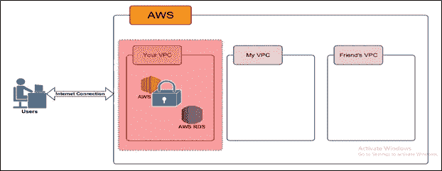

# AWS 高级架构

> 原文：<https://medium.com/analytics-vidhya/aws-high-level-architecture-42f049bae6f0?source=collection_archive---------2----------------------->

你一定在你周围的某个地方听说过这个词，在你的工作中，在你的课本中，或者在一些你没有学过的广告中。你有没有想过，它到底是什么？如果你用非常外行的语言问我，我会说，它只不过是安装在远处的一台巨大的计算机，我们可以通过互联网访问它并执行我们的工作。但是为什么会有这么多的讨论呢？让我们来了解一下！在我们继续之前，让我们了解一下什么是云。

**什么是云？**

云只不过是一台虚拟计算机，借助互联网连接，你可以随时随地访问它。这种云计算机将具有与本地系统(物理计算机)相同的所有功能，包括计算能力、存储容量、网络防火墙、数据库系统等。

例如，iCloud、dropbox、AmazonWebService (AWS)都使用云计算机或数据中心来存储数据，并可以随时通过互联网轻松访问。

**何以云？**

我们使用云有四大支柱，它们是:

**1。高可用性**

-配置的计算机及其周围的数据在用户需要时随时可用。假设用户想在手机上访问计算机及其数据，他们可以通过手机快速访问它。同时，如果用户希望通过其他地区的设备访问数据，用户可以在他们的系统上轻松获得数据。

**2。容错**

-容错与高可用性齐头并进。假设计算机停机或损坏，或者说由于自然灾害而损坏，一台新的计算机被配置为从以前的计算机中检索所有规范，并快速可供用户使用。

**3。可扩展性**

-如果由于某种原因，服务器的需求增加，云上的实例(服务器)会根据需求自动配置和添加。

**4。弹性**

如果由于某种原因用户数量减少，云(AWS)将有能力移除不再需要的服务器。它为使用云服务器的用户节省了大量资金。

**示例**

让我们举一个例子来解释云的所有四个支柱，比较本地服务器和云服务器。

假设一家软件公司“XYZ”正在为其用户使用本地服务器。2016 年，他们有 1000 个用户，2017 年增加到 5000 个用户，为用户增加更多服务器。最终在 2018 年，该公司预计大约。20000 名用户，因此他们配置了更多的服务器作为备份。由于某种原因，2018 年用户没有出现，只有 10000 名用户剩余额外的本地服务器未使用。但是该公司仍然需要为购买和安装时未使用的服务器付费。

现在，在云的情况下，服务器将根据需求进行添加。例如，如果在 2016 年配置了 2 台服务器，当 2017 年负载增加时，将会自动增加 2 台服务器。在 2018 年，根据用户数量增加的服务器很少。在这里，公司节省了未使用服务器的成本。

注意:利用云的另外两个特性是**备份和共享。**

**AWS 云服务**

AWS 是一家云服务提供商，俗称 Iaas(基础设施即服务)。它有一个服务池，包括计算能力、存储、数据库、网络、分析、开发工具、虚拟化、安全性、数据管理等。

**AWS 高层架构**

上图显示了 AWS 高级架构和服务的图示。用户借助活跃的互联网连接进入 AWS 环境并利用其服务。下面就来逐一讨论一下 AWS 最常用的服务及其应用。

**1。VPCs**

VPC 代表虚拟私有云，它是用户的私有部分，用户可以完全控制它。他们可以配置任何服务，如 RDS、S3、EC2(本文稍后讨论)与任何人共享，或者可以限制它们。总之用户可以完全控制这个云段。

**2。EC2 实例**

EC2 代表弹性计算云。它只不过是一台虚拟存在于 AWS cloud 中的基本计算机，您可以访问它，并做您在基本计算机上可以做的任何事情。在 AWS 云术语中，它通常被称为 EC2 实例。它拥有与计算机相同的所有东西，如用于处理的 CPU、操作系统(windows/Linux)、用于本地存储的硬盘、用于联网的网卡、防火墙安全、RAM 等。

例如，考虑网飞，一个先锋视频内容提供商使用 AWS 的 EC2 实例来托管他们的网站。当我们点击网飞网站时，它实际上被重定向到网站所在的 EC2 实例，并返回主页。

**3。RDS**

当用户登录你的网飞账户时会发生什么？这就是 AWS RDS 的用武之地。它存储客户帐户信息，如用户名，电子邮件，密码，信用卡帐户等。每当用户登录时，它与保存的凭证匹配，匹配后返回给 EC2 实例授权用户。它也有节目、剧集等的完整列表。

它还支持可伸缩性和弹性，方法是在负载增加时增加实例的数量，在流量减少时删除实例。内容提供商(在这种情况下是网飞)将不得不为 RDS 以及 EC2 和其他服务支付更少的费用，因为这是一种现收现付的系统。但是，对于内部部署的数据库和服务器，这是不可能的，而且还需要大量的时间进行设置。

**4。S3**

继续网飞的例子，网飞在一个可靠、安全和高度可用的巨大空间中一定有存储其数据的空间。这是 S3 在这个建筑中的照片。S3 是一个巨大的存储桶，几乎有无限的存储空间，用户可以保存任何类型(音频/视频/文本等)。)的文件/数据。当用户点击任何一集时，代码获取该特定集的数据，并将其转码到服务器，用户可以在他们的设备上看到内容。

我们可以说它是一个巨大的桶，任何东西都可以安全地存放在里面。它也是可共享的。用户将有它的完全访问权。

**无限存储“桶”**

之所以说它是无限的，是因为它非常庞大，联盟中没有其他公司能够与这个空间相匹配。

实现 S3 的另一个好例子是 drop box。这只是对 S3 存储实施的一个很好的形象化描述。文件实际上存储在 S3 存储桶中，并以一种良好的可视化方式呈现。

**为什么 AWS 比其他的好？**

**AWS** 对于从底层建立业务来说是**伟大的**，因为它为公司提供了启动云所需的所有工具。对于现有的公司，亚马逊提供低成本的迁移服务，以便您现有的基础设施可以无缝地迁移到 **AWS** 。AWS 为客户提供高可用性和可伸缩性的低成本服务。它还提供多种多样的迁移服务，这些服务灵活且与其他平台兼容。