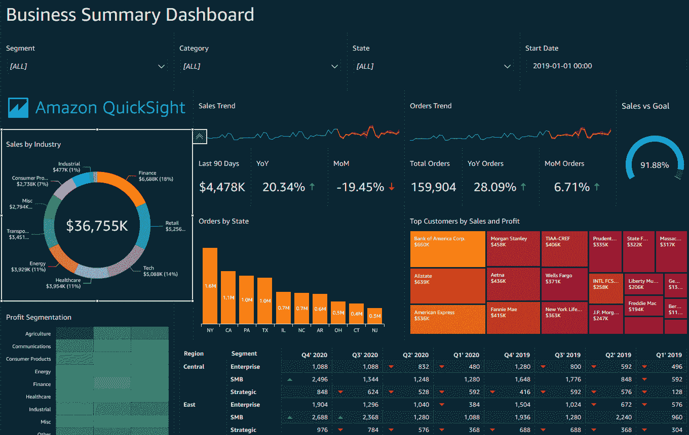

# AWS Quicksight:概述和优势

> 原文：<https://medium.com/analytics-vidhya/aws-quicksight-overview-and-benefits-7fa5f18a661e?source=collection_archive---------13----------------------->

[斯科特·格雷厄姆](https://unsplash.com/@homajob?utm_source=medium&utm_medium=referral)在 [Unsplash](https://unsplash.com?utm_source=medium&utm_medium=referral) 上拍照

# 介绍

数据是 21 世纪的新石油。我们现在生活在一个数字化的世界里，我们的每一个动作都以某种形式被记录下来。你在谷歌上搜索的最佳度假目的地？记录在案。在脸书上评论朋友的照片？记录在案。还有你在亚马逊上订的那本很棒的自助书？记录在案。对于企业来说，利用这些数据来改善服务是非常明智的。但大多数开始处理数据的公司面临的最大问题是:如何处理？你如何利用你收集的大量数据？这就是商业智能(BI)的用武之地。商业智能是一套用于收集商业数据并将其转化为有用见解的策略和技术。有相当多的 BI 工具可以让你做到这一点。Tableau，Power BI，Qlik，AWS Quicksight 等。是一些您可以使用的商业智能工具。还有很多其他的工具。本文旨在让您熟悉一个不太流行但功能强大的选项，AWS Quicksight。

如果你有兴趣学习更多的商业智能，你可以[看看这个](https://praneethvasarla.com/7-reasons-why-business-intelligence-bi-is-crucial/)。

# 什么是 AWS Quicksight？

来源: [AWS Quicksight](https://aws.amazon.com/quicksight/)

亚马逊网络服务(AWS)在云计算行业并不是一个新名字。AWS 是你需要的几乎所有云服务的大型提供商之一。但直到 2016 年，AWS 才发布了其商业智能服务 Quicksight。AWS Quicksight 在商业智能行业中相对较新，但功能非常强大。AWS Quicksight 值得考虑，因为它的价格相对较低，易于安装，等等。所以，事不宜迟，让我们看看使用 AWS Quicksight 的好处。

# 使用 AWS Quicksight 的主要优势

## 1.出色的数据兼容性

照片由 [israel palacio](https://unsplash.com/@othentikisra?utm_source=medium&utm_medium=referral) 在 [Unsplash](https://unsplash.com?utm_source=medium&utm_medium=referral) 上拍摄

AWS Quicksight 对不同的数据源有很大的支持。它可以访问互联网上几乎任何数据源的数据，甚至可以访问 CSV 文件(逗号分隔文件)。此外，Quicksight 对 S3、RDS、极光、红移、DynamoDB、Kinesis 等自动气象站数据源有很大的支持。

## 2.高性能 SPICE 引擎

格伦·惠勒在 [Unsplash](https://unsplash.com?utm_source=medium&utm_medium=referral) 拍摄的照片

Quicksight 提供的一个很棒的特性是它光滑流畅的 SPICE 引擎。SPICE 是亚马逊 Quicksight 的超快速、并行、内存计算引擎。SPICE 旨在快速执行高级计算。使用 SPICE，您可以超快地获取数据，并快速执行一些高度复杂和高级的计算。

## 3.非常容易接近

照片由[陈茂三潭](https://unsplash.com/@tranmautritam?utm_source=medium&utm_medium=referral)在 [Unsplash](https://unsplash.com?utm_source=medium&utm_medium=referral) 拍摄

AWS Quicksight 的另一个伟大特性是它在多种设备上的出色兼容性和访问能力。它的专用移动应用程序允许您在旅途中访问仪表盘。Quicksight 还使您能够将仪表板嵌入到自己的应用程序中，这被证明是非常方便的，尤其是如果您的企业使用中央管理面板，您可以在其中控制所有的业务操作。您的 Quicksight 仪表盘可以无缝集成到您自己的应用程序中，使您无需登录 AWS 控制面板即可访问仪表盘。

## 4.学习曲线

由 [Unsplash](https://unsplash.com?utm_source=medium&utm_medium=referral) 上的[窗口](https://unsplash.com/@windows?utm_source=medium&utm_medium=referral)拍摄的照片

与该领域的其他工具相比，Quicksight 因其直观的界面而非常容易上手。事实上，它在无服务器架构上工作，使您能够快速设置并立即开始使用它，而不必担心维护服务器。还有详细的文档说明一切是如何工作的，这样万一遇到困难，你就知道去哪里找了。它的界面非常用户友好，使得创建仪表板的过程非常无缝。

## 5.智能和交互式可视化

[粘土银行](https://unsplash.com/@claybanks?utm_source=medium&utm_medium=referral)在 [Unsplash](https://unsplash.com?utm_source=medium&utm_medium=referral) 拍摄的照片

尽管在商业智能市场上是一个相对较新的参与者，AWS Quicksight 拥有您可能需要的所有类型的可视化。也就是说，AWS 正在积极地为平台带来新的可视化。使用该工具创建的所有可视化效果都是交互式的。SPICE 引擎还有一个名为“Auto Graph”的功能，它通过分析后端数据集来建议最佳的可视化类型。

## 6.数据警报

[摄粘土堤](https://unsplash.com/@claybanks?utm_source=medium&utm_medium=referral)上[的 Unsplash](https://unsplash.com?utm_source=medium&utm_medium=referral)

在管理一家企业时，全天跟踪所有重要指标几乎是不可能的。无论是通过 web 应用程序、移动应用程序，还是从您自己的应用程序，您都无法一直登录到仪表板。AWS Quicksight 的数据警报在这种情况下会派上用场。Quicksight 会监控您的 KPI，并在达到特定阈值时提醒您。这在你的周销售额下降或者当天的订单数量相对较低的情况下特别有用。在这种情况下，你可能想检查一下你的网站是否有问题。尽管如此，这些数据警报可以让您持续监控业务的健康状况。

## 7.可量测性

Liam Spradlin 在 [Unsplash](https://unsplash.com?utm_source=medium&utm_medium=referral) 上的照片

您可以在几乎每个业务领域使用 AWS Quicksight，从电子商务到制造业以及介于两者之间的所有领域。Quicksight 还可以扩展到成千上万的用户，他们可以同时独立地工作和访问所有数据源。数据源的这种实时并行使用不会影响性能。

## 8.低成本

照片由[米歇尔·亨德森](https://unsplash.com/@micheile?utm_source=medium&utm_medium=referral)在 [Unsplash](https://unsplash.com?utm_source=medium&utm_medium=referral) 上拍摄

与市场上的其他商业智能工具相比，AWS Quicksight 的价格相对较低。它遵循行业首创的按会话付费的计费方法，根据您使用的会话数量向您收费。因此，你不用每月支付固定的许可费，而是只为你使用的东西付费。您可以在此找到有关 AWS Quicksight 定价的更多详细信息。

# 为什么 Quicksight 要优于 Tableau 或 Power BI 等其他工具？

因此，最终的问题是，为什么你需要使用 AWS Quicksight，而不是其他流行和成熟的商业智能工具，如 Tableau 或 Power BI。答案归结为你的具体需求和预算。以下是您应该考虑 AWS Quicksight 优于其他工具的几个原因。

1.  AWS Quicksight 与其他 AWS 产品配合非常好。如果您的组织主要依赖 AWS 服务，那么 Quicksight 肯定是您应该考虑的，因为它可以与其他 AWS 服务无缝集成，并且也符合计费要求。
2.  如果您的商业智能预算有限，您应该考虑将 Quicksight 作为一个选项，因为它的价格相对合理，而且不会损失太多功能。
3.  与其他工具不同，AWS Quicksight 相对来说非常容易设置。你只要注册就可以了。如果你需要可以立即使用的东西，AWS Quicksight 绝对值得考虑。

# 最后的想法

AWS Quicksight 仍处于初始阶段，并承诺在未来提供更好、更方便的功能。如果你已经在其他 AWS 服务如 RDS、Kinesis 等领域有大量业务。你一定要试试 AWS Quicksight。即使您没有 AWS 的其他服务，但需要一个负担得起但可靠的商业智能工具，Quicksight 也是一个很好的选择。

【praneethvasarla.com】[*这篇文章最初发表在我的博客上*](https://praneethvasarla.com/aws-quicksight-overview-and-benefits/)

我定期在我的博客上发表文章，如果你觉得这篇文章有帮助，你也会想看看我的[网站](https://praneethvasarla.com/)！