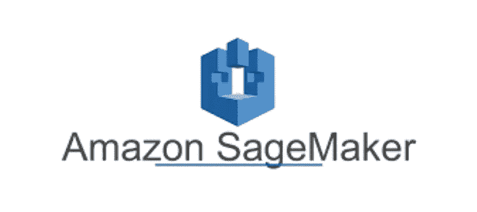
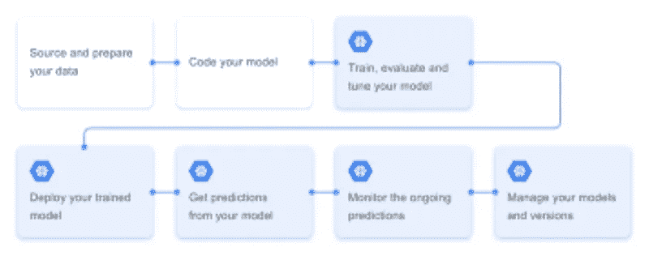
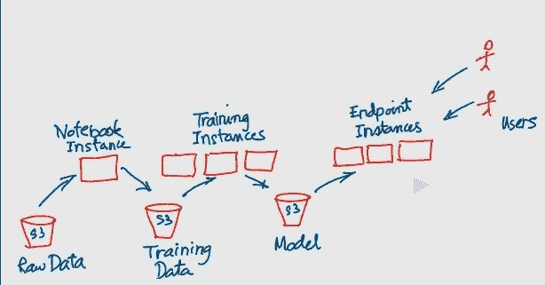

# AWS Sage Maker 基础知识:初学者指南

> 原文：<https://medium.com/analytics-vidhya/aws-sage-maker-fundamentals-beginners-guide-2b796702798d?source=collection_archive---------12----------------------->

在深入研究 Sage Maker 之前，让我们先了解一下 AWS 和它提供的服务，以及为什么公司使用这些云服务(AWS、Azure、Google Cloud)。因此，让我们开始了解 AWS。

# 自动警报系统

> **亚马逊网络服务** ( **AWS** )是一种云服务，它向个人、公司和政府提供随需应变的云计算平台和 API，采用按量付费的方式。

# AWS 提供的服务:-

计算、存储、数据库、分析、网络、移动、开发人员工具、管理工具、IOT、安全和企业应用。

# hy 公司使用这些类型的服务？

> 现在让我告诉你为什么不同的公司和政府需要使用这些服务。假设您是一名数据科学家，在一家公司工作，该公司有许多并行项目。考虑到在一些项目中，您需要获得高端 GPU 的需求，我们知道每次我们都无法获得新的硬件(GPU ),因为高端 GPU 非常昂贵。
> 
> 因此，公司所做的就是使用云服务，如 Azure、AWS、Google Cloud 等。这些云服务所做的是，他们提供使用基于云的高端 GPU，如( **NVIDIA** K80，P100，P4，T4，V100)，以非常低的成本使用这些服务，您可以在系统中没有实际 GPU 的情况下执行这些任务，或者即使您的 GPU 很弱，您也可以使用这些服务。

现在，我们对 AWS 和它提供的服务以及为什么各种公司和政府需要使用这些服务有了一些基本的了解，所以现在让我们深入了解 AWS Sage Maker。

# 什么是亚马逊鼠尾草制造商

> 亚马逊 Sage Maker 是一个完全托管的机器学习服务。与 Sage-Maker 数据科学家和开发人员一起，通过整合一系列专门为机器学习构建的功能，快速准备、构建、训练和部署高质量的机器学习(ML)模型

## 贤者创客解决什么问题？

在过去，从事机器学习的人需要收集数据，准备数据，清理数据，将数据分成训练集和测试集，为用例选择正确的模型，最后部署模型。正如我们所见，这是一个耗时的过程。

> 现在 Sage Maker 开始发挥作用，它自动执行任务，即(收集数据以部署模型)。它所做的是自动分析数据，即我们的“训练数据”，它自动将数据分为训练集和测试集，并使用这些数据来训练模型。Sage Maker 也有内置算法，这些算法是针对万亿字节的数据进行训练的！！。这也是一个耗时较少的过程。

# 鼠尾草制造者提供的服务

Sage Maker 提供三种类型的服务

1 .**笔记本实例**运行 Jupyter 笔记本，用于清理和理解数据。这消除了配置和设置笔记本电脑环境的需要。

(有趣的是，我们大多数人都不知道 Jupyter 这个词的实际意思是什么。意思是“Julia，python 和 r ”,这是 Jupyter 笔记本最初支持的三种语言，这就是 Jupyter 这个名字的由来！！)

2.它提供了**训练实例**，利用这些数据我们可以训练模型。

3.它提供了**端点实例**用于使用模型产生推论。

## 现在让我们理解这些词的意思，即(训练实例、终点、推论)

1.  **训练实例** :-这是一个运行硬件(CPU)的服务器，它被实现为软件，运行在多台计算机之上。Sage -Maker 允许我们使用这些实例(运行计算机的服务器),在这些实例中，我们可以用数据来训练模型。根据您的要求，有许多实例可供您选择。有些情况是地区特有的。一些实例是-(ml.t3.medium，ml.t3.large 以及更多)。实例越高，计算量越大，价格也越贵。

2.**端点:-** 要以编程方式连接到 AWS 服务，可以使用端点。一个*端点*是 AWS web 服务入口点的 URL(已部署模型的 URL)。

3.**推理:-** 推理是使用训练好的模型进行预测的过程。

# 让我们看看数据是如何通过 Sage Maker 流动的

最初，原始数据出现在 S3 存储桶中( **S3 存储桶是一个存储位置，我们可以在其中存储我们的数据、不同的 ML、DL 模型等等)**。笔记本实例可用于分析这些原始数据，并对其进行可视化和清理。一旦数据被清除，它将作为训练数据再次存放在 S3。一旦它作为训练数据在 S3 登台，训练实例就可以消费它并使用它来产生机器学习。

机器学习模型也存储在 S3。一旦训练实例产生了模型并将其存储在 S3 中，则端点实例可以使用该模型并可以使用它来为用户产生推断。该模型现在存储在 S3，因为用户请求端点实例。端点实例使用模型来产生用户数据点的结果。

## 我希望这有助于您了解 AWS Sage Maker 的基础知识

如果你从中有所收获，请为这本 AWS & Sage Maker 基础入门指南鼓掌。

让我们一起潜入云、人工智能、机器学习和深度学习的世界

联系我:- [Linkedin](https://www.linkedin.com/in/parth-singh-7866511a0/)