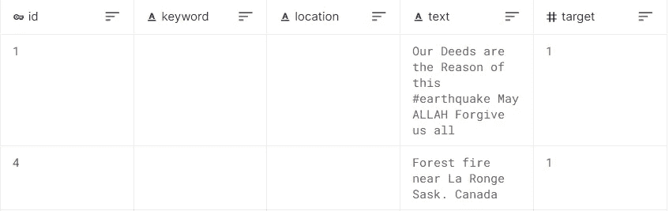

# AWS SageMaker:训练、部署和更新拥抱脸 BERT 模型

> 原文：<https://medium.com/analytics-vidhya/aws-sagemaker-train-deploy-and-update-a-hugging-face-bert-model-eeefc8211368?source=collection_archive---------0----------------------->

#拥抱脸#AWS #BERT #SageMaker #Mlops

诸如 [tf-idf](https://en.wikipedia.org/wiki/Tf%E2%80%93idf) 、 [word2vec](https://en.wikipedia.org/wiki/Word2vec) 或 [bag-of-words (BOW)](https://en.wikipedia.org/wiki/Bag-of-words_model) 的 NLP 技术用于生成可用于训练文本分类模型的词嵌入特征。他们在许多 NLP 任务中非常成功，但是当单词出现在不同的上下文中时，他们并不总是准确地捕捉单词的意思。

我们在文本分类任务中借助 [BERT](https://arxiv.org/abs/1810.04805) 取得了更好的结果，因为它能够更准确地编码不同上下文中单词的含义。

[亚马逊 SageMaker](https://docs.aws.amazon.com/sagemaker/index.html) 使开发人员能够在云中创建、训练、部署和监控机器学习模型。


图片来自 [AWS](https://aws.amazon.com/)

**目录**

1.  问题陈述
2.  目标
3.  资料组
4.  亚马逊 SageMaker 培训
5.  用于 SageMaker 模型训练的 AWS 实例类型
6.  使用按需实例的模型训练
7.  使用 spot 实例的模型训练
8.  SageMaker 端点上的模型部署
9.  更新 SageMaker 模型端点
10.  结论和参考文献

请注意，这篇文章的目的不是建立一个健壮的模型，而是如何在 SageMaker 上训练一个 HuggingFace BERT 模型。让我们详细介绍一下每个步骤。

**1。问题陈述**

推特已经成为紧急时刻的重要沟通渠道。智能手机的普及使人们能够实时宣布他们正在观察的紧急情况。正因为如此，越来越多的机构对有计划地监控 Twitter 感兴趣(即救灾组织和新闻机构)。

更多详情[此处](https://www.kaggle.com/c/nlp-getting-started/overview)。

**2。目标**

Kaggle 竞赛数据集，由关于灾难的虚假和真实推文组成。任务是对推文进行分类。

**3。数据集**

[数据集](https://www.kaggle.com/competitions/nlp-getting-started/data?select=train.csv)由贴有标签的虚假和真实推文组成。标签在“目标”栏中提供。有几个特征，尽管为了这篇博文的目的，我们将只使用“文本”字段来表示推文的文本。



图片来自 Kaggle 数据集(作者截图)

请参考本 [git repo](https://github.com/Vinayaks117/AWS-SageMaker-Examples.git) 以及数据准备和 EDA。让我们专注于使用 AWS SageMaker 训练一个 HuggingFace BERT 模型。

**4。亚马逊 SageMaker 培训**


图片来自 [AWS](https://aws.amazon.com/)

*   当 SageMaker 培训作业开始时，SageMaker 准备实例(在本文中使用“ml.m5.xlarge”实例)进行培训。
*   SageMaker 从亚马逊 S3 下载或读取输入数据，使用这些数据来训练模型。
*   SageMaker 从 Amazon Elastic Container Registry(`ECR`)提取模型训练实例容器(在本文中使用 Pytorch 容器，但我们也可以使用 HuggingFace 和 TensorFlow 容器)，然后来自 S3 的训练数据可用于模型训练实例容器，请参见[预构建的 SageMaker Docker 深度学习图像](https://docs.aws.amazon.com/sagemaker/latest/dg/pre-built-containers-frameworks-deep-learning.html)。
*   一旦模型训练完成，模型训练作业就将模型工件保存回训练作业配置中指定的输出 S3 位置。
*   当我们准备好部署一个模型时，SageMaker 创建新的 ML 实例(在本文中使用“ml.m4.xlarge”实例)，从 ECR 中提取模型推理容器(使用 Pytorch 容器),然后从 S3 中提取这些模型工件以用于实时模型推理。

**5。SageMaker 上用于模型训练的 AWS 实例类型:**

让我们了解一下可以在 AWS SageMaker 上用于模型训练的 AWS 实例的类型。

**答:按需实例:**

*   我们告诉 AWS SM (SageMaker)我们需要哪种 EC2 实例类型以及它们的数量，然后按需创建适当的实例，一旦训练工作完成，就自动配置和终止。
*   按需实例在我们需要时可用，我们需要按小时支付使用时间的费用。
*   按需实例保持不间断，直到我们终止实例或培训作业完成。

**b. Spot 实例:**

*   这是一种对闲置 EC2 实例(空闲容量)的拍卖/投标。
*   如果我们的投标价格≥市场(现货)价格(根据需求和供应实时变化)，那么将启动现货实例。
*   如果空闲容量耗尽或现货价格变得高于投标价格，那么现货实例在通知或警告的 2 分钟内被终止。
*   与在 AWS SageMaker 中使用按需实例相比，EC2 spot 实例帮助我们降低了高达 90%的机器学习培训成本。

**6。使用按需实例的模型训练**

让我们专注于使用 AWS SageMaker 按需实例训练 HuggingFace BERT 模型。

**模型训练脚本**

我们使用 [PyTorch-Transformers 库](https://pytorch.org/hub/huggingface_pytorch-transformers)，它包含 PyTorch 实现和许多 NLP 模型的预训练模型权重，包括 BERT。

我们的训练脚本应该将在训练期间学到的模型工件保存到一个名为`model_dir`的文件路径中，正如 SageMaker PyTorch 映像所规定的那样。培训完成后，保存在`model_dir`中的模型工件将由 SageMaker 上传到 S3，并可在 S3 进行部署。

我们将这个脚本保存在一个名为`train_deploy.py`的文件中，并将该文件放在一个名为`code/`的目录中。完整的训练脚本可以在`code/`下查看。

让我们看看离`train_deploy.py`几个街区的地方

**导入必要的库**

**定义记录器并加载 BERT 记号赋予器**

众所周知，PyTorch 提供了一个解决方案，通过使用 DataLoader 的自动批处理来并行化数据加载过程。Dataloader 用于并行加载数据，因为这样可以提高速度并节省内存。让我们来训练和测试数据加载器。

**获取列车数据加载器**

**获取测试数据加载器**

**定义、训练 BERT 模型并保存微调后的模型**

**使用亚马逊 SageMaker 上的按需实例进行模型训练**

Amazon SageMaker Python SDK 使得在 Amazon SageMaker 中使用 PyTorch 估计器运行 PyTorch 脚本变得更加容易。

首先，我们使用`PyTorch`估计器类来训练我们的模型。在创建我们的评估者时，我们确保指定一些事情:

*   我们 PyTorch 脚本的名字。它包含我们的训练脚本，该脚本从输入通道加载数据，用超参数配置训练，训练模型，并保存模型。它还包含在推理过程中加载和运行模型的代码。
*   `source_dir`:我们的培训脚本和 requirements.txt 文件的位置。“requirements.txt”列出了您想在脚本中使用的包。
*   `framework_version`:我们要用的 PyTorch 版本

创建评估器后，我们调用 fit()，启动一个训练作业。我们使用亚马逊 S3 URIs，在那里我们上传了训练数据。


图片来自 [AWS](https://aws.amazon.com/)

此时，SageMaker 将使用 AWS ECR 中提供的内置 PyTorch Docker 映像创建 ml.m5.xlarge 培训实例。然后，它将从 S3 bucket 下载数据和配置文件到 SageMaker 实例，并开始训练作业。

**创建一个评估对象，开始按需实例训练**

我们可以通过查看下面的*Amazon sage maker>Training jobs*来监控我们培训工作的状态。


培训工作(作者截图)

我们应该看到类似于下面的日志，让您了解培训工作的状态。日志显示在笔记本中，也可以在 AWS CloudWatch 日志中找到，以供将来参考。

```
2022-05-14 09:13:19 Starting - Starting the training job...
2022-05-14 09:13:42 Starting - Preparing the instances for trainingProfilerReport-1652519599: InProgress
......
2022-05-14 09:14:42 Downloading - Downloading input data...
2022-05-14 09:15:02 Training - Downloading the training image...
2022-05-14 09:15:50 Training - Training image download completed. Training in progress...
.........
.........
.........
Train Epoch: 1 [0/5709 (0%)] Loss: 0.752307
INFO:__main__:Train Epoch: 1 [0/5709 (0%)] Loss: 0.752307
Train Epoch: 1 [3200/5709 (56%)] Loss: 0.518363
INFO:__main__:Train Epoch: 1 [3200/5709 (56%)] Loss: 0.518363
Average training loss: 0.473186
INFO:__main__:Average training loss: 0.473186
Test set: Accuracy: 0.825221
INFO:__main__:Test set: Accuracy: 0.825221Train Epoch: 2 [0/5709 (0%)] Loss: 0.367052
INFO:__main__:Train Epoch: 2 [0/5709 (0%)] Loss: 0.367052
Train Epoch: 2 [3200/5709 (56%)] Loss: 0.313773
INFO:__main__:Train Epoch: 2 [3200/5709 (56%)] Loss: 0.313773
Average training loss: 0.356163
INFO:__main__:Average training loss: 0.356163
Test set: Accuracy: 0.824115Saving tuned model.
INFO:__main__:Test set: Accuracy: 0.824115
INFO:__main__:Saving tuned model.
2022-05-14 10:15:36,540 sagemaker-training-toolkit INFO     Reporting training SUCCESS

2022-05-14 10:16:16 Uploading - Uploading generated training model
2022-05-14 10:17:16 Completed - Training job completed
ProfilerReport-1652519599: NoIssuesFound
Training seconds: 3755
Billable seconds: 3755
```

我们使用 SageMaker 训练了一个具有 2 个时期的 BERT 模型来演示模型训练，我们看到测试集上的准确率为 82.41%，完成模型训练所需的时间为 3755 秒，因此我们只需支付 3755 秒。

我们肯定可以通过使用基于 GPU 的实例来改善这一时间，由于我的 AWS 自由层帐户的资源限制，我尝试了基于 CPU 的实例。

**7。使用 spot 实例的模型训练(托管 Spot 训练)**

*   如前所述，使用 spot 实例的模型训练可以优化训练模型的成本，比按需实例高 90%。SageMaker 代表我们管理现场中断。
*   管理现场培训在所有培训配置中都可用:单实例培训、分布式培训和自动模型调整
*   如果我们需要更多的容量并需要自己采取行动，EC2 spot 实例可以被中断或在任何时候被要求。中断导致培训工作需要更长时间开始或完成。
*   别担心，AWS SageMaker 是一个完全托管的服务，它会自动处理流程。

```
. Interrupting the training job
. Obtaining adequate spot capacity again
. Either restarting or resuming the training job
```

*   当 spot 实例被中断时，我们需要使用检查点来避免从头开始训练作业。

**管理现场培训参数:**

a.use_spot_instances = True

b.max_run =培训作业应该运行多长时间。

c.max_wait =训练作业的总持续时间=训练时间+我们准备等待 spot 实例可用的时间。

**创建一个评估对象，并开始受管理的现场培训**

再来看模特培训的现状。

```
2022-05-14 12:15:48 Starting - Starting the training job...
2022-05-14 12:15:49 Starting - Launching requested ML instancesProfilerReport-1652530547: InProgress
......
2022-05-14 12:17:14 Starting - Preparing the instances for training.........
2022-05-14 12:18:42 Downloading - Downloading input data...
2022-05-14 12:19:08 Training - Training image download completed. Training in progress.
.........
.........
.........
Train Epoch: 1 [0/5709 (0%)] Loss: 0.752307
INFO:__main__:Train Epoch: 1 [0/5709 (0%)] Loss: 0.752307
Train Epoch: 1 [3200/5709 (56%)] Loss: 0.518363
INFO:__main__:Train Epoch: 1 [3200/5709 (56%)] Loss: 0.518363
Average training loss: 0.473186
INFO:__main__:Average training loss: 0.473186
Test set: Accuracy: 0.825221
INFO:__main__:Test set: Accuracy: 0.825221Train Epoch: 2 [0/5709 (0%)] Loss: 0.367052
INFO:__main__:Train Epoch: 2 [0/5709 (0%)] Loss: 0.367052
Train Epoch: 2 [3200/5709 (56%)] Loss: 0.313773
INFO:__main__:Train Epoch: 2 [3200/5709 (56%)] Loss: 0.313773
Average training loss: 0.356163
INFO:__main__:Average training loss: 0.356163
Test set: Accuracy: 0.824115Saving tuned model.
INFO:__main__:Test set: Accuracy: 0.824115
INFO:__main__:Saving tuned model.
2022-05-14 12:55:39,669 sagemaker-training-toolkit INFO     Reporting training SUCCESS

2022-05-14 12:55:53 Uploading - Uploading generated training model
2022-05-14 12:56:54 Completed - Training job completed
ProfilerReport-1652530547: NoIssuesFound
Training seconds: 2282
Billable seconds: 508
Managed Spot Training savings: 77.7%
```

在上一步中，我们使用具有 2 个时期的按需实例训练了一个 BERT 模型，完成模型训练花费了 3755 秒，计费秒数= 3755。

通过查看上面的日志，托管 spot 实例培训在 2282 秒内完成，计费秒数= 508。

哇..有管理的现场培训可以节省高达 77.7%的培训成本

**8。SageMaker 端点上的模型部署**

在训练我们的模型之后，我们在 Amazon SageMaker 端点上托管它。为了让端点加载模型并提供预测，我们在`train_deploy.py`中实现了一些方法。

*   `model_fn()`:定义的函数，用于加载保存的模型，并返回一个可用于模型服务的模型对象。SageMaker PyTorch 模型服务器通过调用 model_fn 来加载我们的模型。
*   `input_fn()`:解串并准备预测输入。在这个例子中，我们的请求体首先被序列化为 JSON，然后被发送到模型服务端点。因此，在`input_fn()`中，我们首先反序列化 JSON 格式的请求体，并将输入作为`torch.tensor`返回，这是 BERT 所要求的。
*   `predict_fn()`:进行预测并返回结果。

为了部署我们的端点，我们调用 PyTorch 估计器对象上的`deploy()`,传入我们想要的实例数量和实例类型:

```
predictor **=** estimator**.**deploy(initial_instance_count**=**1, instance_type**=**"ml.m4.xlarge")
```

estimator.deploy()方法在后台做 3 件事。

a.在 sagemaker 上注册一个模型:为模型定义一个名称，并关联到存储模型工件的 s3 位置。


SageMaker 模型(作者截图)

b.创建端点配置:Sagemaker 为不同的目的创建模型托管端点配置——A/B 测试、开发与生产版本等。


SageMaker 端点配置(作者截图)

c.创建端点:最后，它创建一个用于预测的端点。


SageMaker 端点(作者截图)

如果我们查看上述端点的配置细节，我们会发现 SageMaker 上的注册模型被附加到这个端点，这意味着端点使用 SageMaker 上的注册模型来服务模型预测。


SageMaker 端点生产变体(作者截图)

**模型预测/推理**

**推理结果**:

```
predicted_labels: ['Not a disaster', 'Real disaster', 'Real disaster']I met my friend today by accident ---> Not a disaster
Frank had a severe head injury after the car accident last month ---> Real disaster
Just happened a terrible car crash ---> Real disaster
```

**9。更新 SageMaker 模型端点**

我们都知道机器学习是一个高度迭代的过程。当我们在从事任何数据科学项目时，数据科学家和 ML 工程师经常训练成千上万个不同的模型，以寻求最大的准确性。事实上，算法、数据集和训练参数(即超参数)的组合数量是无限的。

例如，让我们用更新的超参数(历元= 3)值训练一个 BERT 模型，看看模型性能是否得到改善。

如果我们发现模型性能的改进，那么我们可以更新现有的 SageMaker 模型端点。

再来看模特培训的现状。

```
2022-05-14 10:28:20 Starting - Starting the training job...
2022-05-14 10:28:46 Starting - Preparing the instances for trainingProfilerReport-1652524100: InProgress
......
2022-05-14 10:29:46 Downloading - Downloading input data...
2022-05-14 10:30:06 Training - Downloading the training image.....
.........
.........
.........Train Epoch: 1 [0/5709 (0%)] Loss: 0.752307
INFO:__main__:Train Epoch: 1 [0/5709 (0%)] Loss: 0.752307
Train Epoch: 1 [3200/5709 (56%)] Loss: 0.518363
INFO:__main__:Train Epoch: 1 [3200/5709 (56%)] Loss: 0.518363
Average training loss: 0.473186
INFO:__main__:Average training loss: 0.473186
Test set: Accuracy: 0.825221
INFO:__main__:Test set: Accuracy: 0.825221Train Epoch: 2 [0/5709 (0%)] Loss: 0.367052
INFO:__main__:Train Epoch: 2 [0/5709 (0%)] Loss: 0.367052
Train Epoch: 2 [3200/5709 (56%)] Loss: 0.313773
INFO:__main__:Train Epoch: 2 [3200/5709 (56%)] Loss: 0.313773
Average training loss: 0.356163
INFO:__main__:Average training loss: 0.356163
Test set: Accuracy: 0.824115
INFO:__main__:Test set: Accuracy: 0.824115Train Epoch: 3 [0/5709 (0%)] Loss: 0.345569
INFO:__main__:Train Epoch: 3 [0/5709 (0%)] Loss: 0.345569
Train Epoch: 3 [3200/5709 (56%)] Loss: 0.371484
INFO:__main__:Train Epoch: 3 [3200/5709 (56%)] Loss: 0.371484
Average training loss: 0.274791
INFO:__main__:Average training loss: 0.274791

2022-05-14 11:59:06 Uploading - Uploading generated training modelTest set: Accuracy: 0.826327
INFO:__main__:Test set: Accuracy: 0.826327
Saving tuned model.
INFO:__main__:Saving tuned model.
2022-05-14 11:59:03,716 sagemaker-training-toolkit INFO     Reporting training SUCCESS

2022-05-14 12:00:12 Completed - Training job completed
Training seconds: 5438
Billable seconds: 5438
```

通过观察上述结果，用纪元= 3 训练的模型比用纪元= 2 训练的模型表现得更好。因此，让我们看看如何更新现有的 SageMaker 模型端点。

使用 sm_client.create_model()方法在 SageMaker 上注册一个模型。


SageMaker 模型(作者截图)

如果我们查看现有端点的配置详细信息(py torch-training-2022–05–14–10–19–37–926 ),我们会发现 SageMaker 上最新注册的模型连接到了现有端点。


SageMaker 端点生产变体(作者截图)

再来看推断结果。

**推理结果**:

```
predicted_labels: ['Not a disaster', 'Real disaster', 'Real disaster']I met my friend today by accident ---> Not a disaster
Frank had a severe head injury after the car accident last month ---> Real disaster
Just happened a terrible car crash ---> Real disaster
```

**10。结论**

*   希望这篇文章可以帮助你利用亚马逊 SageMaker 的力量，使用亚马逊内置的深度学习容器，在你自己的数据上训练，部署和更新拥抱脸 BERT 模型。
*   我们经历了 Amazon SageMaker 培训过程，了解了如何使用按需实例和现场实例来培训模型。
*   与按需实例相比，使用 spot 实例的模型训练可以节省高达 90%的训练模型的成本。
*   我们都知道机器学习是一个高度迭代的过程。当模型性能有所改进时，如何更新超参数并更新 SageMaker 模型端点。
*   最后，我们必须清理 SageMaker 端点以避免收费。

这篇文章的完整源代码可以在 [github repo](https://github.com/Vinayaks117/AWS-SageMaker-Examples/blob/main/01_Train%2C%20Deploy%20and%20Update%20a%20Huggingface%20BERT%C2%A0model/BERT-Disaster-Tweets-Prediction.ipynb) 找到

**参考文献**

*   [亚马逊 SageMaker 上的变形金刚和伯特介绍](https://www.youtube.com/watch?v=D9Qo5OpG4p8)
*   [使用 PyTorch 和 SageMaker Python SDK](https://sagemaker.readthedocs.io/en/stable/frameworks/pytorch/using_pytorch.html)
*   [用于深度学习的预构建 SageMaker Docker 映像](https://docs.aws.amazon.com/sagemaker/latest/dg/pre-built-containers-frameworks-deep-learning.html)
*   [使用亚马逊 SageMaker 中的检查点](https://docs.aws.amazon.com/sagemaker/latest/dg/model-checkpoints.html)
*   [在亚马逊 SageMaker 管理现场培训](https://docs.aws.amazon.com/sagemaker/latest/dg/model-managed-spot-training.html)

感谢阅读！！如果你有任何问题，随时联系我。