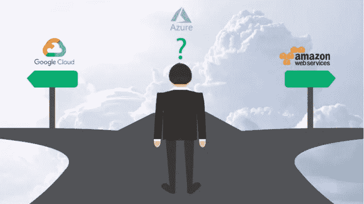
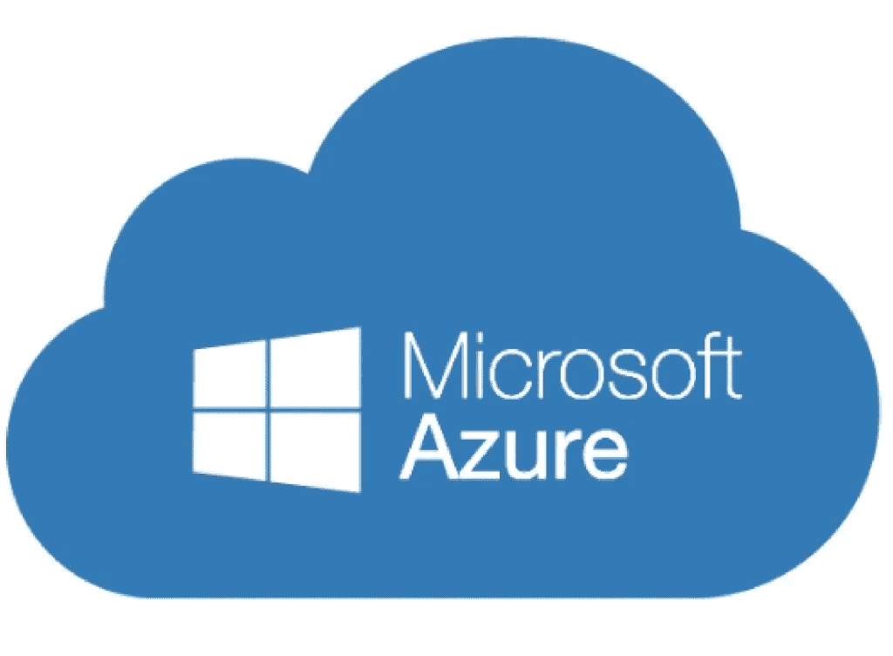
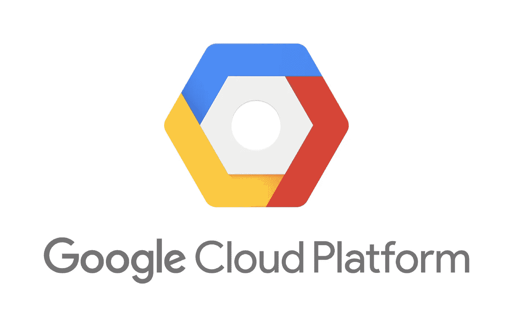
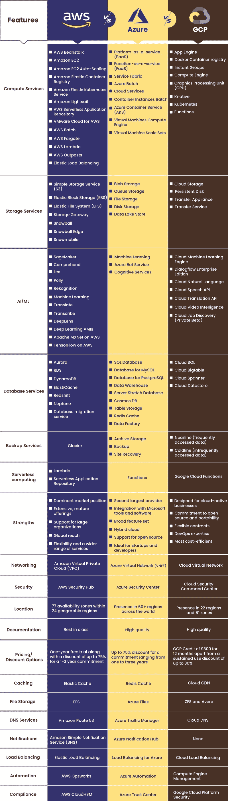

# AWS vs Azure vs GCP——选择困境

> 原文：<https://medium.com/analytics-vidhya/aws-vs-azure-vs-gcp-the-selection-dilemma-8006ff7b1e15?source=collection_archive---------12----------------------->

云霸权之战在三大巨头之间展开。虽然 IBM 和甲骨文等其他公司已经涉足云服务，但它们距离垄断市场的重要份额还有很长的路要走。三个云平台 AWS、Azure 和 GCP 都有自己独特的方式，并为组织提供了大量选项，供他们根据自己的特定需求进行选择。

对于任何 IT 专业人员来说，一个令人费解的情况出现了，他们必须选择一个云平台来用于他们的工作。现在，这是选择最适合他们问题的平台的最大难题。我们都知道三大巨头(AWS，Azure，GCP)在他们的领域做得最好，为他们的客户提供了很多服务，那么我们该如何选择呢？现在，选择平台完全取决于您的问题陈述和需求。让我们找出最适合您应用的云平台。

我们将首先逐一讨论三大平台，然后讨论您应该选择平台的参数。

**亚马逊网络服务(AWS)**

成立于 2006 年的 AWS 升级了它的服务和产品，现在是云计算领域的巨头，占据了 32%的云计算市场份额。AWS 提供一系列基础架构即服务(IaaS)产品，可分为计算、数据库、内容交付和存储以及网络。

AWS 使用无服务器服务，如亚马逊 Kinesis Streams、亚马逊 SQS 队列和 AWS Lambda 函数，实现了平稳灵活的数据收集流程。它为客户提供了选择操作系统、数据库、存储、编程语言等多种选择。

AWS 还提供管理工具来跟踪资源使用情况，如 AWS cloud trail、AWS CloudWatch 等，这有助于优化使用情况并为组织带来利润。

在所有三个先驱中，亚马逊拥有最大的数据中心，拥有 77 个区域，可用性区域的数量不断增加，为其客户提供了出色的可用性，使 AWS 成为该领域的明显赢家。

**蔚蓝色**

Azure 成立于 2008 年，发展迅速，其平台上的各种服务和产品占据了云市场 19%的份额。他们提供了与微软产品的无缝集成，这让他们占了上风。由于微软产品已经拥有庞大的客户网络，他们更喜欢 Azure，因为 Azure 提供了与微软产品的无缝集成和迁移。作为云服务提供商，Azure 向其客户提供一系列产品和服务，包括计算、存储、网络和监控。

Azure Site Recovery 使各种规模的组织能够协调站点到站点的复制和对 Azure 本身上托管的虚拟机的数据恢复。Azure 提供跨多个数据中心区域的区域冗余存储(ZRS)或数据存储冗余。Azure ExpressRoute 通过私有链接而不使用互联网来促进数据中心到 Azure 的连接，从而提供更高的安全性、更高的可靠性和更低的延迟。

Azure 还具有广泛的网络功能，包括支持虚拟网络的多个站点到站点连接，以及将不同区域的虚拟网络相互连接的能力。

Azure 拥有最低的按需和折扣实例定价。专业开发人员可以使用 Azure Machine Learning Studio 编写、测试和部署算法。如今，Azure DevOps 和 Azure ML 越来越出名，越来越好，吸引了更多的客户。

**GCP**

凭借交互式界面、可靠的网络、实惠的价格以及灵活的计算和存储选项，GCP 是 AWS 和 Azure 获得 7%云市场份额的另一种选择。它提供了大量的数据中心，提供了高水平的可用性。市场提供了对客户有用的各种应用。

Google 对他们的计算实例、存储和备份提供了巨大的折扣。由于有大量的数据中心，他们有一个可靠的网络，并随时为您的实例提供备份。

Google 提供了几个与计算机视觉、自然语言处理和翻译相关的现成 API。机器学习工程师可以基于谷歌的云机器学习引擎开源的 TensorFlow 深度学习库来构建模型。

GCP 吸引大量顾客的另一个因素是价格和优惠。对于第一次使用的用户，它向他们的客户提供 300 美元，让他们接触并了解服务。发帖称价格非常实惠，这使得 GCP 成为任何云相关工作的良好选择。

**三种不同参数的比较**

上述比较说明了所有三家云提供商的各种服务。

据我所知，定价和折扣是吸引更多客户的因素，因为计算、备份、存储和网络对所有三家提供商来说都非常相似。考虑到折扣和产品，AWS 利用其便宜和可承受的价格，其次是 GCP，然后是 Azure。然而，平台的选择将完全取决于客户的需求。这三款产品都是同类产品中的佼佼者。

此外，如果您想了解有关他们的产品和折扣的更多信息，请立即注册免费等级帐户，并浏览他们的折扣部分。