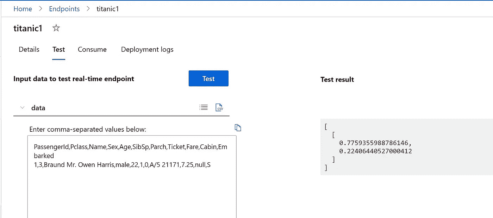

# Azure 自动化 ML Rest API，带有预测类的概率

> 原文：<https://medium.com/analytics-vidhya/azure-automated-ml-rest-api-with-probabilities-of-predicted-classes-21bf6fd298ab?source=collection_archive---------5----------------------->

# 使用自定义分数脚本部署 REST API

# 步伐

*   创建自动化的 ML 运行
*   现在导航到最佳模型
*   转到输出/日志，选择输出并下载 model.pkl
*   也下载乐谱文件
*   编辑乐谱文件

```
# ---------------------------------------------------------
# Copyright (c) Microsoft Corporation. All rights reserved.
# ---------------------------------------------------------
import json
import logging
import os
import pickle
import numpy as np
import pandas as pd
import joblibimport azureml.automl.core
from azureml.automl.core.shared import logging_utilities, log_server
from azureml.telemetry import INSTRUMENTATION_KEYfrom inference_schema.schema_decorators import input_schema, output_schema
from inference_schema.parameter_types.numpy_parameter_type import NumpyParameterType
from inference_schema.parameter_types.pandas_parameter_type import PandasParameterType
from inference_schema.parameter_types.standard_py_parameter_type import StandardPythonParameterTypedata_sample = PandasParameterType(pd.DataFrame({"PassengerId": pd.Series([0], dtype="int64"), "Pclass": pd.Series([0], dtype="int64"), "Name": pd.Series(["example_value"], dtype="object"), "Sex": pd.Series(["example_value"], dtype="object"), "Age": pd.Series([0.0], dtype="float64"), "SibSp": pd.Series([0], dtype="int64"), "Parch": pd.Series([0], dtype="int64"), "Ticket": pd.Series(["example_value"], dtype="object"), "Fare": pd.Series([0.0], dtype="float64"), "Cabin": pd.Series(["example_value"], dtype="object"), "Embarked": pd.Series(["example_value"], dtype="object")}))
input_sample = StandardPythonParameterType({'data': data_sample})result_sample = NumpyParameterType(np.array([0]))
output_sample = StandardPythonParameterType({'Results':result_sample})try:
    log_server.enable_telemetry(INSTRUMENTATION_KEY)
    log_server.set_verbosity('INFO')
    logger = logging.getLogger('azureml.automl.core.scoring_script_v2')
except:
    pass def init():
    global model
    # This name is model.id of model that we want to deploy deserialize the model file back
    # into a sklearn model
    model_path = os.path.join(os.getenv('AZUREML_MODEL_DIR'), 'model.pkl')
    path = os.path.normpath(model_path)
    path_split = path.split(os.sep)
    log_server.update_custom_dimensions({'model_name': path_split[-3], 'model_version': path_split[-2]})
    try:
        logger.info("Loading model from path.")
        model = joblib.load(model_path)
        logger.info("Loading successful.")     
    except Exception as e:
        logging_utilities.log_traceback(e, logger)
        raise@input_schema('Inputs', input_sample)
@output_schema(output_sample)
def run(Inputs):
    data = Inputs['data']
    result = model.predict_proba(data)
    return result.tolist() 
```

*   现在如果你想在 jupyter 笔记本上手动测试
*   将 model.pkl 文件上传到 jupyterlab 文件夹
*   创建一个样本 titanic4.json 文件，并在下面添加这些内容

```
[{"PassengerId":"1","Pclass":"3","Name":"Braund Mr. Owen Harris","Sex":"male","Age":"40","SibSp":"1","Parch":"0","Ticket":"A/5 21171","Fare":"7.25","Cabin":"c","Embarked":"S"},
{"PassengerId":"1","Pclass":"3","Name":"Braund Mr. Owen Harris","Sex":"female","Age":"40","SibSp":"1","Parch":"0","Ticket":"A/5 21171","Fare":"7.25","Cabin":"c","Embarked":"S"},
{"PassengerId":"1","Pclass":"3","Name":"Braund Mr. Owen Harris","Sex":"male","Age":"40","SibSp":"1","Parch":"0","Ticket":"A/5 21171","Fare":"7.25","Cabin":"c","Embarked":"S"},
{"PassengerId":"1","Pclass":"3","Name":"Braund Mr. Owen Harris","Sex":"female","Age":"40","SibSp":"1","Parch":"0","Ticket":"A/5 21171","Fare":"7.25","Cabin":"c","Embarked":"S"},
{"PassengerId":"1","Pclass":"3","Name":"Braund Mr. Owen Harris","Sex":"male","Age":"40","SibSp":"1","Parch":"0","Ticket":"A/5 21171","Fare":"7.25","Cabin":"c","Embarked":"S"}]
```

# 批量或手动评分

*   创建新笔记本

```
import json
import logging
import os
import pickle
import numpy as np
import pandas as pd
import joblibimport azureml.automl.core
from azureml.automl.core.shared import logging_utilities, log_server
from azureml.telemetry import INSTRUMENTATION_KEY
```

*   加载模型

```
model = joblib.load('model.pkl')
```

*   将 json 数据文件 titanic4.json 上传到 jupyterlab 目录

```
import pandas as pd
data = pd.read_json ('titanic4.json')
```

*   预测产量

```
result = model.predict_proba(data)
```

*   现在将数据转换成数组

```
df = data.to_numpy()
```

*   现在显示所有的概率

```
for i in range(len(df)):
    print("X=%s, Predicted=%s" % (df[i], result[i]))
```

# RESP API 部署

*   创建 aks 集群
*   至少需要 12 个内核
*   部署带有定制配置的自动化 ML 模型
*   乐谱环境和乐谱文件位于名为 RESTScoreFiles 文件夹中
*   部署 rest 服务
*   将需要几分钟时间
*   部署成功后，测试服务
*   抽样资料

```
PassengerId,Pclass,Name,Sex,Age,SibSp,Parch,Ticket,Fare,Cabin,Embarked
1,3,Braund Mr. Owen Harris,male,22,1,0,A/5 21171,7.25,null,S
```

*   下图应该显示概率



原文—[samples 2021/probscore . MD at main balakreshnan/samples 2021(github.com)](https://github.com/balakreshnan/Samples2021/blob/main/AutoML/probscore.md)