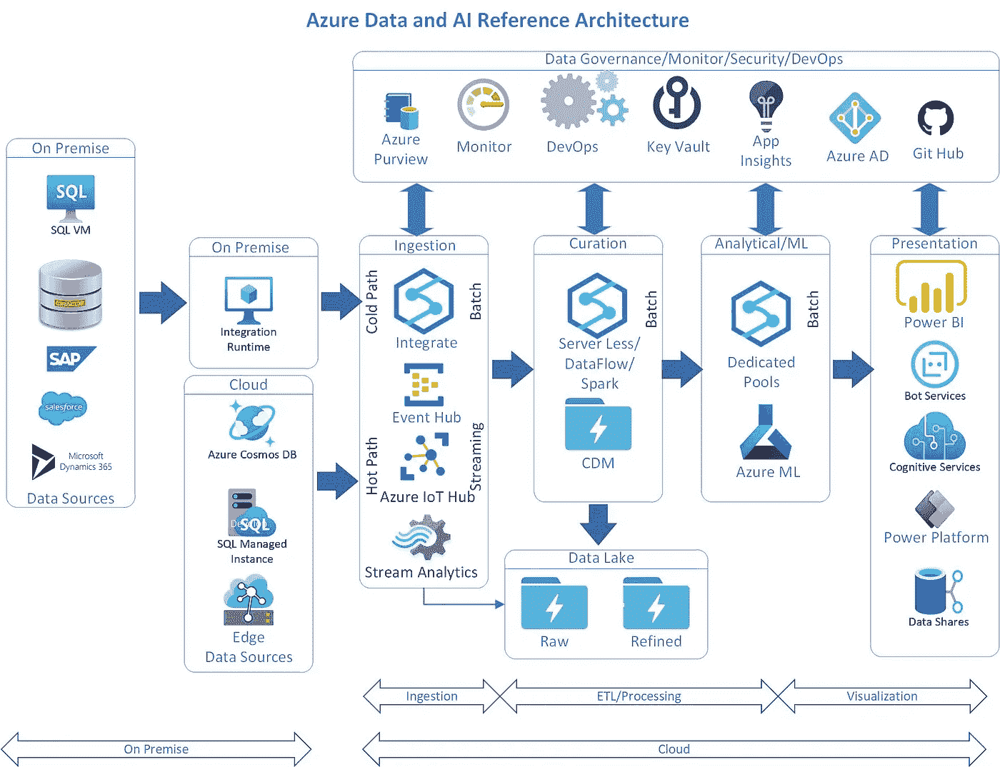

# Azure 云数据和 AI/ML 平台

> 原文：<https://medium.com/analytics-vidhya/azure-cloud-data-and-ai-ml-platform-cfce0e64048a?source=collection_archive---------8----------------------->

# Azure 数据/人工智能平台架构—分析

基于数据治理、数据生命周期管理和 ML/AI 数据科学生命周期管理构建您的数据战略，所有这些都在 PaaS 中进行，并考虑到安全性。

# 用例

*   数据驱动的组织
*   基于数据资产的见解
*   自助服务
*   高级分析
*   数据科学
*   机器学习/深度学习

# 体系结构

# 解释

*   建筑从左到右
*   以安全的方式从内部迁移到云

# 数据源

*   内部数据源
*   云数据源
*   物联网/工业物联网设备
*   人工智能-物联网设备

# 摄取

*   使用 integrate with integration runtime 从本地源获取批处理数据
*   使用 integrate 从其他基于云的数据源获取批量数据
*   疾控中心可以被编排
*   三角洲湖可以使用
*   原始地带的土地
*   对于流和基于事件的使用事件中心
*   可以是 kafka 客户端发送到事件中心 Kafka 端点
*   物联网中心用于支持物联网的设备作为源
*   流分析可用于保存来自事件中心或物联网中心的数据
*   流分析持续到存储— ADLS 第二代

# 治疗

*   Integrate 也可以用来做策展
*   无服务器 SQL 可用于将数据从原始->已处理
*   集成为拖放 ELT/ETL 类型活动的数据流
*   通用数据模型可用于最终持久化
*   数据质量、验证和聚合都发生在这里
*   权限可以捕获沿袭和数据目录信息
*   这里可以应用类型 1、类型 2 和其他数据处理方法
*   目的地可以是数据仓库、数据湖、数据沼泽、数据中枢、数据网格或任何其他数据目的地
*   如果我们需要使用，也可以使用 Delta 处理。
*   最终数据集应准备好供消费者在业务中使用
*   也能够用于自助服务数据驱动的决策

# 分析/毫升/人工智能

*   做假设分析
*   在数据中查找模式
*   专用 SQL 池仅用于具有更快响应时间的大量数据
*   用于构建高级分析模型的 Azure 机器学习
*   应用机器/深度/强化学习
*   提供数据科学生命周期管理
*   模型管理也是可用的
*   无代码/低代码建模
*   也可以使用基于 jupyter 或 python 的代码。
*   来自数据湖并写回数据湖的数据
*   基于视觉/音频的深度学习也可以通过 Azure ML 实现
*   模型推理被部署到 Azure Kubernetes 服务(arch 中缺少——表示为 app 服务)

# 可视化和 Web 应用程序

*   大多数数据可视化是仪表板或报告
*   使用 Power BI 实现可视化
*   对于对话 UI，使用带有认知服务 API 的 Bot 服务
*   对于 RPA —机器人流程自动化使用电源平台
*   对于 Web/UI，我们可以在 power 平台中使用 Power 应用程序

# 业务的共同事务

*   这些服务跨越所有 azure paas 服务
*   用于管理和运营
*   Azure 权限用作数据治理工具
*   数据目录
*   GDPR/PII 和其他合规的数据合规报告
*   数据分类
*   数据源的自动扫描或预设扫描
*   从 Integrate/ADF 带来沿袭
*   商业词汇
*   指定数据管理员、所有者和管理员
*   Azure monitor 构建数据运营仪表板，了解服务和应用程序的执行情况
*   Azure Devops 在环境之间执行 CI/CD
*   Azure Keyvault 在 Keyvault 中存储安全密钥，如密码和其他 api 访问密钥
*   应用洞察—存储运行时日志，以便对应用进行故障排除。更具体的应用
*   Azure AD —针对所有数据服务的单一身份验证
*   Github —在 Github 中存储所有代码报告

原文—[samples 2021/azuredataplatform . MD at main balakreshnan/samples 2021(github.com)](https://github.com/balakreshnan/Samples2021/blob/main/Architecture/AzureDataPlatform.md)