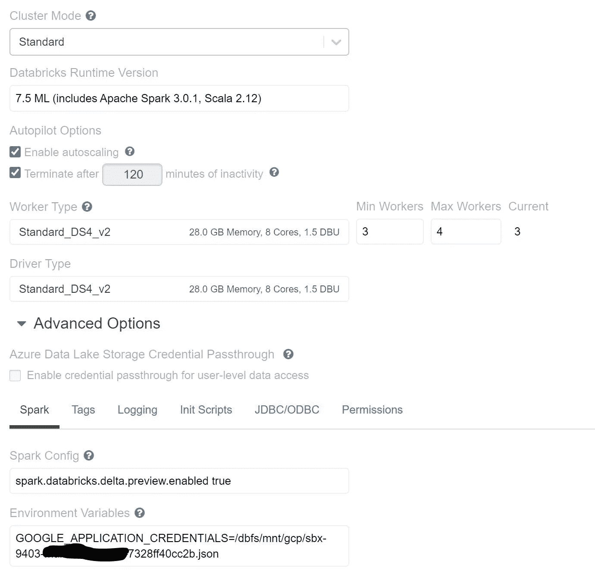
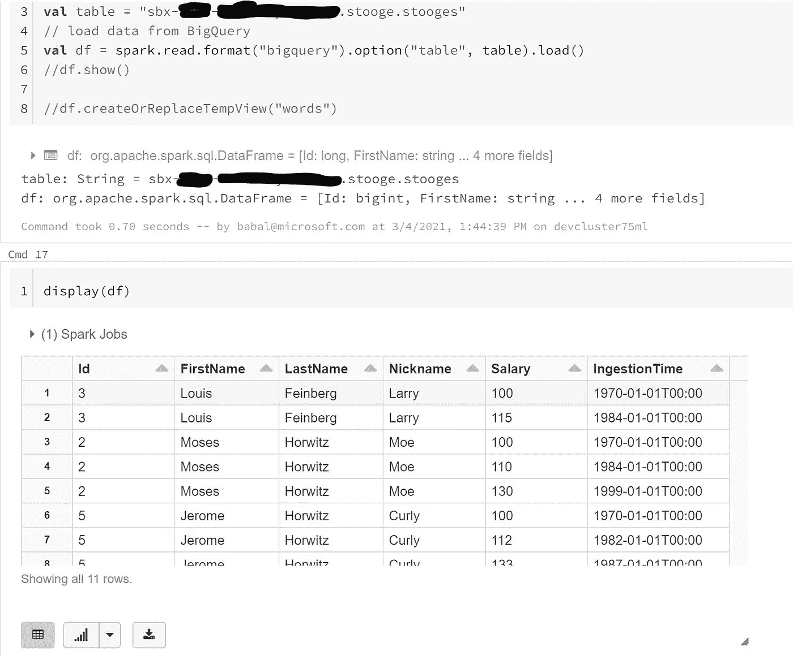

# Azure 数据砖块查询谷歌大查询

> 原文：<https://medium.com/analytics-vidhya/azure-data-bricks-query-google-big-query-6e3de4ef2ef5?source=collection_archive---------6----------------------->

# Azure 数据砖访问大查询

# 用例

*   从 azure 数据块访问大查询数据以进行分析
*   用于数据工程
*   用于机器学习

# 先决条件

*   Azure 帐户
*   Azure 存储帐户
*   Azure 数据块
*   GCP 账户
*   GCP 项目
*   GCP 大质问
*   创建一个样本数据集
*   提供访问和查询权限
*   创建权限 JSON 文件并下载它

# 步伐

*   首先创建一个存储帐户
*   创建名为 gcp 的容器
*   使用存储资源管理器创建配置文件夹
*   上传用于 GCP 访问的权限 json 文件
*   保存文件 service-access.json
*   现在让我们去数据砖开始编码
*   配置集群



*   让我们创建笔记本

```
val accbbstorekey = dbutils.secrets.get(scope = "allsecrects", key = "accbbstore")spark.conf.set(
  "fs.azure.account.key.storagename.blob.core.windows.net",
  accbbstorekey)
```

将驱动器挂载到 dbfs

```
dbutils.fs.mount(
  source = "wasbs://containername@storagename.blob.core.windows.net/conf",
  mountPoint = "/mnt/gcp",
  extraConfigs = Map("fs.azure.account.key.accbbstore.blob.core.windows.net" -> dbutils.secrets.get(scope = "allsecrects", key = "accbbstore")))
```

列出并查看

```
dbutils.fs.ls("dbfs:/mnt/gcp")
```

打印 env 变量并检查我们是否有授权 json

```
%sh printenv
```

配置 bigquery 表名

```
val table = "projectname.dataset.tablename"
// load data from BigQuery
val df = spark.read.format("bigquery").option("table", table).load()
```

显示数据

```
display(df)
```



最后卸载 dbfs

```
dbutils.fs.unmount("/mnt/gcp")
```

[位于主巴拉克雷什南的 samples 2021/gcpbigqueryadb . MD/samples 2021(github.com)](https://github.com/balakreshnan/Samples2021/blob/main/adb/gcpbigqueryadb.md)