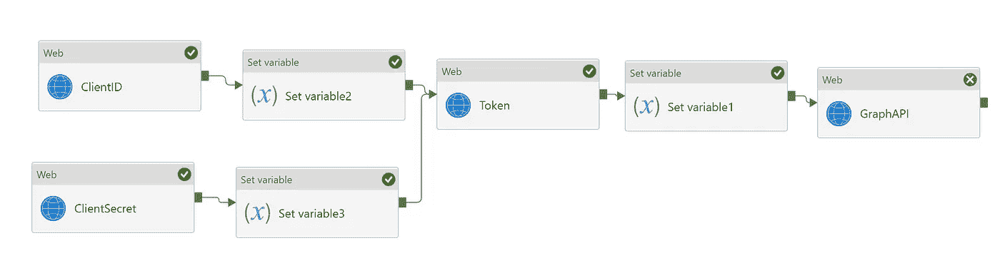
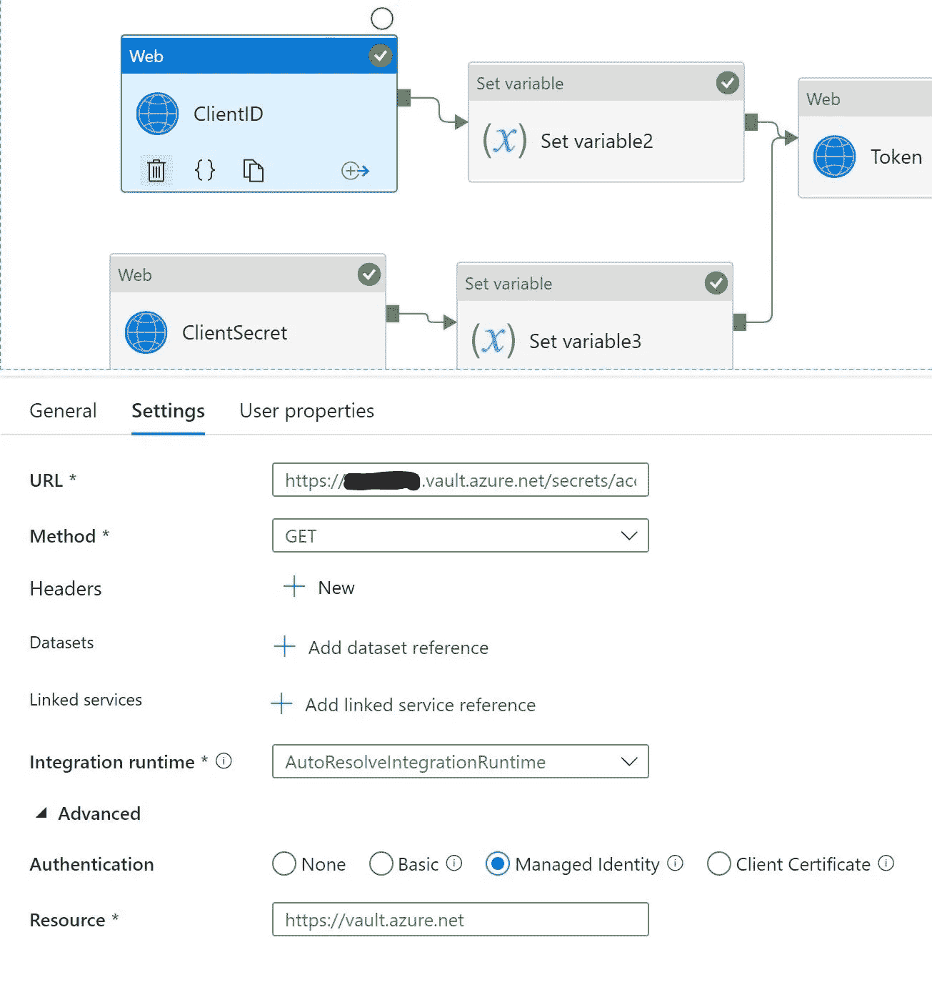
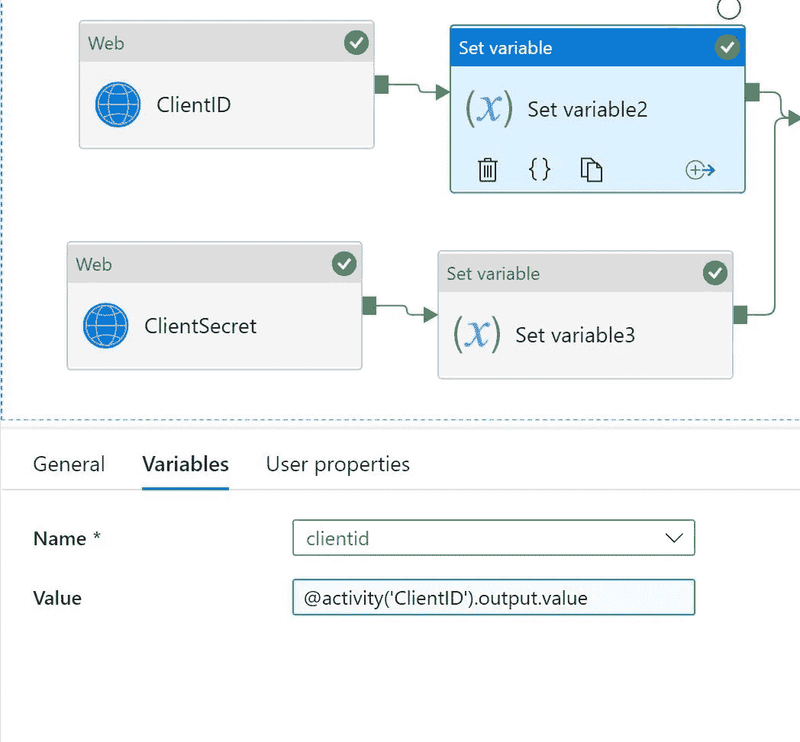
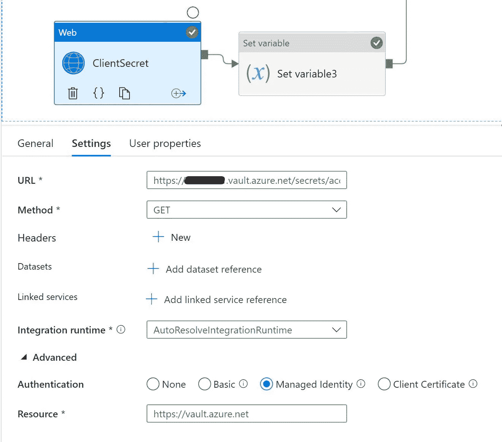
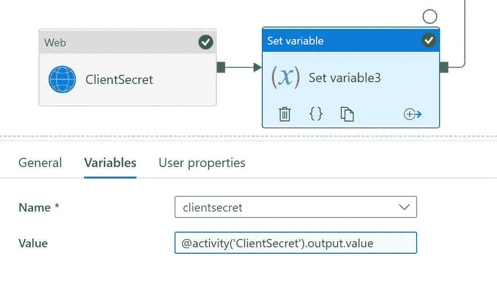
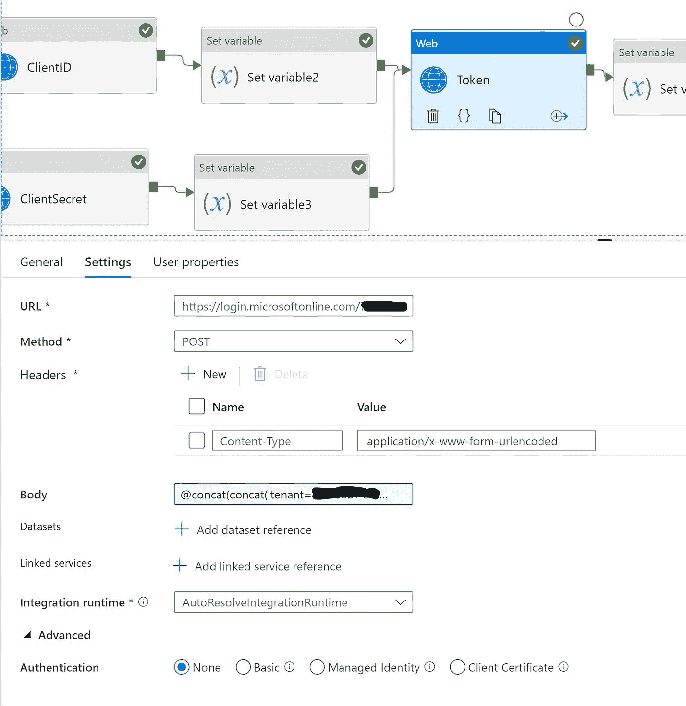
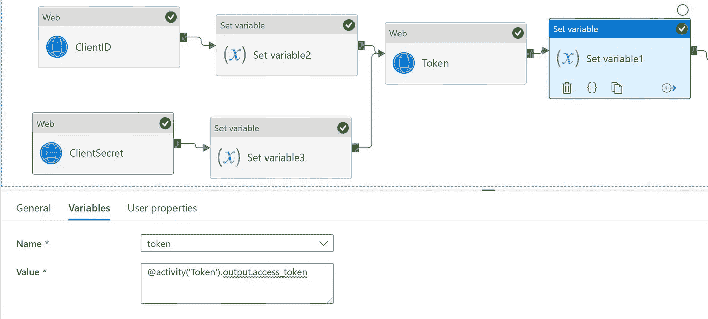
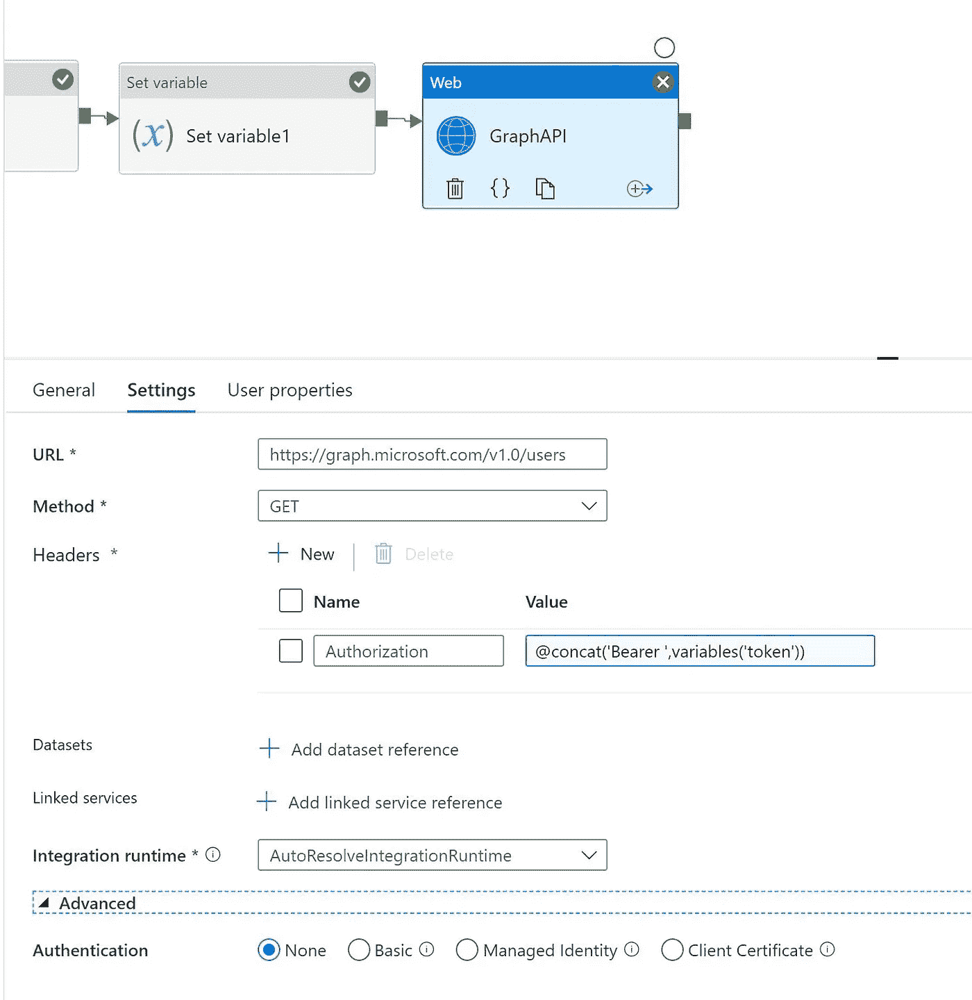

# Azure 数据工厂—访问 Microsoft Graph API

> 原文：<https://medium.com/analytics-vidhya/azure-data-factory-access-microsoft-graph-api-3bbab165eb40?source=collection_archive---------4----------------------->

# 使用服务主体访问 Microsoft Graph API

# 步伐

# 创建服务主体帐户

*   创建新的服务主体
*   [https://docs . Microsoft . com/en-us/azure/azure-SQL/database/authentic ation-aad-service-principal-tutorial](https://docs.microsoft.com/en-us/azure/azure-sql/database/authentication-aad-service-principal-tutorial)
*   分配 Microsoft Graph ->用户->用户。阅读。全部
*   创造一个秘密
*   将客户端 id 和密码存储在 Azure Keyvault 中

# Azure 数据工厂

*   在 microsoft graph api 中查看所有用户的整个流程



*   首先，我们需要从密钥库中获取客户端 id 和密码
*   使用 Web Acitivity 获取秘密并分配给变量
*   创建新的管道
*   创建名为
*   clientid
*   客户端秘密
*   代币
*   现在登录 azure 门户网站
*   转到 Azure keyvault
*   转到机密并复制 URL 以访问
*   确保 ADF 管理的身份在 keyvault 中有参与者
*   还提供获取权限以读取 azure keyvault 中的密钥
*   现在让我们获取客户端 id
*   拖动 web 活动



*   转到高级选项
*   选择托管身份
*   在 URL 框中粘贴以下内容

```
[https://vault.azure.net](https://vault.azure.net)
```

*   将输出分配给变量



*   现在让我们带来客户的秘密



*   转到高级选项
*   选择托管身份
*   在 URL 框中粘贴以下内容

```
https://vault.azure.net
```

*   分配给 clientsecret 变量



*   现在是时候获取用于 microsoft graph 的授权令牌了
*   在 URL 字段中

```
https://login.microsoftonline.com/tenantid/oauth2/v2.0/token
```



*   下面是请求体的代码
*   正文由客户机 id 和机密与租户 id 和范围连接而成

```
@concat(concat('tenant=tenantid&client_id=',variables('clientid'),'&client_secret='),variables('clientsecret'),'&grant_type=client_credentials&scope=https://graph.microsoft.com/.default')
```

*   将令牌分配给名为 token 的变量



*   现在调用 Microsoft graph 来检索数据
*   需要令牌进行授权



原文—【github.com】samples 2021/graphapiaccess . MD at main balakreshnan/samples 2021