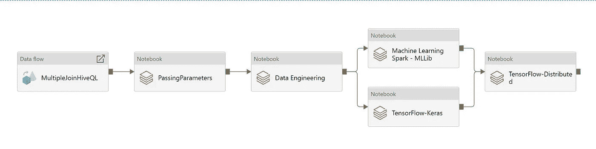
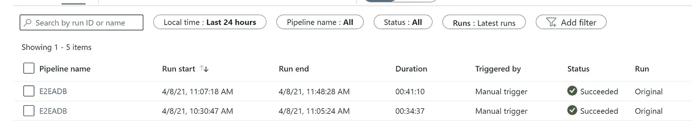
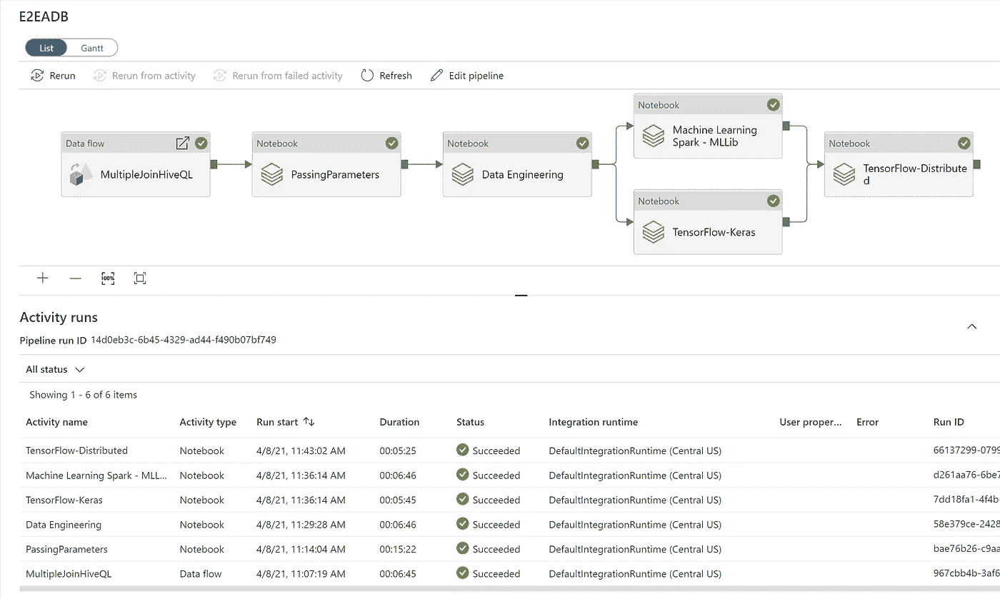
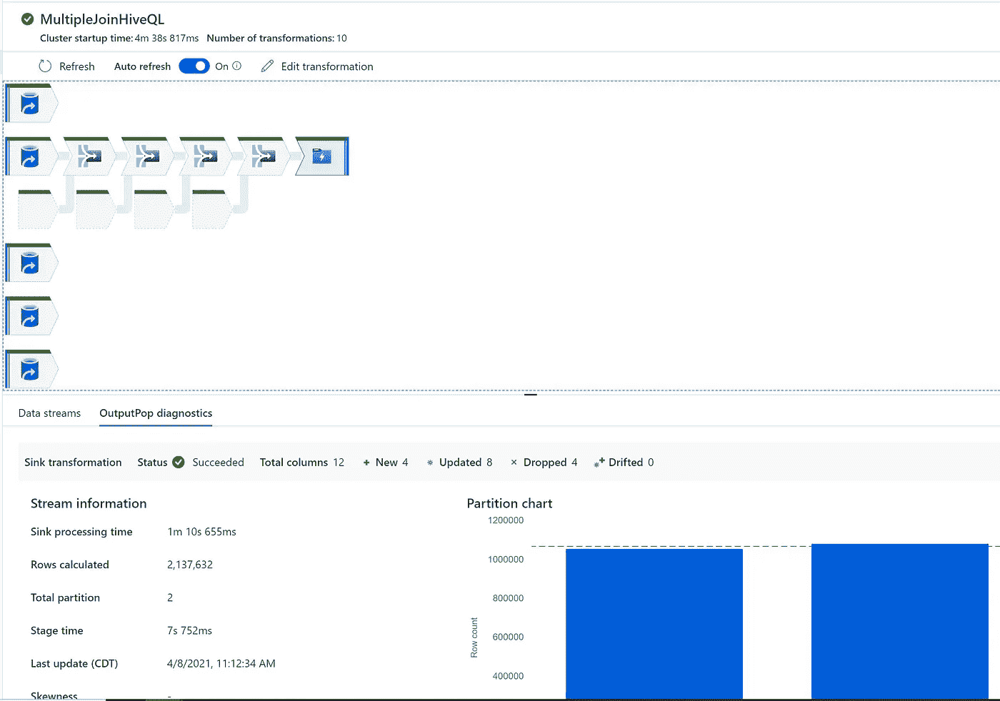

# Azure 数据工厂和 Azure 数据块演示/实验室

> 原文：<https://medium.com/analytics-vidhya/azure-data-factory-and-azure-databricks-demo-lab-d7891211f655?source=collection_archive---------10----------------------->

# 使用 Azure data factory 和 azure databricks 构建端到端数据科学管道实验室

# 先决条件

*   Azure 帐户
*   Azure 数据工厂
*   Azure 数据块
*   Azure Storage ADLS 第二代—存储所有拼花文件—数据湖
*   Azure Keyvault 用于存储机密

# 端到端流水线架构



# 步伐

*   对于笔记本电脑，我使用的是 microsoft doc 网站上现有的笔记本电脑
*   这里的业务逻辑没有真正的业务价值
*   每个任务彼此之间没有关联，这是为了显示流程
*   使用的数据是公共数据集

# 成分

*   显示案例数据仓库的数据流—事实/维度模型
*   笔记本——传递参数——展示如何将管道参数传递到笔记本中
*   笔记本—数据工程—展示使用 spark 的案例数据工程
*   笔记本—机器学习 MLLib —使用 spark ML 库展示案例机器学习
*   笔记本电脑-Tensorflow-Keras-使用 Keras 和 tensor flow 后端展示案例机器学习
*   笔记本电脑—Tensorflow—分布式—展示使用 horovids 进行分布式计算的情形 tensor flow

# 数据流

*   让我们创建一个新的数据流
*   [https://github . com/balakreshnan/samples 2021/blob/main/ADF/ADF multi join . MD](https://github.com/balakreshnan/Samples2021/blob/main/ADF/adfmultijoin.md)
*   按照上面的链接创建多连接数据流
*   模拟 HiveQL 查询

# 笔记本电脑— Azure 数据块

## 笔记本—传递参数

*   登录 Azure 数据块
*   使用默认配置创建集群
*   创建一个名为 adftutorial 的文件夹
*   创建一个名为 mynotebook 的 python 笔记本
*   在第一个单元格中，编写以下代码

```
dbutils.widgets.text("input", "","")
y = dbutils.widgets.get("input")
print ("Param -\'input':")
print (y)
```

## 笔记本—数据工程

*   创建一个名为 Demo 的文件夹
*   从以下位置导入示例 scala 笔记本
*   [https://docs . Microsoft . com/en-us/azure/databricks/_ static/notebooks/delta/quick start-Scala . html](https://docs.microsoft.com/en-us/azure/databricks/_static/notebooks/delta/quickstart-scala.html)
*   单击“导入笔记本”并复制 URL
*   转到 Azure databricks 并导航到演示文件夹
*   单击导入并粘贴 url
*   [https://docs . Microsoft . com/en-us/azure/databricks/_ static/notebooks/delta/quick start-Scala . html](https://docs.microsoft.com/en-us/azure/databricks/_static/notebooks/delta/quickstart-scala.html)

## 笔记本—机器学习火花— MLLib

*   转到名为演示的文件夹
*   从以下位置导入示例 scala 笔记本
*   [https://docs . Microsoft . com/en-us/azure/databricks/_ static/notebooks/getting-started/get-started-with-ml lib-DBR 7 . html](https://docs.microsoft.com/en-us/azure/databricks/_static/notebooks/getting-started/get-started-with-mllib-dbr7.html)
*   单击“导入笔记本”并复制 URL
*   转到 Azure databricks 并导航到演示文件夹
*   单击导入并粘贴 url
*   [https://docs . Microsoft . com/en-us/azure/databricks/_ static/notebooks/getting-started/get-started-with-ml lib-DBR 7 . html](https://docs.microsoft.com/en-us/azure/databricks/_static/notebooks/getting-started/get-started-with-mllib-dbr7.html)

## 笔记本— Tensorflow-keras

*   转到文件夹演示
*   在演示文件夹中创建新笔记本
*   将笔记本命名为:tensorflow-keras
*   选择 python 作为首选语言
*   下面的代码
*   新小区中的每个码块

```
import tensorflow as tf
from tensorflow.keras.layers import Dense
from tensorflow.keras.models import Sequential
import mlflow
import mlflow.keras
import mlflow.tensorflow
from sklearn.datasets import fetch_california_housing
from sklearn.model_selection import train_test_split

cal_housing = fetch_california_housing()

# Split 80/20 train-test
X_train, X_test, y_train, y_test = train_test_split(cal_housing.data,
                                                    cal_housing.target,
                                                    test_size=0.2)from sklearn.preprocessing import StandardScaler

scaler = StandardScaler()
X_train = scaler.fit_transform(X_train)
X_test = scaler.transform(X_test)
```

*   定义模型

```
def create_model():
  model = Sequential()
  model.add(Dense(20, input_dim=8, activation="relu"))
  model.add(Dense(20, activation="relu"))
  model.add(Dense(1, activation="linear"))
  return model
```

*   创建模型

```
model = create_model()

model.compile(loss="mse",
              optimizer="Adam",
              metrics=["mse"])
```

*   运行培训

```
from tensorflow.keras.callbacks import ModelCheckpoint, EarlyStopping

# In the following lines, replace <username> with your username.
experiment_log_dir = "/dbfs/<username>/tb"
checkpoint_path = "/dbfs/<username>/keras_checkpoint_weights.ckpt"

tensorboard_callback = tf.keras.callbacks.TensorBoard(log_dir=experiment_log_dir)
model_checkpoint = ModelCheckpoint(filepath=checkpoint_path, verbose=1, save_best_only=True)
early_stopping = EarlyStopping(monitor="loss", mode="min", patience=3)

history = model.fit(X_train, y_train, validation_split=.2, epochs=35, callbacks=[tensorboard_callback, model_checkpoint, early_stopping])
```

*   预测要评估的模型

```
model.evaluate(X_test, y_test)
```

## 笔记本电脑—tendor flow-分布式

*   转到名为演示的文件夹
*   从以下位置导入示例 scala 笔记本
*   [https://docs . Microsoft . com/en-us/azure/databricks/_ static/notebooks/deep-learning/spark-tensor flow-distributor . html](https://docs.microsoft.com/en-us/azure/databricks/_static/notebooks/deep-learning/spark-tensorflow-distributor.html)
*   单击“导入笔记本”并复制 URL
*   转到 Azure databricks 并导航到演示文件夹
*   单击导入并粘贴 url
*   [https://docs . Microsoft . com/en-us/azure/databricks/_ static/notebooks/deep-learning/spark-tensor flow-distributor . html](https://docs.microsoft.com/en-us/azure/databricks/_static/notebooks/deep-learning/spark-tensorflow-distributor.html)

# Azure 数据工厂

*   登录 Azure Datafactory Authour UI
*   创建一个数据流，并选择上面创建的 multijoindf
*   现在展开数据块并拖放笔记本
*   将其命名为“传递参数”
*   创建 Azure 数据块连接
*   我使用托管身份连接到 Azure databricks
*   必须在 Azure databricks 中提供 ADF 托管身份的权限
*   需要贡献者访问
*   导航到 adftutorial\mynotebook
*   创建基础参数
*   名称为“Name ”,位于值类型@ pipeline()parameters . name 中。
*   现在再次拖动笔记本
*   名字叫“数据工程”
*   连接到相同的数据块
*   导航到演示/数据块增量快速入门(Scala)
*   现在再次拖动笔记本
*   名字叫“机器学习火花— MLLib”
*   连接到相同的数据块
*   演示导航 MLlib 入门
*   现在再次拖动笔记本
*   名字是“TensorFlow-Keras”
*   连接到相同的数据块
*   到演示/tensorflow-keras 的导航
*   现在再次拖动笔记本
*   名称是“张量流-分布式”
*   连接到相同的数据块
*   导航至演示/火花-张量流-分配器
*   将以上所有内容连接如下


*   拯救管道
*   将管道命名为“E2EADB”
*   单击发布
*   等待发布完成
*   然后单击添加触发器->立即触发
*   转到监视器
*   等待作业完成



*   完成后，单击运行并查看详细信息



*   点击详细信息并查看



*   对于 Azure databricks 笔记本，它应该显示笔记本运行 URL
*   单击并查看笔记本输出。

# 完成的

*最初发表于*[*【https://github.com】*](https://github.com/balakreshnan/Samples2021/blob/main/ADF/adfadbmllab.md)*。*