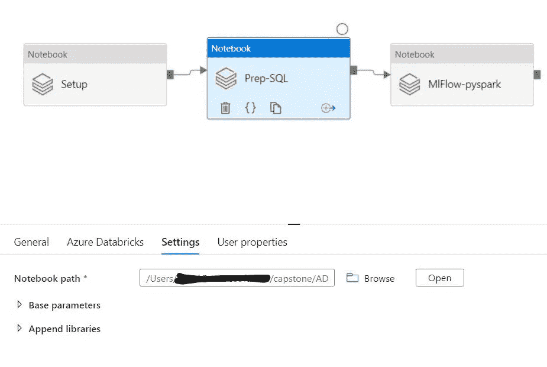

# Azure 数据工厂—使用 Azure 数据块的 mlflow

> 原文：<https://medium.com/analytics-vidhya/azure-data-factory-mlflow-with-azure-data-bricks-d247bc0bc14a?source=collection_archive---------14----------------------->

# 使用 mlflow 运行机器学习的培训，并使用 Azure data factory 实现自动化

# 先决条件

*   Azure 帐户
*   创建资源组
*   创建 Azure databricks 工作区
*   使用 databricks runtime 7.5 创建一个集群，并将 ML 作为选项
*   等待群集启动
*   将 ml . combuste . mleap:mleap-spark _ 2.11:0.13 . 0 安装为 maven
*   创建 Azure 数据工厂

# 为示例培训编写代码

*   创建新笔记本
*   选择 python 作为首选语言
*   加载训练数据

```
df = spark.read.parquet("/databricks-datasets/news20.binary/data-001/training").select("text", "topic")
df.cache()
display(df)
```

*   导入 ML 库

```
from pyspark.ml import Pipeline
from pyspark.ml.classification import DecisionTreeClassifier
from pyspark.ml.feature import StringIndexer, Tokenizer, HashingTF
from pyspark.ml.evaluation import MulticlassClassificationEvaluator
from pyspark.ml.tuning import CrossValidator, ParamGridBuilder
```

*   定义管道组件

```
# Define pipeline components
labelIndexer = StringIndexer(inputCol="topic", outputCol="label", handleInvalid="keep")
tokenizer = Tokenizer(inputCol="text", outputCol="words")
hashingTF = HashingTF(inputCol="words", outputCol="features")
dt = DecisionTreeClassifier()# Construct a Pipeline object using the defined components
pipeline = Pipeline(stages=[labelIndexer, tokenizer, hashingTF, dt])
```

*   编写代码来训练模型
*   使用 ml 流来跟踪它
*   确保在 set_experiment 中指定了实验名称，以便笔记本能够正确运行。

```
import mlflow
import mlflow.mleap

def fit_model():
  # Start a new MLflow run
  exp_id = mlflow.set_experiment('/Users/user@company.com/sample1')
  with mlflow.start_run(experiment_id=exp_id, run_name="online") as run:
    # Fit the model, performing cross validation to improve accuracy
    paramGrid = ParamGridBuilder().addGrid(hashingTF.numFeatures, [1000, 2000]).build()
    cv = CrossValidator(estimator=pipeline, evaluator=MulticlassClassificationEvaluator(), estimatorParamMaps=paramGrid)
    cvModel = cv.fit(df)
    model = cvModel.bestModel

    # Log the model within the MLflow run
    mlflow.mleap.log_model(spark_model=model, sample_input=df, artifact_path="model")
```

*   运行模型

```
fit_model()
```

*   我还为设置创建了样本笔记本
*   设置笔记本只是创建必要的 blob 连接和其他预清理设置
*   然后，我使用 Spark SQL 创建了一个用于 ETL 的样例笔记本
*   这里的想法是首先创建 ETL/ELT 或数据工程，然后运行培训

# Azure Data Factory 将所有 3 台笔记本协调为一个连续的流程

# 整体数据工厂编排


*   让我们创建一个新的管道
*   给管道命名
*   在画布上拖放数据块笔记本
*   创建新数据集并为 azure databricks 工作区创建链接服务
*   使用托管身份连接上述数据块工作区
*   选择设置笔记本


*   在画布上拖放数据块笔记本
*   创建新数据集并为 azure databricks 工作区创建链接服务
*   使用托管身份连接上述数据块工作区
*   选择 ETL 笔记本



*   在画布上拖放数据块笔记本
*   创建新数据集并为 azure databricks 工作区创建链接服务
*   将 databricks 运行时用作基于 ML 的运行时。我用的是 7.5 毫升


*   使用托管身份连接上述数据块工作区
*   选择 mlflow 笔记本


*   保存并发布
*   单击立即触发并运行管道。
*   转到监视器并查看状态


*   状态是绿色的，那么我们是好的
*   因此，现在我们可以编排和管理运行时间表

*最初发表于*[*【https://github.com】*](https://github.com/balakreshnan/Accenture/blob/master/mlflow/adfmlflow.md)*。*