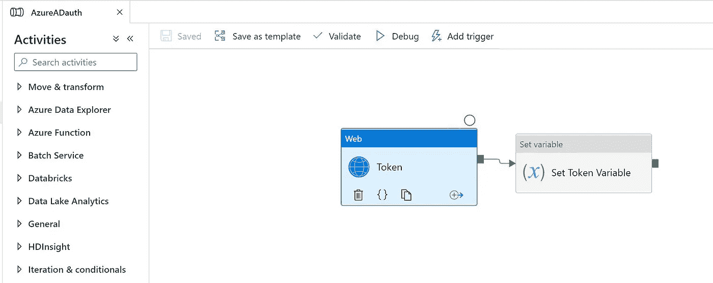
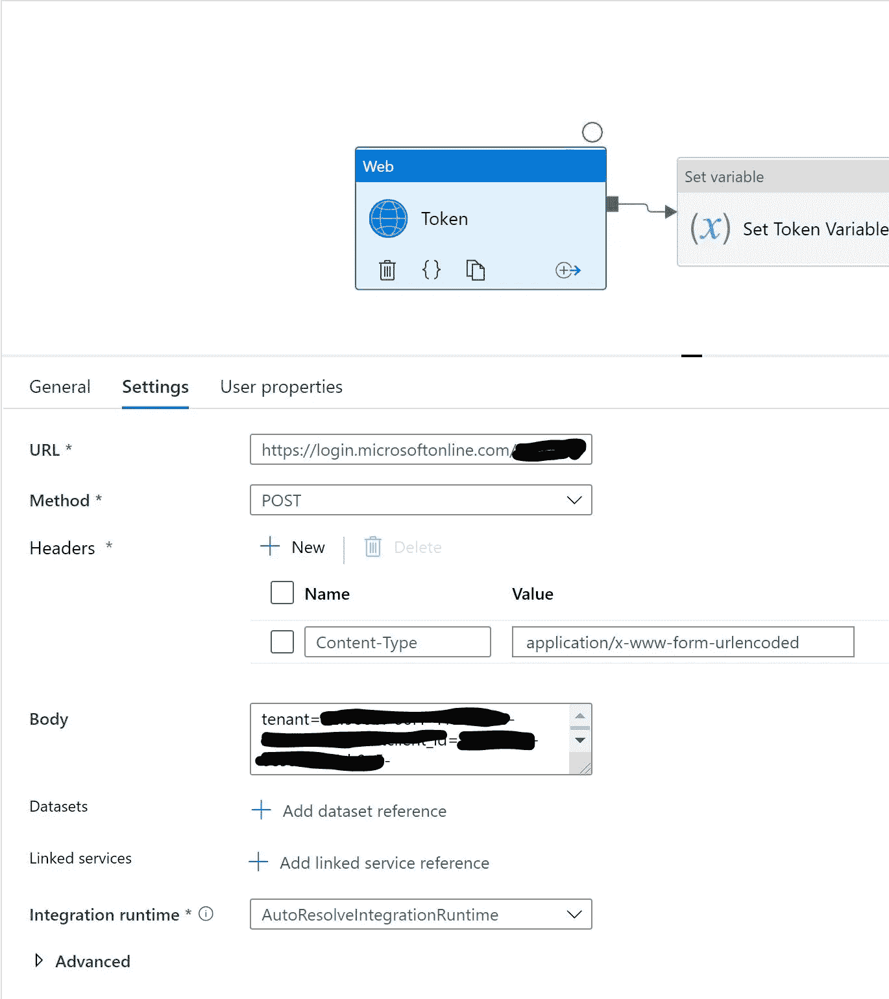
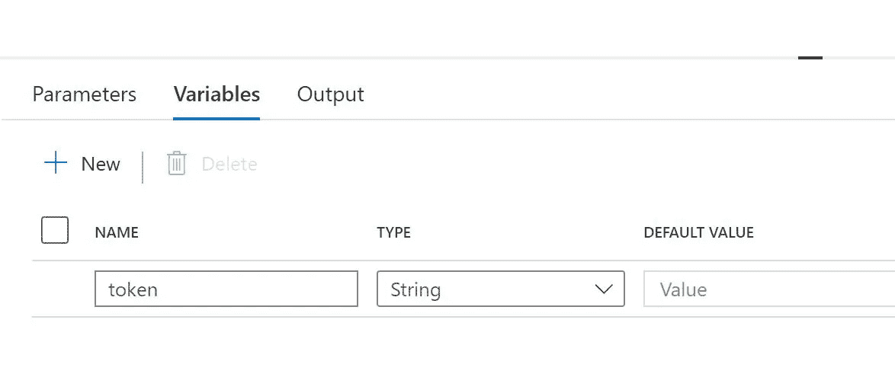
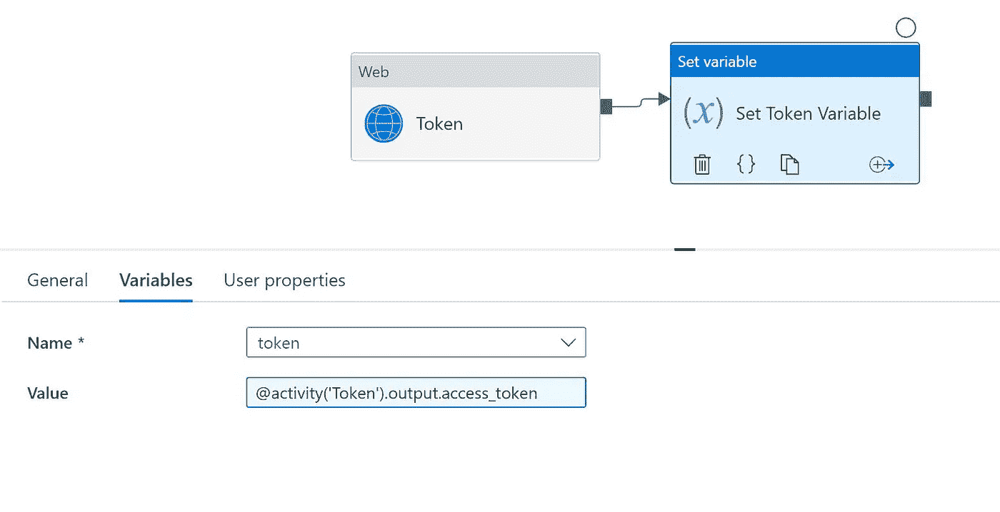
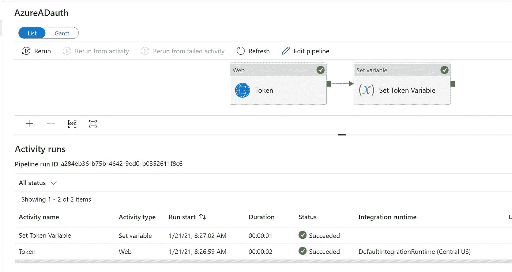
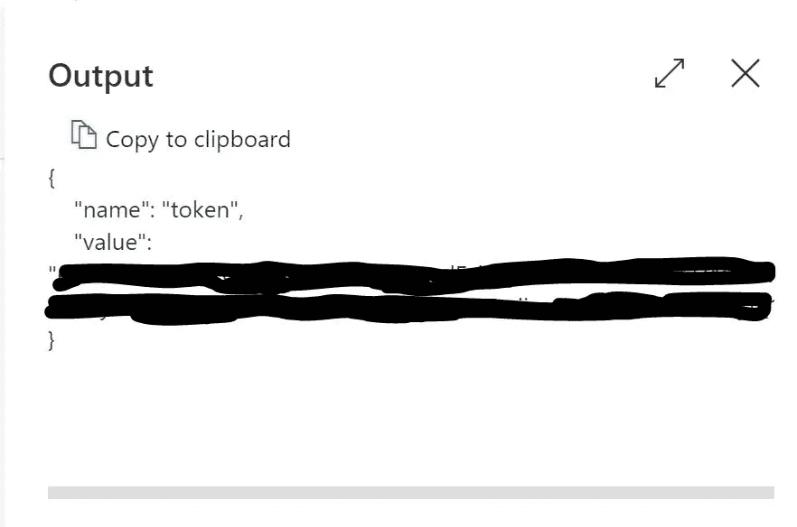

# Azure 数据工厂使用 OAUTH 2.0 从 Azure AD 检索令牌

> 原文：<https://medium.com/analytics-vidhya/azure-data-factory-retrieve-token-from-azure-ad-using-oauth-2-0-9a3ed3f55013?source=collection_archive---------0----------------------->

# 使用 OAUTH v2.0 使用 Azure 数据工厂从 Azure AD 获取令牌

# 用例

*   能够使用 Azure AD 验证服务主体访问并获取令牌
*   令牌通常像每小时或配置的时间一样刷新
*   安全的 ADF 管道访问可在计划和自动化时获取动态令牌

# 先决条件

*   Azure 帐户
*   创建资源组
*   创建存储帐户
*   创建 Azure 数据工厂
*   创建新管道



*   进入“活动”菜单，然后进入“常规”
*   拖放 WEB 活动
*   获取 Azure AD oauth 端点的 URL

```
[https://login.microsoftonline.com/tenantid/oauth2/v2.0/token](https://login.microsoftonline.com/tenantid/oauth2/v2.0/token)
```

*   选择方法作为发布
*   创建标题

```
Content-Type: application/x-www-form-urlencoded
```



*   在正文中使用下面的格式。
*   请替换客户 id、客户密码、tenantid

```
tenant=tenantid&client_id=objectid(applicationid)&client_secret=clientsecret&grant_type=client_credentials&scope=https://graph.microsoft.com/.default
```

*   接下来创建一个变量
*   点击画布的空白部分，添加一个新变量



*   创建一个变量名作为令牌
*   没有任何拖欠
*   现在拖放设置变量活动
*   输出变量以访问从上次登录获得的令牌



```
@activity('Token').output.access_token
```

*   全部保存并发布
*   发布后，单击添加触发器并立即运行
*   转到监视器并查看更新



```
@variables('token')
```

*最初发表于*[*【https://github.com】*](https://github.com/balakreshnan/Accenture/blob/master/GDN/ADFAzuerADtoken.md)*。*