# Azure Databricks Auto ML

> 原文：<https://medium.com/analytics-vidhya/azure-databricks-auto-ml-e985496d51d3?source=collection_archive---------16----------------------->

# 在 Azure 数据块中使用 AutoML 特性

# 要求

*   Azure 帐户
*   Azure 存储帐户
*   Azure 数据块
*   使用的数据集是 titanic 开源数据集

# 步伐

*   使用 8.3beta ML 运行时创建集群

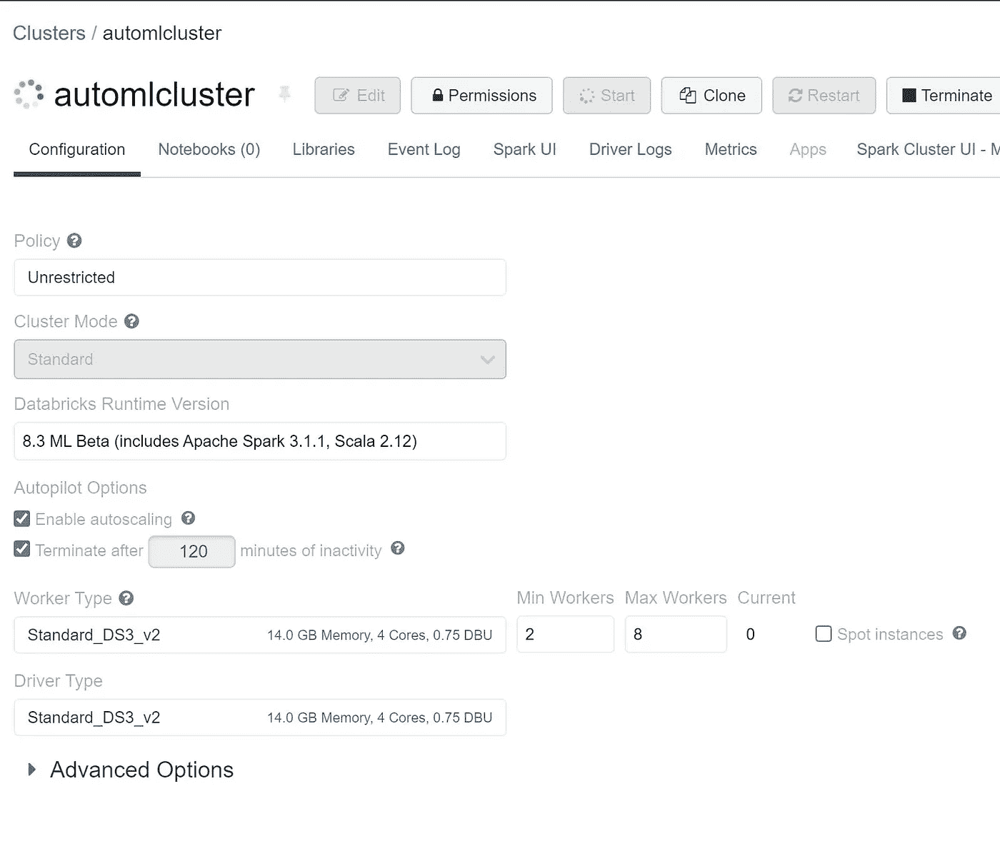

*   等待群集启动
*   一旦开始，你就可以看到数据
*   创造新的实验

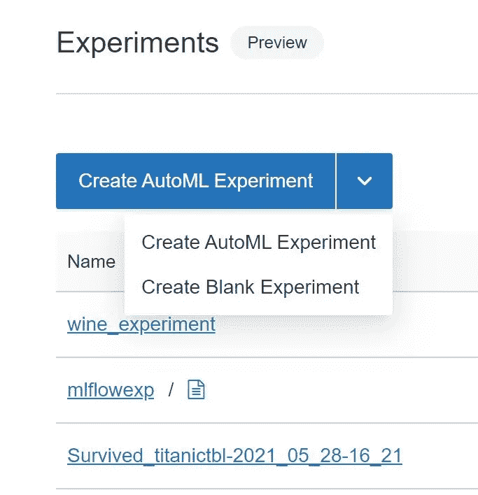

*   现在将 ML 类型配置为分类
*   浏览表格并选择默认，然后选择 titanictbl
*   要创建表，请将 titanic.csv 文件上传到名为 titanictbl 的表中
*   数据见 data\titanic.csv

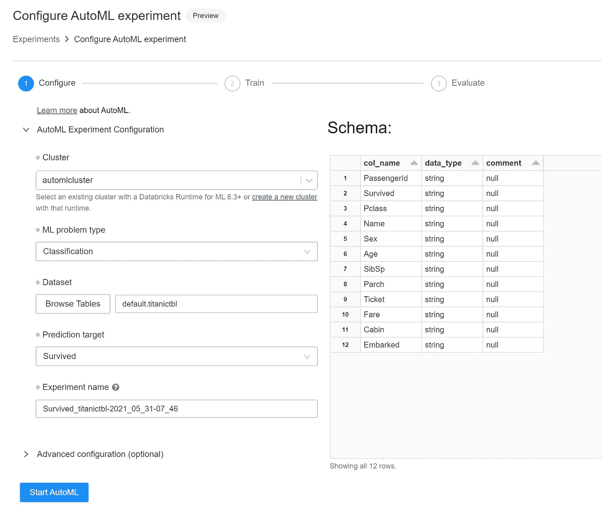

*   高级功能

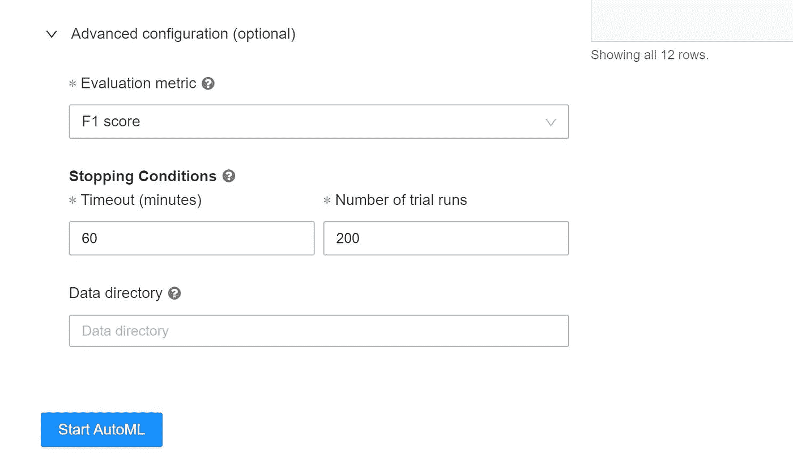

*   进行实验

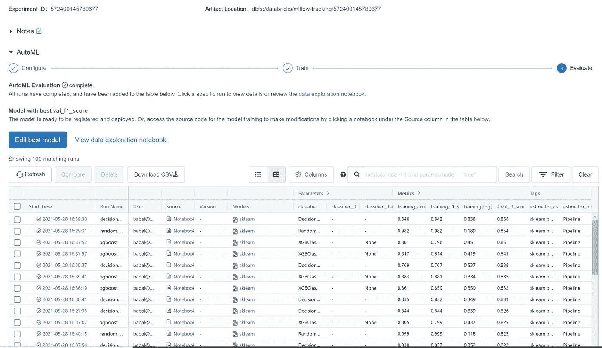

*   列出所有运行的模型

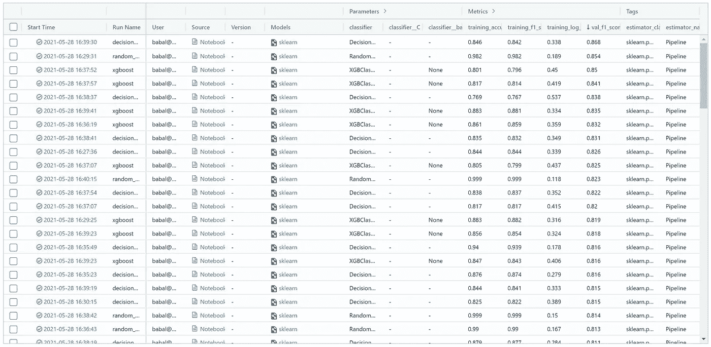

*   最佳模特

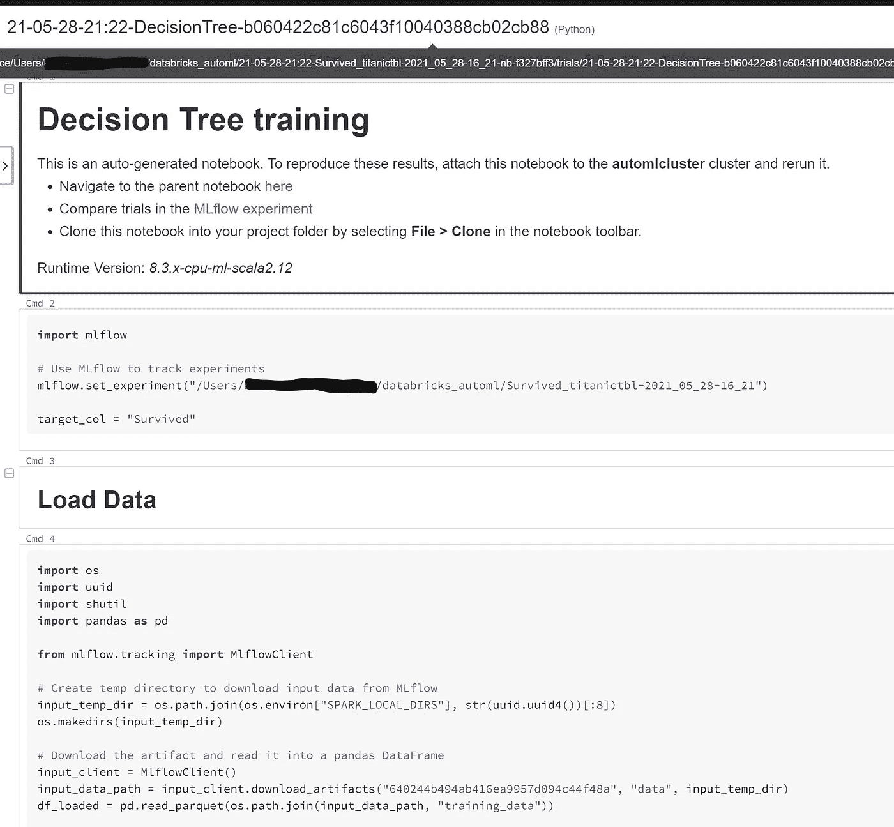

*   数据工作手册—特征工程

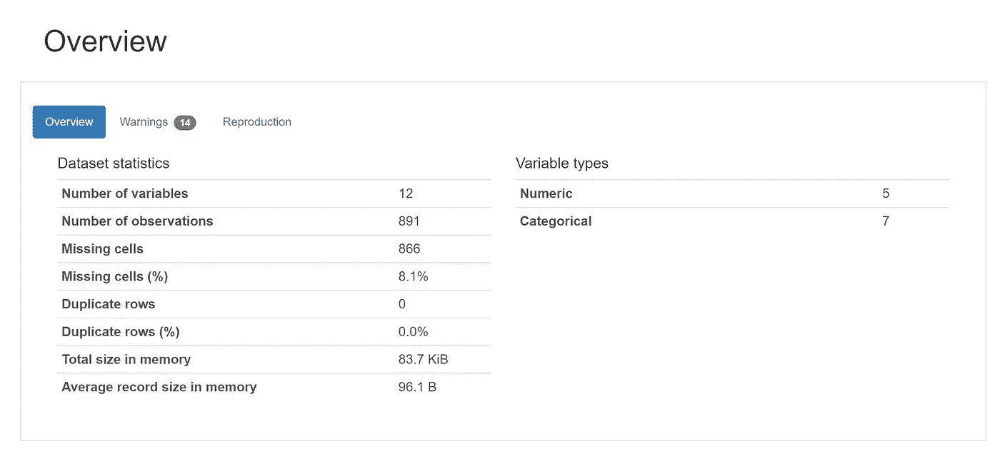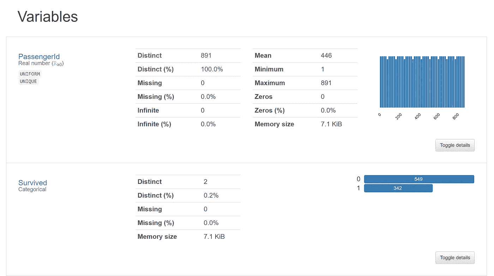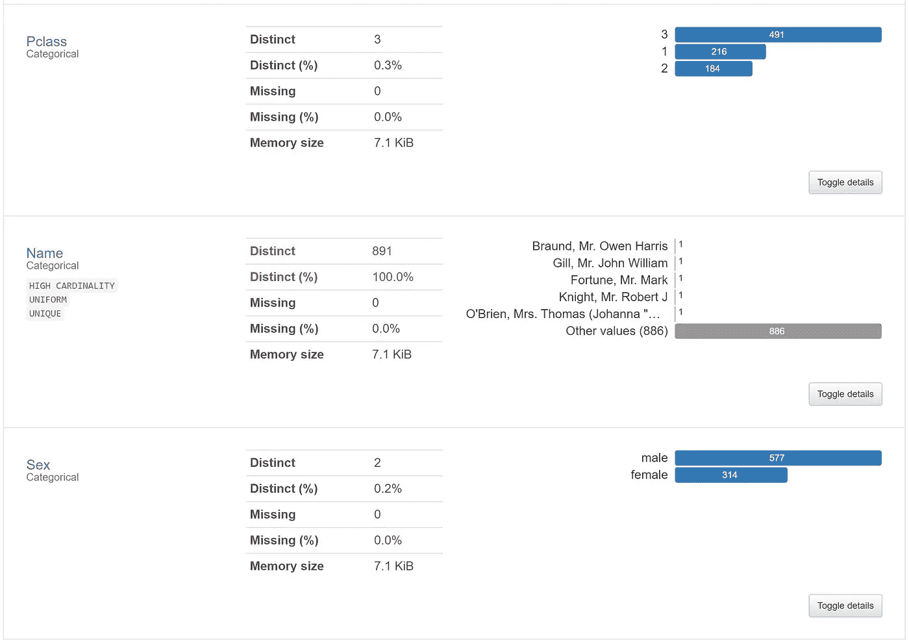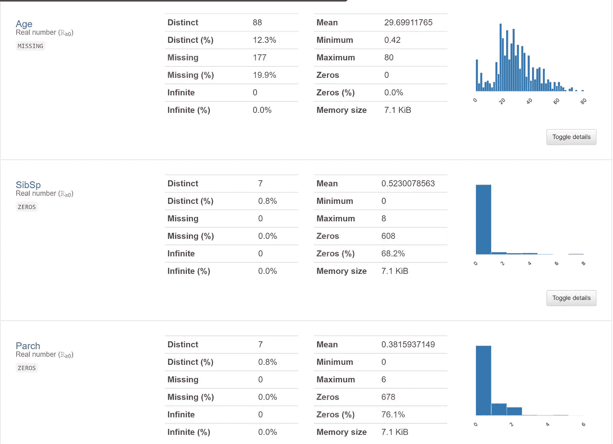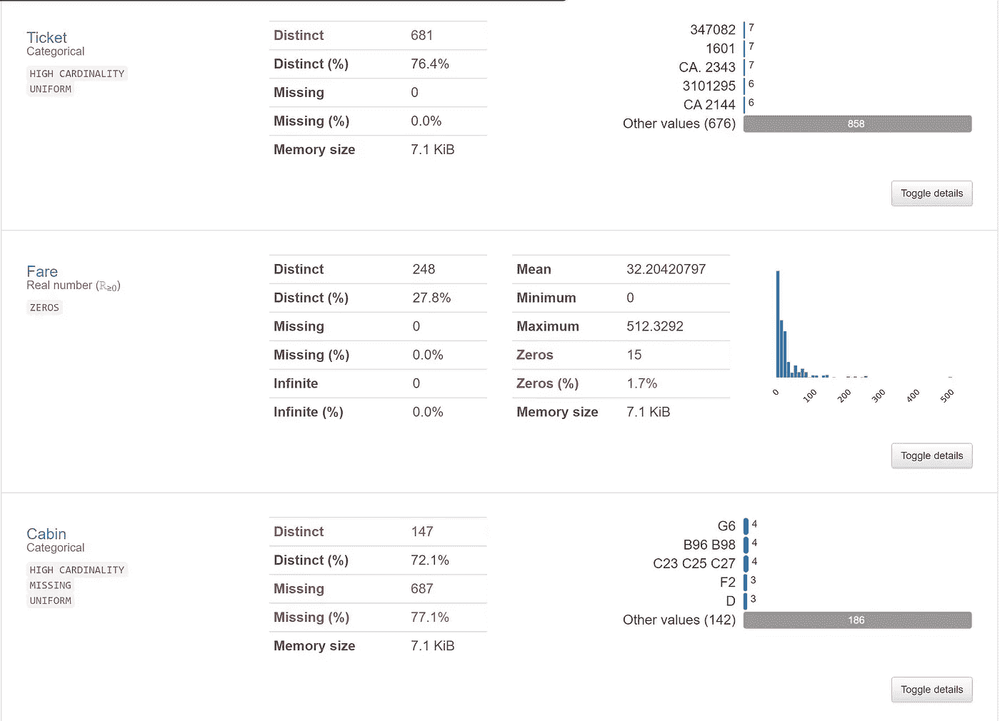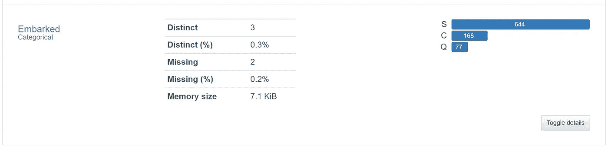

*   相关

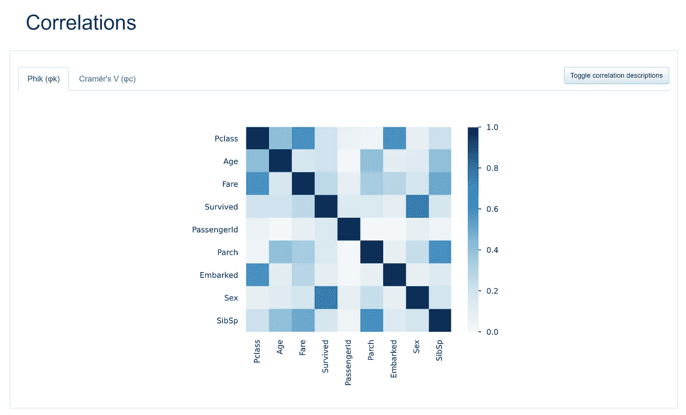

*   [samples 2021/adbautoml . MD at main balakreshnan/samples 2021(github.com)](https://github.com/balakreshnan/Samples2021/blob/main/adb/adbautoml.md)