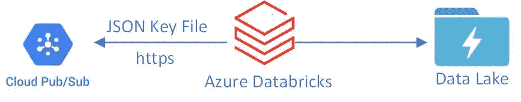

# Azure Databricks 流与 GCP 酒吧订阅

> 原文：<https://medium.com/analytics-vidhya/azure-databricks-streaming-with-gcp-pub-sub-2b8937a1c7cd?source=collection_archive---------8----------------------->

# 使用 Azure 数据块流发布/订阅主题

# 用例

*   多云数据处理
*   能够将数据从 GCP 发布/订阅移动到 Azure 数据块，再移动到 ADLS gen2
*   存储为增量格式
*   事件驱动数据处理

# 体系结构



# 步伐

# GCP

*   创建 GCP 帐户
*   创建项目
*   创建发布/订阅
*   创建一个主题
*   为服务帐户创建认证—[https://cloud . Google . com/docs/authentic ation/getting-started](https://cloud.google.com/docs/authentication/getting-started)
*   提供阅读主题的权限

# 蔚蓝的

*   创建 Azure 帐户
*   创建资源组
*   创建 Azure 数据块
*   创建 Azure 存储帐户— ADLS 第二代(增量存储)
*   创建运行时为 8.2 毫升的集群
*   以下是连接器 URL—【https://github.com/googleapis/java-pubsublite-spark 
*   一旦集群启动，进入库并选择 maven

```
com.google.cloud:pubsublite-spark-sql-streaming:0.2.0
```

*   等待群集安装
*   同时收集 GCP 项目 id 和 JSON 密钥文件
*   以 python 为语言创建笔记本
*   读取流

```
df = spark.readStream \
  .format("pubsublite") \
  .option("pubsublite.subscription", "projects/$PROJECT_NUMBER/locations/$LOCATION/subscriptions/$SUBSCRIPTION_ID") \
  .option("gcp.credentials.key", "<SERVICE_ACCOUNT_JSON_IN_BASE64>") \
  .load
```

*   现在写回 Delta 以便进一步处理

```
events.writeStream
  .format("delta")
  .outputMode("append")
  .option("checkpointLocation", "/delta/events/_checkpoints/etl-from-pubsub")
  .start("/delta/pubsub")
```

*   运行笔记本单元，一旦 writestream 被调用，请检查文件夹以查看数据是否被写入
*   检查 ADLS gen2 中的 delta/pubsub 文件夹

原始帖子—【github.com】samples 2021/pubsubadb . MD at main balakreshnan/samples 2021