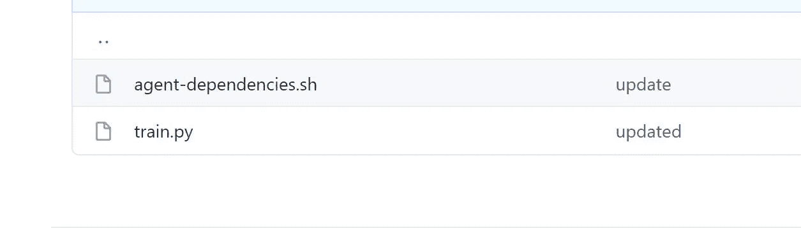
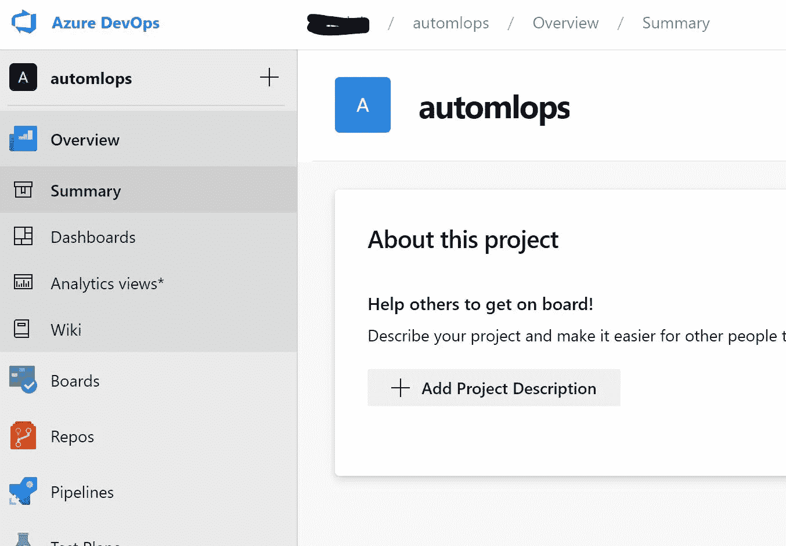
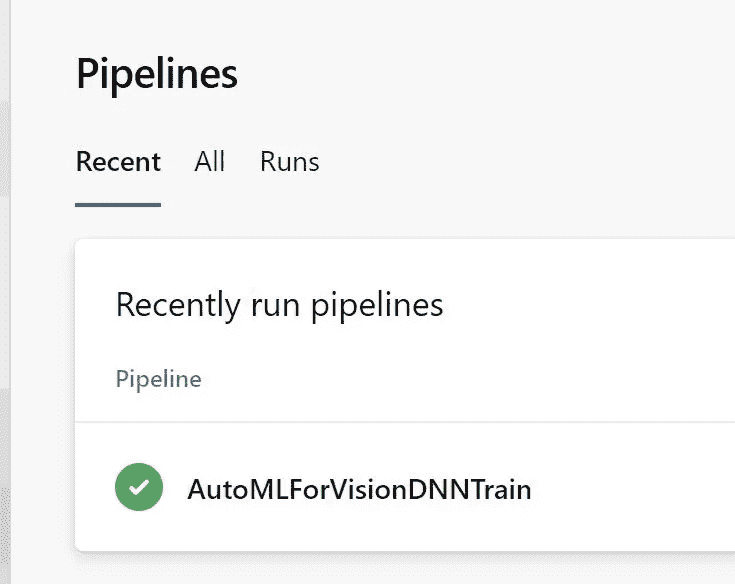
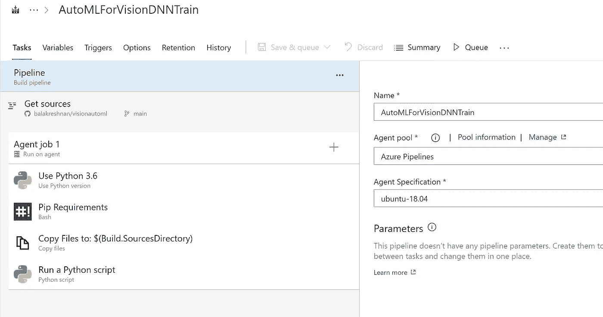
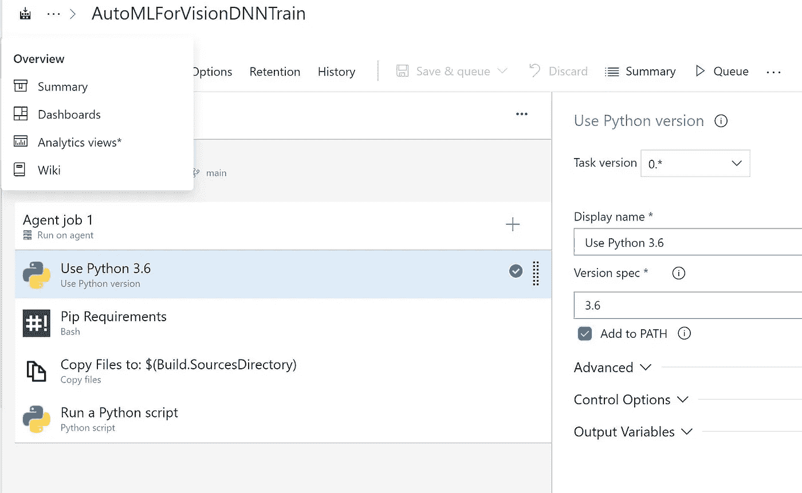
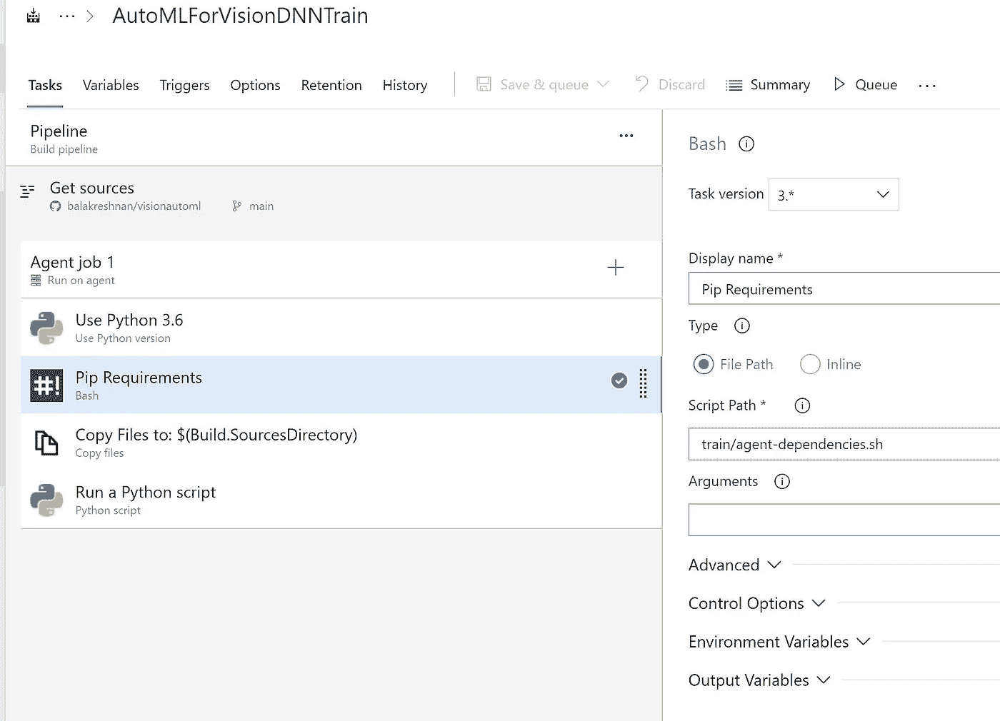
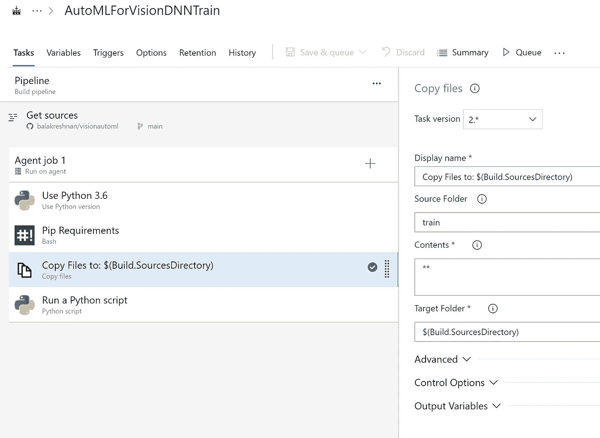
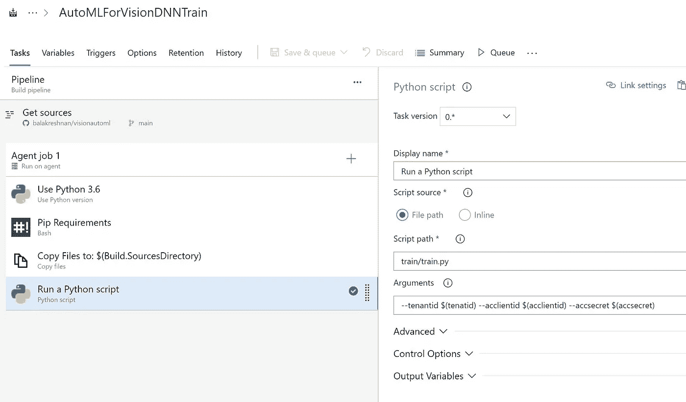
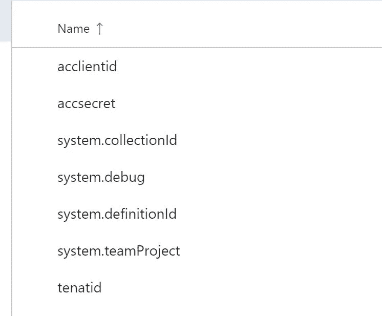
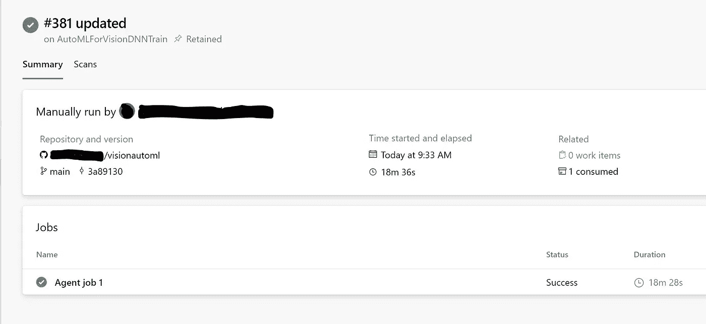

# Azure 机器学习自动化机器学习部署

> 原文：<https://medium.com/analytics-vidhya/azure-machine-learning-automated-machine-learning-deployment-ef98a6982acc?source=collection_archive---------9----------------------->

# 在 Azure DevOps 中为 AutoMLVision 创建火车管道

# 先决条件

*   Azure 帐户
*   Azure 存储
*   Azure 机器学习服务
*   Azure DevOps
*   Github 帐户和存储库
*   Azure 服务主帐户
*   向服务主要贡献者提供对机器学习资源的访问
*   Azure Keyvault 存储秘密
*   用服务主体机密更新密钥库
*   训练脚本被设计成接受 3 个参数
*   租户 id
*   服务主体客户端 id
*   服务主要机密
*   上述细节将从 Azure DevOps 作为秘密变量传递
*   这将自动化训练代码并注册模型

# 步伐

*   创建一个训练脚本
*   创建代理依赖关系脚本
*   创建 Azure DevOps 管道

# 训练脚本



*   打开 Visual Studio 代码
*   创建一个名为 visionautoml 的新项目
*   创建一个名为 train 的新目录
*   创建一个名为 train.py 的新 python 文件
*   训练脚本使用服务主体进行身份验证，以便它可以自动运行
*   替换您的订阅 id、资源组名称和工作区名称来运行
*   DevOps 将实验运行交给 Azure ML 服务来运行。
*   DevOps 将保持监视并输出日志

```
import azureml.core
from azureml.core import Workspace
from azureml.core import Keyvault
import os

from azureml.core import Workspace, Experiment
from azureml.train.automl import AutoMLImageConfig
from azureml.train.hyperdrive import GridParameterSampling
from azureml.train.hyperdrive import choice

from azureml.contrib.dataset.labeled_dataset import _LabeledDatasetFactory, LabeledDatasetTask
from azureml.core import Dataset

from azureml.core.authentication import ServicePrincipalAuthentication
from azureml.core.compute import AmlCompute, ComputeTarget
from azureml.core import Experiment

from azureml.core import Workspace
import os
import urllib
from zipfile import ZipFile

print("SDK version:", azureml.core.VERSION)

import argparse 

parse = argparse.ArgumentParser()
parse.add_argument("--tenantid")
parse.add_argument("--clientid")
parse.add_argument("--secret")

args = parse.parse_args()

sp = ServicePrincipalAuthentication(tenant_id=args.tenantid, # tenantID
                                    service_principal_id=args.clientid, # clientId
                                    service_principal_password=args.secret) # clientSecret

ws = Workspace.get(name="workspacename",
                   auth=sp,
                   subscription_id="xxxxxxxxxxxxxxxxxxxxxxx", resource_group="resourcegroupname")

#ws = Workspace.from_config()
keyvault = ws.get_default_keyvault()
tenantid = keyvault.get_secret(name="tenantid")
acclientid = keyvault.get_secret(name="acclientid")
accsvcname = keyvault.get_secret(name="accsvcname")
accsecret = keyvault.get_secret(name="accsecret")

print(accsvcname)

sp = ServicePrincipalAuthentication(tenant_id=tenantid, # tenantID
                                    service_principal_id=acclientid, # clientId
                                    service_principal_password=accsecret) # clientSecret

ws = Workspace.get(name="gputraining",
                   auth=sp,
                   subscription_id="c46a9435-c957-4e6c-a0f4-b9a597984773", resource_group="mlops")
ws.get_details()

print('Workspace name: ' + ws.name, 
      'Azure region: ' + ws.location, 
      'Subscription id: ' + ws.subscription_id, 
      'Resource group: ' + ws.resource_group, sep = '\n')

cluster_name = "gpu-cluster"

try:
    compute_target = ws.compute_targets[cluster_name]
    print('Found existing compute target.')
except KeyError:
    print('Creating a new compute target...')
    compute_config = AmlCompute.provisioning_configuration(vm_size='Standard_NC6', 
                                                           idle_seconds_before_scaledown=1800,
                                                           min_nodes=0, 
                                                           max_nodes=4)

    compute_target = ComputeTarget.create(ws, cluster_name, compute_config)

# Can poll for a minimum number of nodes and for a specific timeout.
# If no min_node_count is provided, it will use the scale settings for the cluster.
compute_target.wait_for_completion(show_output=True, min_node_count=None, timeout_in_minutes=20)

experiment_name = 'automl-image-notebook' 
experiment = Experiment(ws, name=experiment_name)

# download data
download_url = 'https://cvbp-secondary.z19.web.core.windows.net/datasets/object_detection/odFridgeObjects.zip'
data_file = './odFridgeObjects.zip'
urllib.request.urlretrieve(download_url, filename=data_file)

# extract files
with ZipFile(data_file, 'r') as zip:
    print('extracting files...')
    zip.extractall()
    print('done')

# delete zip file
os.remove(data_file)

from IPython.display import Image
Image(filename='./odFridgeObjects/images/31.jpg')

import json
import os
import xml.etree.ElementTree as ET

src = "./odFridgeObjects/"
train_validation_ratio = 5

# Retrieving default datastore that got automatically created when we setup a workspace
workspaceblobstore = ws.get_default_datastore().name

# Path to the annotations
annotations_folder = os.path.join(src, "annotations")

# Path to the training and validation files
train_annotations_file = os.path.join(src, "train_annotations.jsonl")
validation_annotations_file = os.path.join(src, "validation_annotations.jsonl")

# sample json line dictionary
json_line_sample = \
    {
        "image_url": "AmlDatastore://" + workspaceblobstore + "/"
                     + os.path.basename(os.path.dirname(src)) + "/" + "images",
        "image_details": {"format": None, "width": None, "height": None},
        "label": []
    }

# Read each annotation and convert it to jsonl line
with open(train_annotations_file, 'w') as train_f:
    with open(validation_annotations_file, 'w') as validation_f:
        for i, filename in enumerate(os.listdir(annotations_folder)):
            if filename.endswith(".xml"):
                print("Parsing " + os.path.join(src, filename))

                root = ET.parse(os.path.join(annotations_folder, filename)).getroot()

                width = int(root.find('size/width').text)
                height = int(root.find('size/height').text)

                labels = []
                for object in root.findall('object'):
                    name = object.find('name').text
                    xmin = object.find('bndbox/xmin').text
                    ymin = object.find('bndbox/ymin').text
                    xmax = object.find('bndbox/xmax').text
                    ymax = object.find('bndbox/ymax').text
                    isCrowd = int(object.find('difficult').text)
                    labels.append({"label": name,
                                   "topX": float(xmin)/width,
                                   "topY": float(ymin)/height,
                                   "bottomX": float(xmax)/width,
                                   "bottomY": float(ymax)/height,
                                   "isCrowd": isCrowd})
                # build the jsonl file
                image_filename = root.find("filename").text
                _, file_extension = os.path.splitext(image_filename)
                json_line = dict(json_line_sample)
                json_line["image_url"] = json_line["image_url"] + "/" + image_filename
                json_line["image_details"]["format"] = file_extension[1:]
                json_line["image_details"]["width"] = width
                json_line["image_details"]["height"] = height
                json_line["label"] = labels

                if i % train_validation_ratio == 0:
                    # validation annotation
                    validation_f.write(json.dumps(json_line) + "\n")
                else:
                    # train annotation
                    train_f.write(json.dumps(json_line) + "\n")
            else:
                print("Skipping unknown file: {}".format(filename))

ds = ws.get_default_datastore()
ds.upload(src_dir='./odFridgeObjects', target_path='odFridgeObjects')

training_dataset_name = 'odFridgeObjectsTrainingDataset'
if training_dataset_name in ws.datasets:
    training_dataset = ws.datasets.get(training_dataset_name)
    print('Found the training dataset', training_dataset_name)
else:
    # create training dataset
    training_dataset = _LabeledDatasetFactory.from_json_lines(
        task=LabeledDatasetTask.OBJECT_DETECTION, path=ds.path('odFridgeObjects/train_annotations.jsonl'))
    training_dataset = training_dataset.register(workspace=ws, name=training_dataset_name)

# create validation dataset
validation_dataset_name = "odFridgeObjectsValidationDataset"
if validation_dataset_name in ws.datasets:
    validation_dataset = ws.datasets.get(validation_dataset_name)
    print('Found the validation dataset', validation_dataset_name)
else:
    validation_dataset = _LabeledDatasetFactory.from_json_lines(
        task=LabeledDatasetTask.OBJECT_DETECTION, path=ds.path('odFridgeObjects/validation_annotations.jsonl'))
    validation_dataset = validation_dataset.register(workspace=ws, name=validation_dataset_name)

print("Training dataset name: " + training_dataset.name)
print("Validation dataset name: " + validation_dataset.name)

training_dataset.to_pandas_dataframe()

image_config_yolov5 = AutoMLImageConfig(task='image-object-detection',
                                        compute_target=compute_target,
                                        training_data=training_dataset,
                                        validation_data=validation_dataset,
                                        hyperparameter_sampling=GridParameterSampling({'model_name': choice('yolov5')}))

automl_image_run = experiment.submit(image_config_yolov5)

automl_image_run.wait_for_completion(wait_post_processing=True)
```

# 创建代理依赖项文件

*   创建新的外壳文件
*   安装 Azure ML SDK 所需的所有必要组件

```
python --version
pip install azure-cli==2.0.72
pip install --upgrade azureml-sdk
pip install azureml-sdk[notebooks]
pip install --upgrade azureml-sdk[cli]
pip install argparse
pip install tensorflow==2.0.0
pip install --upgrade "azureml-train-core<0.1.1" "azureml-train-automl<0.1.1" "azureml-contrib-dataset<0.1.1"  --extra-index-url "https://azuremlsdktestpypi.azureedge.net/automl_for_images_private_preview/"
```

*   将它们都存储在 github 中，以便可以为版本维护代码

# Azure DevOps

*   登录 Azure DevOps
*   创建新项目
*   选择 Github 作为存储库
*   选择已创建的项目或回购



*   转到管道并创建新管道



*   我选择经典编辑器
*   创建一个空作业
*   配置代理操作系统



*   选择 Python 版本



*   安装代理 python 包



*   将工件复制到代理进行提交



*   拖动 python 脚本并运行 train.py 文件



```
--tenantid $(tenatid) --acclientid $(acclientid) --accsecret $(accsecret)
```

*   创建要传递的变量



*   运行管道并等待其完成



*   登录 Azure ML workspace 并转到实验以查看实验细节

原文章在[samples 2021/automltfrainevops . MD 在主 balakreshnan/samples 2021(github.com)](https://github.com/balakreshnan/Samples2021/blob/main/AutoML/automltraindevops.md)