# Azure 机器学习推理应用洞察日志

> 原文：<https://medium.com/analytics-vidhya/azure-machine-learning-inferencing-application-insights-logs-fd96d202c375?source=collection_archive---------6----------------------->

# 使用 REST API 为推理启用应用洞察日志

# 步伐

*   每个 Azure ML 工作空间都有自己的应用洞察
*   登录 Azure 门户网站
*   导航至应用洞察文件夹

# 表演

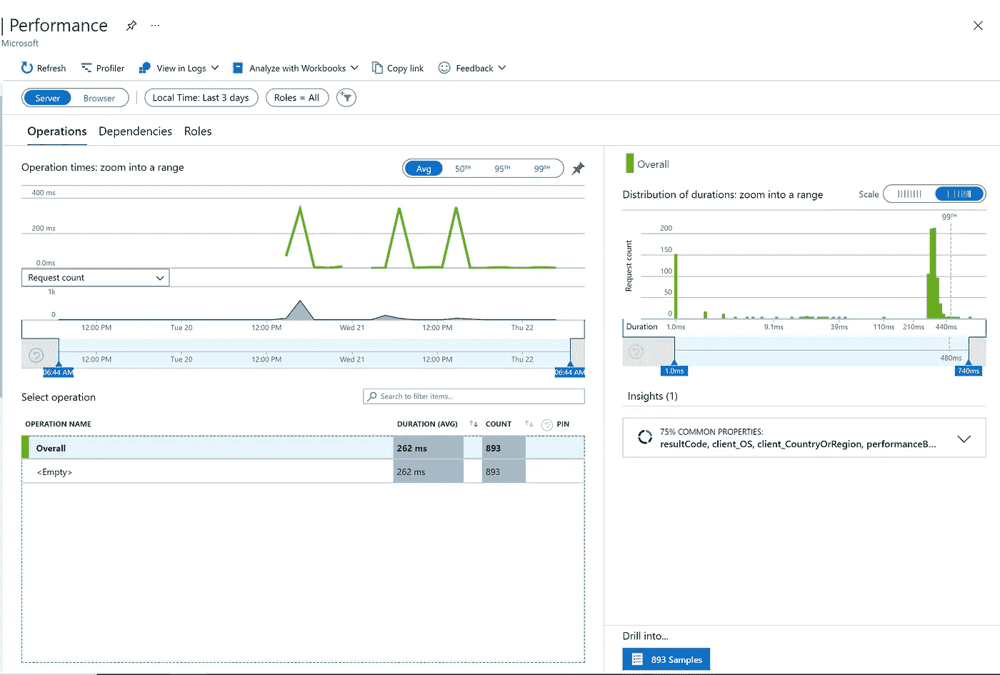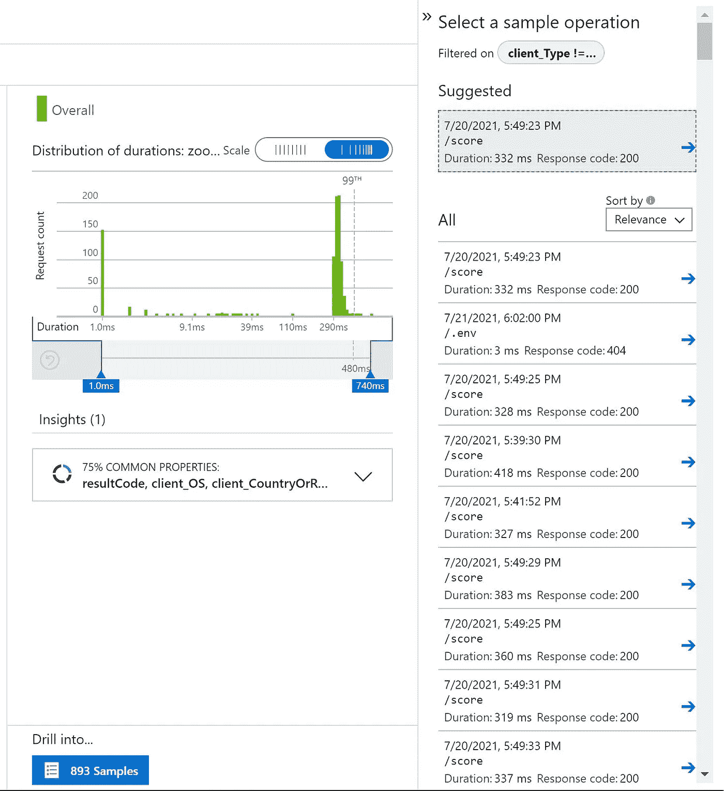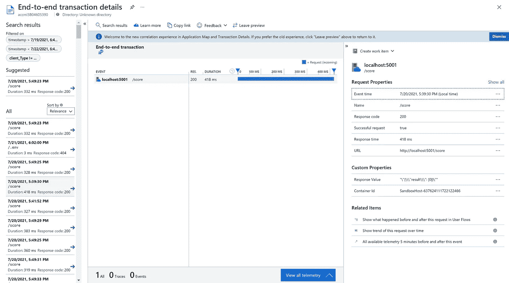

# 失败

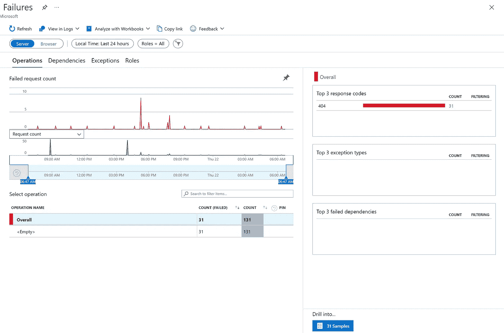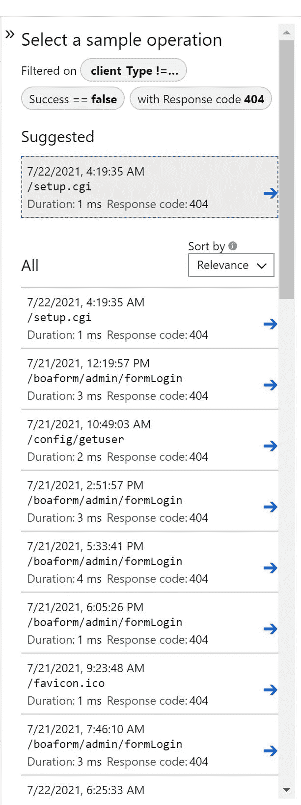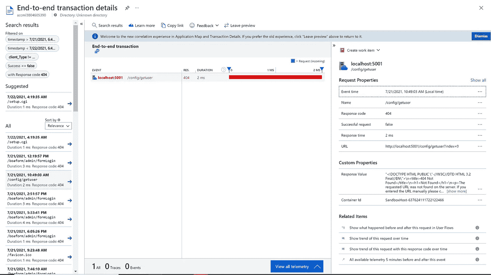

# 故障排除指南

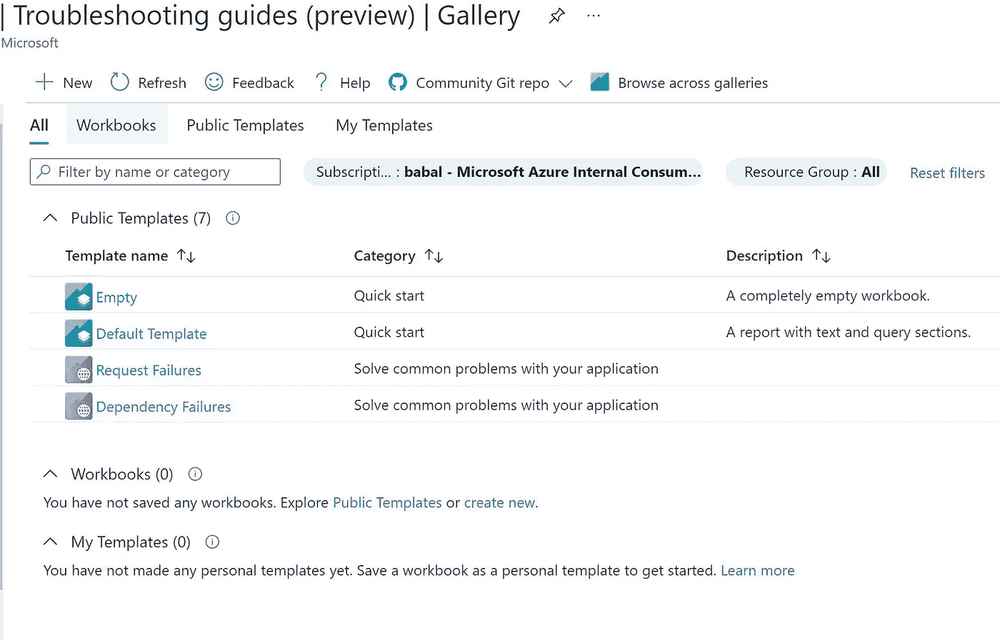

*   请求失败

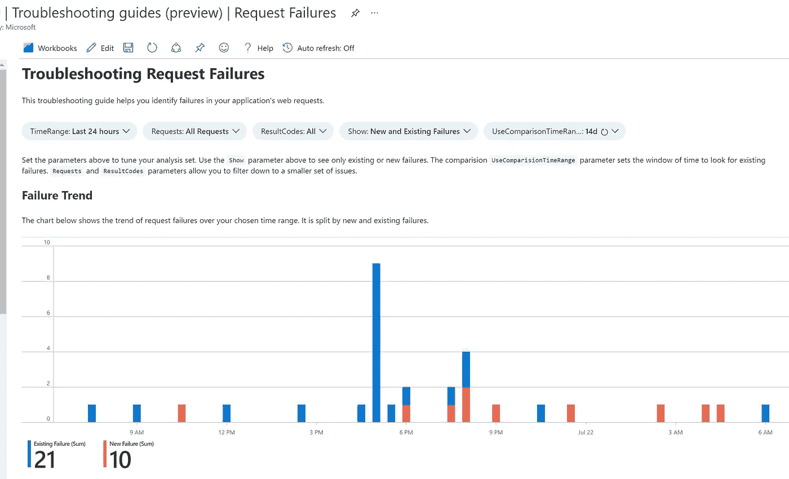

*   失败详细信息

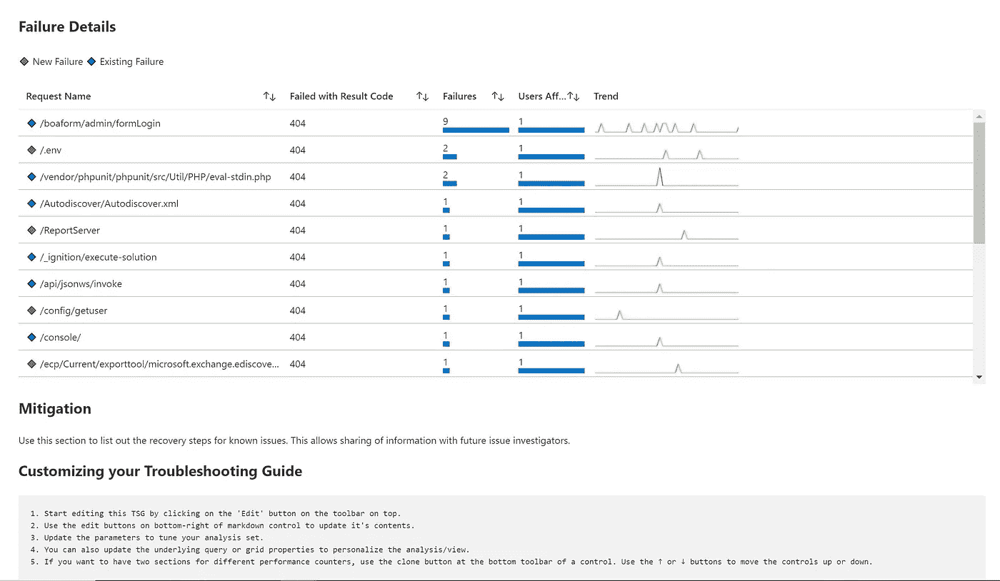

*   失败洞察

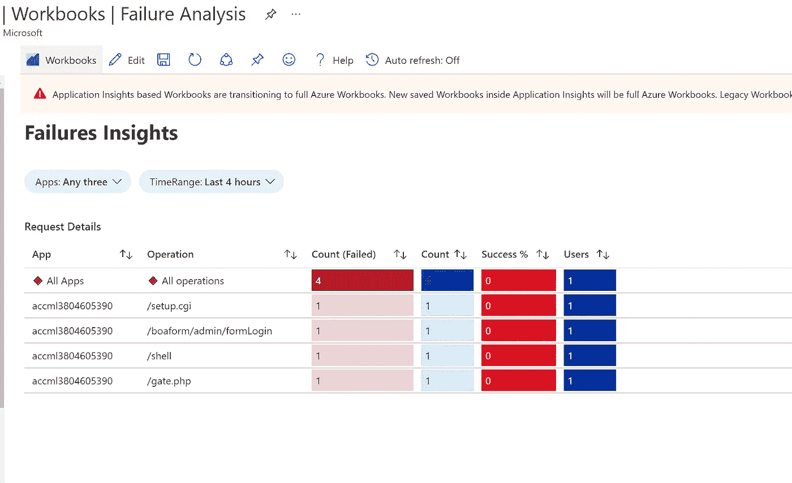

*   所有细节

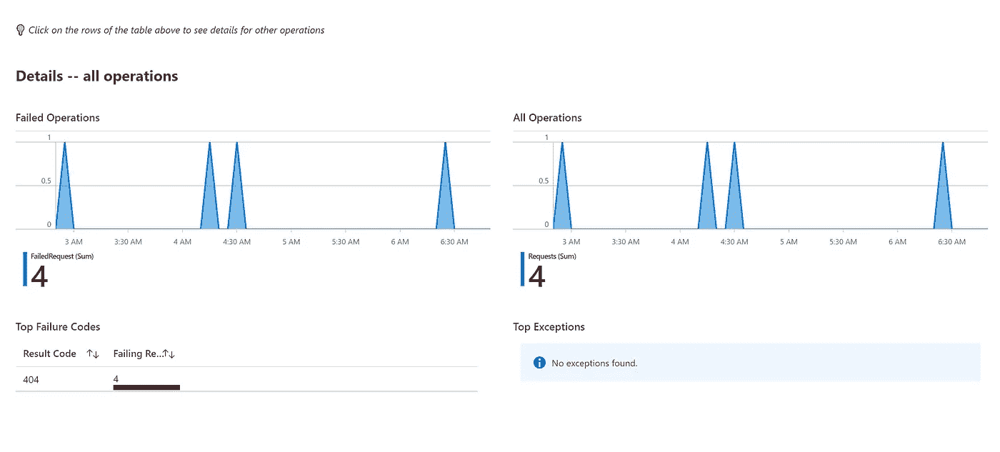

原文—[samples 2021/apping logs . MD at main balakreshnan/samples 2021(github.com)](https://github.com/balakreshnan/Samples2021/blob/main/AzureML/appinglogs.md)